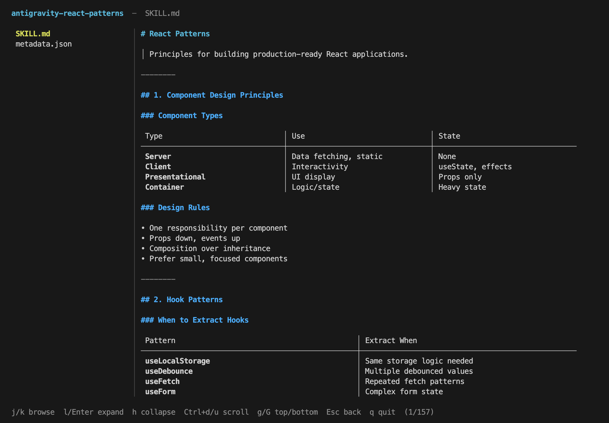
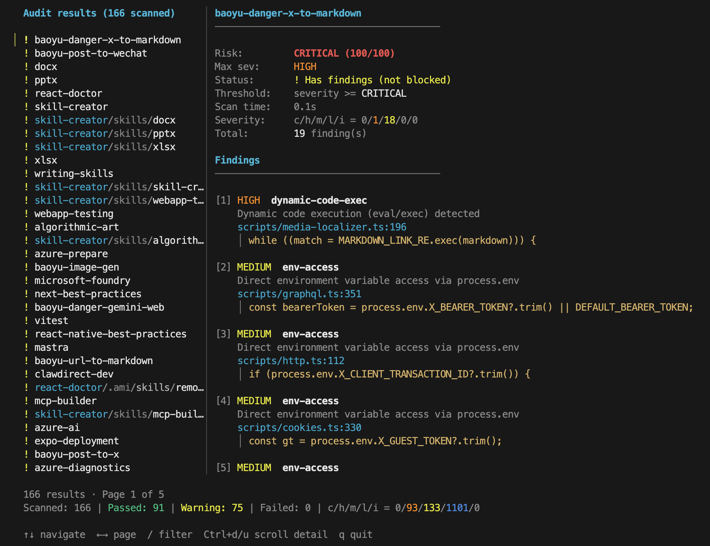
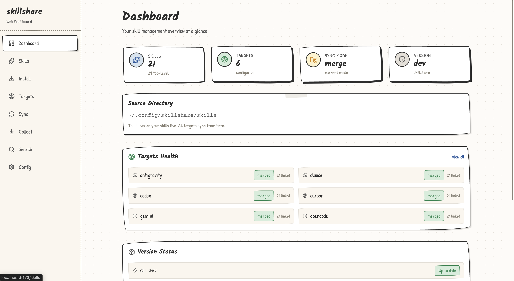
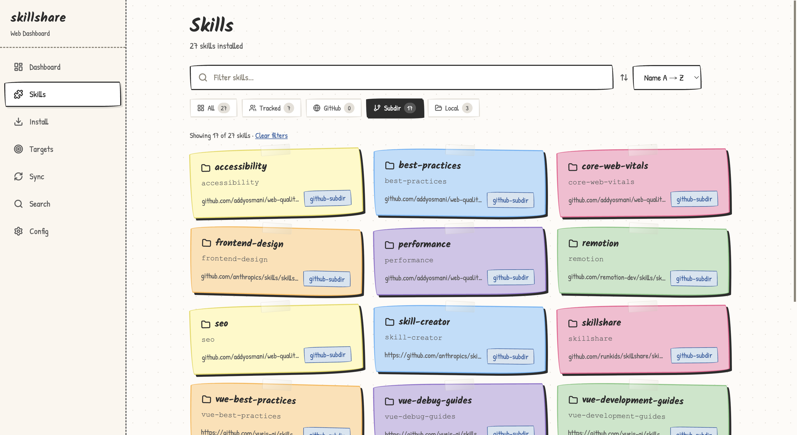

<p align="center" style="margin-bottom: 0;">
  
</p>

<h1 align="center" style="margin-top: 0.5rem; margin-bottom: 0.5rem;">skillshare</h1>

<p align="center">
  <a href="https://skillshare.runkids.cc"></a>
  <a href="LICENSE"></a>
  <a href="https://github.com/runkids/skillshare/releases"></a>
  
  <a href="https://goreportcard.com/report/github.com/runkids/skillshare"></a>
  <a href="https://deepwiki.com/runkids/skillshare"></a>
</p>

<p align="center">
  <a href="https://github.com/runkids/skillshare/stargazers"></a>
</p>

<p align="center">
  <a href="https://trendshift.io/repositories/21835" target="_blank"></a>
</p>

<p align="center">
  <strong>AI CLI 技能（Skills）、智能体（Agents）、规则（Rules）、命令（Commands）等资源的唯一事实来源。</strong><br>
  一键同步到所有平台——从个人到组织级全覆盖。<br>
  支持 Codex、Claude Code、OpenClaw、OpenCode 及 60+ 更多工具。
</p>

<p align="center">
  
</p>

<p align="center">
  <a href="https://skillshare.runkids.cc">官网</a> •
  <a href="#安装">安装</a> •
  <a href="#快速开始">快速开始</a> •
  <a href="#亮点功能">亮点功能</a> •
  <a href="#cli-和-ui-预览">截图预览</a> •
  <a href="https://skillshare.runkids.cc/docs">文档</a>
</p>

> [!NOTE]
> **最新版本**: [v0.19.12](https://github.com/runkids/skillshare/releases/tag/v0.19.12) — config.yaml 中的 `skills:` 字段现在会保留（修复了团队共享问题）。[查看全部版本 →](https://github.com/runkids/skillshare/releases)

## 为什么选择 skillshare

每个 AI CLI 都有自己的技能目录。
你在一个工具里编辑了技能，却忘了复制到另一个，最后记不清哪个在哪里。

skillshare 解决了这个问题：

- **单一来源，覆盖所有智能体** — 一条 `skillshare sync` 命令同步到 Claude、Cursor、Codex 及 60+ 工具
- **智能体管理** — 将自定义智能体与技能一起同步到支持智能体的目标端
- **不止于技能** — 使用 [extras](https://skillshare.runkids.cc/docs/reference/targets/configuration#extras) 管理规则、命令、提示词及任何基于文件的资源
- **从任何地方安装** — GitHub、GitLab、Bitbucket、Azure DevOps 或任何自托管的 Git 仓库
- **内置安全** — 在使用前审计技能是否存在提示注入和数据泄露风险
- **团队就绪** — 项目中通过 `.skillshare/` 管理技能，组织级技能通过代码仓库同步
- **本地轻量** — 单一二进制文件，无需注册中心，无遥测，完全支持离线使用
- **细粒度过滤** — 通过 [`.skillignore`](https://skillshare.runkids.cc/docs/how-to/daily-tasks/filtering-skills)、SKILL.md 中的 `targets` 字段以及按目标端的 include/exclude 配置，精确控制哪些技能同步到哪些目标端

> 从其他工具迁移？[迁移指南](https://skillshare.runkids.cc/docs/how-to/advanced/migration) · [功能对比](https://skillshare.runkids.cc/docs/understand/philosophy/comparison)

## 工作原理

- macOS / Linux：`~/.config/skillshare/`
- Windows：`%AppData%\skillshare\`

```
┌─────────────────────────────────────────────────────────────┐
│                    源目录                                    │
│   ~/.config/skillshare/skills/    ← 技能（SKILL.md）         │
│   ~/.config/skillshare/agents/    ← 智能体                    │
│   ~/.config/skillshare/extras/    ← 规则、命令等              │
└─────────────────────────────────────────────────────────────┘
                              │ sync
              ┌───────────────┼───────────────┐
              ▼               ▼               ▼
       ┌───────────┐   ┌───────────┐   ┌───────────┐
       │  Claude   │   │  OpenCode │   │ OpenClaw  │   ...
       └───────────┘   └───────────┘   └───────────┘
```

| 平台 | 技能源目录 | 智能体源目录 | 扩展资源源目录 | 链接方式 |
|----------|---------------|---------------|---------------|-----------|
| macOS/Linux | `~/.config/skillshare/skills/` | `~/.config/skillshare/agents/` | `~/.config/skillshare/extras/` | 符号链接 |
| Windows | `%AppData%\skillshare\skills\` | `%AppData%\skillshare\agents\` | `%AppData%\skillshare\extras\` | NTFS 交接点（无需管理员权限） |

| | 命令式（逐命令安装） | 声明式（skillshare） |
|---|---|---|
| **事实来源** | 技能各自独立复制 | 单一来源 → 符号链接（或复制） |
| **新机器配置** | 重新手动执行每次安装 | `git clone` 配置 + `sync` |
| **安全审计** | 无 | 内置 `audit` + 安装/更新时自动扫描 |
| **Web 仪表盘** | 无 | `skillshare ui` |
| **运行时依赖** | Node.js + npm | 无（单一 Go 二进制文件） |

> [完整对比 →](https://skillshare.runkids.cc/docs/understand/philosophy/comparison)

## CLI 和 UI 预览

| 技能详细页 | 安全审计 |
|---|---|
|  |  |

| UI 仪表盘 | UI 技能列表 |
|---|---|
|  |  |

## 安装

### macOS / Linux

```bash
curl -fsSL https://raw.githubusercontent.com/runkids/skillshare/main/install.sh | sh
```

### Windows PowerShell

```powershell
irm https://raw.githubusercontent.com/runkids/skillshare/main/install.ps1 | iex
```

### Homebrew

```bash
brew install skillshare
```

> **提示：** 运行 `skillshare upgrade` 即可更新到最新版本。它会自动检测你的安装方式并完成后续操作。

### GitHub Actions

```yaml
- uses: runkids/setup-skillshare@v1
  with:
    source: ./skills
- run: skillshare sync
```

查看 [`setup-skillshare`](https://github.com/marketplace/actions/setup-skillshare) 获取所有选项（审计、项目模式、版本锁定等）。

### 缩写别名（可选）

在 shell 配置（`~/.zshrc` 或 `~/.bashrc`）中添加别名：

```bash
alias ss='skillshare'
```

## 快速开始

```bash
skillshare init            # 创建配置、源目录并检测目标端
skillshare sync            # 将技能同步到所有目标端
```

## 亮点功能

**安装和更新技能** — 从 GitHub、GitLab 或任何 Git 仓库

```bash
skillshare install github.com/reponame/skills
skillshare update --all
skillshare target claude --mode copy  # 如果符号链接不适用
```

**符号链接有问题？** — 为每个目标端切换到复制模式

```bash
skillshare target <名称> --mode copy
skillshare sync
```

**安全审计** — 在技能到达智能体之前进行扫描

```bash
skillshare audit
```

**项目级技能** — 按仓库管理，随代码一起提交

```bash
skillshare init -p && skillshare sync
```

**智能体** — 将自定义智能体同步到支持智能体的目标端

```bash
skillshare sync agents            # 仅同步智能体
skillshare sync --all             # 同步技能 + 智能体 + 扩展资源
```

**扩展资源** — 管理规则、命令、提示词等

```bash
skillshare extras init rules          # 创建一个 "rules" 扩展
skillshare sync --all                 # 同步技能 + 扩展资源
skillshare extras collect rules       # 将本地文件收集回源目录
```

**Shell 自动补全** — Tab 键补全命令、标志和子命令

```bash
skillshare completion bash --install   # 也支持：zsh、fish、powershell、nushell
```

**Web 仪表盘** — 可视化控制面板

```bash
skillshare ui
```

[所有命令和指南 →](https://skillshare.runkids.cc/docs/reference/commands)

## 参与贡献

欢迎贡献！请先提交 issue，然后提交带测试的草稿 PR。
查看 [CONTRIBUTING.md](CONTRIBUTING.md) 了解开发环境设置。

```bash
git clone https://github.com/runkids/skillshare.git && cd skillshare
make check  # 格式化 + 代码检查 + 测试
```

> [!TIP]
> 不知道从哪里开始？浏览 [open issues](https://github.com/runkids/skillshare/issues) 或尝试 [Playground](https://skillshare.runkids.cc/docs/learn/with-playground) 获取零配置开发环境。

## 贡献者

感谢所有帮助 skillshare 变得更好的人。

<a href="https://github.com/leeeezx"></a>
<a href="https://github.com/Vergil333"></a>
<a href="https://github.com/romanr"></a>
<a href="https://github.com/xocasdashdash"></a>
<a href="https://github.com/philippe-granet"></a>
<a href="https://github.com/terranc"></a>
<a href="https://github.com/benrfairless"></a>
<a href="https://github.com/nerveband"></a>
<a href="https://github.com/EarthChen"></a>
<a href="https://github.com/gdm257"></a>
<a href="https://github.com/skovtunenko"></a>
<a href="https://github.com/TyceHerrman"></a>
<a href="https://github.com/1am2syman"></a>
<a href="https://github.com/thealokkr"></a>
<a href="https://github.com/JasonLandbridge"></a>
<a href="https://github.com/masonc15"></a>
<a href="https://github.com/richardwhatever"></a>
<a href="https://github.com/reneleonhardt"></a>
<a href="https://github.com/ndeybach"></a>
<a href="https://github.com/hhh2210"></a>
<a href="https://github.com/leoarry"></a>
<a href="https://github.com/salmonumbrella"></a>
<a href="https://github.com/daylamtayari"></a>
<a href="https://github.com/dstotijn"></a>
<a href="https://github.com/ipruning"></a>
<a href="https://github.com/massukio"></a>
<a href="https://github.com/kevincobain2000"></a>
<a href="https://github.com/StephenPAdams"></a>
<a href="https://github.com/mk-imagine"></a>
<a href="https://github.com/Curtion"></a>
<a href="https://github.com/amdoi7"></a>
<a href="https://github.com/jessica-engel"></a>
<a href="https://github.com/AlimuratYusup"></a>
<a href="https://github.com/thor-shuang"></a>
<a href="https://github.com/bishopmatthew"></a>
<a href="https://github.com/chaosky"></a>
<a href="https://github.com/iFwu"></a>
<a href="https://github.com/ildunari"></a>
<a href="https://github.com/aestilog"></a>
<a href="https://github.com/xarthurx"></a>
<a href="https://github.com/m0cun"></a>

---

如果 skillshare 对你有帮助，不妨点个 ⭐ 支持一下

## Star 历史

[](https://www.star-history.com/#runkids/skillshare&type=date&legend=top-left)

---

## 许可证

MIT
