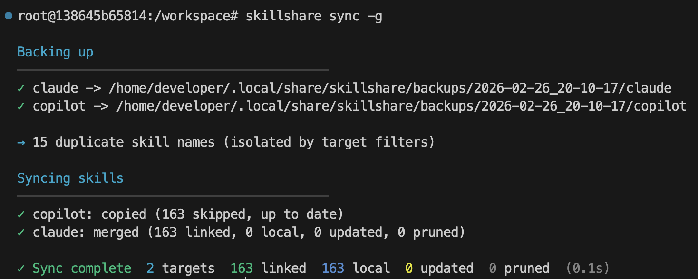

<p align="center" style="margin-bottom: 0;">
  
</p>

<h1 align="center" style="margin-top: 0.5rem; margin-bottom: 0.5rem;">skillshare</h1>

<p align="center">
  <a href="https://skillshare.runkids.cc"></a>
  <a href="LICENSE"></a>
  <a href="https://github.com/runkids/skillshare/releases"></a>
  
  <a href="https://goreportcard.com/report/github.com/runkids/skillshare"></a>
  <a href="https://deepwiki.com/runkids/skillshare"></a>
</p>

<p align="center">
  <a href="https://github.com/runkids/skillshare/stargazers"></a>
</p>

<p align="center">
  <strong>One source of truth for AI CLI skills. Sync everywhere with one command — from personal to organization-wide.</strong><br>
  Claude Code, OpenClaw, OpenCode & 49+ more.
</p>

<p align="center">
  
</p>

<p align="center">
  <a href="https://skillshare.runkids.cc">Website</a> •
  <a href="#installation">Install</a> •
  <a href="#quick-start">Quick Start</a> •
  <a href="#highlights">Highlights</a> •
  <a href="#cli-and-ui-preview">Screenshots</a> •
  <a href="https://skillshare.runkids.cc/docs">Docs</a>
</p>

> [!NOTE]
> **Recent Updates**
> - **[0.16.0](https://github.com/runkids/skillshare/releases/tag/v0.16.0)**: Performance overhaul (sparse checkout, parallel check, tree hash), interactive bubbletea TUI, registry separation, CLI visual refresh.
> - **[0.15.x](https://github.com/runkids/skillshare/releases/tag/v0.15.5)**: Supply-chain security hardening, copy sync mode, HTTPS token auth.
> - Full history: [All Releases](https://github.com/runkids/skillshare/releases)

## Why skillshare

Every AI CLI has its own skills directory.
You edit in one, forget to copy to another, and lose track of what's where.

skillshare fixes this:

- **One source, every agent** — sync to Claude, Cursor, Codex & 49+ more with `skillshare sync`
- **Install from anywhere** — GitHub, GitLab, Bitbucket, Azure DevOps, or any self-hosted Git
- **Built-in security** — audit skills for prompt injection and data exfiltration before use
- **Team-ready** — project skills in `.skillshare/`, org-wide skills via tracked repos
- **Local & lightweight** — single binary, no registry, no telemetry, fully offline-capable

> Coming from another tool? [Migration Guide](https://skillshare.runkids.cc/docs/how-to/advanced/migration) · [Comparison](https://skillshare.runkids.cc/docs/understand/philosophy/comparison)

## How It Works

- macOS / Linux: `~/.config/skillshare/skills/`
- Windows: `%AppData%\skillshare\skills\`

```
┌─────────────────────────────────────────────────────────────┐
│                       Source Directory                      │
│                 ~/.config/skillshare/skills/                │
└─────────────────────────────────────────────────────────────┘
                              │ sync
              ┌───────────────┼───────────────┐
              ▼               ▼               ▼
       ┌───────────┐   ┌───────────┐   ┌───────────┐
       │  Claude   │   │  OpenCode │   │ OpenClaw  │   ...
       └───────────┘   └───────────┘   └───────────┘
```

| Platform | Source Path | Link Type |
|----------|-------------|-----------|
| macOS/Linux | `~/.config/skillshare/skills/` | Symlinks |
| Windows | `%AppData%\skillshare\skills\` | NTFS Junctions (no admin required) |

| | Imperative (install-per-command) | Declarative (skillshare) |
|---|---|---|
| **Source of truth** | Skills copied independently | Single source → symlinks (or copies) |
| **New machine setup** | Re-run every install manually | `git clone` config + `sync` |
| **Security audit** | None | Built-in `audit` + auto-scan on install/update |
| **Web dashboard** | None | `skillshare ui` |
| **Runtime dependency** | Node.js + npm | None (single Go binary) |

> [Full comparison →](https://skillshare.runkids.cc/docs/understand/philosophy/comparison)

## CLI and UI Preview

| Sync | Install + Audit |
|---|---|
|  |  |

| Dashboard | Security Audit |
|---|---|
|  |  |

## Installation

### macOS / Linux

```bash
curl -fsSL https://raw.githubusercontent.com/runkids/skillshare/main/install.sh | sh
```

### Windows PowerShell

```powershell
irm https://raw.githubusercontent.com/runkids/skillshare/main/install.ps1 | iex
```

### Homebrew

```bash
brew install skillshare
```

> **Tip:** Run `skillshare upgrade` to update to the latest version. It auto-detects your install method and handles the rest.

### Shorthand (Optional)

Add an alias to your shell config (`~/.zshrc` or `~/.bashrc`):

```bash
alias ss='skillshare'
```

## Quick Start

```bash
skillshare init            # Create config, source, and detected targets
skillshare sync            # Sync skills to all targets
```

## Highlights

**Install & update skills** —from GitHub, GitLab, or any Git host

```bash
skillshare install github.com/team/skills --track
skillshare update --all
skillshare target claude --mode copy  # if symlinks don't work
```

**Symlink issues?** — switch to copy mode per target

```bash
skillshare target <name> --mode copy
skillshare sync
```

**Security audit** —scan before skills reach your agent

```bash
skillshare audit
```

**Project skills** —per-repo, committed with your code

```bash
skillshare init -p && skillshare sync
```

**Web dashboard** —visual control panel

```bash
skillshare ui
```

[All commands & guides →](https://skillshare.runkids.cc/docs/reference/commands)

## Contributing

Contributions welcome! Open an issue first, then submit a draft PR with tests.
See [CONTRIBUTING.md](CONTRIBUTING.md) for setup details.

```bash
git clone https://github.com/runkids/skillshare.git && cd skillshare
make check  # format + lint + test
```

> [!TIP]
> Not sure where to start? Browse [open issues](https://github.com/runkids/skillshare/issues) or try the [Playground](https://skillshare.runkids.cc/docs/learn/with-playground) for a zero-setup dev environment.

## Contributors

Thanks to everyone who helped shape skillshare.

<a href="https://github.com/leeeezx"></a>
<a href="https://github.com/Vergil333"></a>
<a href="https://github.com/romanr"></a>
<a href="https://github.com/xocasdashdash"></a>
<a href="https://github.com/philippe-granet"></a>
<a href="https://github.com/terranc"></a>
<a href="https://github.com/benrfairless"></a>
<a href="https://github.com/nerveband"></a>
<a href="https://github.com/EarthChen"></a>
<a href="https://github.com/gdm257"></a>
<a href="https://github.com/skovtunenko"></a>
<a href="https://github.com/TyceHerrman"></a>
<a href="https://github.com/1am2syman"></a>
<a href="https://github.com/thealokkr"></a>

---

If you find skillshare useful, consider giving it a ⭐

## Star History

[](https://www.star-history.com/#runkids/skillshare&type=date&legend=top-left)

---

## License

MIT
