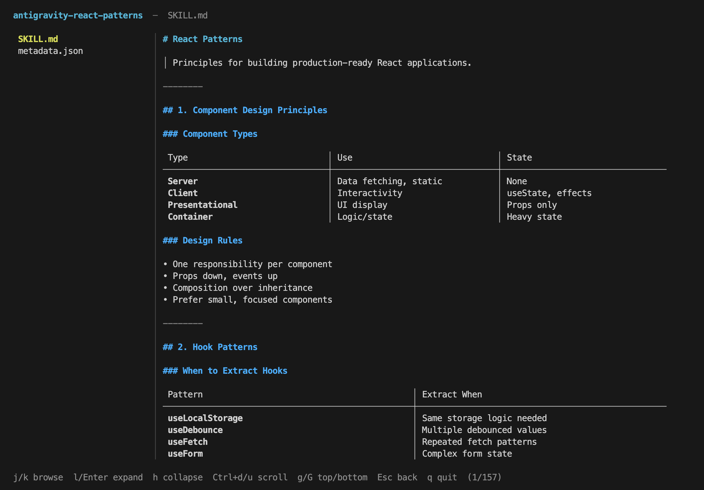
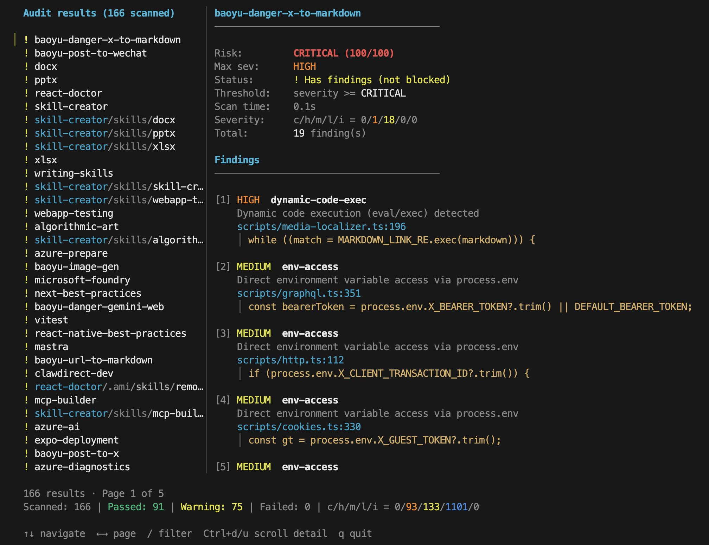
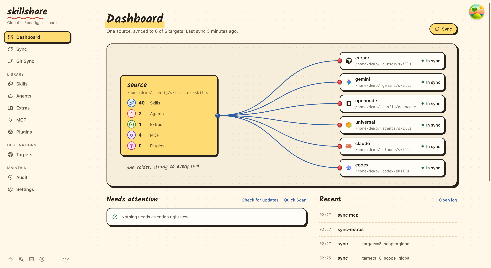
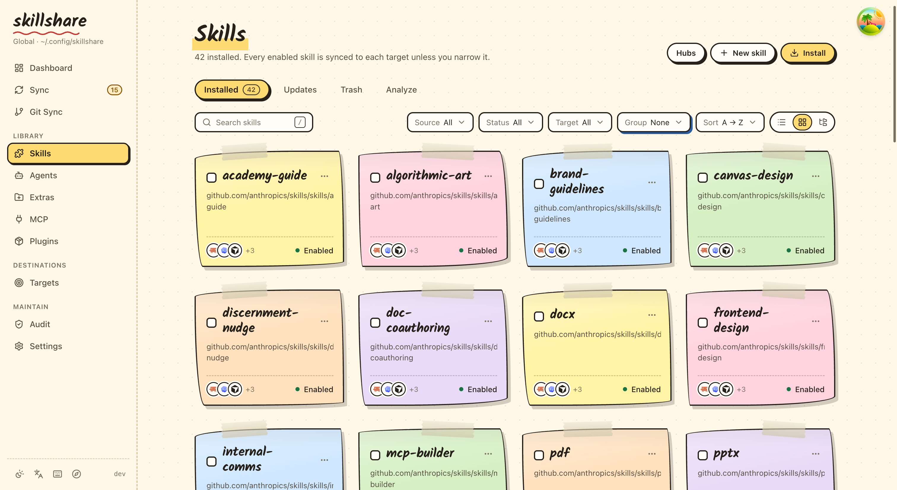

<p align="center" style="margin-bottom: 0;">
  
</p>

<h1 align="center" style="margin-top: 0.5rem; margin-bottom: 0.5rem;">skillshare</h1>

<p align="center">
  <a href="README.md">English</a> · <a href="README-ja.md">日本語</a> · <a href="README-ko.md">한국어</a> · <a href="README-zh-CN.md">简体中文</a> · <a href="README-zh-TW.md">繁體中文</a>
</p>

<p align="center">
  <a href="https://skillshare.runkids.cc"></a>
  <a href="LICENSE"></a>
  <a href="https://github.com/runkids/skillshare/releases"></a>
  <a href="https://github.com/runkids/skillshare/releases"></a>
  
  <a href="https://deepwiki.com/runkids/skillshare"></a>
  <a href="https://ko-fi.com/williehung"></a>
</p>

<p align="center">
  <a href="https://github.com/runkids/skillshare/stargazers"></a>
</p>

<p align="center">
  <a href="https://trendshift.io/repositories/21835" target="_blank"></a>
</p>

<p align="center">
  <strong>Your AI coding setup, everywhere.</strong><br>
  Manage skills, agents, rules, MCP connections and hooks in one place.<br>
  For Claude Code, Codex, Pi, OpenCode and more.
</p>

<p align="center">
  <a href="https://skillshare.runkids.cc">Website</a> •
  <a href="#installation">Install</a> •
  <a href="#quick-start">Quick Start</a> •
  <a href="#highlights">Highlights</a> •
  <a href="#cli-and-ui-preview">Screenshots</a> •
  <a href="#desktop-app">Desktop App</a> •
  <a href="https://skillshare.runkids.cc/docs">Docs</a>
</p>

<p align="center">
  
</p>

> [!NOTE]
> **Latest**: v0.24.6 — `diff` and the dashboard's Sync tab no longer list converted agents (Codex, OpenCode) as pending after a sync, and follow each target's include/exclude; the Targets list links each part of a target straight to its tab; Memory gets a **Refresh** button, and agents keep short facts in `INDEX.md`; and the dashboard rejects skill names that point outside the skills folder. [All releases →](https://github.com/runkids/skillshare/releases)

## Why skillshare

Switching AI tools should not mean rebuilding your setup.
skillshare gives your skills and other AI resources a home you control.

- **Switch tools, keep your skills** — edit once, then sync to Claude Code, Codex, Pi and the other tools you use.
- **Take your setup with you** — version your source in Git and pull it onto another machine.
- **Share with your team** — keep project resources with your code and distribute shared skills through tracked repositories.

One teammate uses Claude Code, another uses Codex. Keep their shared code-review checklist in `.skillshare/` alongside the project. New teammates install the declared skills and sync to the configured tools instead of copying instructions from chat. [Team onboarding →](https://skillshare.runkids.cc/docs/how-to/recipes/team-onboarding-recipe)

Use the desktop app or CLI to manage everything locally, [audit skills before use](https://skillshare.runkids.cc/docs/reference/commands/audit), and [choose what each tool receives](https://skillshare.runkids.cc/docs/how-to/daily-tasks/filtering-skills).

> Coming from another tool? [Migration Guide](https://skillshare.runkids.cc/docs/how-to/advanced/migration) · [Comparison](https://skillshare.runkids.cc/docs/understand/philosophy/comparison)

## CLI and UI Preview

| Skill Detail | Security Audit |
|---|---|
|  |  |

| UI Dashboard | UI Skills |
|---|---|
|  |  |

## Installation

> [!TIP]
> **Use skillshare from your desktop.** [Get Skillshare App](https://github.com/runkids/skillshare-app/releases/latest) for macOS (Apple Silicon), Windows and Linux. First launch helps you install or locate the CLI, choose your AI tools and run your first sync. [Installation guide](https://skillshare.runkids.cc/docs/getting-started/desktop-app).

<a id="desktop-app"></a>

### Desktop App — visual setup and daily management

[Skillshare App](https://github.com/runkids/skillshare-app) puts skills, agents, MCP and hooks in a desktop window. Install the app, open it, and follow first-launch setup.

macOS (Apple Silicon), with Homebrew:

```bash
brew tap runkids/tap
brew install --cask skillshare-app
```

**Windows / Linux, or a manual macOS install:** [Download the latest app installers](https://github.com/runkids/skillshare-app/releases/latest). See the [Desktop App guide](https://skillshare.runkids.cc/docs/getting-started/desktop-app) for platform details.

### CLI: macOS / Linux

```bash
curl -fsSL https://raw.githubusercontent.com/runkids/skillshare/main/install.sh | sh
```

The script installs to `~/.local/bin` by default, so normal installs and updates do not need `sudo`. If the installer prints PATH setup instructions, follow them before running `skillshare`. Add the suggested line to your shell config (such as `~/.zshrc` or `~/.bashrc`) for future terminals. Set `INSTALL_DIR` to use another location.

### Windows PowerShell

```powershell
irm https://raw.githubusercontent.com/runkids/skillshare/main/install.ps1 | iex
```

### CLI: Homebrew

```bash
brew install skillshare
```

> **Tip:** Run `skillshare upgrade` to update to the latest version. It auto-detects your install method and handles the rest.

### GitHub Actions

```yaml
- uses: runkids/setup-skillshare@v1
  with:
    source: ./skills
- run: skillshare sync
```

See [`setup-skillshare`](https://github.com/marketplace/actions/setup-skillshare) for all options (audit, project mode, version pinning).

### Shorthand (Optional)

Add an alias to your shell config (`~/.zshrc` or `~/.bashrc`):

```bash
alias ss='skillshare'
```

## Quick Start

```bash
skillshare init            # Create config, source, and detected targets
skillshare sync            # Sync skills to all targets
```

## How It Works

- macOS / Linux: `~/.config/skillshare/`
- Windows: `%AppData%\skillshare\`

```
┌─────────────────────────────────────────────────────────────┐
│                    Source Directory                         │
│   ~/.config/skillshare/skills/    ← skills (SKILL.md)       │
│   ~/.config/skillshare/agents/    ← agents                  │
│   ~/.config/skillshare/extras/    ← rules, commands, etc.   │
└─────────────────────────────────────────────────────────────┘
                              │ sync
              ┌───────────────┼───────────────┐
              ▼               ▼               ▼
       ┌───────────┐   ┌───────────┐   ┌───────────┐
       │  Claude   │   │  OpenCode │   │ OpenClaw  │   ...
       └───────────┘   └───────────┘   └───────────┘
```

| Platform | Skills Source | Agents Source | Extras Source | Link Type |
|----------|---------------|---------------|---------------|-----------|
| macOS/Linux | `~/.config/skillshare/skills/` | `~/.config/skillshare/agents/` | `~/.config/skillshare/extras/` | Symlinks |
| Windows | `%AppData%\skillshare\skills\` | `%AppData%\skillshare\agents\` | `%AppData%\skillshare\extras\` | NTFS Junctions for folders (no admin required); file symlinks need Developer Mode, otherwise copied |

| | Imperative (install-per-command) | Declarative (skillshare) |
|---|---|---|
| **Source of truth** | Skills copied independently | Single source → symlinks (or copies) |
| **New machine setup** | Re-run every install manually | `git clone` config + `sync` |
| **Security audit** | None | Built-in `audit` + auto-scan on install/update |
| **Web dashboard** | None | `skillshare ui` |
| **Runtime dependency** | Node.js + npm | None (single Go binary) |

> [Full comparison →](https://skillshare.runkids.cc/docs/understand/philosophy/comparison)

## Highlights

**Install & update skills** —from GitHub, GitLab, or any Git host

```bash
skillshare install github.com/reponame/skills
skillshare update --all
skillshare target claude --mode copy  # if symlinks don't work
```

**Symlink issues?** — switch to copy mode per target

```bash
skillshare target <name> --mode copy
skillshare sync
```

**Security audit** —scan before skills reach your agent

```bash
skillshare audit
```

**Project skills** —per-repo, committed with your code

```bash
skillshare init -p && skillshare sync
```

**Agents** —sync custom agents to agent-capable targets

```bash
skillshare sync agents            # sync agents only
skillshare sync --all             # sync skills + agents + extras + MCP + hooks together
```

**Extras** —manage rules, commands, prompts & more

```bash
skillshare extras init rules          # create a "rules" extra
skillshare sync --all                 # sync skills + agents + extras + MCP + hooks together
skillshare extras collect rules       # collect local files back to source
```

**MCP connections** —configure once for Claude Code, Codex, Pi, VS Code, OpenCode and more

```bash
skillshare mcp add                    # guided URL or JSON setup
skillshare sync mcp --dry-run         # preview native configuration changes
skillshare sync mcp                   # apply connection settings
```

Keep definitions in `config.yaml` or reference a separate `mcp.yaml`.
See [MCP setup](https://skillshare.runkids.cc/docs/how-to/daily-tasks/sharing-mcp)
for examples, environment references and importing existing connections.

Manage native hooks without executing them:

```bash
skillshare hooks add check --file ./check.yaml
skillshare hooks sync --dry-run
skillshare hooks sync
```

**Plugins** —install a complete plugin and pick which tools receive it

```bash
skillshare plugin add                 # guided: source, plugin, targets, review
skillshare plugin add owner/repo --target claude --target codex --no-tui
skillshare sync plugins --dry-run     # plugins sync separately from sync --all
```

Existing native installations can be adopted with `plugin import`.
See [Manage plugins across tools](https://skillshare.runkids.cc/docs/how-to/daily-tasks/sharing-plugins).

**Shell completion** —tab-complete commands, flags, and subcommands

```bash
skillshare completion bash --install   # also: zsh, fish, powershell, nushell
```

**Local checkpoints** — commit source changes without pushing

```bash
skillshare commit -m "Update review skill"
skillshare commit --dry-run
```

**Web dashboard** — visual control panel

```bash
skillshare ui
```

[All commands & guides →](https://skillshare.runkids.cc/docs/reference/commands)

## Contributing

Contributions welcome! Open an issue first, then submit a draft PR with tests.
See [CONTRIBUTING.md](CONTRIBUTING.md) for setup details.

```bash
git clone https://github.com/runkids/skillshare.git && cd skillshare
make check  # format + lint + test
```

> [!TIP]
> Not sure where to start? Browse [open issues](https://github.com/runkids/skillshare/issues) or try the [Playground](https://skillshare.runkids.cc/docs/learn/with-playground) for a zero-setup dev environment.

## Contributors

Thanks to everyone who helped shape skillshare.

<a href="https://github.com/leeeezx"></a>
<a href="https://github.com/Vergil333"></a>
<a href="https://github.com/romanr"></a>
<a href="https://github.com/xocasdashdash"></a>
<a href="https://github.com/philippe-granet"></a>
<a href="https://github.com/terranc"></a>
<a href="https://github.com/benrfairless"></a>
<a href="https://github.com/nerveband"></a>
<a href="https://github.com/EarthChen"></a>
<a href="https://github.com/gdm257"></a>
<a href="https://github.com/skovtunenko"></a>
<a href="https://github.com/TyceHerrman"></a>
<a href="https://github.com/1am2syman"></a>
<a href="https://github.com/thealokkr"></a>
<a href="https://github.com/JasonLandbridge"></a>
<a href="https://github.com/masonc15"></a>
<a href="https://github.com/richardwhatever"></a>
<a href="https://github.com/reneleonhardt"></a>
<a href="https://github.com/ndeybach"></a>
<a href="https://github.com/hhh2210"></a>
<a href="https://github.com/leoarry"></a>
<a href="https://github.com/salmonumbrella"></a>
<a href="https://github.com/daylamtayari"></a>
<a href="https://github.com/dstotijn"></a>
<a href="https://github.com/ipruning"></a>
<a href="https://github.com/massukio"></a>
<a href="https://github.com/kevincobain2000"></a>
<a href="https://github.com/StephenPAdams"></a>
<a href="https://github.com/mk-imagine"></a>
<a href="https://github.com/Curtion"></a>
<a href="https://github.com/amdoi7"></a>
<a href="https://github.com/jessica-engel"></a>
<a href="https://github.com/AlimuratYusup"></a>
<a href="https://github.com/thor-shuang"></a>
<a href="https://github.com/bishopmatthew"></a>
<a href="https://github.com/chaosky"></a>
<a href="https://github.com/iFwu"></a>
<a href="https://github.com/ildunari"></a>
<a href="https://github.com/aestilog"></a>
<a href="https://github.com/xarthurx"></a>
<a href="https://github.com/m0cun"></a>
<a href="https://github.com/bit3125"></a>
<a href="https://github.com/eekryuos"></a>
<a href="https://github.com/Bongseop-Kim"></a>
<a href="https://github.com/sophodex"></a>
<a href="https://github.com/PeterTianbuhan"></a>
<a href="https://github.com/dotned"></a>
<a href="https://github.com/ismferd"></a>
<a href="https://github.com/jblackburn21"></a>
<a href="https://github.com/jnhu76"></a>
<a href="https://github.com/jacobleft"></a>
<a href="https://github.com/rhysmcneill"></a>
<a href="https://github.com/druellan"></a>
<a href="https://github.com/12britz"></a>
<a href="https://github.com/askpatrickw"></a>
<a href="https://github.com/Almost42"></a>
<a href="https://github.com/Brett-Best"></a>
<a href="https://github.com/isCopyman"></a>
<a href="https://github.com/svob"></a>
<a href="https://github.com/michal-grzelak"></a>
<a href="https://github.com/shikbupt"></a>
<a href="https://github.com/LeoYeAI"></a>
<a href="https://github.com/TIR44"></a>
<a href="https://github.com/Ajaymamtora"></a>
<a href="https://github.com/vishaldialpad"></a>
<a href="https://github.com/kankan0829"></a>
<a href="https://github.com/dnabb"></a>
<a href="https://github.com/thinhngotony"></a>
<a href="https://github.com/skaurus"></a>
<a href="https://github.com/jamesbraza"></a>
<a href="https://github.com/2BAB"></a>
<a href="https://github.com/zdlldz"></a>
<a href="https://github.com/elstiaan"></a>
<a href="https://github.com/EriaWalker"></a>
<a href="https://github.com/FaintFlower"></a>
<a href="https://github.com/yantinglin21"></a>
<a href="https://github.com/chung1912"></a>
<a href="https://github.com/r-fynn"></a>
<a href="https://github.com/cescox"></a>
<a href="https://github.com/hhdebb"></a>
<a href="https://github.com/Snurppa"></a>
<a href="https://github.com/s0undt3ch"></a>
<a href="https://github.com/danscheer"></a>
<a href="https://github.com/7zq12lvm-b"></a>
<a href="https://github.com/DarkiT"></a>
<a href="https://github.com/harisonw"></a>
<a href="https://github.com/wuhaoyujerry"></a>
<a href="https://github.com/star-nebula"></a>
<a href="https://github.com/AdamMagued"></a>

---

## Support skillshare ❤️

skillshare is free and open source.

If skillshare saves you time, consider buying me a coffee.
Every contribution helps with ongoing development, cross-platform testing,
documentation, and maintenance.

[☕ Buy me a coffee](https://ko-fi.com/williehung)

You can also help by giving skillshare a ⭐ on GitHub!

## Star History

[](https://star-history.dera.page/#runkids/skillshare&type=date&legend=top-left)

---

## License

MIT
