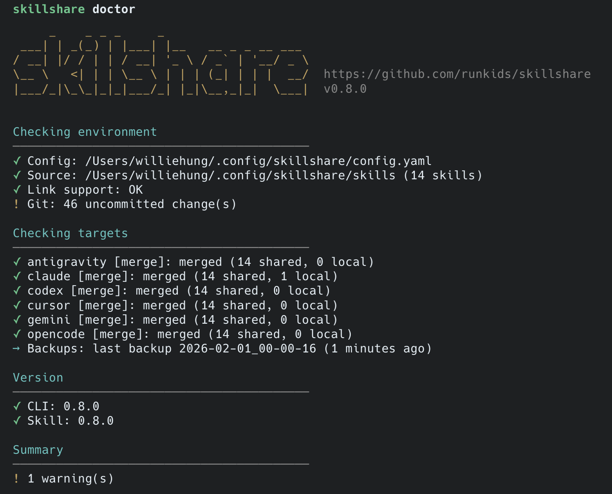

# FAQ & Troubleshooting

## Doctor

Diagnose configuration issues.

```bash
skillshare doctor
```

<p>
  
</p>

**What it checks:**
- Source directory exists and is valid
- Config file is properly formatted
- All targets are accessible
- Symlinks are not broken
- Git repository status (if initialized)

---

## Frequently Asked Questions

### Isn't this just `ln -s`?

Yes, at its core. But skillshare handles multi-target detection, backup/restore, merge mode, cross-device sync, and broken symlink recovery — so you don't have to.

### Can I sync skills to a custom or uncommon tool?

Yes. Use `skillshare target add <name> <path>` with the tool's skills directory.

### How do I sync across multiple machines?

Use git-based cross-machine sync:

```bash
# Machine A: push changes
skillshare push -m "Add new skill"

# Machine B: pull and sync
skillshare pull
```

See [cross-machine.md](cross-machine.md) for full setup.

### What happens if I modify a skill in the target directory?

Since targets are symlinks, changes are made directly to the source. All targets see the change immediately.

### How do I keep a CLI-specific skill?

Use `merge` mode. Local skills in the target won't be overwritten.

### What if I accidentally delete a skill through a symlink?

If you have git initialized (recommended), recover with:

```bash
cd ~/.config/skillshare/skills
git checkout -- deleted-skill/
```

### How does `target remove` work? Is it safe?

Yes, it's safe:

1. **Backup** — Creates backup of the target
2. **Detect mode** — Checks if symlink or merge mode
3. **Unlink** — Removes symlinks, copies source content back
4. **Update config** — Removes target from config.yaml

This is why `skillshare target remove` is safe, while `rm -rf ~/.claude/skills` would delete your source files.

### Can I use skillshare with a private git repo?

Yes. Use SSH URLs when initializing:

```bash
skillshare init --remote git@github.com:you/private-skills.git
```

### How do tracked repos differ from regular skills?

| Aspect | Regular Skill | Tracked Repo |
|--------|---------------|--------------|
| Source | Copied to source | Cloned with `.git` |
| Update | `install --update` | `update <name>` (git pull) |
| Prefix | None | `_` prefix |
| Nested | Flattened | Flattened with `__` |

---

## Common Issues

### `config not found: run 'skillshare init' first`

Run `skillshare init` to create the configuration. Add `--source` if you want a custom path.

### Integration tests cannot find the binary

Run `go build -o bin/skillshare ./cmd/skillshare` or set `SKILLSHARE_TEST_BINARY`.

### Deleting a symlinked target removed source files

Use `skillshare target remove <name>` to unlink targets safely. Recover via git if needed:

```bash
cd ~/.config/skillshare/skills
git checkout -- .
```

### Target directory already exists with files

Run `skillshare backup` before `skillshare sync` to migrate safely.

### Target path does not end with `skills`

Verify the path and prefer `.../skills` as the suffix.

### `target add` fails with "path does not exist"

Create the directory first:

```bash
mkdir -p ~/.myapp/skills
skillshare target add myapp ~/.myapp/skills
```

### Sync seems stuck or slow

Check for large files in your skills directory. Use `.gitignore` patterns in config:

```yaml
ignore:
  - "**/.DS_Store"
  - "**/.git/**"
  - "**/node_modules/**"
```

### Pull conflicts with local changes

If `pull` fails due to local changes:

```bash
# Option 1: Push your changes first
skillshare push -m "Local changes"
skillshare pull

# Option 2: Discard local changes
cd ~/.config/skillshare/skills
git checkout -- .
skillshare pull
```

### Skill not appearing in AI CLI

1. Check if skill has valid `SKILL.md` with `name` field
2. Run `skillshare sync` to ensure symlinks are created
3. Run `skillshare doctor` to diagnose issues
4. Restart your AI CLI (some cache skill lists)

### Upgrade fails with "GitHub API rate limit exceeded"

GitHub limits unauthenticated API requests to 60/hour. Solutions:

**Option 1: Set a GitHub token (recommended)**
```powershell
# Windows PowerShell
$env:GITHUB_TOKEN = "ghp_your_token_here"
skillshare upgrade
```

```bash
# macOS/Linux
export GITHUB_TOKEN=ghp_your_token_here
skillshare upgrade
```

**Option 2: Force upgrade**
```bash
skillshare upgrade --cli --force
```

Create a token at: https://github.com/settings/tokens (no scopes needed for public repos)

---

## Windows-Specific

### How do I install on Windows?

Use PowerShell:
```powershell
irm https://raw.githubusercontent.com/runkids/skillshare/main/install.ps1 | iex
```

Or download the `.zip` from [releases](https://github.com/runkids/skillshare/releases).

### Does skillshare need admin privileges on Windows?

No. Skillshare uses NTFS junctions instead of symlinks, which don't require admin privileges.

### Where are config files on Windows?

```
%USERPROFILE%\.config\skillshare\config.yaml
%USERPROFILE%\.config\skillshare\skills\
```

### How do I set GITHUB_TOKEN permanently on Windows?

```powershell
# Current session only
$env:GITHUB_TOKEN = "ghp_your_token"

# Permanent (user-level)
[Environment]::SetEnvironmentVariable("GITHUB_TOKEN", "ghp_your_token", "User")
```
