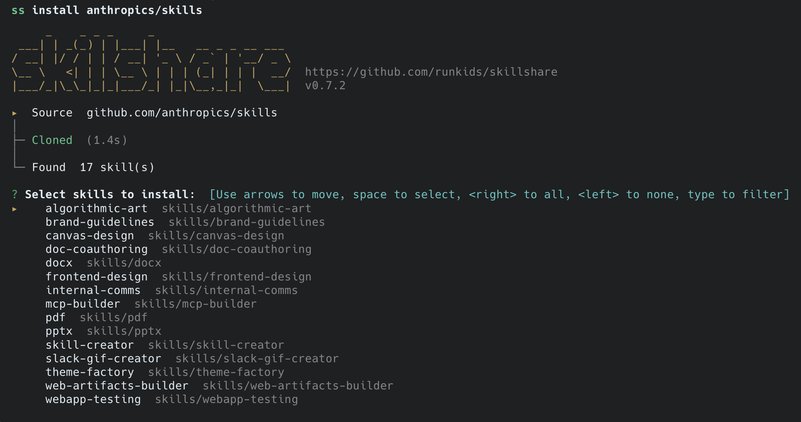
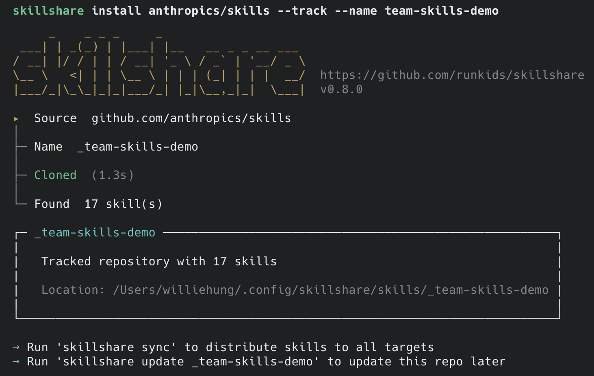
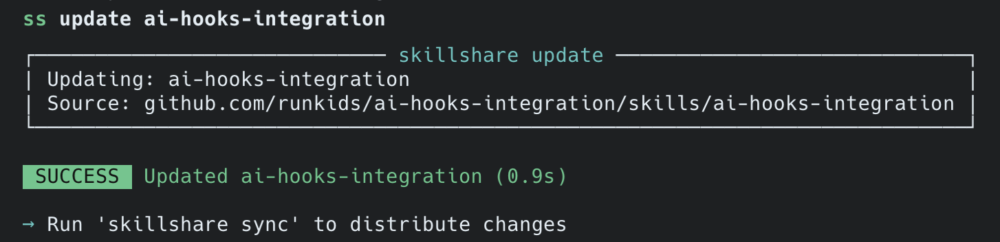
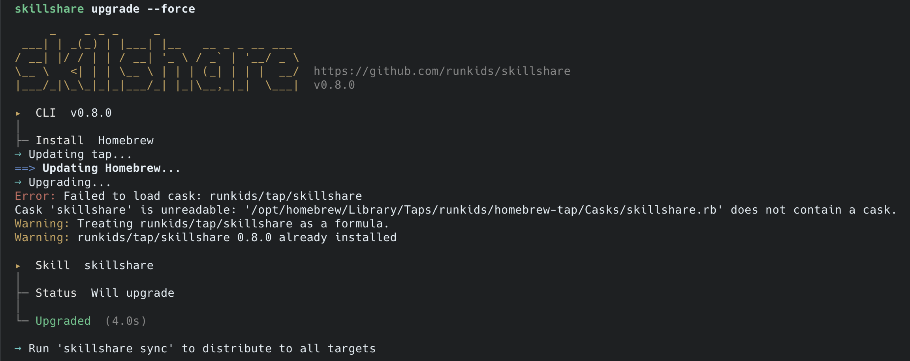

# Install, Update & Manage Skills

## Init

First-time setup. Auto-detects installed AI CLIs and configures targets.

```bash
skillshare init              # Interactive setup
skillshare init --dry-run    # Preview without changes
```

**What happens:**
```
┌─────────────────────────────────────────────────────────────────┐
│ skillshare init                                                 │
└─────────────────────────────────────────────────────────────────┘
                              │
                              ▼
┌─────────────────────────────────────────────────────────────────┐
│ 1. Create source directory                                      │
│    → ~/.config/skillshare/skills/                               │
└─────────────────────────────────────────────────────────────────┘
                              │
                              ▼
┌─────────────────────────────────────────────────────────────────┐
│ 2. Auto-detect AI CLIs                                          │
│    → Found: claude, cursor, codex                               │
└─────────────────────────────────────────────────────────────────┘
                              │
                              ▼
┌─────────────────────────────────────────────────────────────────┐
│ 3. Initialize git (optional)                                    │
│    → Ready for cross-machine sync                               │
└─────────────────────────────────────────────────────────────────┘
                              │
                              ▼
┌─────────────────────────────────────────────────────────────────┐
│ 4. Create config.yaml                                           │
│    → ~/.config/skillshare/config.yaml                           │
└─────────────────────────────────────────────────────────────────┘
```

### Init Options

| Flag | Description |
|------|-------------|
| `--source <path>` | Custom source directory |
| `--remote <url>` | Set git remote (implies git init) |
| `--dry-run` | Preview without changes |

### Common Scenarios

```bash
# Standard setup (auto-detect everything)
skillshare init

# Setup with git remote for cross-machine sync
skillshare init --remote git@github.com:you/my-skills.git

# Use existing skills directory
skillshare init --source ~/.config/skillshare/skills
```

---

## Overview

```
┌──────────────────────────────────────────────────────────────┐
│                    SKILL LIFECYCLE                           │
│                                                              │
│   install ──► source ──► sync ──► targets                   │
│                 │                                            │
│              update                                          │
│                 │                                            │
│            uninstall ──► sync ──► removed from targets       │
└──────────────────────────────────────────────────────────────┘
```

---

## Install

Add skills from GitHub repos, git URLs, or local paths.

### Quick Examples

```bash
# From GitHub (shorthand)
skillshare install anthropics/skills/skills/pdf

# Browse available skills in a repo
skillshare install anthropics/skills

# From local path
skillshare install ~/Downloads/my-skill

# As tracked repo (for team sharing)
skillshare install github.com/team/skills --track
```

### GitHub Shorthand

Use `owner/repo` format — automatically expands to `github.com/owner/repo`:

```bash
skillshare install anthropics/skills                    # Browse mode
skillshare install anthropics/skills/skills/pdf         # Direct install
skillshare install ComposioHQ/awesome-claude-skills     # Another repo
```

### Discovery Mode (Browse Skills)

When you don't specify a path, skillshare lists all available skills:

```bash
skillshare install anthropics/skills
```

<p>
  
</p>

**Tip**: Use `--dry-run` to preview without installing:
```bash
skillshare install anthropics/skills --dry-run
```

### Direct Install (Specific Path)

Provide the full path to install immediately:

```bash
# GitHub with subdirectory
skillshare install anthropics/skills/skills/pdf
skillshare install google-gemini/gemini-cli/packages/core/src/skills/builtin/skill-creator

# Full URL
skillshare install github.com/user/repo/path/to/skill

# SSH URL
skillshare install git@github.com:user/repo.git

# Local path
skillshare install ~/Downloads/my-skill
skillshare install /absolute/path/to/skill
```

### Options

| Flag | Short | Description |
|------|-------|-------------|
| `--name <name>` | | Custom name for the skill |
| `--force` | `-f` | Overwrite existing skill |
| `--update` | `-u` | Update if exists (git pull or reinstall) |
| `--track` | `-t` | Keep `.git` for tracked repos |
| `--dry-run` | `-n` | Preview only |

### Common Scenarios

**Install with custom name:**
```bash
skillshare install google-gemini/gemini-cli/.../skill-creator --name my-creator
# Installed as: ~/.config/skillshare/skills/my-creator/
```

**Force overwrite existing:**
```bash
skillshare install ~/my-skill --force
```

**Update existing skill:**
```bash
# By skill name (uses stored source)
skillshare install pdf --update

# By source URL
skillshare install anthropics/skills/skills/pdf --update
```

**Install team repo (tracked):**
```bash
skillshare install anthropics/skills --track
```

<p>
  
</p>

### After Installing

Always sync to distribute to targets:

```bash
skillshare install anthropics/skills/skills/pdf
skillshare sync  # ← Don't forget!
```

---

## List

View installed skills and their sources.

```bash
skillshare list              # Basic list
skillshare list --verbose    # Detailed info
```

<p>
  
</p>

---

## Update

Update skills or tracked repositories.

### Update Regular Skills

```bash
skillshare update pdf              # Update from stored source
skillshare update pdf --dry-run    # Preview
```

<p>
  
</p>

**How it works:**
```
┌─────────────────────────────────────────┐
│ skillshare update pdf                   │
└─────────────────────────────────────────┘
         │
         ▼
┌─────────────────────────────────────────┐
│ 1. Read stored source from metadata     │
│    → github.com/anthropics/skills/pdf   │
└─────────────────────────────────────────┘
         │
         ▼
┌─────────────────────────────────────────┐
│ 2. Re-download from source              │
└─────────────────────────────────────────┘
         │
         ▼
┌─────────────────────────────────────────┐
│ 3. Replace skill in source directory    │
└─────────────────────────────────────────┘
```

### Update Tracked Repos

```bash
skillshare update _team-repo       # git pull specific repo
skillshare update team-repo        # _ prefix optional
skillshare update --all            # Update all tracked repos + skills with metadata
```

**How it works:**
```
┌─────────────────────────────────────────┐
│ skillshare update team-repo            │
└─────────────────────────────────────────┘
         │
         ▼
┌───────────────────────────────────────────┐
│ cd ~/.config/skillshare/skills/_team-repo │
│ git pull                                  │
└───────────────────────────────────────────┘
```

**Safety check:** If the repo has uncommitted changes, update is blocked:
```bash
skillshare update team-repo
# → "Repository has uncommitted changes"
# → Shows modified files
# → Requires --force to discard and update

skillshare update team-repo --force   # Discards local changes, then pulls
skillshare update --all               # Update all (skips dirty repos)
skillshare update --all --force       # Discards local changes, updates all
```

### After Updating

```bash
skillshare update team-repo
skillshare sync  # ← Distribute changes to targets
```

---

## Upgrade

Upgrade the skillshare CLI binary and/or built-in skill.

```bash
skillshare upgrade              # Both CLI + skill
skillshare upgrade --cli        # CLI only
skillshare upgrade --skill      # Skill only
skillshare upgrade --force      # Skip confirmation
skillshare upgrade --dry-run    # Preview
```

<p>
  
</p>

**What gets upgraded:**

| Component | Location | What happens |
|-----------|----------|--------------|
| CLI | `/usr/local/bin/skillshare` | Downloads latest binary |
| Skill | `~/.config/skillshare/skills/skillshare/` | Downloads latest skill files |

**After upgrading skill:**
```bash
skillshare upgrade --skill
skillshare sync  # ← Update skill in all targets
```

**Troubleshooting:**

If CLI upgrade fails (e.g., GitHub API rate limit), use `--force`:
```bash
skillshare upgrade --cli --force
```

To avoid rate limits, set a GitHub token or login to `gh` cli:
```bash
export GITHUB_TOKEN=ghp_your_token_here
skillshare upgrade
```

---

## Uninstall

Remove a skill from source.

```bash
skillshare uninstall pdf              # With confirmation
skillshare uninstall pdf --force      # Skip confirmation
skillshare uninstall pdf --dry-run    # Preview
```

<p>
  
</p>

**For tracked repos:**
```bash
skillshare uninstall team-repo       # Checks for uncommitted changes
skillshare uninstall team-repo -f    # Force (ignore uncommitted)
```

### After Uninstalling

```bash
skillshare uninstall pdf
skillshare sync  # ← Remove from all targets
```

---

## Related

- [sync.md](sync.md) — Sync skills to targets
- [team-edition.md](team-edition.md) — Tracked repos and team sharing
- [faq.md](faq.md) — Troubleshooting
