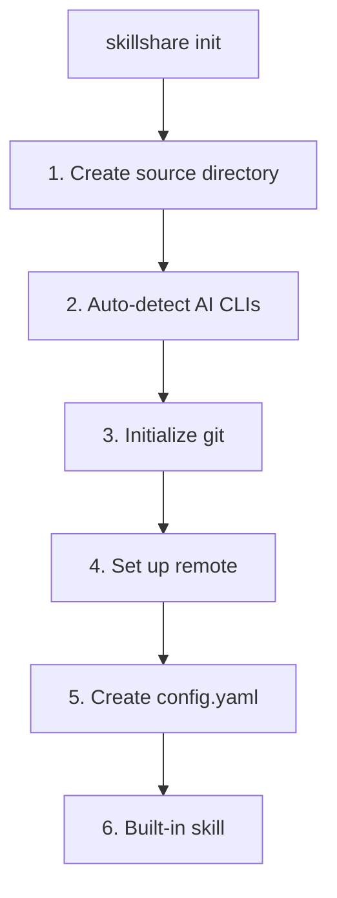
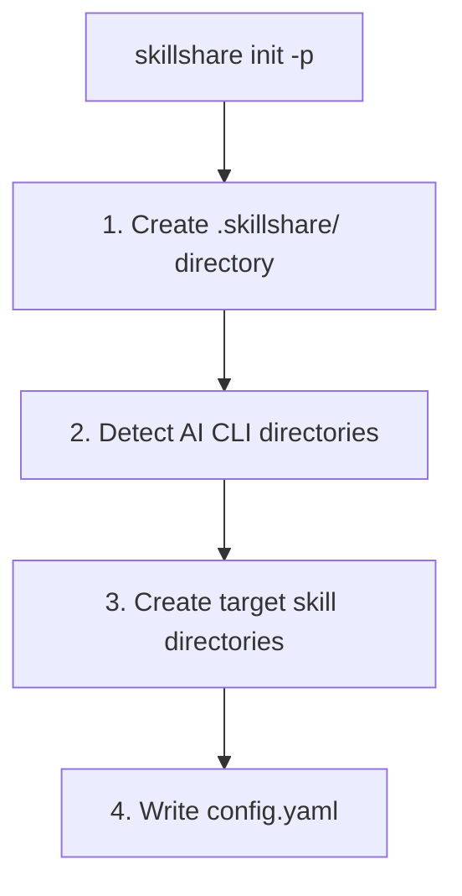

# init

First-time setup. Auto-detects installed AI CLIs and configures targets.

```bash
skillshare init              # Interactive setup
skillshare init --dry-run    # Preview without changes
```

## When to Use

- First time setting up skillshare on a machine
- Migrating to a new computer (with `--remote` to connect to existing repo)
- Adding skillshare to a project (with `--project`)
- Discovering newly installed AI CLIs (with `--discover`)

## What Happens



## Project Mode

Initialize project-level skills with `-p`:

```bash
skillshare init -p                              # Interactive
skillshare init -p --targets claude,cursor  # Non-interactive
```

### What Happens



After init, commit `.skillshare/` to git. See [Project Setup](/docs/guides/project-setup) for the full guide.

## Discover Mode

Re-run init on an existing setup to detect and add new AI CLI targets:

### Global

```bash
skillshare init --discover              # Interactive selection
skillshare init --discover --select codex,opencode  # Non-interactive
```

Scans for newly installed AI CLIs not yet in your config and prompts you to add them.

### Project

```bash
skillshare init -p --discover           # Interactive selection
skillshare init -p --discover --select gemini  # Non-interactive
```

Scans the project directory for new AI CLI directories (e.g., `.gemini/`) and adds them as targets.

:::tip
If you run `skillshare init` on an already-initialized setup without `--discover`, the error message will hint you to use it.
:::

## Options

| Flag | Description |
|------|-------------|
| `--source, -s <path>` | Custom source directory |
| `--remote <url>` | Set git remote (implies `--git`; auto-pulls if remote has skills) |
| `--project, -p` | Initialize project-level skills in current directory |
| `--copy-from, -c <name\|path>` | Copy skills from a specific CLI or path |
| `--no-copy` | Start with empty source (skip copy prompt) |
| `--targets, -t <list>` | Comma-separated target names |
| `--all-targets` | Add all detected targets |
| `--no-targets` | Skip target selection |
| `--git` | Initialize git without prompting |
| `--no-git` | Skip git initialization |
| `--skill` | Install built-in skillshare skill without prompting (adds `/skillshare` to AI CLIs) |
| `--no-skill` | Skip built-in skill installation |
| `--discover, -d` | Detect and add new AI CLI targets to existing config |
| `--select <list>` | Comma-separated targets to add (requires `--discover`) |
| `--dry-run, -n` | Preview without changes |

## Common Scenarios

### Remote setup (pick one)

Interactive (recommended for first-time setup when you want guided prompts):

```bash
skillshare init --remote git@github.com:you/my-skills.git
```

Non-interactive (no prompts, auto-detect installed targets):

```bash
skillshare init --remote git@github.com:you/my-skills.git --no-copy --all-targets --no-skill
```

Non-interactive (no prompts, and import existing Claude skills now):

```bash
skillshare init --remote git@github.com:you/my-skills.git --copy-from claude --all-targets --no-skill
```

### Other scenarios

```bash
# Standard setup (auto-detect everything)
skillshare init

# Use existing skills directory
skillshare init --source ~/.config/skillshare/skills

# Project-level setup
skillshare init -p
skillshare init -p --targets claude,cursor

# Fully non-interactive setup
skillshare init --no-copy --all-targets --git --skill

# Add newly installed CLIs to existing config
skillshare init --discover
skillshare init -p --discover
```
