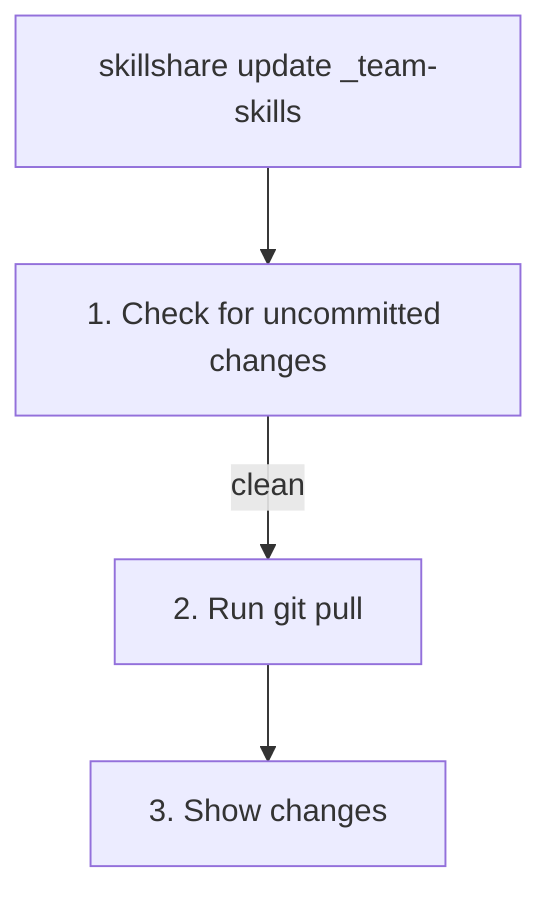
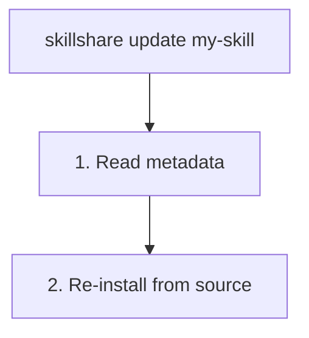

# update

Update one or more skills or tracked repositories to the latest version.

```bash
skillshare update my-skill           # Update single skill
skillshare update a b c              # Update multiple at once
skillshare update --group frontend   # Update all skills in a group
skillshare update team-skills        # Update tracked repo
skillshare update --all              # Update everything
```

## When to Use

- A tracked repository has new commits (found via `check`)
- An installed skill has a newer version available
- You want to re-download a skill from its original source


## What Happens

### For Tracked Repositories



### For Regular Skills



## Options

| Flag | Description |
|------|-------------|
| `--all, -a` | Update all tracked repos and skills with metadata |
| `--group, -G <name>` | Update all updatable skills in a group (repeatable) |
| `--force, -f` | Discard local changes and force update |
| `--dry-run, -n` | Preview without making changes |
| `--help, -h` | Show help |

## Update Multiple

Update several skills at once:

```bash
skillshare update skill-a skill-b skill-c
```

Only updatable skills (tracked repos or skills with metadata) are processed. Skills not found are warned but don't cause failure.

## Update Group

Update all updatable skills within a group directory:

```bash
skillshare update --group frontend        # Update all in frontend/
skillshare update -G frontend -G backend  # Multiple groups
skillshare update x -G backend            # Mix names and groups
```

Local skills (without metadata or `.git`) inside the group are silently skipped.

A positional argument that matches a group directory (not a repo or skill) is auto-expanded:

```bash
skillshare update frontend   # Same as --group frontend
# ℹ 'frontend' is a group — expanding to 3 updatable skill(s)
```

:::note
`--all` cannot be combined with skill names or `--group`.
:::

## Update All

Update everything at once:

```bash
skillshare update --all
```

This updates:
1. All tracked repositories (git pull)
2. All skills with source metadata (re-install)

### Example Output

```
┌─────────────────────────────────────────────────────────────────┐
│ skillshare update --all                                         │
│ Updating 2 tracked repos + 3 skills                             │
└─────────────────────────────────────────────────────────────────┘

[1/5] ✓ _team-skills       Already up to date
[2/5] ✓ _personal-repo     3 commits, 2 files
[3/5] ✓ my-skill           Reinstalled from source
[4/5] ! other-skill        has uncommitted changes (use --force)
[5/5] ✓ another-skill      Reinstalled from source

┌────────────────────────────┐
│ Summary                    │
│   Total:    5              │
│   Updated:  4              │
│   Skipped:  1              │
└────────────────────────────┘
```

## Handling Conflicts

If a tracked repo has uncommitted changes:

```bash
# Option 1: Commit your changes first
cd ~/.config/skillshare/skills/_team-skills
git add . && git commit -m "My changes"
skillshare update _team-skills

# Option 2: Discard and force update
skillshare update _team-skills --force
```

## After Updating

Run `skillshare sync` to distribute changes to all targets:

```bash
skillshare update --all
skillshare sync
```

## Project Mode

Update skills and tracked repos in the project:

```bash
skillshare update pdf -p              # Update single skill (reinstall)
skillshare update a b c -p            # Update multiple skills
skillshare update --group frontend -p # Update all in a group
skillshare update team-skills -p      # Update tracked repo (git pull)
skillshare update --all -p            # Update everything
skillshare update --all -p --dry-run  # Preview
```

### How It Works

| Type | Method | Detected by |
|------|--------|-------------|
| **Tracked repo** (`_repo`) | `git pull` | Has `.git/` directory |
| **Remote skill** (with metadata) | Reinstall from source | Has `.skillshare-meta.json` |
| **Local skill** | Skipped | No metadata |

The `_` prefix is optional — `skillshare update team-skills -p` auto-detects `_team-skills`.

### Handling Conflicts

Tracked repos with uncommitted changes are blocked by default:

```bash
# Option 1: Commit changes first
cd .skillshare/skills/_team-skills
git add . && git commit -m "My changes"
skillshare update team-skills -p

# Option 2: Discard and force update
skillshare update team-skills -p --force
```

### Typical Workflow

```bash
skillshare update --all -p
skillshare sync
git add .skillshare/ && git commit -m "Update remote skills"
```

## See Also

- [install](/docs/commands/install) — Install skills
- [upgrade](/docs/commands/upgrade) — Upgrade CLI and built-in skill
- [sync](/docs/commands/sync) — Sync to targets
- [Project Skills](/docs/concepts/project-skills) — Project mode concepts
