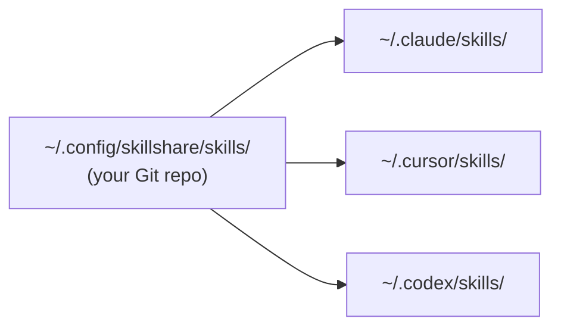

# Getting Started

skillshare keeps one source directory in sync with every AI CLI's skill directory on your machine. You write or install a skill once; symlinks make it appear in Claude, Cursor, Codex, and any other configured target.



Source is a regular Git repo you own. Push from one machine, pull on another, share with a teammate — skillshare handles the symlink layer underneath.

## What lives in source

Three kinds of skills coexist in your source directory. They differ only in how they're tracked by Git and how you update them.

**Skills you author.** Create with `skillshare new <name>` or just drop a folder in. Committed to your repo. Updated by editing.

**Vendored skills.** Installed with `skillshare install <url>`. The clone lives directly in your repo and gets committed alongside your own work. `.metadata.json` records the upstream URL so `skillshare update` can pull new versions later. Use this when you want to customize, freeze a version, or stay reproducible offline.

**Tracked skills.** Installed with `skillshare install <url> --track`. The clone lands in a `_`-prefixed directory that's auto-added to `.gitignore`, so it never enters your repo. `skillshare update` re-pulls it from upstream. Use this for company or community repos you don't intend to modify.

A typical source after a few months looks like:

```
~/.config/skillshare/skills/
├── my-review/                 # authored
├── my-deploy-checklist/       # authored
├── agent-browser/             # vendored
├── skill-creator/             # vendored
├── _company-skills/           # tracked  (gitignored)
└── _team-rules/               # tracked  (gitignored)
```

## Pick a starting point

| You are… | Start here |
|---|---|
| Setting up skillshare for the first time | [First Sync](./first-sync.md) |
| Have skills in Claude / Cursor / Codex already | [From Existing Skills](./from-existing-skills.md) |
| Need command syntax fast | [Quick Reference](./quick-reference.md) |
| Want to poke around without installing | [Docker Playground](/docs/how-to/advanced/docker-sandbox#playground) |

## What's next

- [Core Concepts](/docs/understand) — source, targets, sync modes in depth
- [Daily Workflow](/docs/how-to/daily-tasks/daily-workflow) — day-to-day usage
- [Commands Reference](/docs/reference/commands) — full command reference
