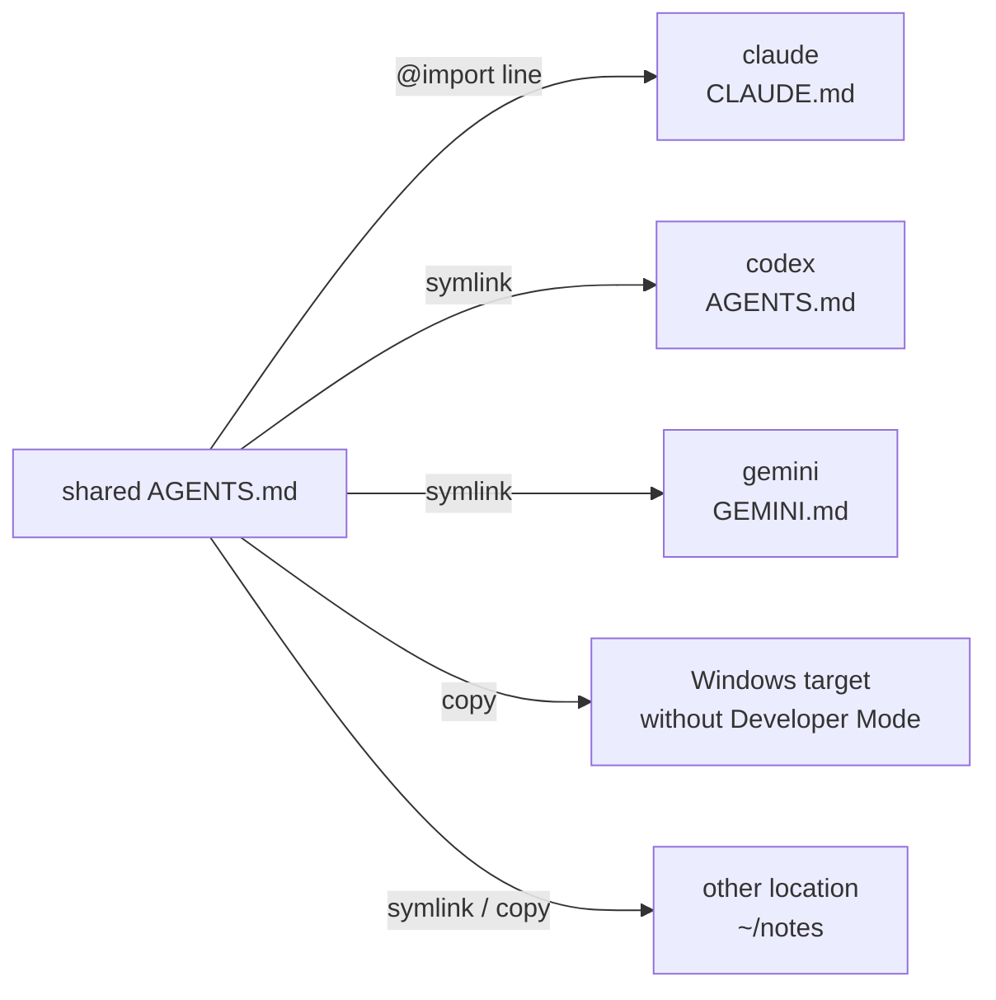

# Share one AGENTS.md across your tools

Each AI tool reads its standing instructions from its own file. Claude Code reads
`CLAUDE.md`, Gemini CLI reads `GEMINI.md`, and Codex and most other tools read
`AGENTS.md`, each in its own folder. The web dashboard (`skillshare ui`) shows these
files, lets you edit them, and can give several tools one shared `AGENTS.md`.

This is a dashboard feature. There is no separate CLI command. A shared `AGENTS.md`
is stored as an [extra](../../reference/commands/extras.md#single-file-extras), so
`skillshare sync extras` also keeps it in place.

To use shared instructions to read one folder of memory notes, follow the
[Memory walkthrough](./sharing-memory.md), with screenshots from creation through
connecting Claude and Codex.

## See what a target reads

Open a target from **Targets**. Its page has a tab named after the file that target
reads: **CLAUDE.md** for claude, **GEMINI.md** for gemini, **AGENTS.md** for codex.
The tab shows, from top to bottom:

- The file's path and size, with **Change location** ([see below](#change-which-file-a-target-reads)),
  **Convert…** and **Save**.
- One line with the **Read order**: the files the tool loads, in the order it loads
  them, each marked as loaded or not (hover to see `loaded`, `skipped` or `missing`).
  For claude this includes the Markdown files in `~/.claude/rules/` once that folder
  has any (an empty rules folder isn't listed), and a note that
  claude doesn't read a user-level `AGENTS.md`. In global mode the same line ends with
  **Shared AGENTS.md**: the shared files this target uses, and a link to choose them.
- An editor for the file, with **Edit** and **Preview** tabs; **Preview** renders
  the Markdown, including unsaved edits. Long lines wrap. **Save** (or ⌘S / Ctrl+S) backs up the
  current file first, and creates the file if it doesn't exist yet. Lines that start
  with `@` are imports, and only some tools expand them; other tools read them as
  plain text. The editor tints these lines and adds a short note saying which tool
  expands them.
- Warnings. Windsurf reads only the first 6,000 characters of its global rules file.


If the file is a link to a shared `AGENTS.md`, the editor is read-only. Editing it
would change every target that uses the shared file, so edit that file on its own
page instead. A link you made yourself, such as one into your dotfiles, stays
editable, and saving writes through to the file it points to.

skillshare knows these instruction files:

| Target | User-level file | Project file | Follows `@` imports |
|--------|-----------------|--------------|---------------------|
| amp | `~/.config/amp/AGENTS.md` | `AGENTS.md` | No |
| antigravity | `~/.gemini/GEMINI.md` (the same file as gemini) | `AGENTS.md` | No |
| antigravity-cli | `~/.gemini/GEMINI.md` (the same file as gemini) | `AGENTS.md` | No |
| claude | `~/.claude/CLAUDE.md`, plus `~/.claude/rules/` | `CLAUDE.md`, or `AGENTS.md` when there is no `CLAUDE.md`, plus `.claude/rules/` | Yes |
| cline | `~/.agents/AGENTS.md` (the same file as universal), plus `~/Documents/Cline/Rules/` | `AGENTS.md`, plus `.clinerules/` | No |
| codebuddy | `~/.codebuddy/CODEBUDDY.md`, plus `~/.codebuddy/rules/` | `CODEBUDDY.md`, or `AGENTS.md` when there is no `CODEBUDDY.md`, plus `.codebuddy/rules/` | Yes |
| codex | `~/.codex/AGENTS.md` | `AGENTS.md` | No |
| commandcode | `~/.commandcode/AGENTS.md` | `AGENTS.md` | Yes |
| copilot | `~/.copilot/copilot-instructions.md` | `.github/copilot-instructions.md` | No |
| cursor | None: user rules live in Cursor's settings | `AGENTS.md` | No |
| deepagents | `~/.deepagents/agent/AGENTS.md` | `.deepagents/AGENTS.md` | No |
| devin | `~/.config/devin/AGENTS.md` | `AGENTS.md` | No |
| droid | `~/.factory/AGENTS.md` | `AGENTS.md` | No |
| firebender | `~/.firebender/AGENTS.md` | `AGENTS.md` | No |
| forgecode | `~/forge/AGENTS.md` | `AGENTS.md` | No |
| gemini | `~/.gemini/GEMINI.md` | `GEMINI.md` | No |
| goose | `~/.config/goose/.goosehints` | `AGENTS.md` | No |
| grok | `~/.grok/AGENTS.md`, plus `~/.grok/rules/` | `AGENTS.md`, plus `.grok/rules/` | No |
| iflow | `~/.iflow/IFLOW.md` | `IFLOW.md` | Yes |
| junie | `~/.junie/AGENTS.md` | `AGENTS.md` | No |
| kiro | `~/.kiro/steering/AGENTS.md` | `AGENTS.md` | No |
| omp | `~/.omp/agent/AGENTS.md` | `AGENTS.md` | Yes |
| opencode | `~/.config/opencode/AGENTS.md` | `AGENTS.md` | No |
| pi | `~/.pi/agent/AGENTS.md` | `AGENTS.md` | No |
| pochi | `~/.pochi/README.pochi.md` | `AGENTS.md` | No |
| qoder | `~/.qoder/AGENTS.md`, plus `~/.qoder/rules/` | `AGENTS.md`, plus `.qoder/rules/` | Yes |
| qwen | `~/.qwen/QWEN.md` | `QWEN.md` | Yes |
| roo | `~/.roo/rules/AGENTS.md` | `AGENTS.md` | No |
| rovodev | `~/.rovodev/AGENTS.md` | `AGENTS.md` | No |
| universal | `~/.agents/AGENTS.md` | `AGENTS.md` | No |
| verdent | `~/.verdent/VERDENT.md` | `AGENTS.md` | No |
| vibe | `~/.vibe/AGENTS.md` | `AGENTS.md` | No |
| warp | `~/.agents/AGENTS.md` (the same file as universal) | `AGENTS.md` | No |
| windsurf | `~/.codeium/windsurf/memories/global_rules.md` (first 6,000 characters) | `AGENTS.md` | No |
| zed | `~/.config/zed/AGENTS.md` | `AGENTS.md` | No |

A [second account](../../reference/targets/configuration.md#agent-config-dir) of
Claude, Codex or Pi reads the same file inside its own config directory, for example
`~/.claude-work/CLAUDE.md`. For any other target, you
[tell skillshare which file it reads](#tools-skillshare-doesnt-know).

## Tools that read skills through universal

Many tools read skills from `~/.agents/skills`, the universal target's folder.
Codex and Goose use it as their skills folder, and tools such as Gemini CLI, Pi and
OpenCode also read it next to their own. If you sync skills to them through
universal and don't add them as targets, they still read their own instruction
file, not `~/.agents/AGENTS.md`: for example, Codex reads `~/.codex/AGENTS.md` and
Gemini CLI reads `~/.gemini/GEMINI.md`.

In global mode, universal's **AGENTS.md** tab lists the files it manages on the
left: universal's own file first, then these tools when they are installed, which
skillshare tells by their folder, such as `~/.codex` or `~/.gemini`. Each row shows
whether the file exists yet. Pick one to see and edit its own file; the choice is
kept in the URL as `?tool=<name>`. They also appear in the shared
AGENTS.md list under **Extras**, so you can connect a shared file to them. Their
file location can't be changed, because they have no target entry to store it in.
A tool that isn't listed can be added as its own target.

Some tools, such as Cline and the Warp Agent CLI, read `~/.agents/AGENTS.md` itself.
Codex, Gemini CLI and Pi read their own file.

## Convert CLAUDE.md to AGENTS.md

Click **Convert…** on the target's tab to make its content readable by other tools.
The button appears when the file has content to move and isn't already an
`AGENTS.md`. The dialog previews every change before anything is written, and each
file it changes or removes is backed up first.

| Method | Result | Available |
|--------|--------|-----------|
| **Move to AGENTS.md, CLAUDE.md imports it** (recommended) | The content moves to `AGENTS.md`. `CLAUDE.md` keeps only an `@AGENTS.md` line and the lines only claude understands | Tools that follow `@` imports (claude) |
| **Rename CLAUDE.md to AGENTS.md** | `CLAUDE.md` is removed and claude reads `AGENTS.md` in its place | Projects only, for a tool that reads `AGENTS.md` when its own file is missing. Refused while a `CLAUDE.local.md` exists, or while `CLAUDE.md` uses a shared `AGENTS.md` (the next sync would bring `CLAUDE.md` back) |
| **Copy to AGENTS.md** | Both files stay and are edited separately, so they will drift apart | Always |

The file names follow the target: for gemini the dialog offers **Copy to
AGENTS.md** only. With the first method, **Leave the @import lines in CLAUDE.md**
is on by default, because other tools would read those lines as plain text.

At user level, no other tool reads an `AGENTS.md` in `~/.claude`. So in global mode
the first method also offers **Make it a shared AGENTS.md other targets can use**,
which is on by default:

- **New one…**: name a new shared `AGENTS.md`; the name starts as the target's
  name, such as `claude`. The content moves into it and `CLAUDE.md` imports it.
- An existing shared file: the content goes at the end of that file, and
  `CLAUDE.md` then imports it.

With sharing off, the content goes to `~/.claude/AGENTS.md` and `CLAUDE.md` gets an
`@AGENTS.md` line.

When no other shared file is available, **Convert…** asks only for the new name; the shared-file picker appears only when there is another file to choose.

## Share one AGENTS.md in global mode

Go to **Extras** and open the **AGENTS.md** tab. **New shared AGENTS.md** asks for a
name (letters, digits, `-` and `_`) and where to start:

- **Empty file**: write the first version in the dialog.
- **Move claude's file here** (or any other target that has a file and doesn't use a
  shared one yet): the target's current file moves into the shared file, and the
  target uses the shared file from then on. The original is backed up first.

Each shared file is stored at `<extras source>/<name>/AGENTS.md`, by default
`~/.config/skillshare/extras/<name>/AGENTS.md`.

How a target uses a shared file depends on whether it follows `@` imports:

- **Import targets** (claude, and tools you mark as supporting `@import`) keep their
  own content and can use several shared files at once. skillshare adds one line per
  shared file inside a managed block at the top of the file and never changes
  anything outside the block. Claude has no user-level `AGENTS.md`, so this block is
  how it reads a shared one:

  ```markdown title="~/.claude/CLAUDE.md"
  <!-- skillshare:instructions:begin -->
  @/Users/you/.config/skillshare/extras/personal/AGENTS.md
  <!-- skillshare:instructions:end -->

  Your own Claude-only instructions stay here.
  ```

- **Other targets** (codex, gemini and the rest) use one shared file. Their file is
  backed up, then replaced by a link (symlink) to the shared file. On Windows without
  Developer Mode, file links aren't available, so it is replaced by a copy instead.

In global mode, one shared file reaches each target like this:



The tab lists the shared files on the left, each with the targets connected to it.
Click one to show it on the right: its path, its content (a rendered **Preview** by default; switch to
**Source** for the raw text), and every
target with a switch. The selected file is part of the URL
(`/extras?tab=instructions&file=<name>`), so a link opens that file directly.

- Turn a target's switch on to connect it. An import target gets one more import line
  and keeps its other shared files. A target that already uses another shared file
  asks first, because it can use only one.
- Turn the switch off to [restore](#restore-and-delete) the target. It shows a
  preview of the result first. For an import target only this file's import line
  goes; its other shared files stay.
- **Connect all** and **Restore all** list every target they change, with a note on
  what happens to each one, before they do anything. To change only some targets,
  tick their rows and use **Connect** or **Restore** in the selection bar.

Some targets are special:

- antigravity reads the same `~/.gemini/GEMINI.md` as gemini. When both are
  targets, antigravity's row follows gemini and can't be changed on its own.
- cline and warp read the same `~/.agents/AGENTS.md` as universal. When universal
  is a target too, their rows follow universal.
- cursor isn't listed: its user rules live in Cursor's settings, not in a file.

A target file in link or `copy` mode can belong to only one shared file. It cannot also import
another shared file. **Connect all** skips targets held by another shared file, including links you
created yourself; restore that connection before attaching a different file.

## Manage one shared file

Each connected target has a mode picker and shows its status. The mode decides how
the target gets the shared file:

| Mode | Target file | Available |
|------|-------------|-----------|
| `import` | Your own file, with one `@import` line in the managed block. Changes to the shared file apply right away | Targets that follow `@` imports |
| `symlink` | A link to the shared file. Changes apply right away | Not on Windows without Developer Mode |
| `copy` | A copy of the shared file. Saving the shared file in the dashboard updates the copy; after editing the shared file elsewhere, sync again with **Sync** on this page | Always |


When file links are unavailable, an info tooltip beside **Targets** explains Windows Developer Mode. Instruction warnings and errors use the dashboard language, with the original English message as a fallback for unknown codes.

The picker marks the default: `import` for targets that follow `@` imports, otherwise
`symlink`, or `copy` on Windows without Developer Mode. A target that uses more than
one shared file can only use `import`. Changing the mode syncs the target right away.
Switching back to `import` restores your last content from `import` mode (or the
pre-attach content if you have not used `import`), plus the import block.

On Windows, a target whose file is a link that was created as a folder shows a
warning: tools can't read it. Switching it to `copy` (or running
`skillshare sync extras`) fixes it; see
[Windows troubleshooting](../../troubleshooting/windows.md#agent-files-or-agentsmd-show-a-folder-icon-and-cant-be-read).

If a mode change replaces an edit, the dashboard reports the backup. Switching back to `import` keeps the last saved own content, including an intentionally empty file.

| Status | Meaning |
|--------|---------|
| `synced` | The link, copy, or import line is in place |
| `modified` | The link was replaced by a different regular file, or a managed copy was edited ([see below](#when-a-linked-file-is-edited)) |
| `drift` | The target file exists but isn't linked to the shared file, or no longer has the import line |
| `not synced` | The target file doesn't exist yet |
| `no source` | The shared file itself is missing |

If a folder occupies the target file path, remove or rename the folder, then sync; sync does not replace it.

When a connected target is `drift` or `not synced`, the heading shows how many need a
sync and a **Sync** button that restores this file’s links, copies, and import lines.

**Edit** opens the file in a large editor with **Edit** and **Preview** tabs. The side
panel lists the targets that read the saved file right away, and warns about targets
that read only part of a long file. Press ⌘S (Ctrl+S) to save. The previous version is
backed up, and targets in `copy` mode get the new content too; the message after
saving names them.

The **⋯** menu copies the file's path or deletes the shared file.

### Restore and delete

Restoring a target returns it to how it was before the shared file was attached. The
file or symlink that was there is put back, or the file is removed if there was none.

Turning a target's switch off first shows what the restore will do:

- By default, the content the file will have after the restore, with a tab that shows
  the difference from the file now.
- If there was no file before, a note that restoring deletes the file.
- If the file was a link before, the link it puts back.
- If you edited the file after attaching, a note that those edits are not restored;
  they are kept as a [drift backup](#backups).
For an import target, only skillshare's import line is removed; a `CLAUDE.md` that
skillshare created just for the block is removed once it is empty. The shared file
itself is kept. If the target is still `modified`, the edited file is first kept as a
[drift backup](#backups).

Deleting a shared file removes it from the config and restores every target that used
it. The file stays in the extras folder.

On Windows, an original junction is recreated as a junction, without requiring Developer Mode or administrator privileges.

When a junction you made is replaced, the warning shows where it pointed.

## Other locations

Below the targets, **Other locations** lists the places a shared file is written that
aren't a tool in the list: a folder that isn't a target, such as notes or a dotfiles
repo, or a different file name, such as `instructions.md`. It does the same as
`skillshare extras <name> --add-target <dir> --as <file>`, and locations added with
that command show up here too.

**Add location** asks for:

- **Folder**: a full path or one that starts with `~`. It is created if missing.
- **File name**: leave it empty to use the shared file's name, `AGENTS.md`.
- How the location gets the file: `symlink` (the default), `copy`, or `import`.
  `import` is available only after you tick that the tool reading this file supports
  `@import`; other tools would only see a path line. `symlink` isn't available on
  Windows without Developer Mode, where `copy` is the default.

**Add and sync** writes the file right away; nothing is saved if it can't be written.
skillshare refuses a location when:

- A folder is in the way at that file path. Use another file name, or move the folder
  first.
- The file is a listed tool's own instruction file. Turn that tool on in **Targets**
  instead.
- The file already links to or copies another shared file. Remove it from that shared
  file first, or use `import` on both.
- The folder is already a location of this shared file. Change its mode in that row.

Each row shows the file, a mode picker and the [status](#manage-one-shared-file).
Changing the mode syncs the location right away. A location that is `drift` or
`not synced` counts toward the heading's **Sync** button. **Remove** first shows the
[restore preview](#restore-and-delete); **Remove and restore** puts back what the file
held before and takes the location off the list. A `modified` location has the same
two buttons as a target row, to collect the edit or overwrite it
([see below](#when-a-linked-file-is-edited)).

In a project, locations work the same way; see
[Shared files in a project](#shared-files-in-a-project).

## When a linked file is edited

If you or a tool edit a target's file directly and the link is replaced by a regular
file with different content, its status becomes `modified` and the row shows a note
with two choices:

- **Collect into** the shared file: the edit goes into the shared file, and every
  target using it gets the change. The current shared file is backed up first.
- **Overwrite with** the shared file: the edited file is kept as a
  [drift backup](#backups), and the link comes back. Other targets are not affected.

Either way, a later restore still returns the target to how it was before it used the
shared file, not to the edited version.

`skillshare sync extras` and **Sync** also reapply the selected mode to a `modified` file
without asking. The edit is kept as a drift backup first, so choose **Collect into**
before syncing if the shared file should get it.

A managed `copy` with edited content also shows `modified` and offers the same **Collect into** and **Overwrite with** choices. Overwrite or Sync reapplies the selected mode, so a target in `copy` mode remains a copy.

## Change which file a target reads

**Change location** on a target's tab opens a dialog where you can change the path
and file name the target reads, for example `~/.claude/instructions.md` instead of
`~/.claude/CLAUDE.md`. Tick **This tool supports @import** if the tool follows `@`
lines. The setting is saved on the target as
[`instructions`](../../reference/targets/configuration.md#target-instructions).
**Reset to default** goes back to the file skillshare knows for that target.

skillshare refuses to change the location while the target uses shared files; switch
it back to its own file first. Tools listed on universal's tab have no
target entry, so their location can't be changed.

The path must name a file; an existing directory is refused. **Change location** is disabled while a shared file is attached.

## Tools skillshare doesn't know

For a target without a known instruction file, such as a
[custom target](../../reference/targets/adding-custom-targets.md), the tab asks
**Which instruction file does this tool read?**:

- In global mode, enter a full path or one that starts with `~/`.
- In a project, enter a path relative to the project root.

Tick **This tool supports @import** if the tool follows `@` lines. It can then use
several shared files at once, like claude. The setting is saved on the target as
[`instructions`](../../reference/targets/configuration.md#target-instructions).
You can also fill it in when you add the tool with **Add target** → **Custom target**.

Use **Change location** to update it later; the dialog also has **Remove setting**.
Removing the setting doesn't delete the file. skillshare refuses to change or remove
the location while the target uses shared files; switch it back to its own file
first.

## Other files a tool reads

Some tools read more than one file. Pi and oh-my-pi, for example, add
`APPEND_SYSTEM.md` to the end of their default system prompt, so their target pages
have an **APPEND_SYSTEM.md** tab next to the instruction file tab. It edits the file
the same way; saving creates it if it doesn't exist yet.

To add another file, click **+** at the end of the tabs and enter its name, such as
`SYSTEM.md` or `prompts/review.md`. The name is relative to the tool's folder, shown
in front of the box, and must stay inside it. Files you added show **Added by you**
and a **Remove from tabs** button, which only takes the tab away; the file stays and
the tool still reads it. The list is saved on the target as
[`files`](../../reference/targets/configuration.md#target-files).

A target shows up to three file tabs, the instruction file included. The rest go
into a **+N more files** menu; the file you open from it takes the last visible place.

**Share with Extras** opens **Extras** → **Add extra** filled in for that file: a
single-file extra with the file's name, targeting its folder. Once the file is linked,
its tab shows **Shared · &lt;name&gt;** and **View in Extras**, and saving writes
through to the shared source.

## Projects

Run `skillshare ui -p` in the project. In a project, every target reads the one
`./AGENTS.md` that is tracked with the repository, so there is nothing to share or
sync. The **AGENTS.md** tab under **Extras** creates or edits that file and shows
whether each target can read it:

| How it gets there | Meaning |
|-------------------|---------|
| Reads it directly | The tool's project file is `AGENTS.md` |
| Reads it because there is no `CLAUDE.md` | claude falls back to `AGENTS.md` |
| `CLAUDE.md` imports it | The tool's own file has an `@AGENTS.md` line |
| `GEMINI.md` links to it | The tool's own file is a symlink to `AGENTS.md` |
| `CLAUDE.md` exists, so claude doesn't read `AGENTS.md` | The tool's own file hides `AGENTS.md` |
| Reads only `GEMINI.md` by default | The tool reads its own file, which doesn't exist |

Tools that only read their own file get a one-click fix: **Add @AGENTS.md** adds the
import line at the top of `CLAUDE.md` (backing it up first), and **Add GEMINI.md**
creates `GEMINI.md` as a link to `AGENTS.md`.

A project has one `AGENTS.md`, so it can't be split into groups. To keep personal and
work instructions apart, use shared files in global mode.

The target tabs work in projects too. There the read order shows the project files,
and **Convert…** also offers **Rename** for claude.

Project-mode imports use paths relative to the target file, so moving the repository keeps the imports working.

### Shared files in a project

To put the same file in several places in the repository, such as `./.gemini/GEMINI.md`
and `./docs/ai/instructions.md`, use **Shared files** at the bottom of the tab. A
shared file is a single-file extra: its one copy lives in
`.skillshare/extras/<name>/` and is committed with the project. **New shared file**
creates it, and each card lists its locations with the same **Add location**, mode
picker, status and **Remove** as [Other locations](#other-locations). Differences in a
project:

- **Folder** is relative to the project root; use `.` for the root itself. A path
  outside the project, such as `../notes` or `~/notes`, is refused.
- A tool's own file is allowed, for example `./CLAUDE.md` with `import`.
- Links and imports use relative paths, so a clone of the repository keeps them working.

Shared files appear only here, not in the **Folders & files** tab, which lists the
other single-file extras. **Delete** in the
card's menu first restores every location, then removes the extra from the config;
the file in `.skillshare/extras/` is kept.

## Backups

skillshare backs up a file before it replaces it, removes it, or changes content
you wrote. Adding or removing its own import line needs no backup. The last 10
versions of each file are kept in skillshare's state directory, under
`~/.local/state/skillshare/extras/backups/` on macOS and Linux
(`$XDG_STATE_HOME/skillshare/extras/backups/` when that variable is set).

Restore uses what was there when the shared file was attached, not the newest
backup. Edits that Sync, Overwrite or Restore replace go to a separate `drift/`
folder, `extras/backups/<id>/drift/`, where `<id>` is derived from the target
file's path. Restore never puts those back.

To see or put back any of these versions, open **Settings › Backup › Files** in the
dashboard, or use [`skillshare backup files`](../../reference/commands/backup.md#file-history).
Each version shows why it was saved, such as converting to `AGENTS.md` or an
Overwrite, and **Preview and restore** compares it with the current file first.

For the configuration behind shared files and the CLI commands that also handle
them, see [single-file extras](../../reference/commands/extras.md#single-file-extras).
