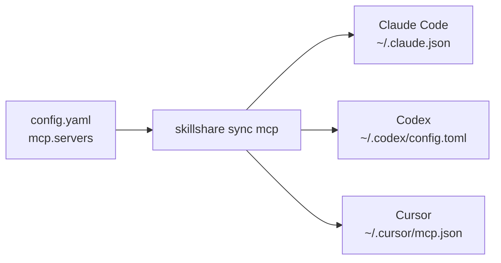

# Set up MCP once for your Agents

MCP lets an Agent use tools supplied by another program or service. Skillshare
stores the connection settings once and writes each supported Agent's native
configuration. It does not run a gateway or keep a background server alive.

Supported MCP clients include Claude Code, Codex (the CLI, the IDE extension and the
ChatGPT desktop app share one config), Cursor, VS Code, OpenCode,
Kilo Code, Grok CLI, Antigravity (AGY), Amp, Claude Desktop, Cline, Copilot CLI, Factory,
Gemini CLI, Goose, Junie, Kiro, LM Studio, Warp and Windsurf, plus Pi ≥ 0.99.0 through
its [built-in MCP](/docs/reference/commands/mcp#pi). See the
[destination and authentication limits](/docs/reference/commands/mcp#native-destinations)
for each client. The dashboard shows the clients available in your current scope.

For example, share Playwright with Amp, Gemini CLI and Kiro:

```yaml
mcp:
  servers:
    playwright:
      command: npx
      args: ["-y", "@playwright/mcp@latest"]
      targets: [amp, gemini, kiro]
```

You do not need to learn each client's JSON or YAML format. Skillshare converts
the definition when you run `skillshare sync mcp`. The receiving client starts
the command, so Node.js/npx must be available in that client's environment.

## Start with the guided setup

Run `skillshare mcp` to browse and manage connections from the terminal. Use `/`
to filter, `e` to edit, `d` to remove, or `r` to restore from a backup. Every interactive change is previewed before saving. Use
`skillshare mcp --no-tui` for plain status output.

Initialize Skillshare first if this is a new installation, then run:

```bash
skillshare mcp add
```

Paste the URL or JSON supplied by your MCP provider, give it a name, select your
Agents, and review the changes. **Save and sync** applies the settings immediately;
**Save only** keeps the definition for a later `skillshare sync mcp`.

In the dashboard, **Add server** takes either shape: fill in the fields, or paste
a configuration. The paste side also loads a file, which is the browser's
equivalent of `mcp import --file`. Pasted JSON is recognized automatically; for
TOML, choose whether it came from Codex or Grok. When the paste holds one server
and Pi is ticked, the dialog also shows the Pi settings of the form: tool exposure and
other Pi settings. **Import from a target** is
separate and reads the servers an installed Agent already has. Either way the
dashboard uses the same source, validation, preview and conflict rules as the
CLI. **Sync MCP**, in the MCP page's Sync box, writes the MCP config files only. The
Sync page also has **Sync all resources** for skills, agents, extras and MCP.

For Pi, the import source menu lists Pi's `mcp.json` and, for servers set up with
`pi-mcp-adapter` before 0.23.0, its `mcp-adapter.json`; each reads only that file.
The adapter file is only read: sync writes the imported servers to Pi's `mcp.json`.
The displayed paths follow the current scope, `PI_CODING_AGENT_DIR`, and any account
directory.
Project imports read `.pi/` inside that project. Keep personal servers and
credentials in the global file; use project files only in trusted projects.


The Config editor formats YAML when you save, using two-space indentation and
preserving comments. Click a field to see its explanation in the right panel,
including `mcp`, `sources.mcp`, connection fields and environment references.

After syncing, reload your Agent. Complete any login or approval in that Agent.
Skillshare does not test the connection, install the server program, or copy login
sessions. A successful sync means the configuration was written, not that a tool
call has succeeded.

## Understand the two connection types

| Provider gives you | Connection | Example |
|---|---|---|
| A command and arguments | `stdio`: the Agent starts a local process | `command: npx` plus `args` |
| An MCP endpoint URL | Streamable HTTP: the Agent connects to a running service | `url: https://example.com/mcp` |

Either way, the definition is stored once and written into each Agent's own file:



You usually do not need to set `transport`; Skillshare infers it from `command`
or `url`. A URL can point to a service on your own computer or a remote service.
Use the provider's actual MCP endpoint, not an ordinary website URL. Legacy SSE
configuration is rejected rather than silently converted.

## Limit which tools reach the model

A server can offer many tools. Set `tools` once to keep only some of them, or to hide
some, and Skillshare writes it in each Agent's own format:

```bash
skillshare mcp edit github --tools-allow 'get_*,search_code' --tools-deny get_secret
skillshare sync mcp --dry-run
```

In the dashboard, open the server and use its **Tools** section; **Load tools from
server** lists the server's tools; untick the ones the model should not get. Pi applies the whole policy; Codex and
Copilot CLI apply exact names; other Agents do not apply it. The preview and
`skillshare mcp check` name each Agent that leaves part of it out. See
[Tool policy](/docs/reference/commands/mcp#tool-policy).

## Keep everything in one file

This is the default. Your existing skills and agents remain directory sources;
MCP connections are structured settings under `mcp.servers`:

```yaml
sources:
  skills: ~/.config/skillshare/skills
  agents: ~/.config/skillshare/agents

mcp:
  targets: [claude, codex, cursor, vscode]
  servers:
    company-docs:
      url: https://docs.example.com/mcp
```

`company-docs` is a name you choose. It does not install or look up a server.
Replace the example URL with your provider's endpoint. `mcp.targets` selects
receiving clients independently of your skill targets. A server's optional
`targets` list overrides that default.

## Split MCP into its own file {#split-mcp-into-its-own-file}

Use an external source when you want to share or version it separately:

```yaml title="config.yaml"
sources:
  skills: ~/.config/skillshare/skills
  agents: ~/.config/skillshare/agents
  mcp: ./mcp.yaml

mcp:
  targets: [claude, codex, cursor]
```

```yaml title="mcp.yaml"
servers:
  company-docs:
    url: https://docs.example.com/mcp
```

Relative paths are resolved from the directory containing `config.yaml`.
For `.skillshare/config.yaml`, `./mcp.yaml` means `.skillshare/mcp.yaml`.
Absolute paths and `~/` are also supported.
To share the file between machines with `push` / `pull`, keep it inside a
`root`-scope repository; see
[Cross-Machine Sync — MCP servers](/docs/how-to/sharing/cross-machine-sync#mcp-servers).

Use **one source at a time**: `sources.mcp` and `mcp.servers` cannot coexist,
including `mcp.servers: {}`. To switch, move the `servers` mapping into the external
file, add `sources.mcp`, and remove inline `mcp.servers`. Keep `mcp.targets` in
`config.yaml`. Preview before syncing:

```bash
skillshare sync mcp --dry-run
```

Both CLI and dashboard edits follow the active source. A missing or invalid
external file stops synchronization; it never means “delete all servers.” Use an
explicit `servers: {}` to remove definitions intentionally, then preview the
managed removals.

## Local programs and credentials

```yaml
mcp:
  targets: [claude, codex]
  servers:
    internal-tools:
      command: company-mcp
      args: [--workspace, /path/to/workspace]
      env:
        COMPANY_TOKEN:
          fromEnv: COMPANY_TOKEN
    company-docs:
      url: https://docs.example.com/mcp
      bearerToken:
        fromEnv: DOCS_TOKEN
```

Install the required local program yourself. The Agent must be able to find it
and read any referenced environment variables in its own environment. A variable
set only in a terminal may not reach an Agent launched from the desktop.

Skillshare writes variable references and never resolves them. Keep actual tokens
out of source files, URLs and command arguments. Known sensitive environment or
header keys require `fromEnv`. Import converts recognizable literal secrets,
including a password inside a URL value such as `DATABASE_URL`, to references and
reports the variable you need to set. Command arguments have no portable reference
syntax: import warns when an argument looks like a credential but keeps it as plain
text. Import cannot identify every credential format, such as a token in a URL path.

Codex forwards local variables by name, so `env.KEY.fromEnv` must also be `KEY`
when Codex is selected. A target that cannot represent a setting blocks the
preview instead of dropping it. Client-specific placeholders and input prompts must
be resolved explicitly before import. Agent-specific fields such as Codex
`startup_timeout_sec` or `cwd` are not imported; import lists them as warnings, and
sync keeps them in that Agent's existing entry.

## Import existing connections

```bash
skillshare mcp import                         # Choose an Agent and a server
skillshare mcp import docs --from claude --target claude --target codex --sync
```

Import one server at a time. When an Agent's entry already matches the imported
definition, it becomes managed without changing that Agent's file. When it
differs, most often because a literal token became an environment reference, the
CLI stops instead of rewriting a working entry. Set the reported variables, then
rerun with `--replace`, or leave that Agent out of `--target`. The dashboard
preview shows the same entry as a conflict.

If the source already contains the name, use the dashboard's **Edit** action or
CLI `--replace`. On import, `--replace` also rewrites the imported Agent's own
entry; **Save only** then records that entry as the baseline without changing the
file, so the next sync rewrites it and still detects edits made in the meantime.
It never overrides other conflicting native entries. In the MCP dashboard, a conflict
you can settle offers an import action named after the Agent, such as **Import from
cursor**, to adopt that version, or **Replace with source** to overwrite that entry.
A conflict held by another Skillshare configuration that still exists offers neither,
because only that configuration can release the entry.

This is also how you take over a server an Agent already has under the same name:
add it to the source. If the Agent's entry already matches, the next preview lists it
as **Take over**, and sync records it as managed without changing the file. This is
what happens when you tick the Agent you imported from after the import. If it
differs, the preview shows a conflict instead of overwriting it. Import it to adopt
the Agent's version, or replace it with the source definition.

The MCP dashboard also looks for servers already in your Agents' config files that
Skillshare does not manage. When it finds some, a note above the server list says how
many and in which Agents, and **Import** opens the import for the first of them. A
project's **MCP** tab does the same for that project's files and imports into that
project. See [Servers Skillshare does not manage](/docs/reference/commands/mcp#unmanaged-servers).

## Turn off a global server in one project

A server in an Agent's global config loads in every project. To turn it off in
one project, run this inside that project, using the name the server has in the
Agent's global config:

```bash
skillshare mcp add company-docs --disabled --target opencode
skillshare sync mcp
```

In the dashboard, open it from the project folder with `skillshare ui` and choose
**Turn off a global server**, the button beside **Add server**.

This works with Claude Code, OpenCode, Kilo Code and Pi 1.0.1 or later. Other Agents
are refused. The
[command reference](/docs/reference/commands/mcp#turn-off-a-global-server-in-one-project)
shows what is written for each Agent and why the others are not supported.


## Remove and restore

```bash
skillshare mcp remove company-docs
skillshare sync mcp --dry-run
skillshare sync mcp
```

Only unchanged entries previously managed by this configuration are removed.
Unmanaged entries and entries edited by another program are protected. An Agent
entry that already matched the source before Skillshare managed it, for example
in a moved project, also stays; import it first if Skillshare should remove it.

In the dashboard, use the delete action on a server row. The dialog lists each
Agent file that will change. **Remove from source only** matches `mcp remove`
without syncing; **Remove and sync** also cleans the Agent files and is disabled
while a conflict is present.

To stop managing a server but keep it in your Agents, remove it with `--keep-files`,
or choose **Stop managing** in the dashboard's remove dialog:

```bash
skillshare mcp remove company-docs --keep-files
```

No Agent file changes, and later syncs leave those entries alone. See
[Stop managing a server](/docs/reference/commands/mcp#stop-managing-a-server).

Every native file change creates a private backup of the affected MCP entries.
Skillshare keeps the newest 20 backups for each Agent file. The output includes
its ID:

```bash
skillshare mcp restore BACKUP_ID --dry-run
skillshare mcp restore BACKUP_ID
```

In the dashboard, **Backups & restore** lists backups by day. Preview a backup
to see the entries it would restore, then choose **Restore this file**.

Restore preserves unrelated settings and refuses to overwrite newer changes to
the affected entries. It does not revert your source file; edit the source too
if you want the restoration to survive the next sync. Backups may contain old
native credentials, so keep the local state directory private.

Writes are atomic per file. A failure midway through multiple files leaves
completed files applied and reports their backup IDs. Fix the reported cause and
retry. The next MCP write, such as `sync mcp` or a dashboard sync, finishes
recovering an interrupted write, and previews already show that result. If the
Agent file was edited again in the meantime, entries that no longer match are
reported as conflicts.
Do not delete ownership state to “fix” conflicts: existing entries would become
unmanaged and need explicit import again. An entry whose owning configuration was
deleted does not need that: the conflict reports it as left over, and an import or
replacement from the conflict itself takes it over.

See the [MCP command reference](/docs/reference/commands/mcp) for supported paths,
flags and current limitations.
