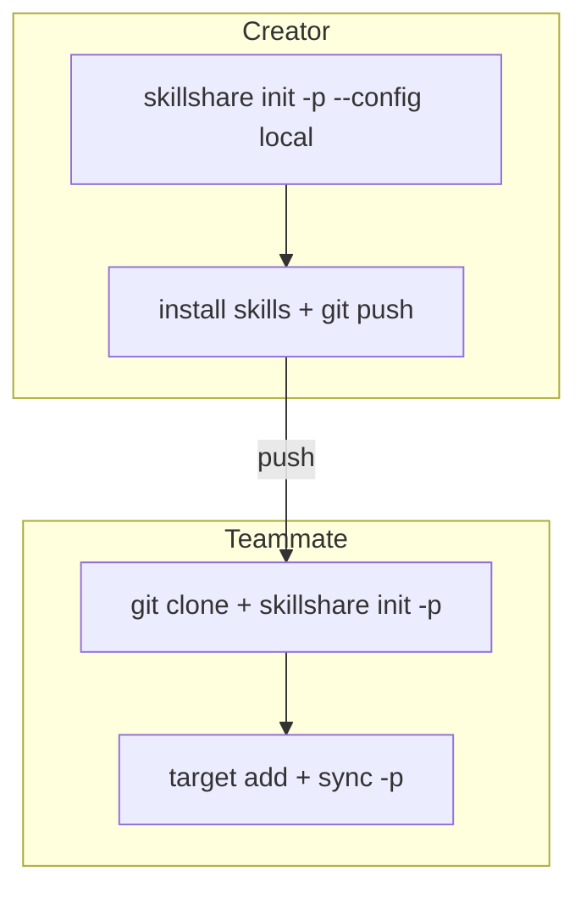

# Centralized Skills Repo

> Use one project as a shared skills repository; other projects stay clean.

## Scenario

Your team has multiple projects (B, C, D) but wants to manage AI skills in a single dedicated repo (A). Each developer clones repo A and points targets to their own local projects.

## Solution

### Creator: Set up the shared repo

```bash
cd ~/DEV/skills-repo        # Project A
skillshare init -p --config local --targets claude
```

This creates `.skillshare/` with `config.yaml` gitignored, so each developer manages their own targets independently.

```bash
# Add shared skills
skillshare install <skill-repo> -p

# Commit (config.yaml is excluded by .gitignore)
git add .skillshare/
git commit -m "add shared skills"
git push
```

### Teammate: Clone and configure

```bash
git clone <A-repo> && cd skills-repo
skillshare init -p
```

Skillshare auto-detects the shared repo (`.gitignore` contains `config.yaml`) and creates an empty config. No `--config local` flag needed.

```bash
# Add targets pointing to your local projects
skillshare target add project-b ~/DEV/project-b/.cursor/skills -p
skillshare target add project-c ~/DEV/project-c/.claude/skills -p

# Sync shared skills to all your targets
skillshare sync -p
```

## How It Works



The `--config local` flag adds `config.yaml` to `.skillshare/.gitignore`. This means:

- **Skills** (`.skillshare/skills/`) are shared via git
- **Config** (`.skillshare/config.yaml`) is local to each developer
- Each developer chooses their own targets without affecting others

## Verification

After the creator runs `init -p --config local`:

```bash
cat .skillshare/.gitignore
# Should contain: config.yaml
```

After a teammate clones and runs `init -p`:

```bash
skillshare list -p     # Shows shared skills
skillshare status -p   # Shows your personal targets
```

## FAQ

**Q: Does each teammate need `--config local`?**
A: No. Only the creator uses `--config local`. Teammates just run `skillshare init -p` and skillshare auto-detects the shared repo pattern.

**Q: Can teammates install additional skills?**
A: Yes. `skillshare install <repo> -p` works normally. The installed skill lands in `.skillshare/skills/` which is tracked by git, so you can push it for others to use.

**Q: What if a teammate wants different skills?**
A: Skills in `.skillshare/skills/` are shared. For truly personal skills, use [global mode](/docs/understand/project-skills) (`skillshare install <repo>` without `-p`).
