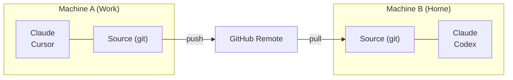

# Cross-Machine Sync

Sync your skills across multiple computers using git.

## Overview



---

## First Machine Setup

### Interactive (guided prompts)

```bash
skillshare init --remote git@github.com:you/my-skills.git
```

### Non-interactive (no prompts)

```bash
# Remote already has your skills (or start fresh source)
skillshare init --remote git@github.com:you/my-skills.git --no-copy --all-targets --no-skill

# First machine with existing Claude skills: import during init
skillshare init --remote git@github.com:you/my-skills.git --copy-from claude --all-targets --no-skill
```

This:
1. Creates source directory
2. Initializes git with initial commit
3. Adds remote
4. Auto-detects and configures targets

Optional later (only if you install additional AI CLIs after setup):

```bash
skillshare init --discover
```

Then push your skills:
```bash
skillshare push
```

:::tip Already initialized?
Add a remote to an existing setup:
```bash
skillshare init --remote git@github.com:you/my-skills.git
```
This works even after initial setup — it just adds the remote.
:::

---

## Second Machine Setup

Run `skillshare init`, choose **Connect my existing skillshare repo**, and paste the repo URL:

<p>
  
</p>

Or pass the URL directly:

```bash
skillshare init --remote git@github.com:you/my-skills.git
```

Init checks the repo before writing anything, then pulls it down. No manual `git clone` needed.

:::info What happens behind the scenes
1. Clones the repo into a temporary folder to count its skills and detect its layout: a whole-folder repo pushed with `--git-root root`, or skills in a `skills/` folder
2. Skills on this machine with the same name as one in the repo use the repo version; skills only on this machine are kept and added on the next `skillshare push`
3. After you confirm: creates the source, initializes git, adds the remote, resets to the remote branch, and sets up tracking
4. Configures the detected local targets and offers a first sync
:::

If you prefer manual control:

```bash
# Clone directly, then init with existing source
git clone git@github.com:you/my-skills.git ~/.config/skillshare/skills
skillshare init --source ~/.config/skillshare/skills
skillshare sync
```

---

## Daily Workflow

### Machine A: Make changes and push

```bash
# Edit skills (changes visible immediately via symlinks)
$EDITOR ~/.config/skillshare/skills/my-skill/SKILL.md

# Optional: create a local checkpoint without pushing
skillshare commit -m "Update my-skill"

# Push to remote when ready to share
skillshare push -m "Update my-skill"
```

### Machine B: Pull and sync

```bash
skillshare pull
```

That's it. `pull` automatically runs `sync` after pulling. It syncs what the [git root scope](/docs/reference/targets/configuration#git-root) holds: skills by default, agents or extras with those scopes, and all three with `git_root: root`. Plugins, MCP servers and hooks need the extra steps below.

### Both ways in one command

When you edit skills on more than one machine, run this instead of `push` and `pull`:

```bash
skillshare push --pull -m "Update my-skill"
```

It commits your changes, merges what the other machines pushed, pushes, and syncs targets. A conflict stops it before anything is pushed. See [Push and Pull Together](/docs/reference/commands/push#push-and-pull-together).

---

## Plugins, MCP and Hooks {#plugins-mcp-hooks}

`push` and `pull` version the files in the git root directory. Plugins, hooks and MCP servers are settings in `config.yaml`, and `config.yaml` is never part of that repository: the default `skills` scope keeps it outside the repo, and the `root` scope ignores it. Each machine keeps its own `config.yaml`, with its own targets and paths.

| Resource | Stored in | Moves with `push` / `pull` |
|---|---|---|
| Skills | Skills source | Yes |
| Agents | Agents source | With `git_root: agents` or `root` |
| Extras | Extras source | With `git_root: extras` or `root` |
| MCP servers | `config.yaml`, or the file named by `sources.mcp` | Only when that file is inside the repository |
| Plugins | `plugins:` in `config.yaml` | No |
| Hooks | `hooks:` in `config.yaml` | No |

After pulling on another machine, apply the rest yourself:

```bash
skillshare pull
skillshare sync --all              # adds agents, extras, MCP and hooks
skillshare sync plugins --no-tui   # plugins are never part of --all
```

### MCP servers {#mcp-servers}

Keep the server definitions in a separate file inside the repository. With `git_root: root`, the repository is the directory that holds `config.yaml` (`~/.config/skillshare`, or `%AppData%\skillshare` on Windows), so a relative `sources.mcp` path is committed while `config.yaml` stays local:

```yaml title="config.yaml (on each machine)"
sources:
  mcp: ./mcp.yaml

mcp:
  targets: [claude, codex]
```

`mcp.targets` stays in `config.yaml`, so each machine chooses its own receiving clients. Set `sources.mcp` on every machine. To move existing servers out of `config.yaml`, see [Split MCP into its own file](/docs/how-to/daily-tasks/sharing-mcp#split-mcp-into-its-own-file). To switch an existing setup to the `root` scope, see [`git_root`](/docs/reference/targets/configuration#git-root).

Skillshare stores credentials as `fromEnv` references, never as values. Set those environment variables on each machine where the Agent can read them.

### Plugins {#plugins}

Plugin definitions do not travel through git. Add them again on each machine from the same source:

1. On the first machine, open **Plugins → Share** in the dashboard and copy the command. It lists plugins added from an HTTPS Git source, for example:

   ```bash
   skillshare plugin add https://github.com/acme/plugins --plugin review -g --no-tui
   ```

2. Run it on the other machine, tick the Agents on the Plugins page, then run `skillshare sync plugins`.

Add a plugin from its source (**Add plugin**) rather than **Import installed** when you want it on several machines. An import records only the native installation. On another machine, Claude and Codex reinstall it from the native marketplace of the same name, and the plugin is skipped when that marketplace is not registered there. Cursor and Antigravity cannot reinstall an imported plugin at all. Plugins added from a local directory are not listed under **Share**, because the path exists only on the first machine.

`sync plugins` installs missing plugins and leaves installed ones as they are. To update them, run `skillshare plugin check`, then `skillshare plugin update`. See [Manage plugins across tools](/docs/how-to/daily-tasks/sharing-plugins#updates-and-recovery).

### Hooks {#hooks}

Hooks have no separate file. Copy the `hooks:` section of `config.yaml` to the other machine, then run `skillshare sync hooks`.

### What stays on each machine {#per-machine}

- The native CLIs that install plugins (`claude`, `codex`, and so on) must be installed and on `PATH` where Skillshare runs. A scheduled job often has a shorter `PATH` than your terminal. Codex is also found inside the Codex desktop app and in Homebrew's folders; set [`SKILLSHARE_CODEX_CLI`](/docs/reference/appendix/environment-variables#skillshare_codex_cli) on a machine where it is elsewhere.
- Sign-ins, OAuth tokens, native trust prompts and enabled/disabled state stay in each Agent.
- The values of environment variables that MCP servers reference.

---

## Commands

### Commit

Create a local checkpoint without pushing:

```bash
skillshare commit                  # Default message
skillshare commit -m "Add pdf"     # Custom message
skillshare commit --dry-run        # Preview
```

**What happens:**
```
git add -A
git commit -m "Add pdf"
```

`commit` does not require a remote and never pushes.

### Push

Commit and push local changes:

```bash
skillshare push                  # Auto-generated message
skillshare push -m "Add pdf"     # Custom message
```

**What happens:**
```
git add -A
git commit -m "Add pdf"
git push          # auto-sets upstream on first push
```

### Pull

Pull remote changes and sync:

```bash
skillshare pull
```

**What happens:**
```
git pull           # merges when both machines committed; fetch + merge or reset on first pull
skillshare sync
```

---

## Conflict Handling

### Pull fails (local uncommitted changes)

If you want to keep the local changes but are not ready to push them yet, commit them locally first:

```bash
skillshare commit -m "Save local changes"
skillshare pull
```

### Push fails (remote ahead)

```
$ skillshare push
Push failed
  Remote may have newer changes
  Run: skillshare pull
  Then: skillshare push
```

**Solution:**
```bash
skillshare pull
skillshare push
```

### Pull still fails with local uncommitted changes

```
$ skillshare pull
Local changes detected
  Run: skillshare push
  Or:  cd ~/.config/skillshare/skills && git stash
```

**Solution:**
```bash
# Option 1: Commit locally first
skillshare commit -m "Local changes"
skillshare pull

# Option 2: Push your changes first
skillshare push -m "Local changes"
skillshare pull

# Option 3: Stash changes temporarily
cd ~/.config/skillshare/skills
git stash
skillshare pull
git stash pop
```

### Merge conflicts

When both machines committed, `pull` merges them. Conflicts in `.metadata.json` resolve automatically. A conflict in any other file stops the pull, undoes the merge, and names the files:

```
$ skillshare pull
pull stopped: this machine and the remote both changed my-skill/SKILL.md; the merge was undone, resolve it with git in ~/.config/skillshare/skills
```

**Solution:**
```bash
cd ~/.config/skillshare/skills
git pull --no-rebase          # Redo the merge and keep the conflicts
# Edit the conflicted files
git add .
git commit --no-edit
skillshare push
skillshare sync
```

---

## Check Status

```bash
skillshare status
```

Shows:
- Git status (clean, ahead, behind)
- Remote configuration
- Sync status

---

## Private Repository

Use SSH URL for private repos:

```bash
skillshare init --remote git@github.com:you/private-skills.git
```

---

## Tips

### Use SSH keys

Set up SSH keys to avoid password prompts:
```bash
ssh-keygen -t ed25519 -C "your@email.com"
# Add public key to GitHub
```

### Portable paths for dotfiles

If you share `config.yaml` via dotfiles, enable `preserve_tilde_on_save` to keep paths as `~/...` instead of `/home/alice/...`:

```yaml
preserve_tilde_on_save: true
```

This prevents noisy diffs when the same config is used across machines with different usernames or OS-specific home prefixes. See [Configuration — preserve_tilde_on_save](/docs/reference/targets/configuration#preserve_tilde_on_save).

### Multiple remotes

Add backup remotes:
```bash
cd ~/.config/skillshare/skills
git remote add backup git@gitlab.com:you/skills-backup.git
git push backup main
```

### Sync on shell startup

Add to `~/.bashrc` or `~/.zshrc`:
```bash
# Sync skillshare on terminal open (if remote configured)
skillshare pull 2>/dev/null
```

---

## Alternative: Install from Config {#alternative-install-from-config}

If you don't want to set up a git remote, `config.yaml` doubles as a portable skill manifest. Every `install` / `uninstall` auto-updates the `skills:` section, and `skillshare install` (no args) reinstalls everything listed:

```bash
# Machine A — config.yaml records what you installed
skillshare install anthropics/skills -s pdf
# config.yaml now has: skills: [{name: pdf, source: "..."}]

# Machine B — copy config.yaml, then:
skillshare install      # Installs all listed skills
skillshare sync
```

### When to use which

| | `push` / `pull` | `install` (no args) |
|---|---|---|
| What's synced | Actual skill files (full content) | Source URLs only — re-downloads on install |
| Local/hand-written skills | Included | Not included (no source URL) |
| Setup required | Git remote on source dir | Just `config.yaml` |
| Project mode | Global only | Works with `-p` (`.skillshare/config.yaml`) |
| Maintenance | Manual `push` after changes | Auto-reconciled on install/uninstall |

**Recommendation**: Use `push`/`pull` for personal cross-machine sync. Use `install` from config for team onboarding and project setup.

---

## See Also

- [push](/docs/reference/commands/push) — Push to remote
- [pull](/docs/reference/commands/pull) — Pull from remote
- [install](/docs/reference/commands/install#install-from-config-no-arguments) — Install from config
- [Organization-Wide Skills](./organization-sharing.md) — Team sharing
- [init](/docs/reference/commands/init) — Init with `--remote`
