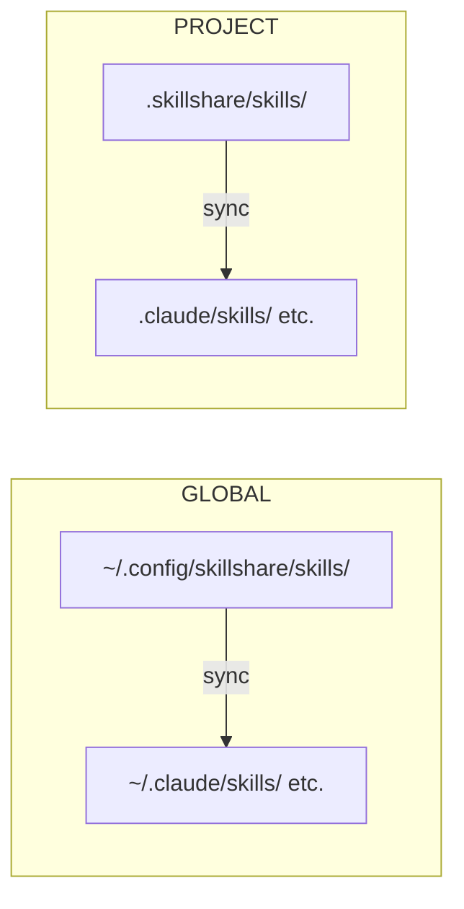

# Introduction

**Your AI coding setup, everywhere.**

skillshare manages skills, agents, rules, MCP connections and hooks in one place. Use the [desktop app](/docs/getting-started/desktop-app) or CLI to keep your setup with you as you switch AI tools, machines or projects.

## Why skillshare?

- **Switch tools, keep your setup** — maintain a source you control and choose what each supported tool receives.
- **Take your setup with you** — version your source in Git and bring it to another machine.
- **Share project context** — keep team skills and configuration alongside your code, with remote skill commits recorded in a lockfile.

For example, one teammate uses Claude Code and another uses Codex. Both need the same code-review checklist for a legacy API. Keep that checklist in `.skillshare/skills/` and commit the project configuration. New teammates install the declared remote skills and sync to the configured targets, instead of finding and copying instructions from chat.

Follow the [team onboarding recipe](/docs/how-to/recipes/team-onboarding-recipe) for the full workflow. Shared instructions reduce configuration drift; each AI tool still has its own capabilities, permissions and behavior.

## Quick Start

```bash
# Install
curl -fsSL https://raw.githubusercontent.com/runkids/skillshare/main/install.sh | sh
```

If the installer prints PATH setup instructions, follow them before running the commands below. If it prints no PATH warning, no extra setup is needed.

```bash

# Initialize (auto-detects CLIs, sets up git)
skillshare init

# Install a skill
skillshare install anthropics/skills/skills/pdf

# Sync to all targets
skillshare sync
```

Your skill is now available to the configured targets.

:::tip[Try without installing]
Want to explore first? Use the [Docker Playground](/docs/how-to/advanced/docker-sandbox#playground) — one command, no local install needed:

```bash
git clone https://github.com/runkids/skillshare.git && cd skillshare
make playground
```
:::

## How It Works



Edit an existing skill in source and linked targets see the change immediately. In copy mode, run `sync` to refresh their copies. In the default merge mode, adding, removing or renaming skills also requires `sync`.

Global mode holds your personal setup and installed team repositories. Project mode holds resources and configuration for one codebase. A Git pull brings in the project's files; run `skillshare install -p` and `skillshare sync -p` to apply its declared skills locally.

## Key Features

- **Auto-Detection** — `cd` into a project with `.skillshare/` and skillshare switches to project mode automatically
- **Global and Project Scope** — Personal and shared organization resources in global mode; codebase-specific resources in project mode
- **Linked Updates** — Edits to existing skills reflect immediately in targets that use symlinks
- **Team Ready** — Organization skills via tracked repos, project skills via git commit
- **Any Git Host** — Install, update, and check from GitHub, GitLab, Bitbucket, Azure DevOps, AtomGit, Gitee, or any self-hosted Git
- **Security Audit** — Scan skills for known injection and exfiltration patterns before use. Audit is static analysis; execution permissions remain with your AI tools

## Supported Platforms

| Platform | Source Path | Link Type |
|----------|-------------|-----------|
| macOS/Linux | `~/.config/skillshare/skills/` | Symlinks |
| Windows | `%AppData%\skillshare\skills\` | NTFS Junctions for folders; symlinks for single files (Developer Mode, otherwise copies) |

## Next Steps

### Individual Developer

1. [First Sync](/docs/getting-started/first-sync) — Get synced in 5 minutes
2. [Creating Skills](/docs/how-to/daily-tasks/creating-skills) — Write your first skill
3. [Cross-Machine Sync](/docs/how-to/sharing/cross-machine-sync) — Keep skills in sync across machines

### Team Lead / Organization

1. [Organization-Wide Skills](/docs/how-to/sharing/organization-sharing) — Share standards across the team
2. [Project Setup](/docs/how-to/sharing/project-setup) — Set up project-scoped skills
3. [Security Audit](/docs/reference/commands/audit) — Scan third-party skills before deployment

### Already Have Skills?

- [From Existing Skills](/docs/getting-started/from-existing-skills) — Migrate and consolidate

### Explore More

- [Core Concepts](/docs/understand) — Source, targets, sync modes
- [Commands Reference](/docs/reference/commands) — All available commands
- [Docker Sandbox](/docs/how-to/advanced/docker-sandbox) — Try skillshare in an isolated environment
- [FAQ](/docs/troubleshooting/faq) — Common questions
