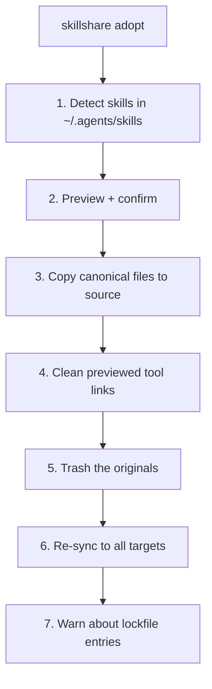

# adopt

Repair external CLI-bundled skills that were dropped into the universal target (`~/.agents/skills`) so skillshare can govern them.

```bash
skillshare adopt                  # Detect and interactively adopt
skillshare adopt --dry-run        # Preview what would be adopted
skillshare adopt --all            # Adopt all non-conflicting skills without prompting
skillshare adopt --all --force    # Also overwrite source conflicts
skillshare adopt -p               # Project mode (.agents/skills)
```

## When to Use

Some CLI tools (for example `firecrawl/cli`, `googleworkspace/cli`) ship their own skills directly into the shared `~/.agents/skills/` directory and symlink them into agent directories, tracking them in their own `~/.agents/.skill-lock.json`. This bypasses skillshare's source-of-truth model, which causes:

- `audit` flags them as unmanaged
- the tool's symlinks only reach the agents it detected — other targets are left uncovered
- moving them into skillshare by hand gets overwritten on the tool's next reinstall (the lockfile still claims them)

Use `adopt` as a repair flow when `doctor`, `audit`, or the dashboard's **Health Check** page shows skills that came from another CLI. Normal new installs should still use [`install`](/docs/reference/commands/install); `adopt` exists for already-present files that bypassed skillshare.

`adopt` brings those skills under skillshare's management: migrate the canonical files into your source, clean up only the tool links identified in the preview, and re-sync to all configured targets. Unrelated broken links and local target entries are left alone.

## What Happens



:::tip
Original content is moved to skillshare's trash, not permanently deleted. To recover it, first remove or rename the adopted source copy, then run [`skillshare trash restore <name>`](/docs/reference/commands/trash). Restore places the content in skillshare's source; it does not recreate the original agents path or hand ownership back to the external tool. Use `--dry-run` first to preview every change.
:::

:::warning
The tool's lockfile (`~/.agents/.skill-lock.json`) is **never modified** — it belongs to the tool that created it. After adopting, `adopt` warns you to release the entry from the owning tool (e.g. `firecrawl uninstall <skill>`); otherwise that tool may re-create the skill on its next update.
:::

## Options

| Flag | Description |
|------|-------------|
| `--all, -a` | Adopt all detected skills without prompting |
| `--dry-run, -n` | Preview without making changes |
| `--force, -f` | Overwrite same-name skills in source |
| `--json` | Output as JSON without prompting; conflicts still require `--force` |
| `--project, -p` | Use project config (`.agents/skills`) |
| `--global, -g` | Use global config (`~/.agents/skills`) |

:::note
In a non-interactive terminal (CI, pipes), a bare `skillshare adopt` refuses to run rather than silently migrate and trash files. Pass `--all` to adopt (add `--force` to overwrite conflicts), or `--dry-run` to preview.
:::

:::note
For host-filesystem safety, the dashboard's apply action is accepted only from the local Skillshare UI. Remote dashboard clients can preview candidates but cannot perform the ownership transfer.
:::

## Conflicts

If an unmanaged skill of the same name already exists in source, `adopt` skips it unless `--force` is given — the original is left in place, untouched:

```bash
$ skillshare adopt --all

Adopt
  ⚠ my-skill   conflict: already in source — use --force to overwrite

# To overwrite the source copy:
$ skillshare adopt --all --force
```

If the source entry has install metadata, uninstall it first and then run `adopt`. `--force` does not silently discard another install ownership record, because a later `update` or project bare-install replay could otherwise overwrite the adopted copy.

## JSON Output

```bash
skillshare adopt --all --json
```

```json
{
  "adopted": ["firecrawl"],
  "skipped": [],
  "failed": {},
  "trashed": 1,
  "pruned": 1,
  "lock_warnings": [
    { "name": "firecrawl", "source_tool": "firecrawl" }
  ],
  "dry_run": false,
  "duration": "0.042s"
}
```

Combine with `--dry-run` to preview without changes:

```bash
skillshare adopt --json --dry-run
```

## See Also

- [collect](/docs/reference/commands/collect) — Pull local (non-symlinked) skills from a target into source
- [doctor](/docs/reference/commands/doctor) — Diagnose setup issues and open the dashboard repair flow
- [sync](/docs/reference/commands/sync) — Distribute from source to targets
- [audit](/docs/reference/commands/audit) — Find unmanaged skills
- [trash](/docs/reference/commands/trash) — Inspect or recover soft-deleted content
