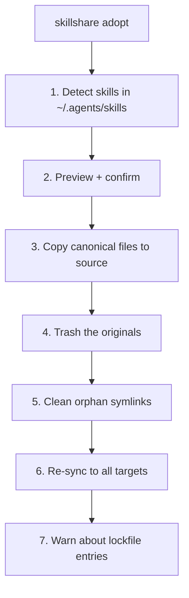

# adopt

Adopt CLI-bundled skills that external tools dropped into the universal target (`~/.agents/skills`) so skillshare governs them.

```bash
skillshare adopt                  # Detect and interactively adopt
skillshare adopt --dry-run        # Preview what would be adopted
skillshare adopt --all --force    # Adopt everything without prompting
skillshare adopt -p               # Project mode (.agents/skills)
```

## When to Use

Some CLI tools (for example `firecrawl/cli`, `googleworkspace/cli`) ship their own skills directly into the shared `~/.agents/skills/` directory and symlink them into agent directories, tracking them in their own `~/.agents/.skill-lock.json`. This bypasses skillshare's source-of-truth model, which causes:

- `audit` flags them as unmanaged
- the tool's symlinks only reach the agents it detected — other targets are left uncovered
- moving them into skillshare by hand gets overwritten on the tool's next reinstall (the lockfile still claims them)

Use `adopt` to bring those skills under skillshare's management: migrate the canonical files into your source, clean up the tool's orphan symlinks, and re-sync to **all** targets.

## What Happens



:::tip
Originals are moved to skillshare's trash (soft-delete), not deleted — restore them with [`restore`](/docs/reference/commands/restore) if needed. Use `--dry-run` first to preview every change.
:::

:::warning
The tool's lockfile (`~/.agents/.skill-lock.json`) is **never modified** — it belongs to the tool that created it. After adopting, `adopt` warns you to release the entry from the owning tool (e.g. `firecrawl uninstall <skill>`); otherwise that tool may re-create the skill on its next update.
:::

## Options

| Flag | Description |
|------|-------------|
| `--all, -a` | Adopt all detected skills |
| `--dry-run, -n` | Preview without making changes |
| `--force, -f` | Overwrite same-name skills in source and skip confirmation |
| `--json` | Output as JSON (implies `--force`) |
| `--project, -p` | Use project config (`.agents/skills`) |
| `--global, -g` | Use global config (`~/.agents/skills`) |

:::note
In a non-interactive terminal (CI, pipes), a bare `skillshare adopt` refuses to run rather than silently migrate and trash files. Pass `--all` to adopt (add `--force` to overwrite conflicts), or `--dry-run` to preview.
:::

## Conflicts

If a skill of the same name already exists in source, `adopt` skips it unless `--force` is given — the original is left in place, untouched:

```bash
$ skillshare adopt --all

Adopt
  ⚠ my-skill   conflict: already in source — use --force to overwrite

# To overwrite the source copy:
$ skillshare adopt --all --force
```

## JSON Output

```bash
skillshare adopt --all --json
```

```json
{
  "adopted": ["firecrawl"],
  "skipped": [],
  "failed": {},
  "trashed": 1,
  "pruned": 1,
  "lock_warnings": [
    { "name": "firecrawl", "source_tool": "firecrawl" }
  ],
  "dry_run": false,
  "duration": "0.042s"
}
```

Combine with `--dry-run` to preview without changes:

```bash
skillshare adopt --json --dry-run
```

## Example Output

```bash
$ skillshare adopt

Adopt
  ℹ firecrawl   [firecrawl] ~/.agents/skills/firecrawl

Adopt these skills into skillshare? [y/N]: y

Adopting skills
  ✓ firecrawl: migrated to source, original trashed
  ✓ cleaned 1 orphan symlink

⚠ firecrawl still claims 'firecrawl' in ~/.agents/.skill-lock.json
  Release it with the owning tool (e.g. 'firecrawl uninstall firecrawl')
  or it may be re-created on the tool's next update.

Run 'skillshare sync' to confirm distribution to all targets
```

## See Also

- [collect](/docs/reference/commands/collect) — Pull local (non-symlinked) skills from a target into source
- [sync](/docs/reference/commands/sync) — Distribute from source to targets
- [audit](/docs/reference/commands/audit) — Find unmanaged skills
- [restore](/docs/reference/commands/restore) — Restore a trashed original
