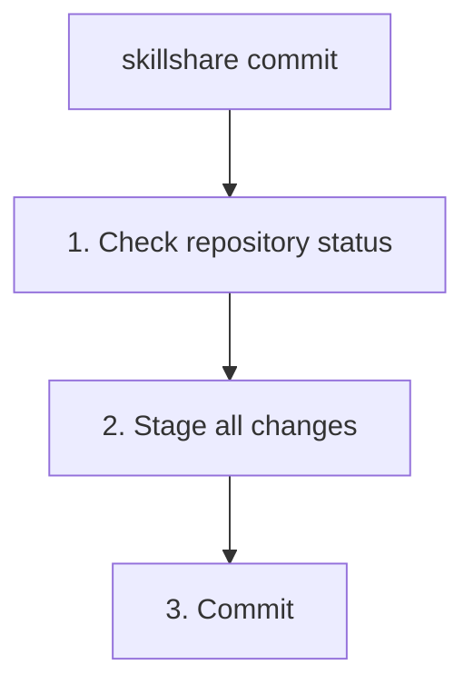

# commit

Create a local git commit for source skills without pushing.

```bash
skillshare commit                         # Commit with default message
skillshare commit -m "Update skill"       # Custom message
skillshare commit --dry-run               # Preview
```

## When to Use

- Save a local checkpoint before experimenting with skill edits
- Commit changes on a machine or source repo that does not have a remote configured
- Keep local history separate from sharing changes across machines

Use [`push`](./push.md) when you want to commit **and** push to a git remote.

## What Happens



`commit` stages all changes in the skills source directory and creates a git commit. It does not require a remote and never runs `git push`.

## Options

| Flag | Description |
|------|-------------|
| `-m, --message <msg>` | Commit message (default: "Update skills") |
| `--dry-run, -n` | Preview without making changes |

## Git Root Scope

`commit` operates on the directory selected by the `git_root` config field (default: `skills` source). Use `skillshare init --git-root <scope>` to change which directory is versioned. Valid scopes:

| Scope | Directory |
|-------|-----------|
| `skills` (default) | Skills source (`~/.config/skillshare/skills/`) |
| `agents` | Agents source (`~/.config/skillshare/agents/`) |
| `extras` | Extras source (`~/.config/skillshare/extras/`) |
| `root` | Config root (`~/.config/skillshare/`) — versions skills + agents + extras in one repo |

If `git_root` was changed but the git repo still lives in another scope's directory, `commit` prints a "Git root mismatch" error and asks you to re-run `skillshare init`.

## Prerequisites

Your skills source directory must be a git repository:

```bash
skillshare init
```

If the source is not a git repository, `commit` prints a setup hint and exits without changing files.

## Examples

```bash
# Commit with the default message
skillshare commit

# Commit with a custom message
skillshare commit -m "Update review skill"

# Preview staged files and message without committing
skillshare commit --dry-run
```

## See Also

- [push](./push.md) — Commit and push to a git remote
- [pull](./pull.md) — Pull from remote and sync to targets
- [status](./status.md) — Check git and sync state
