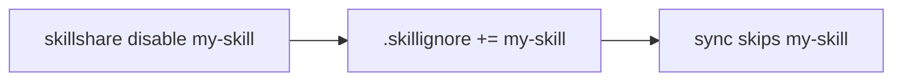
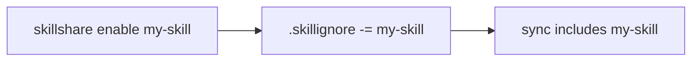

# enable / disable

Temporarily enable or disable skills without removing them.

```bash
skillshare disable draft-*          # Disable by pattern
skillshare enable draft-*           # Re-enable
skillshare disable "frontend/**"    # Disable every skill in a folder
skillshare disable my-skill -p      # Project mode
```

## When to Use

- Temporarily hide a skill from sync without uninstalling it
- Mute a draft or experimental skill across all targets
- Toggle skills on/off from the list TUI with the `t` key

## How It Works

`disable` adds a pattern to `.skillignore`; `enable` removes it. Disabled skills stay in the source directory but are excluded from `sync` and `collect`.





:::tip
After enabling or disabling, run `skillshare sync` to apply the change to targets.
:::

## Options

| Flag | Description |
|------|-------------|
| `<name\|pattern>` | One or more skill names or glob patterns (e.g., `draft-*`, `frontend/**`) |
| `--project, -p` | Use project `.skillignore` (`.skillshare/skills/.skillignore`) |
| `--global, -g` | Use global `.skillignore` (`~/.config/skillshare/.skillignore`) |
| `--dry-run, -n` | Preview without writing |
| `--help, -h` | Show help |

Mode is auto-detected when neither `-p` nor `-g` is specified (same as other commands).

## Examples

```bash
# Disable a single skill
$ skillshare disable my-draft
✓ my-draft  added to .skillignore

Next
  skillshare sync  apply the change

# Disable by glob pattern
$ skillshare disable "experimental-*"
✓ experimental-*  added to .skillignore

Next
  skillshare sync  apply the change

# Re-enable
$ skillshare enable my-draft
✓ my-draft  removed from .skillignore

Next
  skillshare sync  apply the change

# Preview without writing
$ skillshare disable my-skill --dry-run
  my-skill  would be added to ~/.config/skillshare/skills/.skillignore

Dry run — nothing was written

# Already disabled
$ skillshare disable my-draft
! my-draft  already disabled
```

## Disable a Whole Folder

`disable`/`enable` accept the same glob syntax as `.skillignore`, so there is no separate "group" flag — point a pattern at the folder and every skill inside is toggled at once.

```bash
# Disable every skill under frontend/ (any depth)
$ skillshare disable "frontend/**"
✓ frontend/**  added to .skillignore

Next
  skillshare sync  apply the change

# Re-enable the whole folder
$ skillshare enable "frontend/**"
✓ frontend/**  removed from .skillignore

Next
  skillshare sync  apply the change
```

:::tip Quote the pattern
Always wrap folder patterns in quotes (`"frontend/**"`) so your shell doesn't expand `*` before skillshare sees it.
:::

`frontend/**` writes a single line to `.skillignore` and keeps covering anything you add to the folder later. `enable` with the **same** pattern removes that line. To disable individual skills instead, list them by name (`skillshare disable a b c`). See [.skillignore pattern syntax](/docs/reference/filtering#skillignore) for the full glob reference (`*`, `**`, `?`, `[abc]`, `!negation`, anchored `/`, directory-only `pattern/`).

## TUI Toggle

You can also turn skills on and off in the `skillshare list` TUI. The change is written to `.skillignore` immediately.

## Where is the .skillignore?

| Mode | Path |
|------|------|
| Global | `~/.config/skillshare/skills/.skillignore` |
| Project | `.skillshare/skills/.skillignore` |

The file is created automatically on first `disable`.

## Agent Support

Use `--kind agent` to enable or disable agents. This writes to `.agentignore` instead of `.skillignore`:

```bash
skillshare disable --kind agent draft-reviewer     # Disable an agent
skillshare enable --kind agent draft-reviewer      # Re-enable an agent
skillshare disable --kind agent "experimental-*"   # Disable by pattern
```

| Mode | `.agentignore` path |
|------|---------------------|
| Global | `~/.config/skillshare/agents/.agentignore` |
| Project | `.skillshare/agents/.agentignore` |

See [Agents](/docs/understand/agents) for background on agent management.

## See Also

- [list](./list.md) — View disabled skills and toggle with `t` key
- [Filtering Skills](/docs/how-to/daily-tasks/filtering-skills) — All filtering layers
- [.skillignore](/docs/reference/filtering#skillignore) — Pattern syntax
- [sync](./sync.md) — Apply changes after enable/disable
- [Agents](/docs/understand/agents) — Agent concepts
