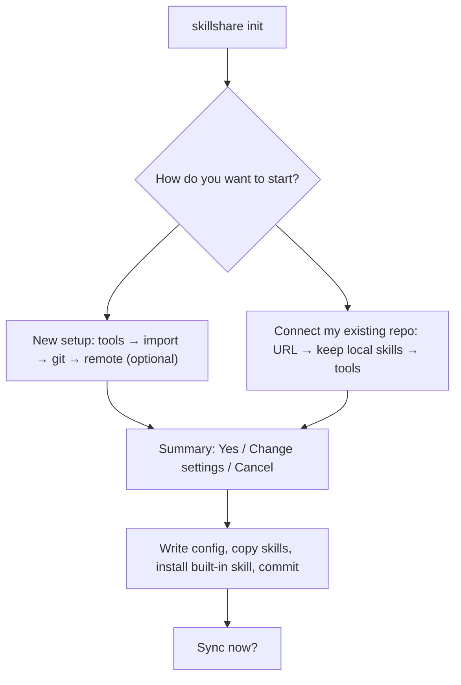
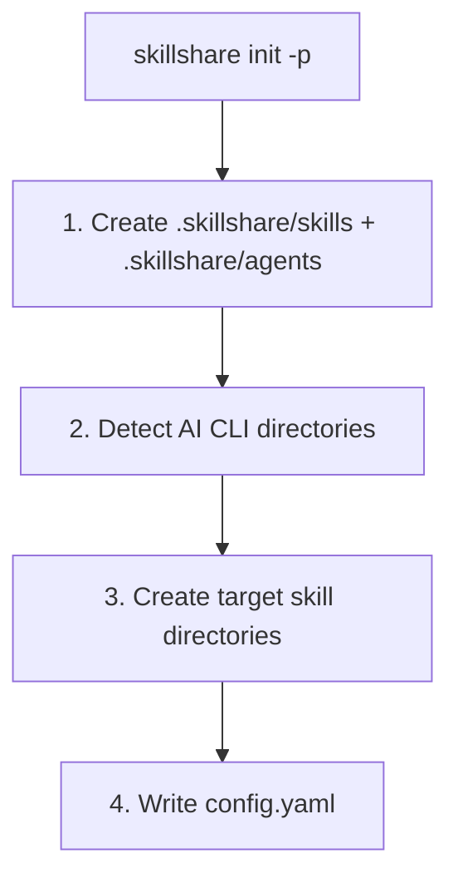

# init

First-time setup. Detects installed AI CLIs, brings in the skills they already have, and syncs them.

```bash
skillshare init              # Interactive setup
skillshare init --dry-run    # Preview without changes
```

## When to Use

- First time setting up skillshare on a machine
- Migrating to a new computer (with `--remote` to connect to existing repo)
- Adding skillshare to a project (with `--project`)
- Discovering newly installed AI CLIs (with `--discover`)

## What Happens

`init` asks first and writes last. Nothing is created until you confirm the summary, and pressing <kbd>Esc</kbd> at any question cancels without writing anything.



Each answer has a default, so pressing <kbd>Enter</kbd> through every question gives a working setup:

| Question | Default |
|----------|---------|
| Targets | Every detected AI CLI |
| Import | Every skill those tools already have |
| Git | On. Versions only the skills, or skills, agents and extras when a remote is linked. Plugins, MCP servers and hooks stay in each machine's `config.yaml` |
| Built-in skill | Installed |
| Sync | Yes |

**Change settings** in the summary edits the source path, the sync mode, and what git versions.

**Connect my existing repo** is for a second machine. It checks the repo first, without writing anything, and works out its layout: a repo pushed with `--git-root root` becomes the whole skillshare folder, and a repo whose skills sit in a `skills/` folder uses it as the source. Skills that exist both on this machine and in the repo use the repo version. Skills only on this machine are offered to keep, and are added to the repo on your next `skillshare push`.

During the first sync, a skill folder in a tool that is byte-for-byte identical to the source copy is replaced with a link. Folders that differ are kept and listed; run `skillshare sync --force` to replace them.

### Without a terminal

When stdin or stdout is not a terminal (CI, scripts, an AI agent), `init` asks nothing and uses the defaults above. It prints one line per decision with the flag that changes it:

```text
✓ Source   ~/.config/skillshare/skills (--source, --subdir)
✓ Targets  claude, cursor, universal (--targets, --no-targets)
✓ Import   all 2 (--copy-from, --no-copy)
✓ Git      skills only (--no-git, --git-root)
✓ Remote   none (--remote <url>)
✓ Skill    install skillshare (--skill, --no-skill)
✓ Sync     merge (--mode)
```

With `--remote`, a repo that already has skills is pulled, and same-name skills use the repo version; their names are listed. Output without a terminal has no colors or escape codes.

`init` creates the skills source directory **and** an `agents/` sibling directory in one step, so both resource kinds are ready to use immediately. The agents directory is silent — no extra prompts or flags. See [Agents](/docs/understand/agents) for the agent file format.

:::info Universal target
When any AI CLI is detected, `init` automatically recommends the **universal** target (`~/.agents/skills`). This is the shared directory used by [vercel-labs/skills](https://github.com/vercel-labs/skills) (`npx skills list`) to provide skills to all compatible agents at once.
:::

:::tip Agents source path
The agents source defaults to `<source parent>/agents` (so `~/.config/skillshare/agents/` for the default install). Set `agents_source:` in `config.yaml` to override the location. Project mode always uses `agents/` inside the project directory and does not honor `agents_source`. Agent-capable targets (Claude, Cursor, Augment, OpenCode) pick agents up automatically once you run `skillshare sync`.
:::

## Project Mode

Initialize project-level skills with `-p`:

```bash
skillshare init -p                              # Interactive (no terminal: every detected tool)
skillshare init -p --targets claude,cursor  # Choose the tools
skillshare init -p --visible                    # Use a visible skillshare/ directory
```

### What Happens



After init, commit the project directory to git (both `skills/` and `agents/`). Use `--visible` to create `skillshare/` instead of `.skillshare/`. See [Project Setup](/docs/how-to/sharing/project-setup) for the full guide.

## Discover Mode

Re-run init on an existing setup to detect and add new AI CLI targets:

### Global

```bash
skillshare init --discover              # Interactive selection
skillshare init --discover --select codex,opencode  # Non-interactive
```

Scans for newly installed AI CLIs not yet in your config and asks which to add; all start checked. Without a terminal, every new tool is added. The `universal` target (`~/.agents/skills`) is automatically recommended whenever any CLI is detected.

### Project

```bash
skillshare init -p --discover           # Interactive selection
skillshare init -p --discover --select antigravity  # Non-interactive
```

Scans the project directory for new AI CLI directories (e.g., `.agents/`) and adds them as targets. Without a terminal, every new tool found is added.

### Discover + Mode behavior

When you combine `--discover` with `--mode`, the mode is applied **only** to targets added in this discover run.
Existing targets in config are left unchanged.

```bash
# Adds cursor with mode=copy, does not change existing targets
skillshare init --discover --select cursor --mode copy

# Project mode variant (same rule)
skillshare init -p --discover --select cursor --mode copy
```

:::tip
If you run `skillshare init` on an already-initialized setup without `--discover`, the error message will hint you to use it.
:::

## Options

| Flag | Description |
|------|-------------|
| `--source, -s <path>` | Custom source directory (also under **Change settings** in the summary) |
| `--remote <url>` | Set git remote (implies `--git`). A repo that already has skills is pulled; same-name skills use the repo version |
| `--project, -p` | Initialize project-level skills in current directory |
| `--copy-from, -c <name\|path>` | Copy skills from a specific CLI or path |
| `--no-copy` | Start with empty source (skip copy prompt) |
| `--targets, -t <list>` | Comma-separated target names |
| `--all-targets` | Add all detected targets |
| `--no-targets` | Skip target selection |
| `--mode, -m <mode>` | Set default mode for newly configured targets (`merge`, `copy`, `symlink`). With `--discover`, affects only newly added targets. |
| `--git` | Initialize git without prompting (the default) |
| `--no-git` | Skip git initialization |
| `--skill` | Install built-in skillshare skill (the default; adds `/skillshare` to AI CLIs) |
| `--no-skill` | Skip built-in skill installation |
| `--discover, -d` | Detect and add new AI CLI targets to existing config |
| `--select <list>` | Comma-separated targets to add (requires `--discover`) |
| `--config local` | Gitignore `config.yaml` so each developer manages own targets (project mode only). See [Centralized Skills Repo](/docs/how-to/recipes/centralized-skills-repo) recipe. |
| `--visible` | Create a visible `skillshare/` project directory instead of `.skillshare/` (project mode only). See [Project Skills](/docs/understand/project-skills#visible-project-directory). |
| `--git-root <scope>` | Directory for `commit`/`push`/`pull` operations (`skills` default, `agents`, `extras`, `root`). `root` versions skills + agents + extras together in one repo with `config.yaml` auto-ignored. Defaults to `root` when a remote is linked, otherwise `skills`; also under **Change settings** in the summary. Re-run `skillshare init --git-root <scope>` later to switch scope headlessly — it inits a repo at the new scope and persists the setting, but does not move existing history. |
| `--subdir <name>` | Use a subdirectory as the source path (e.g. `skills`); detected automatically when connecting a repo |
| `--dry-run, -n` | Preview without changes |

`init` sets your starting mode policy. You can always fine-tune per target later:

```bash
skillshare target cursor --mode copy
skillshare sync
```

## Source Subdirectory

By default, `init --remote` treats the entire git repo root as the skills source. If your repo also contains non-skill files (README, CI config, dotfiles, etc.), you can store skills in a subdirectory instead:

```
# Without --subdir: repo root = source (all files are skills)
~/.config/skillshare/skills/          ← git repo root = source
  ├── my-skill/
  └── another-skill/

# With --subdir skills: source points to a subdirectory
~/.config/skillshare/skills/          ← git repo root
  ├── README.md
  ├── .github/
  └── skills/                         ← source points here
      ├── my-skill/
      └── another-skill/
```

Typical use case: embedding skills inside an existing dotfiles or monorepo instead of a dedicated skills-only repo.

When you connect a repo whose top level has no skills but a `skills/` folder does, `init` uses that folder automatically. Pass `--subdir` to choose another name:

```bash
skillshare init --remote git@github.com:you/dotfiles.git --subdir skills
```

## Common Scenarios

### Remote setup (pick one)

Interactive: run `skillshare init` and choose **Connect my existing skillshare repo**.

Non-interactive (no prompts, auto-detect installed targets):

```bash
skillshare init --remote git@github.com:you/my-skills.git --no-copy --all-targets --no-skill
```

Non-interactive (no prompts, and import existing Claude skills now):

```bash
skillshare init --remote git@github.com:you/my-skills.git --copy-from claude --all-targets --no-skill
```

### Centralized skills repo

```bash
# Creator: set up shared repo with local config
skillshare init -p --config local --targets claude

# Teammate: clone and auto-detect shared repo
git clone <repo> && cd <repo>
skillshare init -p
skillshare target add myproject ~/DEV/myproject/.claude/skills -p
```

### Other scenarios

```bash
# Standard setup (auto-detect everything)
skillshare init

# Use existing skills directory
skillshare init --source ~/.config/skillshare/skills

# Project-level setup
skillshare init -p
skillshare init -p --targets claude,cursor

# Defaults without prompts (also what runs without a terminal)
skillshare init --no-copy --all-targets --git --skill

# Start with copy mode defaults for newly added targets
skillshare init --mode copy

# Add newly installed CLIs to existing config
skillshare init --discover
skillshare init -p --discover

# Add a newly discovered target and force copy mode only for that new target
skillshare init --discover --select cursor --mode copy
```
