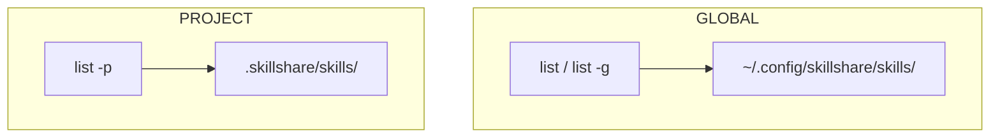
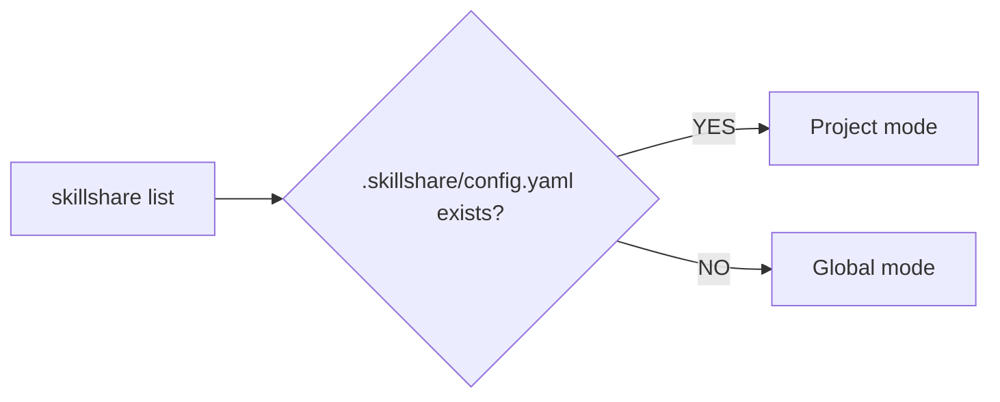

# list

List all installed skills in the source directory.

```bash
skillshare list              # Interactive TUI (default on TTY)
skillshare list --verbose    # Detailed plain text view
skillshare list --json       # JSON output for CI/scripts
```

## When to Use

- See what skills are installed and where they came from
- Search and filter skills interactively
- Check which skills are tracked repos vs local
- Audit your skill collection before a cleanup


## Interactive TUI

On a TTY, `skillshare list` launches an interactive terminal UI with:

- **Fuzzy filtering** — type to filter by name, path, or source
- **Keyboard navigation** — arrow keys to browse, `q` to quit
- **Detail panel** — shows description, disk path, files, and synced targets for the selected skill

Use `--no-tui` to skip the TUI and print plain text instead:

```bash
skillshare list --no-tui          # Plain text output
skillshare list --no-tui | less   # Pipe to pager manually
```

## Search and Filter

Filter skills without entering the TUI:

```bash
skillshare list react                     # Filter by name/path/source
skillshare list --type local              # Only local skills
skillshare list --type github             # Only GitHub-sourced skills
skillshare list react --sort newest       # Sort by install date
skillshare list --json | jq '.[].name'   # JSON for scripting
```

:::tip AI Usage
Use `--json` mode when inspecting skills programmatically:
```bash
skillshare list --json | jq '.[] | {name, source, type}'
```
:::

## Example Output

### Compact View

Skills are automatically grouped by directory when you use folders to organize them:

```
Installed skills
─────────────────────────────────────────

  frontend/
    → react-helper        github.com/user/skills
    → vue-helper          github.com/user/skills

  → my-skill              local
  → commit-commands       github.com/user/skills

Tracked repositories
─────────────────────────────────────────
  ✓ _team-skills          3 skills, up-to-date
```

If all skills are at the top level (no folders), the output is a flat list — identical to previous versions.

### Verbose View

```bash
skillshare list --verbose
```

```
Installed skills
─────────────────────────────────────────

  frontend/
    react-helper
      Source:      github.com/user/skills
      Type:        github
      Installed:   2026-01-15

    vue-helper
      Source:      github.com/user/skills
      Type:        github
      Installed:   2026-01-15

  my-skill
    Source:      (local - no metadata)

  commit-commands
    Source:      github.com/user/skills
    Type:        github
    Installed:   2026-01-15

Tracked repositories
─────────────────────────────────────────
  ✓ _team-skills          3 skills, up-to-date
  ! _other-repo           5 skills, has changes
```

## Global vs Project

skillshare operates at two levels. The `list` command shows skills from the active level:



| | Global | Project |
|---|---|---|
| **Source** | `~/.config/skillshare/skills/` | `.skillshare/skills/` |
| **Flag** | `-g` or default | `-p` or auto-detected |
| **Scope** | All projects on machine | Single repository |
| **Shared via** | `push` / `pull` | git commit |

### Auto-Detection

When you run `skillshare list` without flags, skillshare automatically detects the mode:



```bash
cd my-project/            # Has .skillshare/config.yaml
skillshare list           # → Installed skills (project)

cd ~
skillshare list           # → Installed skills (global)
```

Use `-p` or `-g` to override auto-detection:

```bash
skillshare list -g        # Force global, even inside a project
skillshare list -p        # Force project, even without auto-detection
```

## Project Mode

```bash
skillshare list          # Auto-detected if .skillshare/ exists
skillshare list -p       # Explicit project mode
```

### Example Output

```
Installed skills (project)
─────────────────────────────────────────

  tools/
    → pdf               anthropic/skills/pdf
    → review            github.com/team/tools

  → my-skill            local

→ 3 skill(s): 2 remote, 1 local
```

Project list uses the same visual format as global list, with `(project)` label in the header. Skills are grouped by directory and categorized as `local` (no metadata) or by source URL (remote).

## Options

| Flag | Description |
|------|-------------|
| `[pattern]` | Filter skills by name, path, or source (case-insensitive) |
| `--verbose, -v` | Show detailed information (source, type, install date) |
| `--json, -j` | Output as JSON (useful for CI/scripts) |
| `--no-tui` | Disable interactive TUI, use plain text output |
| `--type, -t <type>` | Filter by type: `tracked`, `local`, `github` |
| `--sort, -s <order>` | Sort order: `name` (default), `newest`, `oldest` |
| `--project, -p` | List project skills |
| `--global, -g` | List global skills |
| `--help, -h` | Show help |

## Directory Grouping

When skills are organized into folders (via [`--into`](/docs/reference/commands/install) during install or manual `mv` + `sync`), `list` automatically groups them by directory:

```
  frontend/
    → react-helper        github.com/user/skills
    → vue-helper          github.com/user/skills

  → my-skill              local
```

- Skills under the same folder share a group header (e.g., `frontend/`)
- Within each group, only the base name is shown (not the full path)
- Top-level skills (no parent folder) appear ungrouped at the bottom
- If **all** skills are top-level, the output is a flat list — no group headers

Grouping is based on the directory structure inside your source directory, not a flag. To start using it, organize skills with `--into`:

```bash
skillshare install owner/repo -s react-patterns --into frontend
skillshare install owner/repo -s vue-patterns --into frontend
```

For more details, see [Organizing Skills with Folders](/docs/how-to/daily-tasks/organizing-skills).

## Understanding the Output

### Skill Sources

| Label | Meaning |
|-------|---------|
| `local` | Created locally, no metadata |
| `github.com/...` | Installed from GitHub |
| `tracked: <repo>` | Part of a tracked repository |

### Repository Status

| Icon | Meaning |
|------|---------|
| `✓` | Up-to-date, no local changes |
| `!` | Has uncommitted changes |

## See Also

- [install](/docs/reference/commands/install) — Install skills
- [uninstall](/docs/reference/commands/uninstall) — Remove skills
- [status](/docs/reference/commands/status) — Show sync status
