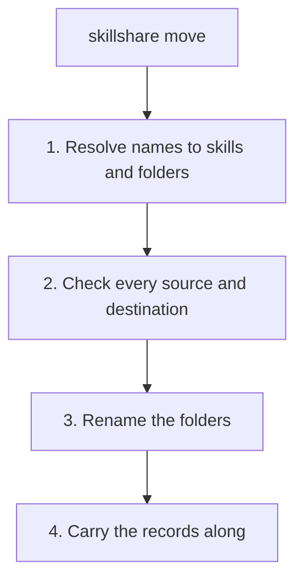

# move

Move installed skills, or whole folders of skills, to another folder of the source. Install records move with them, so nothing is re-downloaded.

```bash
skillshare move react-best-practices frontend        # Skill into frontend/
skillshare move pdf docx office                      # Several skills into office/
skillshare move frontend archive                     # Whole folder -> archive/frontend/
skillshare move archive/old-skill .                  # Back to the source root
skillshare move react-best-practices frontend -n     # Preview
skillshare move react-best-practices frontend -p     # Project mode
```

## When to Use

- Organize a flat collection into folders after you installed the skills
- Rename a group by moving its folder
- Keep the source link, audit acceptance and project lock pin of a skill that you reorganize

For skills you created yourself with `skillshare new`, a plain `mv` + `sync` works as well. Installed skills should always go through `move`: their install record is keyed by path, and `mv` would leave it behind. See [Organizing Skills](/docs/how-to/daily-tasks/organizing-skills#migrating-from-flat-to-folders).

## Compared with `mv`

A hand `mv` renames the directory and nothing else. The next `sync`, `install` or **Install missing** adopts the moved copy of an installed skill and moves its record and accepted audit findings, as long as the copy has the same name, its files are unchanged since the install and there is only one such copy. Until then `update` and `uninstall` do not find the skill. `sync --dry-run` adopts nothing.

What `mv` never does, and `move` does:

- Carry the project lock pin, the `config.yaml` group and the `.gitignore` line, and rewrite a literal `.skillignore` line.
- Check first: a tracked repo or a followed source link, a destination that exists or sits inside a skill, a target name collision, and a target filter rule that would decide differently for the new flat name.
- Move a folder whole or not at all, and leave nothing for a later `install` to repair.

## How It Works



Step 2 checks everything before anything is renamed. One refusal stops that skill or folder as a whole, so a folder is never left half moved.

What moves along with a skill or folder:

| Item | Where it lives |
|------|----------------|
| Install record | `.metadata.json` |
| Audit acceptances | `.metadata.json` |
| Literal `.skillignore` line (disabled skills) | `.skillignore` |
| Commit pin (project mode) | `.skillshare/skills.lock.json` |
| Skill group (project mode) | `.skillshare/config.yaml` |
| Ignore entry (project mode) | `.skillshare/.gitignore` |

## Arguments

```
skillshare move <skill|folder>... <dest-folder> [options]
```

- The **last** argument is the destination folder, relative to the skills source. `.` is the source root. At least two arguments are required.
- A folder keeps its base name under the destination: `move frontend archive` produces `archive/frontend/...`. A trailing `/` is accepted.
- A name is resolved in this order: exact skill path, exact folder path, flat name (`grp__demo`), then a unique skill base name. A base name that matches several skills is refused with `ambiguous_name`; use the full path.
- A skill that has nested skills below it moves together with them. A folder moves with every skill under it; empty subfolders and non-skill files move along.

## Options

| Flag | Description |
|------|-------------|
| `--dry-run, -n` | Preview without changing anything |
| `--force, -f` | Accept a target-name collision (`name_collision`). Never overwrites a destination, never moves tracked or linked content |
| `--json` | Output JSON |
| `--project, -p` | Use project-level config in current directory |
| `--global, -g` | Use global config (`~/.config/skillshare`) |
| `--help, -h` | Show help |

There is no `--kind` flag: agents are not supported.

## Examples

```text
$ skillshare move react-best-practices pdf frontend
✓ react-best-practices  → frontend/react-best-practices
✓ pdf                   → frontend/pdf

✓ Moved 2 skills

Next
  skillshare sync  rename the links in your targets
```

```text
$ skillshare move frontend archive -n
  frontend  would move to archive/frontend (3 skills)

Dry run — nothing was written
```

## Run sync afterwards

`move` does not sync. Until you run `skillshare sync`, the old link in each target is dangling, the same as after `uninstall`. `sync` removes the old flat name and creates the new one (`react-best-practices` becomes `frontend__react-best-practices`).

:::tip
`move` only touches the source. Run `skillshare sync` (or `sync -p`) when you are happy with the result.
:::

## Refusals

Each refusal has a stable code. It appears in `--json` output (`failed[].code`) and as `error_code` in the Web API.

| Code | Case |
|------|------|
| `skill_not_found` | The name matches no skill, and no folder with a skill below it |
| `ambiguous_name` | The base name matches several skills. Use the full path |
| `dest_exists` | `<dest>/<base>` already exists, as a skill or a folder. Never overwritten or merged; `--force` does not change it |
| `inside_tracked_repo` | The skill is under a `_`-prefixed tracked repo checkout, which `update` pulls into. A folder that is or contains a tracked checkout, even one with no skill of its own, is refused as a whole |
| `dest_inside_tracked_repo` | The destination is inside a tracked repo |
| `linked_folder` | The skill or folder is, or sits below, a followed source link ([`follow_source_links`](/docs/reference/targets/configuration#follow_source_links)), or the destination is below one. Other symlinks inside a folder are ordinary entries and move with it |
| `dest_is_skill` | The destination, or one of its ancestors, is itself a skill |
| `invalid_dest` | Not a valid folder path: use letters, numbers, `_` and `-`, and no segment starting with `_` |
| `dest_inside_source_folder` | A folder is moved into itself or one of its descendants |
| `duplicate_dest` | Two names in one command resolve to the same destination. `--force` does not change it |
| `overlapping_sources` | One name equals or is below another, such as `move foo foo/sub archive` |
| `same_folder` | Already in that folder. A no-op, exit code 0 |
| `name_collision` | The new flat or target name equals another skill's name in a sync target. `--force` accepts it; sync skips both entries until one is renamed |
| `ambiguous_record` | Two install records in `.metadata.json` claim the same path below the moved name (a legacy basename key and a full-path key), so moving would drop one with its audit acceptances. Remove the stale one from `.metadata.json` by hand, then retry |

## Target filters

Target `include` and `exclude` filters are not rewritten. They match flat names (`grp__demo`), not the old `demo`. `move` prints a warning when a target's filter result differs between the old and the new flat name, in either direction. Edit `config.yaml` yourself if a filter should follow the skill. See [Filtering Skills](/docs/how-to/daily-tasks/filtering-skills).

## JSON Output

```bash
skillshare move demo grp --json
```

```json
{
  "moved": [
    {"name": "demo", "from": "demo", "to": "grp/demo", "record": true, "skills": 1}
  ],
  "failed": [
    {"name": "x", "code": "dest_exists", "error": "..."}
  ],
  "skipped": 0,
  "warnings": [],
  "dry_run": false,
  "duration": "1.2s"
}
```

| Field | Meaning |
|-------|---------|
| `moved[].record` | Whether an install record moved along |
| `moved[].skills` | `1` for a skill, or the number of skills below a folder |
| `failed[].code` | One of the refusal codes above |

The exit code is non-zero when `failed` is not empty. `--json` works in global and project mode.

## Project Mode

```bash
skillshare move react-best-practices frontend -p
skillshare sync -p
```

In project mode `move` also updates the files that describe the skill:

- `.skillshare/skills.lock.json`: the commit pin follows the skill to its new path
- `.skillshare/config.yaml`: the skill's `group` is rewritten to the new folder
- `.skillshare/.gitignore`: the ignore entry follows the skill

Commit these files together, so teammates running `skillshare install -p` get the new layout. See [Project Skills](/docs/understand/project-skills#lockfile).

## Dashboard / API

The Web API exposes the same operation. It does not sync.

```http
POST /api/resources/batch/move
```

```json
{"names": ["demo"], "dest": "grp", "force": false, "dryRun": false}
```

The response is `200` with one result per name, also when some names failed. A folder result carries `skills: n`. `same_folder` is reported as a successful item with `from` equal to `to` and that `error_code`, since nothing is wrong. A malformed request is `400` with `error_code` `invalid_body`, `invalid_dest` or `unsupported_kind` (a `kind` of `agent`).

```json
{
  "results": [
    {"name": "demo", "success": true, "from": "demo", "to": "grp/demo",
     "flatName": "grp__demo", "record": true},
    {"name": "x", "success": false, "error": "grp/x already exists",
     "error_code": "dest_exists"}
  ],
  "summary": {"succeeded": 1, "failed": 1},
  "warnings": [],
  "dryRun": false
}
```

## See Also

- [Organizing Skills](/docs/how-to/daily-tasks/organizing-skills) — Folder layouts and migration from a flat source
- [install](/docs/reference/commands/install) — `--into` installs straight into a folder
- [uninstall](/docs/reference/commands/uninstall) — Remove a skill or group
- [sync](/docs/reference/commands/sync) — Rename the links in your targets after a move
- [Project Skills](/docs/understand/project-skills) — Lockfile and project config
