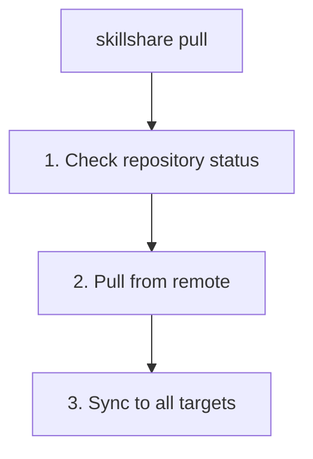

# pull

Pull from git remote and sync to all targets.

```bash
skillshare pull              # Pull and sync
skillshare pull --dry-run    # Preview
skillshare pull --force      # Replace local with remote on first pull
```

## When to Use

- Sync skills from another machine that pushed changes
- Get the latest skills after someone else pushed updates
- Start working on a new machine after `init --remote`

## What Happens



## Options

| Flag | Description |
|------|-------------|
| `--dry-run, -n` | Preview without making changes |
| `--force, -f` | On first pull conflict, replace local skills with remote |

## Git Root Scope

`pull` operates on the directory selected by the `git_root` config field (default: `skills` source). See [commit — Git Root Scope](./commit.md#git-root-scope) for the scope table. If `git_root` was changed but the git repo still lives in another scope's directory, `pull` prints a "Git root mismatch" error with the exact `git init` / `mv` commands to fix it. See [Changing the scope after init](/docs/reference/targets/configuration#git-root).

After pulling, `pull` syncs what the scope holds: `skills` runs `sync`, `agents` runs `sync agents`, `extras` runs `sync extras`, and `root` runs all three.

Plugins, MCP servers and hooks are settings in `config.yaml`, which no scope tracks, so `pull` neither brings nor applies them. See [Cross-Machine Sync — Plugins, MCP and Hooks](/docs/how-to/sharing/cross-machine-sync#plugins-mcp-hooks).

## Prerequisites

Your source directory must be a git repository with a remote:

```bash
# Check if ready:
skillshare status
# Shows: Git: initialized with remote
```

## Local Changes Warning

If you have uncommitted changes, `pull` will fail:

```bash
$ skillshare pull
✗ Local changes detected
  Run: skillshare push
  Or:  cd ~/.config/skillshare/skills && git stash -u
```

Solutions:
```bash
# Option 1: Commit locally first, without pushing
skillshare commit -m "Local changes"
skillshare pull

# Option 2: Push your changes first
skillshare push
skillshare pull

# Option 3: Stash your changes
cd ~/.config/skillshare/skills
git stash
skillshare pull
git stash pop
```

## When Both Machines Committed

If this machine has commits the remote lacks and the remote has commits this machine lacks, `pull` merges the two histories into a merge commit, then syncs. Push afterwards to share the merge.

Both machines rewrite `.metadata.json` whenever they install or update a skill, so it often conflicts. `pull` resolves those conflicts on its own: each skill's entry is merged separately, and when both machines changed the same entry, the one with the later `installed_at` wins.

A conflict in any other file stops the pull, undoes the merge, and names the files:

```bash
$ skillshare pull
✗ git pull failed
pull stopped: this machine and the remote both changed my-skill/SKILL.md; the merge was undone, resolve it with git in ~/.config/skillshare/skills
```

The repository is left as it was before the pull. To resolve the conflict yourself:

```bash
cd ~/.config/skillshare/skills
git pull --no-rebase             # redo the merge and keep the conflicts
# edit the conflicted files, then
git add . && git commit --no-edit
skillshare push
skillshare sync
```

## First Pull with Existing Skills

On first pull (no upstream yet), if the local repository already holds content (any directory, or any tracked or non-ignored file other than `.gitignore`),
`pull` attempts a **merge** to combine both sides. If the merge succeeds, both local and remote content is preserved. Only a repository with nothing else is reset to the remote branch.

At `git_root: root`, `config.yaml` is machine-specific. If the remote repository tracks `config.yaml`, `pull` refuses with an error so local configuration is never overwritten. Untrack `config.yaml` on the remote first (via `skillshare push` on the machine that tracks it) before pulling.

If there are **merge conflicts**, `pull` fails with a non-zero exit code:

```bash
$ skillshare pull
✗ Pull failed
  Resolve manually: cd ~/.config/skillshare/skills && git merge --allow-unrelated-histories <remote branch>
  Or force-pull: skillshare pull --force  (replaces local with remote)
```

Resolve options:

```bash
# Resolve conflicts manually, then push
cd ~/.config/skillshare/skills
git add . && git commit
skillshare push

# Or discard local and take remote
skillshare pull --force
```

## Examples

```bash
# Standard pull (most common)
skillshare pull

# Preview what would happen
skillshare pull --dry-run

# Replace local with remote on first-pull conflict
skillshare pull --force
```

## Workflow

Typical workflow on a secondary machine:

```bash
# Start of day: get latest skills
skillshare pull

# ... work with AI tools ...

# End of day: share any new skills
skillshare collect claude    # If you created new skills
skillshare push -m "Add new skill"
```

## See Also

- [commit](/docs/reference/commands/commit) — Commit locally without pushing
- [push](/docs/reference/commands/push) — Push to remote
- [sync](/docs/reference/commands/sync) — Manual sync without pull
- [Cross-Machine Sync](/docs/how-to/sharing/cross-machine-sync) — Full setup
