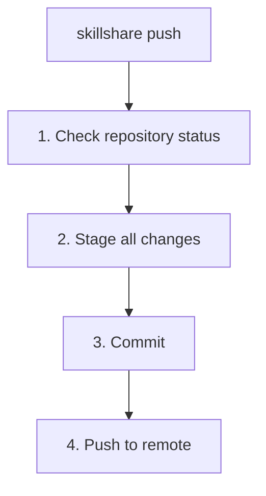

# push

Commit and push source to git remote.

Use [`commit`](./commit.md) instead when you only want a local checkpoint without pushing.

```bash
skillshare push                  # Auto-generated message
skillshare push -m "Add pdf"     # Custom message
skillshare push --pull           # Merge remote changes, push, then sync
skillshare push --dry-run        # Preview
```

## When to Use

- Share skill changes with your other machines via git
- Back up your skills to a remote repository
- After editing skills, commit and push in one command

If you want to save a local checkpoint without sharing it yet, use [`skillshare commit`](./commit.md).

## What Happens



## Options

| Flag | Description |
|------|-------------|
| `-m, --message <msg>` | Commit message (default: "Update skills") |
| `--pull` | Merge remote changes before pushing, then sync targets (see [Push and Pull Together](#push-and-pull-together)) |
| `--dry-run, -n` | Preview without making changes |

## Git Root Scope

`push` operates on the directory selected by the `git_root` config field (default: `skills` source). See [commit — Git Root Scope](./commit.md#git-root-scope) for the scope table. If `git_root` was changed but the git repo still lives in another scope's directory, `push` prints a "Git root mismatch" error with the exact `git init` / `mv` commands to fix it. See [Changing the scope after init](/docs/reference/targets/configuration#git-root).

At `git_root: root`, `push` refuses if any unpushed commit adds or modifies `config.yaml` or a file under `config.yaml/`, even if a later commit removes it. This also applies to `--pull` and `--dry-run`; the check runs before staging or pulling, and dry-run changes nothing. The error lists the affected commit hashes. A commit counts as unpushed when the remote that `push` targets (the upstream remote, or `origin` before the first push) has no ref containing it, so history that remote already has is never refused. `push` always sends only the current branch to that remote, regardless of `push.default` or `remote.pushDefault`.

Remove the file from the listed commits before retrying: run the `git rebase -i <commit>` shown in the error (it starts just before the oldest affected commit), mark the affected commits for editing, then run `git rm -r --cached -- config.yaml`, `git commit --amend`, and `git rebase --continue` at each edit. Skillshare never rewrites history automatically. A commit that only stops tracking a previously published `config.yaml` can still be pushed; adding a removal commit after an unpushed addition does not remove that earlier content from history.

## Prerequisites

Your source directory must be a git repository with a remote:

```bash
# Set up during init (recommended):
skillshare init --remote git@github.com:you/my-skills.git

# Or add remote to existing setup:
skillshare init --remote git@github.com:you/my-skills.git
```

Init automatically creates the initial commit, so `push` works immediately after setup.

## First Push Upstream Mapping

On first push (no upstream tracking yet), `skillshare push` auto-configures upstream:

- If remote already has a default branch (for example `main` or `trunk`), local changes are pushed to that remote default branch.
- If remote is empty, it pushes to your current local branch.

This avoids accidentally creating the wrong remote branch (for example local `master` while remote uses `main`).

## Examples

```bash
# Quick push with auto message
skillshare push

# Custom commit message
skillshare push -m "Add commit-commands skill"

# Preview what would be pushed
skillshare push --dry-run
```

## Conflict Handling

If the remote has newer commits:

```bash
$ skillshare push
✗ Push failed
  Remote may have newer changes

Next
  skillshare pull  get them first
  skillshare push  then push again
```

Solution:
```bash
skillshare pull    # Merge remote changes with yours
skillshare push    # Push your changes
```

`pull` merges the remote commits with the ones you have not pushed yet, so the second `push` goes through. See [When Both Machines Committed](/docs/reference/commands/pull#when-both-machines-committed) for what happens if both sides changed the same file.

## Push and Pull Together

`skillshare push --pull` does the whole round trip in one command:

1. Commits your local changes (if any)
2. Merges the remote's new commits, the same way [`pull`](/docs/reference/commands/pull) does
3. Pushes the result
4. Syncs targets for what the git root scope holds, like `pull`

If the merge hits a conflict, nothing is pushed and targets are not synced. Your changes stay committed locally; resolve the conflict, then run `skillshare push --pull` again. If the push succeeds but syncing targets fails, the remote is already updated, so run the `skillshare sync ... --global` command it prints to retry (one per synced resource, matching your `git_root`).

At `git_root: root`, if the merge brings in a `config.yaml` that the remote tracks, `push --pull` keeps this machine's copy and removes `config.yaml` from the remote in the same push.

`--pull` never rebases and never force-pushes.

## Workflow

Typical workflow for sharing skills:

```bash
# 1. Make changes to skills
# 2. Push to remote
skillshare push -m "Update my-skill"

# On another machine:
skillshare pull    # Gets changes and syncs
```

## See Also

- [commit](/docs/reference/commands/commit) — Commit locally without pushing
- [pull](/docs/reference/commands/pull) — Pull from remote
- [sync](/docs/reference/commands/sync) — Sync to local targets
- [Cross-Machine Sync](/docs/how-to/sharing/cross-machine-sync) — Full setup
