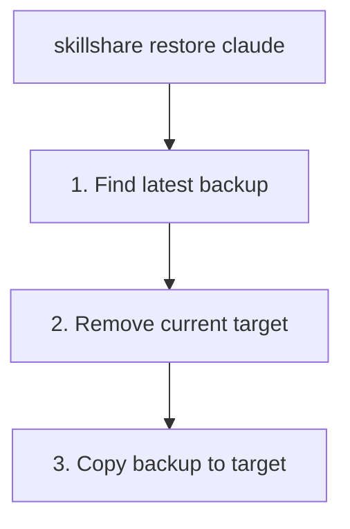

# restore

Restore a target from a backup.

```bash
skillshare restore                                     # Interactive TUI (browse + restore)
skillshare restore claude                              # Latest backup
skillshare restore claude --from 2026-01-19_10-00-00   # Specific backup
skillshare restore claude --dry-run                    # Preview
```

## When to Use

- A sync went wrong and you need to revert a target to its previous state
- You accidentally removed skills from a target
- Browse backup versions interactively and compare against current state

## Interactive TUI

On a TTY, `skillshare restore` (with no arguments) launches a unified restore TUI:

1. **Source picker** — Choose between "Backup Restore" and "Trash Restore"
2. **Backup Restore** — Select a target, then browse backup versions with a detail panel showing:
   - Backup date, size, and skill count
   - Diff vs current target (added/removed skills)
   - Individual file listings
3. **Trash Restore** — Opens the trash TUI to restore deleted skills

### Key Bindings

| Key | Action |
|-----|--------|
| `↑`/`↓` | Navigate targets / versions |
| `Enter` | Select target / restore version |
| `/` | Filter targets |
| `d` | Delete a backup version |
| `Ctrl+d`/`Ctrl+u` | Scroll detail panel |
| `Esc` | Go back |
| `q`/`Ctrl+C` | Quit |

Use `--no-tui` to skip the TUI and show a plain backup list instead.

## What Happens



## Options

| Flag | Description |
|------|-------------|
| `--from, -f <timestamp>` | Restore from specific backup |
| `--force` | Overwrite without confirmation |
| `--dry-run, -n` | Preview without making changes |
| `--no-tui` | Skip interactive TUI, show backup list instead |

## Finding Backups

List available backups:

```bash
skillshare backup --list
```

```
All backups (15.3 MB total)
  2026-01-20_15-30-00  claude, cursor     4.2 MB
  2026-01-19_10-00-00  claude             2.1 MB
  2026-01-18_09-00-00  claude, cursor     4.0 MB
```

## Examples

```bash
# Restore from latest backup
skillshare restore claude

# Restore from specific backup
skillshare restore claude --from 2026-01-19_10-00-00

# Preview restore
skillshare restore claude --dry-run

# Force restore (skip confirmation)
skillshare restore claude --force
```

## After Restoring

After restore, your target will have regular directories instead of symlinks. To re-sync:

```bash
skillshare restore claude    # Restore backup
skillshare sync              # Re-sync from source (creates symlinks)
```

Or keep the restored state:
```bash
skillshare restore claude    # Restore backup
# Done - skills are now local copies
```

## Use Cases

### Accidental Deletion

If you accidentally deleted a skill:

```bash
skillshare restore claude --from 2026-01-19_10-00-00
```

### Reverting Changes

If a sync went wrong:

```bash
skillshare restore claude  # Go back to pre-sync state
```

### Testing

Restore to test old skill versions:

```bash
skillshare restore claude --from 2026-01-15_10-00-00
# Test old skills...
skillshare sync  # Return to current state
```

## See Also

- [backup](/docs/reference/commands/backup) — Create and manage backups
- [sync](/docs/reference/commands/sync) — Re-sync after restore
