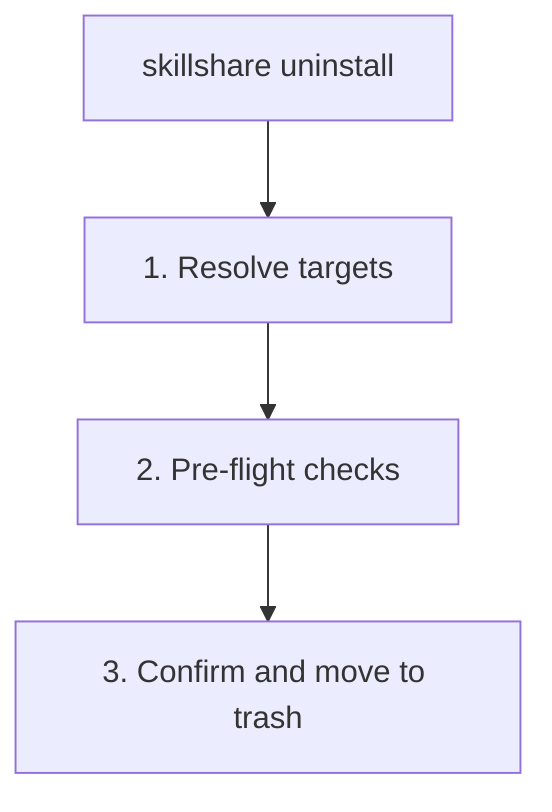

# uninstall

Remove one or more skills or tracked repositories from the source directory. Skills are moved to trash and kept for 7 days before automatic cleanup.

```bash
skillshare uninstall my-skill              # Remove a single skill
skillshare uninstall a b c --force         # Remove multiple skills at once
skillshare uninstall --all                 # Remove all skills
skillshare uninstall --group frontend      # Remove all skills in a group
skillshare uninstall team-repo             # Remove tracked repository (_ prefix optional)
```

## When to Use

- Remove skills you no longer need (they move to trash for 7 days)
- Clean up a tracked repository you've stopped using
- Batch-remove an entire group of skills at once
- Remove **all** skills at once with `--all`


## What Happens



## Options

| Flag | Description |
|------|-------------|
| `--all` | Remove **all** skills from source (requires confirmation) |
| `--group, -G <name>` | Remove all skills in a group (prefix match, repeatable) |
| `--force, -f` | Skip confirmation and ignore uncommitted changes |
| `--dry-run, -n` | Preview without making changes |
| `--project, -p` | Use project-level config in current directory |
| `--global, -g` | Use global config (`~/.config/skillshare`) |
| `--help, -h` | Show help |

## Multiple Skills

Remove several skills in one command:

```bash
skillshare uninstall alpha beta gamma --force
```

When some skills are not found, the command **skips them with a warning** and continues removing the rest. It only fails if **all** specified skills are invalid.

### Glob Patterns

Skill names support glob patterns (`*`, `?`, `[...]`) for batch removal:

```bash
skillshare uninstall "core-*"              # Remove all skills matching core-*
skillshare uninstall "test-?" --force      # Single-character wildcard
skillshare uninstall "core-*" "util-*"     # Multiple patterns
```

Glob matching is case-insensitive: `"Core-*"` matches `core-auth`, `CORE-DB`, etc.

:::note Top-level matching only
Glob patterns match against **top-level directory names** in the source folder. Nested skills (e.g. `frontend/react-hooks`) are not matched by `"react-*"` — use `--group frontend` to target skills within a subdirectory.
:::

## Remove All

Use `--all` to remove every skill from the source directory at once:

```bash
skillshare uninstall --all                 # Interactive confirmation
skillshare uninstall --all --force         # Skip confirmation
skillshare uninstall --all -n              # Preview what would be removed
```

`--all` cannot be combined with skill names or `--group`.

:::tip Shell glob protection
Running `skillshare uninstall *` without quotes causes your shell to expand `*` into file names in the current directory. skillshare detects this and suggests using `--all` instead. Always quote the wildcard (`"*"`) or use `--all`.
:::

## Group Removal

When you uninstall a directory that contains sub-skills, skillshare automatically detects it as a **group** and lists the contained skills before asking for confirmation:

```
Uninstalling group (5 skills)
─────────────────────────────────────────
  - feature-radar
  - feature-radar-archive
  - feature-radar-learn
  - feature-radar-ref
  - feature-radar-scan
→ Name: feature-radar
→ Path: ~/.config/skillshare/skills/feature-radar

Are you sure you want to uninstall this group? [y/N]:
```

The `--group` flag removes all skills under a directory using **prefix matching**:

```bash
# Remove all skills under frontend/
skillshare uninstall --group frontend

# Also removes nested skills: frontend/react/hooks, frontend/vue/composables
skillshare uninstall --group frontend --force

# Preview what would be removed
skillshare uninstall --group frontend --dry-run
```

When group removal is applied (including auto-detected directory groups), each removed member is also removed from the managed `skills:` list in config (`~/.config/skillshare/config.yaml` or `.skillshare/config.yaml` in project mode).

You can combine positional names with `--group`, and even use `-G` multiple times:

```bash
# Mix names and groups
skillshare uninstall standalone-skill -G frontend -G backend --force

# Duplicates are automatically deduplicated
skillshare uninstall frontend/hooks -G frontend --force  # hooks removed once
```

## Tracked Repositories

For tracked repositories (folders starting with `_`):

- Checks for uncommitted changes (use `--force` to override)
- Automatically removes the entry from `.gitignore`
- The `_` prefix is optional when uninstalling

```bash
skillshare uninstall _team-skills        # With prefix
skillshare uninstall team-skills         # Without prefix (auto-detected)
skillshare uninstall _team-skills --force # Force remove with uncommitted changes
```

## Examples

```bash
# Remove a single skill
skillshare uninstall my-skill

# Remove multiple skills
skillshare uninstall skill-a skill-b skill-c --force

# Remove all skills
skillshare uninstall --all
skillshare uninstall --all --force
skillshare uninstall --all -n              # Preview

# Remove by group
skillshare uninstall --group frontend --force

# Preview removal
skillshare uninstall my-skill --dry-run
skillshare uninstall --group frontend -n

# Remove tracked repository
skillshare uninstall team-repo

# Mix names and groups
skillshare uninstall my-skill -G frontend --force
```

## Safety

Uninstalled skills are **moved to trash**, not permanently deleted:

- **Location:** `~/.local/share/skillshare/trash/` (global) or `.skillshare/trash/` (project)
- **Retention:** 7 days, then automatically cleaned up
- **Reinstall hint:** If the skill was installed from a remote source, the reinstall command is shown
- **Restore:** Use `skillshare trash restore <name>` to recover from trash

Single skill (verbose):

```
✓ Uninstalled skill: my-skill
ℹ Moved to trash (7 days): ~/.local/share/skillshare/trash/my-skill_2026-01-20_15-30-00
ℹ Reinstall: skillshare install github.com/user/repo/my-skill
```

Multiple skills (batch):

```
✓ Uninstalled 4 skill(s) (0.1s)

── Removed ─────────────────────────────
✓ pdf        skill
✓ tdd        skill
✓ security   group, 2 skills
✗ bad-skill  failed to move to trash: ...

── Next Steps ──────────────────────────
ℹ Moved to trash (7 days).
ℹ Run 'skillshare sync' to update all targets
```

Large batches use a condensed format:

```
✓ Uninstalled 920, failed 2 (1.2s)

── Failed ──────────────────────────────
✗ bad-a  failed to move to trash: permission denied
✗ bad-b  failed to move to trash: permission denied

── Removed ─────────────────────────────
✓ 920 uninstalled

── Next Steps ──────────────────────────
ℹ Moved to trash (7 days).
ℹ Run 'skillshare sync' to update all targets
```

To restore an accidentally uninstalled skill:

```bash
skillshare trash list                  # See what's in trash
skillshare trash restore my-skill      # Restore to source
skillshare sync                        # Sync back to targets
```

## After Uninstalling

Run `skillshare sync` to remove the skill from all targets:

```bash
skillshare uninstall old-skill
skillshare sync  # Remove from Claude, Cursor, etc.
```

## Project Mode

Uninstall skills or tracked repos from the project's `.skillshare/skills/`:

```bash
skillshare uninstall my-skill -p                  # Remove a skill
skillshare uninstall a b c -p -f                  # Remove multiple skills
skillshare uninstall --all -p -f                   # Remove all project skills
skillshare uninstall --group frontend -p -f        # Remove a group
skillshare uninstall team-skills -p                # Tracked repo (_ prefix optional)
```

In project mode, uninstall:
- Moves the skill directory to `.skillshare/trash/` (kept 7 days)
- Removes the skill's entry from `.skillshare/config.yaml` `skills:` list (for remote skills)
- Removes the entry from `.skillshare/.gitignore` (for remote/tracked skills)
- For tracked repos: checks for uncommitted changes (use `--force` to override)
- The `_` prefix is optional — auto-detected

```bash
skillshare uninstall pdf -p
skillshare sync
git add .skillshare/ && git commit -m "Remove pdf skill"
```

## See Also

- [install](/docs/reference/commands/install) — Install skills
- [list](/docs/reference/commands/list) — List installed skills
- [trash](/docs/reference/commands/trash) — Manage trashed skills
- [Project Skills](/docs/understand/project-skills) — Project mode concepts
