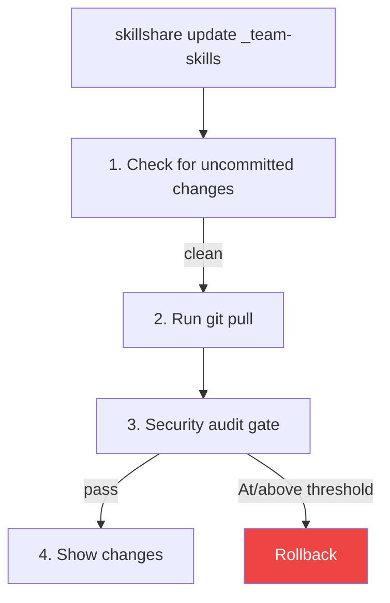
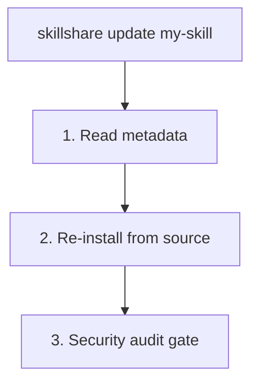

# update

Update one or more skills or tracked repositories to the latest version.

```bash
skillshare update my-skill           # Update single skill
skillshare update a b c              # Update multiple at once
skillshare update --group frontend   # Update all skills in a group
skillshare update team-skills        # Update tracked repo
skillshare update --all              # Update everything
skillshare update agents --all       # Update all tracked/updatable agents
```

## When to Use

- A tracked repository has new commits (found via `check`)
- An installed skill has a newer version available
- You want to re-download a skill from its original source


## What Happens

### For Tracked Repositories



### For Regular Skills



## Options

| Flag | Description |
|------|-------------|
| `--all, -a` | Update all tracked repos/skills, or all agents when used as `update agents --all` |
| `--group, -G <name>` | Update all updatable skills in a group, or all agents in an agent subdirectory |
| `--force, -f` | Discard local changes and force update |
| `--dry-run, -n` | Preview without making changes |
| `--skip-audit` | Skip the post-update security audit gate |
| `--audit-threshold <t>`, `--threshold <t>`, `-T <t>` | Override update audit block threshold (`critical|high|medium|low|info`; shorthand: `c|h|m|l|i`, plus `crit`, `med`) |
| `--diff` | Show file-level change summary after skill/repo update |
| `--audit-verbose` | Show detailed per-skill audit findings in batch mode |
| `--prune` | Remove stale skills (deleted upstream) instead of warning |
| `--project, -p` | Use project-level config in current directory |
| `--global, -g` | Use global config (`~/.config/skillshare`) |
| `--json` | Output as JSON |
| `--help, -h` | Show help |

`update agents` supports: `--all`, `--group`, `--force`, `--dry-run`, `--skip-audit`, `--audit-threshold` / `--threshold` / `-T`, `--json`, plus `--project` / `--global`. It does **not** support `--diff`, `--audit-verbose`, or `--prune`.

## JSON Output

```bash
skillshare update --all --json
```

```json
{
  "updated": 3,
  "skipped": 1,
  "security_failed": 0,
  "pruned": 0,
  "dry_run": false,
  "duration": "4.567s",
  "items": [
    {"name": "_team-skills", "type": "repo", "status": "updated"},
    {"name": "my-skill", "type": "skill", "status": "updated"},
    {"name": "another-skill", "type": "skill", "status": "updated"},
    {"name": "local-only", "type": "skill", "status": "skipped"}
  ]
}
```

Possible `status` values: `updated`, `skipped`, `failed`, `security_blocked`. When an item fails, the `error` field is included.

When tracked repos are declared in metadata but missing on disk, each is reported as a skipped `repo` item with a concise `error` (`clone directory absent`), and an aggregated `missing_tracked_repos` summary carries the names plus a one-shot rehydration hint:

```json
{
  "updated": 0,
  "skipped": 1,
  "items": [
    {"name": "_team-skills", "type": "repo", "status": "skipped", "error": "clone directory absent"}
  ],
  "missing_tracked_repos": {
    "names": ["_team-skills"],
    "hint": "Run 'skillshare install' to rehydrate tracked repositories"
  }
}
```

The `missing_tracked_repos` field is omitted when no tracked repos are missing.

### Agent JSON Output

```bash
skillshare update agents --all --json
```

```json
{
  "agents": [
    {"name": "reviewer", "status": "updated", "source": "github.com/user/agents/reviewer.md"},
    {"name": "team/tutor", "status": "up_to_date", "source": "github.com/user/agents/team/tutor.md"}
  ],
  "dry_run": false,
  "duration": "1.234s"
}
```

Possible agent `status` values include `updated`, `failed`, `skipped`, `up_to_date`, `update_available`, `dirty`, `drifted`, and `local`.

## Updating Agents

Use the `agents` kind selector when you only want to update standalone `.md` agents:

```bash
skillshare update agents reviewer
skillshare update agents --group team
skillshare update agents --all -T high
skillshare update agents --all --json
```

Agent updates follow the same audit gate as skills:

- tracked agent repos run `git pull`, then audit the updated repo
- metadata-backed single-file agents reinstall from source, audit the staged `.md`, and only replace the local file on success

## Update Multiple

Update several skills at once:

```bash
skillshare update skill-a skill-b skill-c
```

Only updatable skills (tracked repos or skills with metadata) are processed. Skills not found are warned but don't cause failure. However, if any skill is **blocked by the security audit gate**, the batch command exits with a non-zero code.

### Glob Patterns

Skill names support glob patterns (`*`, `?`, `[...]`) for batch operations:

```bash
skillshare update "core-*"              # Update all skills matching core-*
skillshare update "_team-?"             # Single-character wildcard
skillshare update "core-*" "util-*"     # Multiple patterns
```

Glob patterns match against the **basename** (last path component) of each skill or tracked repo. For example, `"react-*"` matches `frontend/react-hooks` because the basename is `react-hooks`.

Glob matching is case-insensitive: `"Core-*"` matches `core-auth`, `CORE-DB`, etc.

:::tip Shell glob protection
Always quote glob patterns (`"core-*"`) to prevent your shell from expanding `*` into file names in the current directory.
:::

## Update Group

Update all updatable skills within a group directory:

```bash
skillshare update --group frontend        # Update all in frontend/
skillshare update -G frontend -G backend  # Multiple groups
skillshare update x -G backend            # Mix names and groups
```

Local skills (without metadata or `.git`) inside the group are silently skipped.

A positional argument that matches a group directory (not a repo or skill) is auto-expanded:

```bash
skillshare update frontend   # Same as --group frontend
# ℹ 'frontend' is a group — expanding to 3 updatable skill(s)
```

:::note
`--all` cannot be combined with skill names or `--group`.
:::

## Update All

Update everything at once:

```bash
skillshare update --all
```

This updates:
1. All tracked repositories (git pull)
2. All skills with source metadata (re-install)

### Example Output

```
Updating 2 tracked repos + 3 skills

[1/5] ✓ _team-skills       Already up to date
[2/5] ✓ _personal-repo     3 commits, 2 files
[3/5] ✓ my-skill           Reinstalled from source
→ risk: LOW (12/100)
[4/5] ! other-skill        has uncommitted changes (use --force)
[5/5] ✓ another-skill      Reinstalled from source

── Summary ─────────────────────────────
  Total:    5
  Updated:  4
  Skipped:  1
```

### Missing Tracked Repositories

If `.metadata.json` declares a tracked repo (`tracked: true`) but its clone directory is absent on disk — common on a fresh machine, since clone directories live in the managed `.gitignore` block — `update --all` no longer skips it silently. It reports each missing repo and points you to rehydrate:

```
! 1 tracked repo(s) declared in metadata but missing on disk:
  ! _team-skills         clone directory absent
→ Run 'skillshare install' to rehydrate tracked repositories
```

This applies to both global and project (`-p`) mode. To recreate the clones from metadata, run no-argument [install](/docs/reference/commands/install) (see [Rehydrating After a Fresh Clone](/docs/understand/tracked-repositories#rehydrating-after-a-fresh-clone)).

## Stale Skill Cleanup (`--prune`)

When an upstream repository renames or removes a skill, `update` detects it as **stale** and warns you:

```
⚠ 1 skill(s) no longer found in upstream repository:
  ⚠ frontend/old-skill — stale (deleted upstream)
ℹ Run with --prune to remove stale skills
```

Add `--prune` to automatically remove stale skills (moved to trash, not permanently deleted):

```bash
skillshare update --all --prune
```

`check` also reports stale skills:

```bash
skillshare check --all
# ⚠ 1 skill(s) stale (deleted upstream) — run 'skillshare update --all --prune' to remove
```

:::note
Tracked repositories (`_repo`) are not affected by `--prune`. When a tracked repo removes a skill internally, `sync` automatically cleans up orphan symlinks via `PruneOrphanLinks`.
:::

## Security Audit Gate

After updating skills, `update` automatically runs a security audit:

- **Tracked repos (`git pull`)** use a post-pull gate at the active threshold (`audit.block_threshold`, default `CRITICAL`)
- **Regular skills (reinstall path)** use the same threshold policy
- For all update types, risk label/score is displayed for review context

```
→ risk: LOW (12/100)
```

### Interactive Mode (TTY, tracked repos)

When findings are detected at or above the active threshold, you're prompted to decide:

```
  [HIGH] Source repository link detected — may be used for supply-chain redirects (SKILL.md:5)

  Security findings at or above active threshold detected.
  Apply anyway? [y/N]:
```

- **`y`** — Accept the update despite findings
- **`N`** (default) — Roll back to the pre-pull state

### Non-Interactive Mode (CI/CD)

In non-interactive environments, the update is automatically rolled back and the command exits with a non-zero code. This ensures fail-closed behavior in CI pipelines.

```bash
# Bypass the audit gate when you trust the source
skillshare update --all --skip-audit
```

:::caution
`--skip-audit` disables the post-update security scan entirely. Use it only when you trust the source or have an external audit process.
:::

You can override threshold per command with `--audit-threshold`, `--threshold`, or `-T`:

```bash
skillshare update _team-skills --threshold high
skillshare update --all -T h
```

## File Change Summary (`--diff`)

Use `--diff` to see a file-level change summary after each update:

```bash
skillshare update team-skills --diff
skillshare update --all --diff
```

For **tracked repositories**, the diff uses `git diff` and includes line-level statistics:

```
┌─ Files Changed ─────────────────────────────┐
│                                             │
│  ~ SKILL.md (+12 -3)                        │
│  + scripts/deploy.sh (+45 -0)               │
│  - old-helper.sh (+0 -22)                   │
│  ~ utils/format.md (+5 -2)                  │
│                                             │
└─────────────────────────────────────────────┘
```

For **regular skills** (installed from a remote source), the diff compares file hashes before and after the reinstall:

```
┌─ Files Changed ─────────────────────────────┐
│                                             │
│  ~ SKILL.md                                 │
│  + new-helper.sh                            │
│                                             │
└─────────────────────────────────────────────┘
```

Markers: `+` added, `-` deleted, `~` modified. Shows up to 20 files; additional files are summarized as "... and N more file(s)".

## Handling Conflicts

If a tracked repo has uncommitted changes:

```bash
# Option 1: Commit your changes first
cd ~/.config/skillshare/skills/_team-skills
git add . && git commit -m "My changes"
skillshare update _team-skills

# Option 2: Discard and force update
skillshare update _team-skills --force
```

## After Updating

Run `skillshare sync` to distribute changes to all targets:

```bash
skillshare update --all --diff   # Update with file-level change summary
skillshare sync
```

## Project Mode

Update skills and tracked repos in the project:

```bash
skillshare update pdf -p              # Update single skill (reinstall)
skillshare update a b c -p            # Update multiple skills
skillshare update --group frontend -p # Update all in a group
skillshare update team-skills -p      # Update tracked repo (git pull)
skillshare update --all -p            # Update everything
skillshare update --all -p --dry-run  # Preview
skillshare update --all -p --diff     # Update with file change summary
skillshare update --all -p --skip-audit  # Skip security audit gate
```

### How It Works

| Type | Method | Detected by |
|------|--------|-------------|
| **Tracked repo** (`_repo`) | `git pull` | Has `.git/` directory |
| **Remote skill** (with metadata) | Reinstall from source | Listed in `.metadata.json` |
| **Local skill** | Skipped | Not listed in `.metadata.json` |

The `_` prefix is optional — `skillshare update team-skills -p` auto-detects `_team-skills`.

### Handling Conflicts

Tracked repos with uncommitted changes are blocked by default:

```bash
# Option 1: Commit changes first
cd .skillshare/skills/_team-skills
git add . && git commit -m "My changes"
skillshare update team-skills -p

# Option 2: Discard and force update
skillshare update team-skills -p --force
```

### Typical Workflow

```bash
skillshare update --all -p
skillshare sync
git add .skillshare/ && git commit -m "Update remote skills"
```

## See Also

- [install](/docs/reference/commands/install) — Install skills
- [upgrade](/docs/reference/commands/upgrade) — Upgrade CLI and built-in skill
- [sync](/docs/reference/commands/sync) — Sync to targets
- [Project Skills](/docs/understand/project-skills) — Project mode concepts
