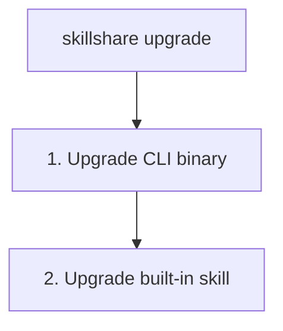

# upgrade

Upgrade the skillshare CLI binary and/or the built-in skillshare skill.

```bash
skillshare upgrade              # Upgrade both CLI and skill
skillshare upgrade --cli        # CLI only
skillshare upgrade --skill      # Skill only
```

## When to Use

- A new version of the skillshare CLI is available
- The built-in skillshare skill needs updating
- After `doctor` reports an available update


## What Happens



## Options

| Flag | Description |
|------|-------------|
| `--cli` | Upgrade CLI only |
| `--skill` | Upgrade skill only (prompts if not installed) |
| `--force, -f` | Skip confirmation prompts |
| `--dry-run, -n` | Preview without making changes |
| `--help, -h` | Show help |

## Homebrew Users

If you installed via Homebrew, `skillshare upgrade` automatically delegates to `brew upgrade`:

```bash
skillshare upgrade
# → brew update && brew upgrade skillshare
```

You can also use Homebrew directly:

```bash
brew upgrade skillshare
```

## Examples

```bash
# Standard upgrade (both CLI and skill)
skillshare upgrade

# Preview what would be upgraded
skillshare upgrade --dry-run

# Force upgrade without prompts
skillshare upgrade --force

# Upgrade only the CLI binary
skillshare upgrade --cli

# Upgrade only the skillshare skill
skillshare upgrade --skill
```

## After Upgrading

If you upgraded the skill, run `skillshare sync` to distribute it:

```bash
skillshare upgrade --skill
skillshare sync  # Distribute to all targets
```

## What Gets Upgraded

### CLI Binary

The `skillshare` executable itself. Downloads from GitHub releases.

### Web UI Assets

After upgrading, skillshare pre-downloads the Web UI frontend assets for the new version. These are cached at `~/.cache/skillshare/ui/<version>/` and served when you run `skillshare ui`.

If the pre-download fails (e.g. network issues), the assets will be downloaded on the next `skillshare ui` launch instead.

### skillshare Skill

The built-in `skillshare` skill that adds the `/skillshare` command to AI CLIs. Located at:
```
~/.config/skillshare/skills/skillshare/SKILL.md
```

## See Also

- [update](/docs/reference/commands/update) — Update other skills and repos
- [status](/docs/reference/commands/status) — Check current versions
- [doctor](/docs/reference/commands/doctor) — Diagnose issues
