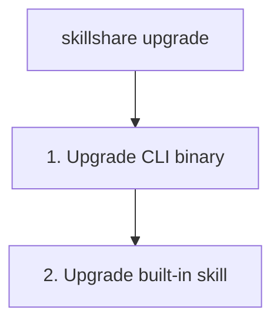

# upgrade

Upgrade the skillshare CLI binary and/or the built-in skillshare skill.

```bash
skillshare upgrade              # Upgrade both CLI and skill
skillshare upgrade --cli        # CLI only
skillshare upgrade --skill      # Skill only
```

## When to Use

- A new version of the skillshare CLI is available
- The built-in skillshare skill needs updating
- After `doctor` reports an available update

```text
skillshare upgrade --skill --dry-run
  Skill     v0.21.12 → v0.21.13 · would download

Dry run — nothing was written
```

## What Happens


```mermaid
flowchart TD
    TITLE["skillshare upgrade"]
    CLI["1. Upgrade CLI binary"]
    SKILL["2. Upgrade built-in skill"]
    TITLE --> CLI --> SKILL
```

## Options

| Flag | Description |
|------|-------------|
| `--cli` | Upgrade CLI only |
| `--skill` | Upgrade skill only (prompts if not installed) |
| `--force, -f` | Skip confirmation prompts |
| `--dry-run, -n` | Preview without making changes |
| `--help, -h` | Show help |

## Homebrew Users

If you installed via Homebrew, `skillshare upgrade` automatically delegates to `brew upgrade`:

```bash
skillshare upgrade
# → brew update && brew upgrade skillshare
```

You can also use Homebrew directly:

```bash
brew upgrade skillshare
```

## Examples

```bash
# Standard upgrade (both CLI and skill)
skillshare upgrade

# Preview what would be upgraded
skillshare upgrade --dry-run

# Force upgrade without prompts
skillshare upgrade --force

# Upgrade only the CLI binary
skillshare upgrade --cli

# Upgrade only the skillshare skill
skillshare upgrade --skill
```

## After Upgrading

If you upgraded the skill, run `skillshare sync` to distribute it:

```bash
skillshare upgrade --skill
skillshare sync  # Distribute to all targets
```

## What Gets Upgraded

### CLI Binary

The `skillshare` executable itself. Downloads from GitHub releases.

The archive is verified against the release's `checksums.txt` before your running binary is
replaced, so a damaged or mismatched download stops the upgrade instead of installing itself.
The current binary stays untouched, and the error names the mismatch.

In a terminal, the download shows how much has arrived, so a slow connection does not
look like a hang. The Web UI assets below show the same.

```
Downloading v0.21.4...  3.2 MB / 9.1 MB
```

The install script now defaults to `~/.local/bin`, where normal updates do not need `sudo`. Existing installations keep their current location.

If the binary is in a protected directory (e.g., `/usr/local/bin`), skillshare asks `sudo` to replace only the binary — no manual prefix needed. The built-in skill, UI assets, and logs are still written as you, so don't run the whole upgrade with `sudo`: that leaves root-owned files in your skills source, and a later `git pull` fails with `Permission denied`.

If an earlier upgrade already left such files, updating the built-in skill fails with `permission denied`, and the error shows the command that gives the skills source back to you, for example:

```bash
sudo chown -R "$(id -un)" ~/.config/skillshare/skills
```

When there is no terminal to ask for a password on (the dashboard's **Update now** button, CI), the upgrade stops right away and tells you to run `skillshare upgrade` in a terminal instead of waiting for input. Cached `sudo` credentials and `NOPASSWD` setups still upgrade without a prompt.

### Web UI Assets

After upgrading, skillshare pre-downloads the Web UI frontend assets for the new version. These are cached at `~/.cache/skillshare/ui/<version>/` and served when you run `skillshare ui`.

If the pre-download fails (e.g. network issues), the assets will be downloaded on the next `skillshare ui` launch instead.

### skillshare Skill

The built-in `skillshare` skill that adds the `/skillshare` command to AI CLIs. Located at:
```
~/.config/skillshare/skills/skillshare/SKILL.md
```

## See Also

- [update](/docs/reference/commands/update) — Update other skills and repos
- [status](/docs/reference/commands/status) — Check current versions
- [doctor](/docs/reference/commands/doctor) — Diagnose issues
