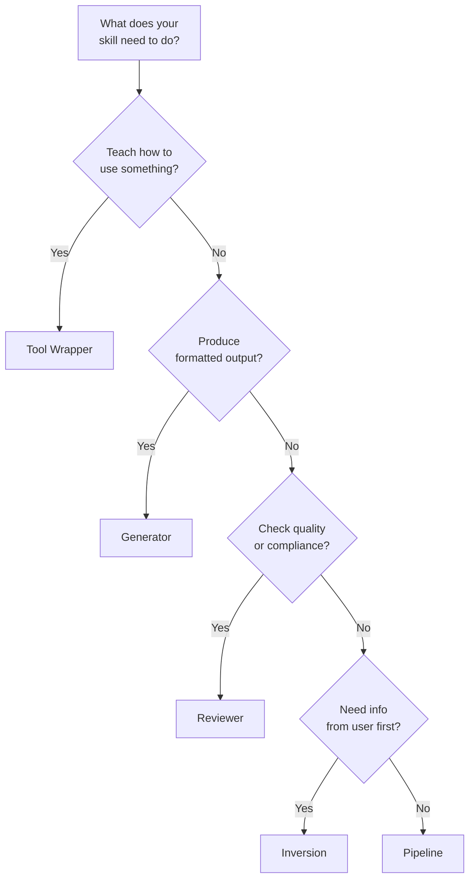

# Skill Design Patterns

Five structural templates to jump-start your skills. Pick a pattern, generate a template with `skillshare new`, and customize from there.

:::tip Quick Start
Use `skillshare new my-skill -P <pattern>` to generate a template for any pattern. Run `skillshare new my-skill` for an interactive picker.
:::

---

## Part 1: Quick Reference

### Pattern Overview

| Pattern | What It Does | Use When |
|---------|-------------|----------|
| Tool Wrapper | Teaches agent how to use a library/API | Agent needs domain-specific conventions |
| Generator | Produces structured output from a template | You need consistent document/code formats |
| Reviewer | Scores/audits against a checklist | Code review, security audit, quality checks |
| Inversion | Agent interviews user before acting | Requirements gathering, project planning |
| Pipeline | Multi-step workflow with checkpoints | Complex tasks needing validation gates |

### Which Pattern Should I Use?



### Use-Case Categories

When creating a skill, you can also tag it with a **category** to signal its domain:

| Category | Description | Examples |
|----------|-------------|----------|
| `library` | Library & API Reference | `billing-lib`, `internal-platform-cli` |
| `verification` | Product Verification | `signup-flow-driver`, `checkout-verifier` |
| `data` | Data Fetching & Analysis | `funnel-query`, `grafana` |
| `automation` | Business Process & Team Automation | `standup-post`, `weekly-recap` |
| `scaffold` | Code Scaffolding & Templates | `new-migration`, `create-app` |
| `quality` | Code Quality & Review | `adversarial-review`, `testing-practices` |
| `cicd` | CI/CD & Deployment | `babysit-pr`, `deploy-service` |
| `runbook` | Runbooks & Incident Response | `oncall-runner`, `log-correlator` |
| `infra` | Infrastructure Operations | `orphan-cleanup`, `cost-investigation` |

Categories are stored in SKILL.md frontmatter and are independent from patterns — any pattern can be combined with any category.

---

## Part 2: Detailed Examples

### Tool Wrapper

Teaches the agent how to use a specific library, framework, or API by embedding conventions and usage examples.

The agent loads the conventions once and applies them whenever it writes or reviews code that touches that library. This keeps domain-specific knowledge out of your head and into a repeatable skill.

**Example SKILL.md:**

```markdown
---
name: billing-lib
description: >-
  Conventions for the billing-lib SDK. Use when writing or reviewing
  code that imports billing-lib or handles payment flows.
pattern: tool-wrapper
category: library
---

# Billing Lib

## Core Conventions

Load and follow the rules in `references/conventions.md` before writing any code.

## When Reviewing Code

- Check that all API calls follow the conventions
- Verify error handling matches the library's patterns
- Ensure imports and initialization are correct

## When Writing Code

- Follow the conventions from `references/conventions.md`
- Use idiomatic patterns for this library/API
- Include error handling for common failure modes
```

**Directory structure:**

```
billing-lib/
├── SKILL.md
└── references/
    └── conventions.md      # API patterns, error codes, initialization
```

**Variations:** Some tool-wrapper skills include a `references/examples.md` with copy-paste snippets, or a `references/migration.md` for version upgrades.

---

### Generator

Produces structured output (documents, config files, code) by filling a template according to a style guide. The agent collects variables from the user, then generates consistent output every time.

**Example SKILL.md:**

```markdown
---
name: rfc-writer
description: >-
  Generates RFC documents following the team template. Use when user
  says "write an RFC", "new proposal", or "design doc".
pattern: generator
category: scaffold
---

# RFC Writer

## Steps

### Step 1: Load Style Guide

Read `references/style-guide.md` for formatting and naming rules.

### Step 2: Load Template

Read `assets/template.md` as the base structure.

### Step 3: Gather Input

Ask the user what they need generated. Collect all required variables.

### Step 4: Generate

Fill in the template following the style guide. Ensure all placeholders are replaced.

### Step 5: Deliver

Present the generated output. Ask if adjustments are needed.
```

**Directory structure:**

```
rfc-writer/
├── SKILL.md
├── assets/
│   └── template.md         # RFC skeleton with placeholders
└── references/
    └── style-guide.md       # Formatting, section ordering, naming
```

**Variations:** Some generators skip the style guide and put all rules directly in the template. Others include multiple templates in `assets/` for different document types.

---

### Reviewer

Scores or audits work against a defined checklist. The agent reads the target, applies each criterion, and produces a structured report with severity levels and a pass/fail score.

**Example SKILL.md:**

```markdown
---
name: pr-review
description: >-
  Reviews pull requests against the team quality checklist. Use when
  user says "review this PR", "check this code", or "audit quality".
pattern: reviewer
category: quality
---

# PR Review

## Steps

### Step 1: Load Checklist

Read `references/review-checklist.md` for the complete list of review criteria.

### Step 2: Understand

Read the code/document under review. Identify its purpose and scope.

### Step 3: Apply Rules

Evaluate each checklist item. Classify findings by severity:
- **Critical**: Must fix before proceeding
- **Warning**: Should fix, may cause issues later
- **Info**: Suggestion for improvement

### Step 4: Report

Produce a review report with:
1. Summary (pass/fail + one-line verdict)
2. Findings (severity, location, description)
3. Score (percentage of checklist items passed)
4. Top 3 recommended fixes
```

**Directory structure:**

```
pr-review/
├── SKILL.md
└── references/
    └── review-checklist.md  # Criteria with severity weights
```

**Variations:** Some reviewer skills include a `references/examples.md` showing good vs. bad code for each rule. Others add a `references/scoring-rubric.md` for weighted scoring.

---

### Inversion

Flips the usual interaction: instead of the user telling the agent what to do, the agent interviews the user to gather requirements before taking action. This prevents the "build first, ask later" problem.

**Example SKILL.md:**

```markdown
---
name: project-planner
description: >-
  Plans a new project by interviewing the user about goals, constraints,
  and success criteria. Use when user says "plan a project", "new feature
  spec", or "help me think through this".
pattern: inversion
category: automation
---

# Project Planner

**DO NOT start building until all phases are complete.**

## Phase 1: Discovery

Ask the user these questions before proceeding:
- What is the goal?
- Who is the audience?
- What does success look like?

## Phase 2: Constraints

Ask the user about constraints:
- What are the technical limitations?
- What is the timeline?
- Are there existing patterns to follow?

## Phase 3: Synthesis

Based on the answers, load `assets/template.md` and produce a plan.
Present the plan for approval before executing.
```

**Directory structure:**

```
project-planner/
├── SKILL.md
└── assets/
    └── template.md          # Plan document skeleton
```

**Variations:** Some inversion skills have a fixed question list in `references/interview-questions.md` instead of inline. Others add a Phase 0 that reads existing project context before asking questions.

---

### Pipeline

Orchestrates a multi-step workflow where each stage has a validation gate. The agent must pass each checkpoint before proceeding, which prevents cascading failures in complex operations.

**Example SKILL.md:**

```markdown
---
name: deploy-staging
description: >-
  Deploys to staging with pre-flight checks and rollback plan. Use when
  user says "deploy to staging", "push to staging", or "staging release".
pattern: pipeline
category: cicd
---

# Deploy Staging

## Steps

### Step 1: Prepare

Gather inputs and validate prerequisites:
- Confirm branch is clean (`git status`)
- Run tests (`make test`)
- Check CI status

### Step 2: Gate Check

Present the plan to the user.

**Do NOT proceed until user confirms.**

### Step 3: Execute

Run the deployment pipeline. After each stage, verify output before continuing:
1. Build: `make build`
2. Push: `make push-staging`
3. Health check: `curl -sf https://staging.example.com/health`

### Step 4: Quality Check

Review results against `references/quality-checklist.md`.
Report pass/fail status for each criterion.
```

**Directory structure:**

```
deploy-staging/
├── SKILL.md
├── references/
│   └── quality-checklist.md  # Post-deploy verification criteria
├── assets/
│   └── rollback-plan.md      # Steps to undo if something fails
└── scripts/
    └── healthcheck.sh        # Automated health verification
```

**Variations:** Some pipelines include a `scripts/` directory with automation that the agent executes. Others embed rollback instructions directly in the SKILL.md body.

---

## Patterns Compose

These patterns are building blocks, not rigid molds. Combine them to match your real-world needs:

- **Pipeline + Reviewer:** A deploy pipeline that ends with a quality review step, scoring the deployment against a checklist before marking it complete.
- **Inversion + Generator:** An RFC skill that first interviews the user about goals and constraints (Inversion), then fills a template with the gathered information (Generator).
- **Tool Wrapper + Reviewer:** A library skill that both teaches conventions (Tool Wrapper) and can audit existing code for compliance (Reviewer).

Start with a single pattern, then layer on additional patterns as your skill's scope grows.

---

## See Also

- [Skill Design](./skill-design.md) — Design principles (determinism, progressive disclosure, complexity matching)
- [Creating Skills](/docs/how-to/daily-tasks/creating-skills) — Step-by-step creation guide
- [Skill Format](/docs/understand/skill-format) — SKILL.md structure and metadata
