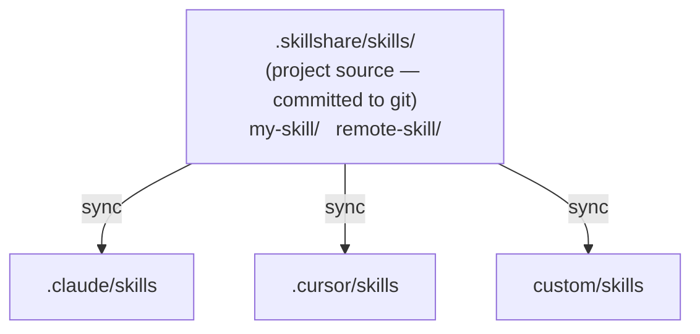

# Project Skills

Run skillshare at the project level — skills scoped to a single repository, shared via git.

:::tip When does this matter?
Use project skills when your team needs repo-specific AI instructions (coding standards, deployment guides, API conventions) that shouldn't be in your personal global skill collection.
:::

## Usage Scenarios

| Scenario | Example |
|----------|---------|
| **Monorepo onboarding** | New developer clones repo, runs `skillshare install -p && skillshare sync` — instant project context |
| **API conventions** | Embed API style guides as skills so every AI assistant follows team conventions |
| **Domain-specific context** | Finance app with regulatory rules, healthcare app with compliance guidelines |
| **Project tooling** | CI/CD deployment knowledge, testing patterns, migration scripts specific to this repo |
| **Onboarding acceleration** | "How does auth work here?" — the AI already knows, from committed project skills |
| **Open source projects** | Maintainers commit `.skillshare/` so contributors get project-specific AI context on clone |
| **Community skill curation** | A repo's `config.yaml` `skills:` section serves as a curated skill list — anyone can `install -p` to get the same setup |

---

## Overview



---

## Auto-Detection

skillshare automatically enters project mode when `.skillshare/config.yaml` exists in the current directory:

```bash
cd my-project/           # Has .skillshare/config.yaml
skillshare sync          # → Project mode (auto-detected)
skillshare status        # → Project mode (auto-detected)
```

:::tip Zero Config
Just `cd` into any project with `.skillshare/` — skillshare detects it automatically. No flags, no environment variables, no configuration needed.
:::

To force a specific mode:

```bash
skillshare sync -p       # Force project mode
skillshare sync -g       # Force global mode
```

---

## Global vs Project

| | Global Mode | Project Mode |
|---|---|---|
| **Source** | `~/.config/skillshare/skills/` | `.skillshare/skills/` (project root) |
| **Config** | `~/.config/skillshare/config.yaml` | `.skillshare/config.yaml` |
| **Targets** | System-wide AI CLI directories | Per-project directories |
| **Sync mode** | Merge, copy, or symlink (per-target) | Merge, copy, or symlink (per-target, default merge) |
| **Tracked repos** | Supported (`--track`) | Supported (`--track -p`) |
| **Git integration** | Optional (`push`/`pull`) | Skills committed directly to project repo |
| **Scope** | All projects on machine | Single repository |

---

## `.skillshare/` Directory Structure

```
<project-root>/
├── .skillshare/
│   ├── config.yaml              # Targets + settings (incl. extras)
│   ├── skills/.metadata.json     # Runtime metadata (hashes, timestamps — auto-managed, gitignored)
│   ├── .gitignore               # Ignores logs/, trash/, backups/, and cloned remote/tracked skill dirs
│   ├── extras/                  # Extras source directories
│   │   └── rules/               # e.g. extras init rules --target .claude/rules -p
│   │       └── coding.md
│   └── skills/
│       ├── my-local-skill/      # Created manually or via `skillshare new`
│       │   └── SKILL.md
│       ├── remote-skill/        # Installed via `skillshare install -p`
│       │   └── SKILL.md
│       ├── tools/               # Category folder (via --into tools)
│       │   └── pdf/             # Installed via `skillshare install ... --into tools -p`
│       │       └── SKILL.md
│       └── _team-skills/        # Installed via `skillshare install --track -p`
│           ├── .git/            # Git history preserved
│           ├── frontend/ui/
│           └── backend/api/
├── .claude/
│   └── skills/
│       ├── my-local-skill → ../../.skillshare/skills/my-local-skill
│       ├── remote-skill → ../../.skillshare/skills/remote-skill
│       ├── tools__pdf → ../../.skillshare/skills/tools/pdf
│       ├── _team-skills__frontend__ui → ../../.skillshare/skills/_team-skills/frontend/ui
│       └── _team-skills__backend__api → ../../.skillshare/skills/_team-skills/backend/api
└── .cursor/
    └── skills/
        └── (same symlink structure as .claude/skills/)
```

Symlinks in project mode use **relative paths** (e.g., `../../.skillshare/skills/...`). This makes the project directory portable — rename it, move it, or clone it on another machine and all symlinks continue to work. Global mode uses absolute paths since source and targets are in separate filesystem locations.

---

## Visible Project Directory

Repositories that treat skills as reviewable content rather than tool state can use a visible `skillshare/` directory instead of the hidden `.skillshare/`:

```bash
skillshare init -p --visible
```

```
<project-root>/
├── skillshare/
│   ├── config.yaml
│   ├── skills/
│   └── agents/
└── src/
```

Everything else is identical — `config.yaml`, `skills/`, `agents/`, `extras/`, and the operational `trash/`, `backups/` and `logs/` directories all live inside whichever project directory is in use.

Detection checks `.skillshare/config.yaml` first and `skillshare/config.yaml` second, so:

- Existing projects are unaffected.
- If both directories exist, `.skillshare/` wins.
- Moving an existing project is just `mv .skillshare skillshare` — there is no migration step.

`init -p` without `--visible` continues to create `.skillshare/`.

:::note
The global config directory is also called `skillshare` (`~/.config/skillshare/`). Only a `skillshare/` directory inside a project root is treated as a project.
:::

### Missing config

Project commands initialize a project automatically when there isn't one yet, and a [shared skills repo](/docs/how-to/recipes/centralized-skills-repo) using `--config local` regenerates its gitignored `config.yaml` the same way.

They stop short of one case: if the project directory already holds skills or agents but its `config.yaml` is missing, re-initializing would write an empty config and drop every configured target. Those commands report the problem instead, so you can restore `config.yaml` from version control or run `skillshare init -p` deliberately.

---

## Config Format

`.skillshare/config.yaml`:

```yaml
targets:
  - claude                    # Known target (uses default path)
  - cursor                         # Known target
  - name: custom-ide               # Custom target with explicit path
    path: ./tools/ide/skills
    mode: symlink                  # Optional: "merge" (default), "copy", or "symlink"
  - name: codex                    # Optional filters (merge mode)
    include: [codex-*]
    exclude: [codex-experimental-*]
```

**Targets** support two formats:
- **Short**: Just the target name (e.g., `claude`). Uses known default path, merge mode.
- **Long**: Object with `name`, optional `path`, optional `mode` (`merge`, `copy`, or `symlink`), and optional `include`/`exclude` filters. Supports relative paths (resolved from project root) and `~` expansion.

Remote skill dependencies are declared in `config.yaml` under `skills:`:

```yaml
targets:
  - claude
  - cursor

skills:
  - name: pdf
    source: anthropic/skills/pdf
  - name: _team-skills
    source: github.com/team/skills
    tracked: true
  - name: review
    source: github.com/team/skills/code-review
    group: frontend
```

**Skills** list declares remote installations only. Local skills don't need entries here.

- `tracked: true`: Installed with `--track` (git repo with `.git/` preserved). When someone runs `skillshare install -p`, tracked skills are cloned with full git history so `skillshare update` works correctly.
- `group`: Subdirectory path (corresponds to `--into` during install).

Runtime metadata (install timestamps, file hashes, commit SHAs) is stored separately in `.skillshare/skills/.metadata.json` — this file is auto-managed and gitignored.

:::tip Portable Skill Manifest
`config.yaml` is the declarative skill manifest. In a project, commit it to git and anyone can run `skillshare install -p && skillshare sync`. For global mode, `.metadata.json` serves as the manifest since global config doesn't need to be shared via git.
:::

---

## Custom Source Directories

By default, project mode reads skills, agents, and extras from `.skillshare/skills/`, `.skillshare/agents/`, and `.skillshare/extras/`. Override these paths with the optional `sources` map when you want to keep skill content alongside other project documentation:

```yaml
sources:
  skills: ./docs/skills
  agents: ./docs/agents
  extras: ./docs/extras
targets:
  - claude
```

Each key is optional — omitting a key falls back to the default `.skillshare/<type>/` path. Paths are resolved relative to the project root, and absolute paths (including `~`) work too.

**Common layouts:**

```yaml
# Co-locate skill content with existing project docs
sources:
  skills: ./docs/skills

# Keep agents in an AI-focused subdirectory
sources:
  agents: ./ai/agents
```

**Constraints:**

- **No alias with target paths.** `skillshare sync -p` rejects configs where a source resolves to the same directory as a target (or one contains the other). This prevents `sync --force` from wiping the configured source. For example, `sources.skills: .claude/skills` combined with a `claude` target is rejected with an `overlaps` error.
- **External paths skip gitignore management.** When a source resolves outside the project root (an absolute path elsewhere on disk), skillshare does not add entries to the project's `.gitignore`. Manage ignore rules in the source directory yourself if needed.
- **Operational dirs stay in the project directory.** Trash, backups, and operation logs always live under the active project directory (`.skillshare/`, or `skillshare/` — see below) regardless of `sources` settings.
- **`init -p` always seeds `{skills,agents}/` in the project directory.** Custom sources take effect only after you edit `config.yaml`.

---

## Mode Restrictions

Project mode has some intentional limitations:

| Feature | Supported? | Notes |
|---------|-----------|-------|
| Merge sync mode | ✓ | Default, per-skill symlinks |
| Copy sync mode | ✓ | Per-target via `skillshare target <name> --mode copy -p` |
| Symlink sync mode | ✓ | Per-target via `skillshare target <name> --mode symlink -p` |
| `--track` repos | ✓ | Cloned to `.skillshare/skills/_repo/`, added to `.gitignore` (`logs/`, `trash/`, and `backups/` are also ignored by default) |
| `--discover` | ✓ | Detect and add new targets to existing project config |
| `push` / `pull` | ✗ | Use git directly on the project repo |
| `collect` | ✓ | Collect local skills from project targets to `.skillshare/skills/` |
| `extras` | ✓ | Extras sync, init, list, remove, collect — all support `-p` |
| `backup` / `restore` | ✗ | Not needed (project targets are reproducible) |

---

## When to Use: Project vs Organization

| Need | Use |
|------|-----|
| Skills specific to **one repo** (API style, deployment, domain rules) | **Project skills** — committed to the repo |
| Skills shared across **all projects** (coding standards, security audit) | **Organization skills** — tracked repos via `--track` |
| **Onboarding** a new member to a specific project | **Project skills** — clone + install + sync |
| **Onboarding** a new member to the organization | **Organization skills** — one install command |
| Both repo context **and** org standards | **Use both** — they coexist independently |

---

## See Also

- [Project Setup](/docs/how-to/sharing/project-setup) — Step-by-step setup guide
- [Project Workflow](/docs/how-to/daily-tasks/project-workflow) — Day-to-day project mode usage
- [Organization-Wide Skills](/docs/how-to/sharing/organization-sharing) — Team-wide sharing
