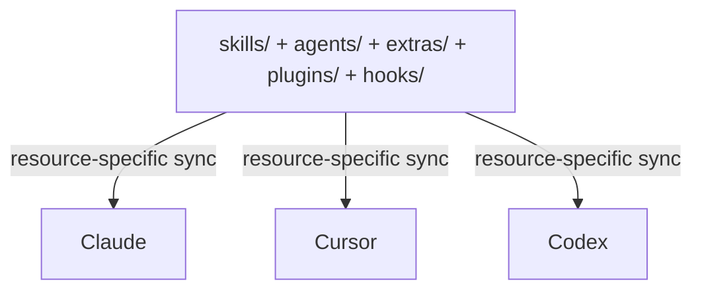

# Source & Targets

The core model behind skillshare: one source, many targets.

:::tip When does this matter?
Understanding source vs targets helps you know where to edit skills, agents, plugins, hooks, and extras, why `sync` is a separate step for some resource kinds, and how `collect` or import flows work in the reverse direction.
:::

## The Problem

Without skillshare, you manage skills separately for each AI CLI:

```
~/.claude/skills/         # Edit here
  └── my-skill/

~/.cursor/skills/         # Copy to here
  └── my-skill/           # Now out of sync!

~/.codex/skills/          # And here
  └── my-skill/           # Also out of sync!
```

**Pain points:**
- Edits in one place don't propagate
- Skills drift apart over time
- No single source of truth

---

## The Solution

skillshare introduces source-managed resource roots that sync to targets or target config:



**Benefits:**
- Edit in source → targets or target config can be regenerated consistently
- Skills and agents can reflect edits instantly through symlinks
- Single source of truth

---

## Why Sync is a Separate Step

Operations like `install`, `update`, `uninstall`, `plugins import`, and `hooks import` only modify the **source** side. A separate `sync` step propagates changes to targets or target config. This two-phase design is intentional:

**Preview before propagating** — Run `sync --dry-run` to review what will change across all targets before applying. Especially useful after `uninstall` or `--force` operations.

**Batch multiple changes** — Install 5 skills, then sync once. Without separation, each install would trigger a full scan and symlink update across all targets.

**Safe by default** — Source changes are staged, not immediately live. You stay in control of when targets update. Additionally, `uninstall` moves skills to a trash directory (kept 7 days) instead of permanently deleting them, so accidental removals are recoverable.

:::tip Exception: pull
`pull` automatically runs sync after `git pull`. Since its intent is "bring everything up to date from remote," auto-syncing matches the expected behavior.
:::

:::info When sync is NOT needed
Editing an existing skill or agent usually doesn't require sync because symlinks mean changes are instantly visible in linked targets. Plugins, hooks, and extras still require explicit sync because they render into managed roots or config files.
:::

---

## Source Directory

**Default location:** `~/.config/skillshare/skills/`

This is where:
- You create and edit skills
- Skills are installed to
- Git tracks changes (for cross-machine sync)

:::tip Symlinked source directories
The source directory can be a symlink — common when using dotfiles managers (GNU Stow, chezmoi, yadm). For example, `~/.config/skillshare/skills/ → ~/dotfiles/ss-skills/`. Skillshare resolves symlinks before scanning, so all commands work transparently. Chained symlinks are also supported.
:::

**Structure:**
```
~/.config/skillshare/skills/
├── my-skill/
│   └── SKILL.md
├── code-review/
│   └── SKILL.md
├── _team-skills/          # Tracked repo (underscore prefix)
│   ├── frontend/
│   │   └── ui/
│   └── backend/
│       └── api/
└── ...
```

### Organize with Folders (Auto-Flattening)

You can use folders to organize your own skills — they'll be auto-flattened when synced to targets:


**Benefits:**
- Organize skills by project, team, or category
- No manual flattening required
- AI CLIs get the flat structure they expect
- Folder names become prefixes for traceability

---

## Agents Source

Agents are a parallel resource kind to skills. They live in their own source directory next to `skills/` and follow the same source-and-targets model:

```
~/.config/skillshare/
├── skills/                    # Skills source (directories)
│   └── my-skill/
│       └── SKILL.md
└── agents/                    # Agents source (single .md files)
    ├── reviewer.md
    └── auditor.md
```

The same `skillshare init` run creates both directories. Agents are single `.md` files (no nested directories) and are synced via `skillshare sync` (or `skillshare sync agents` to scope to agents only).

**Targets that support agents.** Not every AI CLI exposes an agents directory. The targets that do are:

- `~/.claude/agents/` — Claude Code
- `~/.cursor/agents/` — Cursor
- `~/.augment/agents/` — Augment
- `~/.config/opencode/agents/` — OpenCode

Other targets are silently skipped during agent sync (with a `target(s) skipped for agents (no agents path)` warning). The same merge / copy / symlink modes that apply to skills also apply to agents.

See [Agents](/docs/understand/agents) for the full agent file format, `.agentignore` rules, and discovery semantics.

---

## Custom Source Directories

By default, global mode reads skills from `~/.config/skillshare/skills/`, agents from `~/.config/skillshare/agents/`, and derives the extras parent from the skills source. Since v0.19.16, the optional top-level `sources` map lets you override any of these:

```yaml
# ~/.config/skillshare/config.yaml
sources:
  skills: ~/work/skills
  agents: ~/work/agents
  extras: ~/work/extras
targets:
  claude:
    skills:
      path: ~/.claude/skills
```

Each key is optional — omit a key to keep its built-in default. Paths support `~` (home expansion) and absolute paths.

**Common layouts:**

```yaml
# Point all three at a shared dotfiles directory
sources:
  skills: ~/dotfiles/skillshare/skills
  agents: ~/dotfiles/skillshare/agents
  extras: ~/dotfiles/skillshare/extras

# Override only skills; agents and extras keep their defaults
sources:
  skills: ~/projects/team-skills
```

### Backward Compatibility

The pre-v0.19.16 top-level fields are still accepted and continue to work unchanged:

```yaml
# Legacy format — fully supported, no auto-migration on save
source: ~/.config/skillshare/skills
agents_source: ~/.config/skillshare/agents
extras_source: ~/.config/skillshare/extras
```

When both formats are present, the `sources.<key>` value wins over the corresponding legacy field. Existing configs are never auto-rewritten; only fresh `skillshare init` runs emit the new `sources:` shape.

### When This Matters

The same feature exists in project mode (see [Project Skills](/docs/understand/project-skills#custom-source-directories) for the project-mode form, which also supports relative paths from the project root).

---

## Plugin source

Plugins are their own source-managed subsystem:

```text
~/.config/skillshare/plugins/      # global
.skillshare/plugins/               # project
```

A plugin bundle is not synced like a skill directory. The flow is:

```text
source bundle
  -> target-specific staged bundle
  -> rendered marketplace root
  -> optional install/enable step
```

Target render roots:

- Claude:
  - Global: `~/.config/skillshare/rendered/claude-marketplace/`
  - Project: `.skillshare/rendered/claude-marketplace/`
- Codex:
  - Global: `~/.agents/plugins/`
  - Project: `.agents/plugins/`

Codex activation is still global because enablement writes `~/.codex/config.toml`, even when the plugin source itself is project-scoped.

---

## Hook source

Hooks are another separate subsystem:

```text
~/.config/skillshare/hooks/        # global
.skillshare/hooks/                 # project
```

The hook flow is:

```text
source bundle
  -> managed hook script root
  -> merge managed entries back into target config
```

Managed config files:

- Claude: `.claude/settings.json` or `~/.claude/settings.json`
- Codex: `.codex/hooks.json` or `~/.codex/hooks.json`
- Codex also enables `features.codex_hooks = true` in `~/.codex/config.toml`

This merge model preserves unmanaged hook entries that already exist in those config files.

For native resources, reporting stays target-aware:

- plugin reporting includes only targets the bundle can actually sync to, including generated manifests
- hook reporting includes only target sections defined in `hook.yaml`

---

## Targets

Targets are AI CLI skill directories that skillshare syncs to.

**Common targets:**
- `~/.claude/skills/` — Claude Code
- `~/.cursor/skills/` — Cursor
- `~/.codex/skills/` — OpenAI Codex CLI
- `~/.gemini/skills/` — Antigravity
- And [64+ more](/docs/reference/targets/supported-targets)

**Auto-detection:** When you run `skillshare init`, it automatically detects installed AI CLIs and adds them as targets.

**Manual addition:**
```bash
skillshare target add myapp ~/.myapp/skills
```

---

## How Sync Works

### Source → Targets (`sync`)

```bash
skillshare sync
```

Creates symlinks from each target to the source:
```
~/.claude/skills/my-skill → ~/.config/skillshare/skills/my-skill
```

### Target → Source (`collect`)

```bash
skillshare collect claude
```

Collects local skills from a target back to source:
1. Finds non-symlinked skills in target
2. Copies them to source (`.git/` directories are excluded automatically)
3. Replaces with symlinks

---

## Editing Skills

Because targets are symlinked to source, you can edit from anywhere:

**Edit in source:**
```bash
$EDITOR ~/.config/skillshare/skills/my-skill/SKILL.md
# Changes visible in all targets immediately
```

**Edit in target:**
```bash
$EDITOR ~/.claude/skills/my-skill/SKILL.md
# Changes go to source (same file via symlink)
```

---

## See Also

- [sync](/docs/reference/commands/sync) — Propagate changes from source to targets
- [collect](/docs/reference/commands/collect) — Pull skills from targets back to source
- [plugins](/docs/reference/commands/plugins) — Native plugin bundle flow
- [hooks](/docs/reference/commands/hooks) — Standalone hook bundle flow
- [Sync Modes](./sync-modes.md) — How files are linked (merge, copy, symlink)
- [Agents](./agents.md) — Agent resource model and discovery
- [Configuration](/docs/reference/targets/configuration) — Target config reference

:::note Current web UI scope
The web UI exposes skills, targets, extras, and related operations, but it does not yet have dedicated plugin or hook screens. Use the CLI or server API endpoints for plugin/hook workflows.
:::
