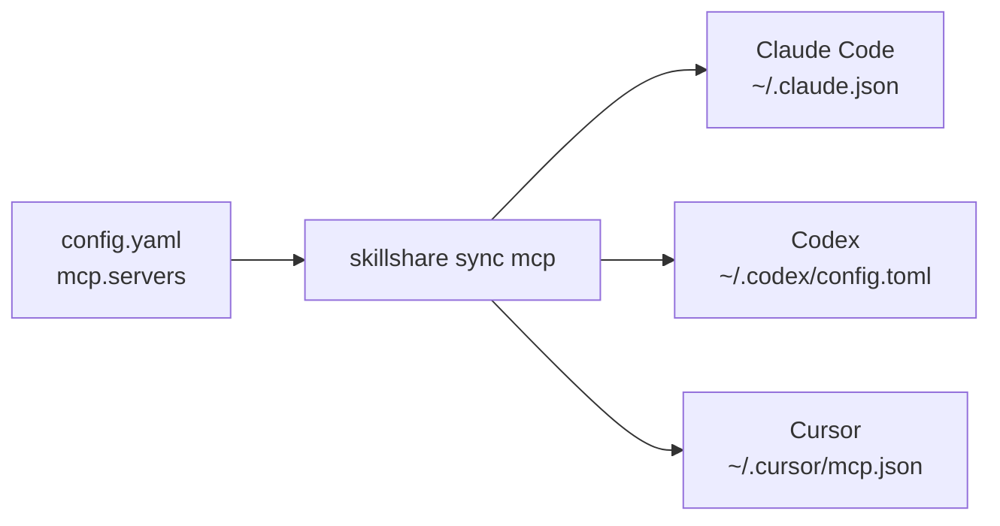

# Agent 向けに MCP を一度だけセットアップする

MCP は、Agent が別のプログラムやサービスが提供するツールを使えるようにします。skillshare
は接続設定を一度だけ保存し、対応する各 Agent のネイティブな設定を書き込みます。ゲートウェイを実行したり、
バックグラウンドサーバーを稼働させ続けたりすることはありません。

対応する MCP クライアントには Claude Code、Codex（CLI、IDE 拡張機能、ChatGPT デスクトップアプリは
1つの設定を共有します）、Cursor、VS Code、OpenCode、Kilo Code、Grok CLI、Antigravity (AGY)、
Amp、Claude Desktop、Cline、Copilot CLI、Factory、Gemini CLI、Goose、Junie、Kiro、LM Studio、
Warp、Windsurf、そして[内蔵 MCP](/docs/reference/commands/mcp#pi) を通じた Pi ≥ 0.99.0 が含まれます。
[送信先と認証の制限](/docs/reference/commands/mcp#native-destinations)を参照してください。ダッシュボードには、
現在の scope で利用可能なクライアントが表示されます。

例えば、Playwright を Amp、Gemini CLI、Kiro と共有するには:

```yaml
mcp:
  servers:
    playwright:
      command: npx
      args: ["-y", "@playwright/mcp@latest"]
      targets: [amp, gemini, kiro]
```

各クライアントの JSON や YAML の形式を覚える必要はありません。`skillshare sync mcp` を実行すると、
skillshare がその定義を変換します。コマンドを起動するのは受け取り側のクライアントなので、そのクライアントの
環境に Node.js/npx が利用可能である必要があります。

## ガイド付きセットアップから始める

ターミナルから接続を閲覧・管理するには `skillshare mcp` を実行します。`/` で絞り込み、
`e` で編集、`d` で削除、`r` でバックアップから復元できます。すべてのインタラクティブな変更は保存前に
プレビューされます。プレーンなステータス出力には `skillshare mcp --no-tui` を使ってください。

新規インストールの場合はまず skillshare を初期化してから、次を実行します。

```bash
skillshare mcp add
```

MCP プロバイダーから提供された URL または JSON を貼り付け、名前を付け、Agent を選択し、変更内容を
レビューします。**Save and sync** はすぐに設定を適用します。**Save only** は定義を保存し、後で
`skillshare sync mcp` を実行するために取っておきます。

ダッシュボードでは、**Add server** はどちらの形式にも対応しています。フィールドに入力するか、設定を
貼り付けるかです。貼り付け側はファイルの読み込みにも対応しており、これはブラウザ版の
`mcp import --file` に相当します。貼り付けられた JSON は自動的に認識されます。TOML の場合は、
Codex 由来か Grok 由来かを選択します。貼り付けた内容がサーバー 1 つだけで Pi にチェックが入っている場合は、
ダイアログにフォームの Pi 設定（ツールの公開方法、その他の Pi 設定）も表示されます。**Import from a target** は別の機能で、すでにインストールされて
いる Agent が持つサーバーを読み込みます。いずれの方法でも、ダッシュボードは CLI と同じ source、検証、
プレビュー、競合ルールを使用します。MCP ページの Sync ボックスにある **Sync MCP** は、MCP の設定ファイルだけを
書き込みます。Sync ページには、skills、agents、extras、MCP をまとめて Sync するための
**Sync all resources** もあります。

Pi のインポート元メニューには、Pi の `mcp.json` と、0.23.0 より前に `pi-mcp-adapter` で
設定したサーバー用の `mcp-adapter.json` が並び、それぞれそのファイルだけを読み込みます。
adapter のファイルは読み込むだけで、sync はインポートしたサーバーを Pi の `mcp.json` に書き込みます。
表示パスは現在のスコープ、`PI_CODING_AGENT_DIR`、アカウントのディレクトリに従います。プロジェクトではその `.pi/` を読み込みます。
個人用 server と認証情報はグローバルファイルに置き、プロジェクトファイルは信頼できる
プロジェクトでのみ使ってください。


Config エディタは保存時に YAML を整形し、スペース2つのインデントを使い、コメントを保持します。
フィールドをクリックすると、右パネルにその説明が表示されます。`mcp`、`sources.mcp`、接続フィールド、
環境変数の参照などが対象です。

Sync 後は、Agent を再読み込みしてください。その Agent 内でログインや承認が必要であれば完了させて
ください。skillshare は接続をテストしたり、サーバープログラムをインストールしたり、ログインセッションを
コピーしたりすることはありません。Sync が成功したということは、設定が書き込まれたことを意味するのみで、
ツール呼び出しが成功したことを意味するものではありません。

## 2種類の接続タイプを理解する

| プロバイダーが提供するもの | 接続 | 例 |
|---|---|---|
| コマンドと引数 | `stdio`: Agent がローカルプロセスを起動する | `command: npx` と `args` |
| MCP エンドポイント URL | Streamable HTTP: Agent が稼働中のサービスに接続する | `url: https://example.com/mcp` |

どちらの場合も、定義は 1 回だけ保存され、各 Agent 自身のファイルに書き込まれます:



通常、`transport` を設定する必要はありません。skillshare は `command` または `url` から推測します。
URL は自分のコンピューター上のサービスを指すことも、リモートサービスを指すこともできます。通常の
Web サイトの URL ではなく、プロバイダーの実際の MCP エンドポイントを使用してください。従来の SSE
設定は、暗黙に変換されるのではなく拒否されます。

## モデルに渡すツールを絞る

1 つのサーバーが多数のツールを提供することがあります。`tools` を一度設定すれば、一部だけを残したり、
一部を隠したりでき、skillshare はそれを各 Agent 独自の形式で書き込みます。

```bash
skillshare mcp edit github --tools-allow 'get_*,search_code' --tools-deny get_secret
skillshare sync mcp --dry-run
```

ダッシュボードでは、サーバーを開いて **ツール** セクションを使います。**ツールを読み込む** で
サーバーのツールが一覧表示されるので、モデルに渡さないツールのチェックを外します。Pi はポリシー全体を適用し、Codex と Copilot CLI は完全一致の
名前を適用します。その他の Agent は適用しません。プレビューと `skillshare mcp check` は、ポリシーの
一部を適用しない Agent をそれぞれ示します。[ツールポリシー](/docs/reference/commands/mcp#tool-policy)を
参照してください。

## すべてを1つのファイルにまとめる

これがデフォルトです。既存の skills と agents はディレクトリ Source のままで、MCP 接続は
`mcp.servers` 配下の構造化された設定になります。

```yaml
sources:
  skills: ~/.config/skillshare/skills
  agents: ~/.config/skillshare/agents

mcp:
  targets: [claude, codex, cursor, vscode]
  servers:
    company-docs:
      url: https://docs.example.com/mcp
```

`company-docs` は自分で選ぶ名前です。サーバーをインストールしたり検索したりするわけではありません。
例の URL は自分のプロバイダーのエンドポイントに置き換えてください。`mcp.targets` は skill の Target とは
独立して受け取り側クライアントを選択します。サーバーごとの任意の `targets` リストは、そのデフォルトを
上書きします。

## MCP を独立したファイルに分割する {#split-mcp-into-its-own-file}

別々に共有したりバージョン管理したりしたい場合は、外部の Source を使います。

```yaml title="config.yaml"
sources:
  skills: ~/.config/skillshare/skills
  agents: ~/.config/skillshare/agents
  mcp: ./mcp.yaml

mcp:
  targets: [claude, codex, cursor]
```

```yaml title="mcp.yaml"
servers:
  company-docs:
    url: https://docs.example.com/mcp
```

相対パスは `config.yaml` を含むディレクトリを基準に解決されます。`.skillshare/config.yaml` の場合、
`./mcp.yaml` は `.skillshare/mcp.yaml` を意味します。絶対パスと `~/` にも対応しています。
`push` / `pull` でこのファイルをマシン間で共有するには、`root` スコープの repository 内に置いてください。
[クロスマシン Sync — MCP サーバー](/docs/how-to/sharing/cross-machine-sync#mcp-servers) を参照してください。

**一度に使う Source は1つだけ**にしてください。`sources.mcp` と `mcp.servers` は共存できません
（`mcp.servers: {}` を含む）。切り替えるには、`servers` マッピングを外部ファイルに移し、`sources.mcp` を
追加し、インラインの `mcp.servers` を削除します。`mcp.targets` は `config.yaml` に残してください。
Sync 前にプレビューします。

```bash
skillshare sync mcp --dry-run
```

CLI とダッシュボードでの編集はどちらも、有効な Source に従います。外部ファイルが欠落している、または
無効な場合、同期は停止します。それは決して「すべてのサーバーを削除する」ことを意味しません。定義を
意図的に削除するには、明示的に `servers: {}` を使い、その後で管理対象の削除をプレビューしてください。

## ローカルプログラムと認証情報

```yaml
mcp:
  targets: [claude, codex]
  servers:
    internal-tools:
      command: company-mcp
      args: [--workspace, /path/to/workspace]
      env:
        COMPANY_TOKEN:
          fromEnv: COMPANY_TOKEN
    company-docs:
      url: https://docs.example.com/mcp
      bearerToken:
        fromEnv: DOCS_TOKEN
```

必要なローカルプログラムは自分でインストールしてください。Agent はそれを見つけられ、自身の環境で
参照されている環境変数を読み取れる必要があります。ターミナルだけで設定された変数は、デスクトップから
起動された Agent には届かない場合があります。

skillshare は変数の参照を書き込むだけで、それを解決することは決してありません。実際のトークンは
ソースファイル、URL、コマンド引数には含めないでください。既知の機密性の高い環境変数やヘッダーキーには
`fromEnv` が必須です。Import は、`DATABASE_URL` のような URL 値の中のパスワードを含め、認識可能な
リテラルの secret を参照に変換し、設定すべき変数を報告します。コマンド引数には移植可能な参照構文が
ないため、Import は引数が認証情報らしく見える場合に警告しますが、プレーンテキストのままにします。
Import は、URL パス内のトークンのような、すべての認証情報の形式を識別できるわけではありません。

Codex はローカル変数を名前で転送するため、Codex を選択する場合は `env.KEY.fromEnv` も `KEY` と
一致している必要があります。設定を表現できない Target は、それを黙って落とすのではなくプレビューを
ブロックします。クライアント固有のプレースホルダーと入力プロンプトは、Import の前に明示的に解決して
おく必要があります。Codex の `startup_timeout_sec` や `cwd` のような Agent 固有のフィールドは
Import されません。Import はそれらを警告として一覧表示し、Sync はその Agent の既存エントリ内にそれらを
維持します。

## 既存の接続をインポートする

```bash
skillshare mcp import                         # Agent とサーバーを選択する
skillshare mcp import docs --from claude --target claude --target codex --sync
```

一度に1つのサーバーをインポートします。Agent のエントリがすでにインポートされる定義と一致している
場合、それはその Agent のファイルを変更することなく管理対象になります。異なる場合（多くはリテラルの
トークンが環境変数の参照に変換されたことが原因）、CLI は動作しているエントリを書き換えるのではなく
停止します。報告された変数を設定してから `--replace` を付けて再実行するか、その Agent を `--target`
から外してください。ダッシュボードのプレビューには同じエントリが競合として表示されます。

Source にすでにその名前が存在する場合は、ダッシュボードの **Edit** アクションまたは CLI の
`--replace` を使ってください。Import 時、`--replace` はインポートされた Agent 自身のエントリも
書き換えます。**Save only** はそのエントリをファイルを変更せずにベースラインとして記録するため、
次の Sync でそれが書き換えられ、その間に行われた編集も引き続き検出されます。これは他の競合する
ネイティブエントリを上書きすることは決してありません。MCP ダッシュボードでは、対処できる競合に
**Import from cursor** のように Agent 名を冠したインポートアクションがあり、そのバージョンを採用するか、
**Replace with source** でそのエントリを上書きできます。まだ存在する別の Skillshare 設定が所有している
競合には、そのどちらも表示されません。そのエントリを解放できるのはその設定だけだからです。

Agent がすでに同じ名前で持っているサーバーを引き継ぐ方法も同じです。それを source に追加します。Agent のエントリが
すでに一致していれば、次のプレビューに **引き継ぎ** と表示され、sync はファイルを変更せずに管理対象として
記録します。インポート後にインポート元の Agent にチェックを入れた場合がこれにあたります。一致していなければ、
エントリは上書きされずに競合として表示されます。Import して Agent のバージョンを採用するか、source の定義で
置き換えてください。

MCP ダッシュボードは、Agent の設定ファイルにすでにあり、Skillshare が管理していないサーバーも探します。
見つかった場合は、サーバー一覧の上にその件数とどの Agent にあるかが表示され、**Import** でそのうち最初の
Agent のインポートが開きます。プロジェクトの **MCP** タブも、そのプロジェクトのファイルについて同じことを行い、
そのプロジェクトにインポートします。[Skillshare が管理していないサーバー](/docs/reference/commands/mcp#unmanaged-servers)
を参照してください。

## 1つのプロジェクトだけで global サーバーをオフにする

Agent の global config 内のサーバーは、すべてのプロジェクトで読み込まれます。1つのプロジェクトだけで
それをオフにするには、そのプロジェクト内で、Agent の global config でそのサーバーが持つ名前を使って
次を実行します。

```bash
skillshare mcp add company-docs --disabled --target opencode
skillshare sync mcp
```

ダッシュボードでは、`skillshare ui` でプロジェクトフォルダから開き、**サーバーを追加** の
横にある **グローバルサーバーをオフにする** ボタンを選びます。

これは Claude Code、OpenCode、Kilo Code、Pi 1.0.1 以降で動作します。他の Agent は拒否されます。各 Agent に対して
何が書き込まれるか、また他の Agent が対応していない理由については
[コマンドリファレンス](/docs/reference/commands/mcp#turn-off-a-global-server-in-one-project)
を参照してください。


## 削除と復元

```bash
skillshare mcp remove company-docs
skillshare sync mcp --dry-run
skillshare sync mcp
```

この設定によって以前に管理されていた、変更されていないエントリのみが削除されます。管理対象外の
エントリや、他のプログラムによって編集されたエントリは保護されます。プロジェクトが移動された場合などで、
skillshare がそれを管理する前からすでに Source と一致していた Agent のエントリも保持されます。
skillshare にそれを削除させたい場合は、先にそれを Import してください。

ダッシュボードでは、サーバー行の削除アクションを使います。ダイアログには変更される各 Agent ファイルが
一覧表示されます。**Remove from source only** は Sync せずに `mcp remove` と同等の動作をします。
**Remove and sync** は Agent ファイルもクリーンアップし、競合がある間は無効化されます。

サーバーの管理をやめて Agent には残しておくには、`--keep-files` を付けて削除するか、ダッシュボードの
削除ダイアログで **Stop managing** を選びます。

```bash
skillshare mcp remove company-docs --keep-files
```

Agent ファイルは変更されず、以降の Sync もそれらのエントリには触れません。
[サーバーの管理をやめる](/docs/reference/commands/mcp#stop-managing-a-server)を参照してください。

ネイティブファイルへの変更のたびに、影響を受ける MCP エントリのプライベートなバックアップが作成されます。
skillshare は各 Agent ファイルについて最新20件のバックアップを保持します。出力にはその ID が含まれます。

```bash
skillshare mcp restore BACKUP_ID --dry-run
skillshare mcp restore BACKUP_ID
```

ダッシュボードでは、**Backups & restore** が日付ごとにバックアップを一覧表示します。バックアップを
プレビューして復元されるエントリを確認し、**Restore this file** を選択します。

Restore は無関係な設定を保持し、影響を受けるエントリへのより新しい変更を上書きすることを拒否します。
これは Source ファイルを元に戻すものではありません。復元を次の Sync でも維持したい場合は、Source も
編集してください。バックアップには古いネイティブの認証情報が含まれる場合があるため、ローカルの
state ディレクトリは非公開に保ってください。

書き込みはファイルごとにアトミックです。複数ファイルの途中で失敗した場合、完了したファイルは適用された
ままとなり、それらのバックアップ ID が報告されます。報告された原因を修正して再試行してください。
`sync mcp` やダッシュボードの Sync のような次の MCP 書き込みが、中断された書き込みの復旧を完了させ、
プレビューにはすでにその結果が表示されます。その間に Agent ファイルが再度編集されていた場合、
一致しなくなったエントリは競合として報告されます。
競合を「解決」するために所有権の状態を削除しないでください。既存のエントリが管理対象外になり、
再度明示的な Import が必要になります。所有していた設定がすでに削除されているエントリには、それは
必要ありません。競合がそれを残存エントリとして報告するため、その競合から Import または Replace を
行えば引き継げます。

対応するパス、フラグ、現時点での制限については [MCP コマンドリファレンス](/docs/reference/commands/mcp)
を参照してください。
