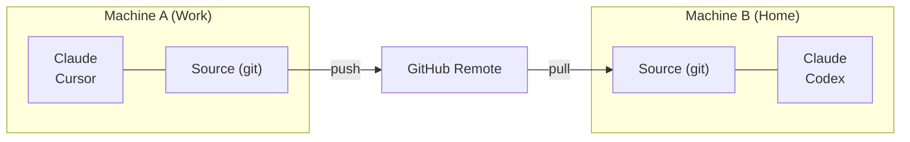

# クロスマシン Sync

git を使って複数のコンピューター間で Skill を Sync します。

## 概要



---

## 最初のマシンのセットアップ

### インタラクティブ（ガイド付きプロンプト）

```bash
skillshare init --remote git@github.com:you/my-skills.git
```

### 非インタラクティブ（プロンプトなし）

```bash
# remote にすでに Skill がある場合（または新規に Source を始める場合）
skillshare init --remote git@github.com:you/my-skills.git --no-copy --all-targets --no-skill

# 既存の Claude の Skill がある最初のマシン: init 時にインポートする
skillshare init --remote git@github.com:you/my-skills.git --copy-from claude --all-targets --no-skill
```

これは:
1. Source ディレクトリを作成する
2. 初回コミットで git を初期化する
3. remote を追加する
4. Target を自動検出して設定する

任意（セットアップ後に追加の AI CLI をインストールした場合のみ）:

```bash
skillshare init --discover
```

その後、Skill をプッシュします。
```bash
skillshare push
```

:::tip すでに初期化済みですか？
既存のセットアップに remote を追加します。
```bash
skillshare init --remote git@github.com:you/my-skills.git
```
これは初期セットアップ後でも動作します — remote を追加するだけです。
:::

---

## 2台目のマシンのセットアップ {#second-machine-setup}

`skillshare init` を実行し、**Connect my existing skillshare repo** を選んでリポジトリの URL を貼り付けます:

<p>
  
</p>

URL を直接渡すこともできます:

```bash
skillshare init --remote git@github.com:you/my-skills.git
```

Init は何も書き込まずに先にリポジトリを確認し、その後 pull します。手動での `git clone` は不要です。

:::info 裏側で何が起きているか
1. リポジトリを一時フォルダに clone して Skill 数を数え、構成を判断する: `--git-root root` で push したフォルダ全体か、`skills/` フォルダ内の Skill か
2. このマシンにあるリポジトリと同名の Skill はリポジトリ版を使う。このマシンにしかない Skill は残し、次の `skillshare push` でリポジトリに追加される
3. 確認後: source を作成し、git を初期化し、remote を追加し、remote ブランチにリセットしてトラッキングを設定する
4. 検出されたローカルの Target を設定し、初回 sync を提案する
:::

手動で制御したい場合:

```bash
# 直接 clone してから、既存の Source で init する
git clone git@github.com:you/my-skills.git ~/.config/skillshare/skills
skillshare init --source ~/.config/skillshare/skills
skillshare sync
```

---

## 日々のワークフロー

### マシン A: 変更してプッシュする

```bash
# Skill を編集する（シンボリックリンク経由で変更はすぐに反映される）
$EDITOR ~/.config/skillshare/skills/my-skill/SKILL.md

# 任意: プッシュせずにローカルのチェックポイントを作成する
skillshare commit -m "Update my-skill"

# 共有の準備ができたら remote にプッシュする
skillshare push -m "Update my-skill"
```

### マシン B: pull して sync する

```bash
skillshare pull
```

これだけです。`pull` は pull の後で自動的に `sync` を実行します。同期されるのは [git root scope](/docs/reference/targets/configuration#git-root) に含まれるものです。デフォルトでは skills、agents / extras スコープではそのリソース、`git_root: root` では 3 つすべてを同期します。Plugins、MCP サーバー、hooks には以下の追加手順が必要です。

### 1つのコマンドで双方向に

複数のマシンで Skill を編集する場合は、`push` と `pull` の代わりに次のコマンドを実行します:

```bash
skillshare push --pull -m "Update my-skill"
```

変更をコミットし、他のマシンがプッシュした内容をマージしてからプッシュし、target を sync します。競合が発生した場合は、何もプッシュされる前に停止します。[Push と Pull を同時に行う](/docs/reference/commands/push#push-and-pull-together) を参照してください。

---

## Plugins、MCP、Hooks {#plugins-mcp-hooks}

`push` と `pull` がバージョン管理するのは git root ディレクトリ内のファイルです。Plugins、hooks、MCP サーバーは `config.yaml` 内の設定であり、`config.yaml` がこの repository に含まれることはありません。デフォルトの `skills` scope では repo の外に置かれ、`root` scope では ignore されます。各マシンは独自の `config.yaml` を持ち、targets とパスもマシンごとに異なります。

| リソース | 保存先 | `push` / `pull` で移動するか |
|---|---|---|
| Skills | Skills source | はい |
| Agents | Agents source | `git_root: agents` または `root` の場合 |
| Extras | Extras source | `git_root: extras` または `root` の場合 |
| MCP サーバー | `config.yaml`、または `sources.mcp` で指定したファイル | そのファイルが repository 内にある場合のみ |
| Plugins | `config.yaml` の `plugins:` | いいえ |
| Hooks | `config.yaml` の `hooks:` | いいえ |

別のマシンで pull した後、残りは自分で適用します：

```bash
skillshare pull
skillshare sync --all              # agents、extras、MCP、hooks も同期
skillshare sync plugins --no-tui   # plugins は --all に含まれない
```

### MCP サーバー {#mcp-servers}

サーバー定義は repository 内の別ファイルに置きます。`git_root: root` では、repository は `config.yaml` があるディレクトリ（`~/.config/skillshare`、Windows では `%AppData%\skillshare`）なので、相対パスの `sources.mcp` は commit され、`config.yaml` はローカルに残ります：

```yaml title="config.yaml（各マシンで設定）"
sources:
  mcp: ./mcp.yaml

mcp:
  targets: [claude, codex]
```

`mcp.targets` は `config.yaml` に残るので、受け取るクライアントはマシンごとに選べます。`sources.mcp` はすべてのマシンで設定してください。既存のサーバーを `config.yaml` から移すには [MCP を独立したファイルに分割する](/docs/how-to/daily-tasks/sharing-mcp#split-mcp-into-its-own-file) を、既存の環境を `root` scope に切り替えるには [`git_root`](/docs/reference/targets/configuration#git-root) を参照してください。

Skillshare は認証情報を `fromEnv` 参照として保存し、値そのものは保存しません。各マシンで、Agent が読める場所にそれらの環境変数を設定してください。

### Plugins {#plugins}

Plugin の定義は git では移動しません。各マシンで同じソースから追加し直します：

1. 最初のマシンの dashboard で **Plugins → Share** を開き、コマンドをコピーします。HTTPS Git ソースから追加した plugins が一覧され、例えば次のようになります：

   ```bash
   skillshare plugin add https://github.com/acme/plugins --plugin review -g --no-tui
   ```

2. 別のマシンでそれを実行し、Plugins ページで Agents にチェックを入れてから `skillshare sync plugins` を実行します。

複数のマシンで使う plugin は、**Import installed** ではなく **Add plugin** でソースから追加してください。Import が記録するのは native のインストールだけです。別のマシンでは、Claude と Codex は同名の native marketplace から再インストールし、その marketplace が登録されていなければ plugin はスキップされます。Cursor と Antigravity は imported plugin を再インストールできません。ローカルディレクトリから追加した plugin は、パスが最初のマシンにしか存在しないため **Share** に表示されません。

`sync plugins` は不足している plugins をインストールし、インストール済みのものはそのままにします。更新するには `skillshare plugin check` を実行してから `skillshare plugin update` を実行します。[ツール間で plugins を管理する](/docs/how-to/daily-tasks/sharing-plugins#updates-and-recovery) を参照してください。

### Hooks {#hooks}

Hooks には別ファイルがありません。`config.yaml` の `hooks:` セクションを別のマシンにコピーし、`skillshare sync hooks` を実行します。

### 各マシンに残るもの {#per-machine}

- plugin をインストールする native CLI（`claude`、`codex` など）は、Skillshare を実行する環境にインストールされ、`PATH` 上にある必要があります。スケジュールされたジョブの `PATH` は、ターミナルより短いことがよくあります。Codex は Codex デスクトップ app と Homebrew のフォルダーからも探されます。別の場所にあるマシンでは [`SKILLSHARE_CODEX_CLI`](/docs/reference/appendix/environment-variables#skillshare_codex_cli) を設定してください。
- サインイン、OAuth トークン、native の信頼確認、有効/無効の状態は各 Agent に残ります。
- MCP サーバーが参照する環境変数の値。

---

## コマンド

### Commit

プッシュせずにローカルのチェックポイントを作成します。

```bash
skillshare commit                  # デフォルトのメッセージ
skillshare commit -m "Add pdf"     # カスタムメッセージ
skillshare commit --dry-run        # プレビュー
```

**何が起きるか:**
```
git add -A
git commit -m "Add pdf"
```

`commit` は remote を必要とせず、プッシュすることも決してありません。

### Push

ローカルの変更をコミットしてプッシュします。

```bash
skillshare push                  # 自動生成されたメッセージ
skillshare push -m "Add pdf"     # カスタムメッセージ
```

**何が起きるか:**
```
git add -A
git commit -m "Add pdf"
git push          # 初回のプッシュでは自動的に upstream を設定する
```

### Pull

remote の変更を pull して sync します。

```bash
skillshare pull
```

**何が起きるか:**
```
git pull           # 両方のマシンでコミットした場合はマージ。初回 pull では fetch + マージまたは reset
skillshare sync
```

---

## 競合の処理

### Pull が失敗する（ローカルに未コミットの変更がある）

ローカルの変更を保持したいがまだプッシュする準備ができていない場合は、先にローカルでコミットします。

```bash
skillshare commit -m "Save local changes"
skillshare pull
```

### Push が失敗する（remote が先に進んでいる）

```
$ skillshare push
Push failed
  Remote may have newer changes
  Run: skillshare pull
  Then: skillshare push
```

**解決策:**
```bash
skillshare pull
skillshare push
```

### ローカルに未コミットの変更があるために Pull が失敗し続ける

```
$ skillshare pull
Local changes detected
  Run: skillshare push
  Or:  cd ~/.config/skillshare/skills && git stash
```

**解決策:**
```bash
# オプション 1: 先にローカルでコミットする
skillshare commit -m "Local changes"
skillshare pull

# オプション 2: 先に自分の変更をプッシュする
skillshare push -m "Local changes"
skillshare pull

# オプション 3: 変更を一時的に stash する
cd ~/.config/skillshare/skills
git stash
skillshare pull
git stash pop
```

### マージの競合

両方のマシンでコミットした場合、`pull` はそれらをマージします。`.metadata.json` の競合は自動で解決されます。それ以外のファイルで競合が起きると、`pull` は停止してマージを取り消し、該当ファイルを表示します:

```
$ skillshare pull
pull stopped: this machine and the remote both changed my-skill/SKILL.md; the merge was undone, resolve it with git in ~/.config/skillshare/skills
```

**解決方法:**
```bash
cd ~/.config/skillshare/skills
git pull --no-rebase          # マージをやり直し、競合を残す
# 競合したファイルを編集する
git add .
git commit --no-edit
skillshare push
skillshare sync
```

---

## ステータスを確認する

```bash
skillshare status
```

表示内容:
- Git のステータス（clean、ahead、behind）
- remote の設定
- Sync のステータス

---

## プライベートリポジトリ

プライベートリポジトリには SSH URL を使います。

```bash
skillshare init --remote git@github.com:you/private-skills.git
```

---

## ヒント

### SSH キーを使う

パスワードプロンプトを避けるために SSH キーをセットアップします。
```bash
ssh-keygen -t ed25519 -C "your@email.com"
# 公開鍵を GitHub に追加する
```

### dotfiles 用のポータブルなパス

`config.yaml` を dotfiles 経由で共有する場合、`preserve_tilde_on_save` を有効にして、パスを
`/home/alice/...` ではなく `~/...` のまま保持します。

```yaml
preserve_tilde_on_save: true
```

これにより、異なるユーザー名や OS 固有のホームプレフィックスを持つマシン間で同じ config を使ったときの
ノイズの多い diff を防げます。[Configuration — preserve_tilde_on_save](/docs/reference/targets/configuration#preserve_tilde_on_save)
を参照してください。

### 複数の remote

バックアップ用の remote を追加します。
```bash
cd ~/.config/skillshare/skills
git remote add backup git@gitlab.com:you/skills-backup.git
git push backup main
```

### シェル起動時に Sync する

`~/.bashrc` または `~/.zshrc` に追加します。
```bash
# ターミナルを開いたときに skillshare を Sync する（remote が設定されている場合）
skillshare pull 2>/dev/null
```

---

## 代替案: Config からインストールする {#alternative-install-from-config}

git remote をセットアップしたくない場合、`config.yaml` は持ち運び可能な Skill マニフェストとしても
機能します。`install` / `uninstall` のたびに `skills:` セクションが自動更新され、
`skillshare install`（引数なし）はリストされているすべてを再インストールします。

```bash
# マシン A — config.yaml にインストールしたものが記録される
skillshare install anthropics/skills -s pdf
# config.yaml には次が含まれる: skills: [{name: pdf, source: "..."}]

# マシン B — config.yaml をコピーしてから:
skillshare install      # リストされたすべての Skill をインストールする
skillshare sync
```

### どちらを使うべきか

| | `push` / `pull` | `install`（引数なし） |
|---|---|---|
| Sync されるもの | 実際の Skill ファイル（完全な内容） | Source の URL のみ — インストール時に再ダウンロード |
| ローカル/手書きの Skill | 含まれる | 含まれない（Source URL がない） |
| 必要なセットアップ | Source ディレクトリの Git remote | `config.yaml` のみ |
| Project mode | Global のみ | `-p`（`.skillshare/config.yaml`）で動作する |
| メンテナンス | 変更後に手動で `push` | install/uninstall 時に自動調整される |

**推奨**: 個人のクロスマシン Sync には `push`/`pull` を使ってください。チームのオンボーディングや
プロジェクトセットアップには config からの `install` を使ってください。

---

## 関連項目

- [push](/docs/reference/commands/push) — remote へのプッシュ
- [pull](/docs/reference/commands/pull) — remote からの Pull
- [install](/docs/reference/commands/install#install-from-config-no-arguments) — config からのインストール
- [組織全体の Skill](./organization-sharing.md) — チーム共有
- [init](/docs/reference/commands/init) — `--remote` での Init
