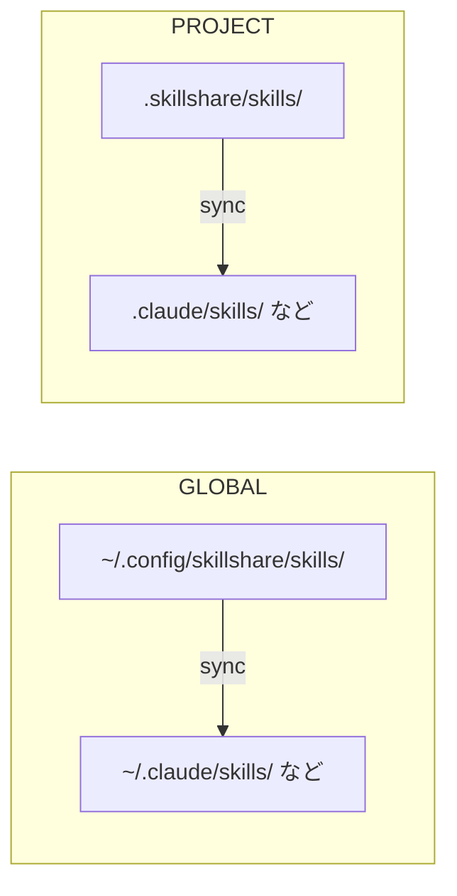

# はじめに

**あなたの AI コーディング環境を、どこでも。**

skillshare は Skill、Agent、Rule、MCP 接続、Hook を一か所で管理します。[デスクトップアプリ](/docs/getting-started/desktop-app)または CLI で、AI ツール、マシン、プロジェクトを切り替えても自分の設定を持ち運べます。

## なぜ skillshare なのか

- **ツールを変えても、設定はそのまま** — 自分で管理する Source を維持し、対応する各ツールに渡すリソースを選べます。
- **設定を別のマシンへ** — Source を Git でバージョン管理し、別のマシンに持ち運べます。
- **プロジェクトの文脈を共有** — チームの Skill と設定をコードと一緒に管理し、リモート Skill のコミットを lockfile に記録します。

たとえば、あるメンバーは Claude Code、別のメンバーは Codex を使っていて、どちらにも旧 API に関する同じコードレビューチェックリストが必要だとします。チェックリストを `.skillshare/skills/` に置き、プロジェクト設定をコミットします。新しいメンバーは、チャットから指示を探してコピーする代わりに、宣言されたリモート Skill をインストールして設定済みの Target に同期します。

詳しい手順は[チームオンボーディングのレシピ](/docs/how-to/recipes/team-onboarding-recipe)を参照してください。共通の指示は設定のずれを減らしますが、各 AI ツールの機能、権限、動作はそれぞれ異なります。

## クイックスタート

```bash
# Install
curl -fsSL https://raw.githubusercontent.com/runkids/skillshare/main/install.sh | sh
```

インストーラーが PATH 設定の案内を表示した場合のみ、その案内に従ってから以下のコマンドを実行してください。PATH の警告がなければ追加の設定は不要です。

```bash

# 初期化（CLI を自動検出し、git をセットアップ）
skillshare init

# Skill をインストール
skillshare install anthropics/skills/skills/pdf

# すべての Target に同期
skillshare sync
```

設定済みの Target で Skill を利用できるようになりました。

:::tip[インストールせずに試す]
まず触ってみたいですか？ [Docker Playground](/docs/how-to/advanced/docker-sandbox#playground) ならコマンド 1 つ、ローカルへのインストールは不要です:

```bash
git clone https://github.com/runkids/skillshare.git && cd skillshare
make playground
```
:::

## 仕組み



Source にある既存の Skill を編集すると、リンクされた Target に変更がすぐ反映されます。copy mode では `sync` でコピーを更新してください。デフォルトの merge mode でも、Skill の追加、削除、名前変更には `sync` が必要です。

Global mode は個人の設定とインストール済みのチームリポジトリを管理します。Project mode は特定のコードベースのリソースと設定を管理します。Git pull でプロジェクトのファイルを取得した後、`skillshare install -p` と `skillshare sync -p` を実行して宣言された Skill をローカルに適用します。

## 主な機能

- **自動検出** — `.skillshare/` があるプロジェクトに `cd` すると、skillshare は自動的に Project mode へ切り替わります
- **Global と Project のスコープ** — Global mode で個人と組織の共有リソースを、Project mode でコードベース固有のリソースを管理
- **リンクによる更新** — 既存の Skill の編集は symlink を使う Target にすぐ反映
- **チーム対応** — 組織 Skill は Tracked repo 経由、プロジェクト Skill は git commit 経由で共有
- **あらゆる Git ホスト** — GitHub、GitLab、Bitbucket、Azure DevOps、AtomGit、Gitee、セルフホストの Git からインストール・更新・チェックが可能
- **セキュリティ監査** — 使用前に既知のインジェクションやデータ流出パターンをスキャン。Audit は静的解析であり、実行権限は AI ツールが管理

## 対応プラットフォーム

| プラットフォーム | Source のパス | リンク種別 |
|----------|-------------|-----------|
| macOS/Linux | `~/.config/skillshare/skills/` | Symlink |
| Windows | `%AppData%\skillshare\skills\` | フォルダーは NTFS Junction、単一ファイルはシンボリックリンク（Developer Mode が必要、ない場合はコピー） |

## 次のステップ

### 個人開発者

1. [First Sync](/docs/getting-started/first-sync) — 5 分で同期を完了する
2. [Creating Skills](/docs/how-to/daily-tasks/creating-skills) — 最初の Skill を書く
3. [Cross-Machine Sync](/docs/how-to/sharing/cross-machine-sync) — 複数マシン間で Skill を同期し続ける

### チームリード / 組織

1. [Organization-Wide Skills](/docs/how-to/sharing/organization-sharing) — チーム全体で標準を共有する
2. [Project Setup](/docs/how-to/sharing/project-setup) — プロジェクト単位の Skill を設定する
3. [Security Audit](/docs/reference/commands/audit) — 導入前にサードパーティ製 Skill をスキャンする

### すでに Skill をお持ちですか？

- [From Existing Skills](/docs/getting-started/from-existing-skills) — 移行と統合

### さらに詳しく

- [Core Concepts](/docs/understand) — Source、Target、Sync モード
- [Commands Reference](/docs/reference/commands) — 利用可能なすべてのコマンド
- [Docker Sandbox](/docs/how-to/advanced/docker-sandbox) — 隔離環境で skillshare を試す
- [FAQ](/docs/troubleshooting/faq) — よくある質問
