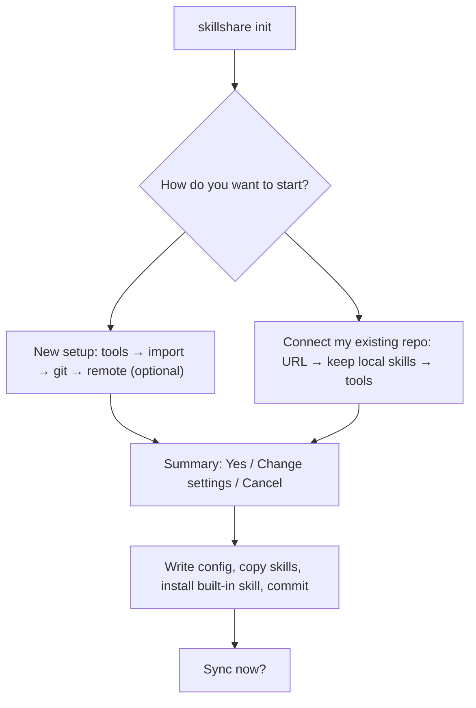
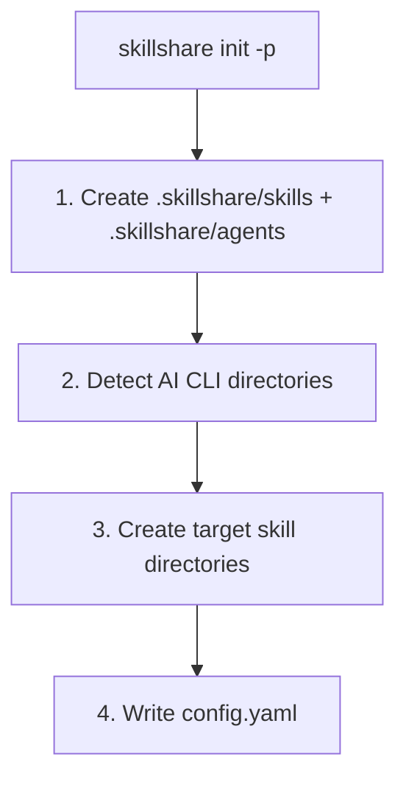

# init

初回セットアップ。インストール済みの AI CLI を検出し、すでにある Skill を取り込んで同期します。

```bash
skillshare init              # インタラクティブセットアップ
skillshare init --dry-run    # 変更を加えずにプレビュー
```

## 使うタイミング

- マシンで初めて skillshare をセットアップするとき
- 新しいコンピュータへの移行時（既存リポジトリに接続する `--remote` 付き）
- project に skillshare を追加するとき（`--project` 付き）
- 新しくインストールされた AI CLI を発見するとき（`--discover` 付き）

## 実行される処理

`init` は先に質問し、書き込みは最後に行います。サマリーを確認するまで何も作成されません。どの質問でも <kbd>Esc</kbd> を押すと、何も書き込まずにキャンセルします。



各質問にはデフォルトがあり、すべて <kbd>Enter</kbd> で進めるだけで使えるセットアップになります：

| 質問 | デフォルト |
|------|------------|
| Targets | 検出されたすべての AI CLI |
| Import | それらのツールにある既存の Skill すべて |
| Git | オン。Skill のみをバージョン管理。remote を設定した場合は skills、agents、extras。Plugins、MCP servers、hooks は各マシンの `config.yaml` に残ります |
| 組み込み Skill | インストール |
| Sync | はい |

サマリーの **Change settings** で、source パス、sync mode、git でバージョン管理する範囲を変更できます。

**Connect my existing repo** は 2 台目のマシン向けです。何も書き込まずに先にリポジトリを確認し、構成を判断します。`--git-root root` で push したリポジトリは skillshare フォルダ全体になり、Skill が `skills/` フォルダにあるリポジトリはそのフォルダを source にします。このマシンとリポジトリの両方にある同名の Skill はリポジトリ版を使います。このマシンにしかない Skill は残すかどうかを尋ね、次の `skillshare push` でリポジトリに追加されます。

初回の sync では、source とバイト単位で同一のツール側 Skill フォルダはリンクに置き換えられます。内容が異なるフォルダは残して一覧表示します。`skillshare sync --force` で置き換えられます。

### ターミナルがない場合

stdin または stdout がターミナルでない場合（CI、スクリプト、AI エージェント）、`init` は何も尋ねず上記のデフォルトを使います。決定ごとに 1 行ずつ、変更に使う flag と一緒に表示します：

```text
✓ Source   ~/.config/skillshare/skills (--source, --subdir)
✓ Targets  claude, cursor, universal (--targets, --no-targets)
✓ Import   all 2 (--copy-from, --no-copy)
✓ Git      skills only (--no-git, --git-root)
✓ Remote   none (--remote <url>)
✓ Skill    install skillshare (--skill, --no-skill)
✓ Sync     merge (--mode)
```

`--remote` を指定すると、Skill があるリポジトリは pull され、同名の Skill はリポジトリ版を使い、その名前を表示します。ターミナルがないときの出力には色やエスケープコードが含まれません。

`init` は Skill の source ディレクトリと、それに並ぶ `agents/` ディレクトリを一度に作成するため、両方のリソース種別がすぐに使える状態になります。agents ディレクトリはサイレントに作成されます — 追加のプロンプトやフラグはありません。agent ファイルの形式については [Agents](/docs/understand/agents) を参照してください。

:::info universal Target
いずれかの AI CLI が検出されると、`init` は自動的に **universal** Target（`~/.agents/skills`）を推奨します。これは、互換性のあるすべての agent に一括で Skill を提供するために [vercel-labs/skills](https://github.com/vercel-labs/skills)（`npx skills list`）が使用する共有ディレクトリです。
:::

:::tip agents source path
agents source のデフォルトは `<source parent>/agents`（デフォルトインストールの場合は `~/.config/skillshare/agents/`）です。`config.yaml` で `agents_source:` を設定すると場所を上書きできます。project mode では常に project ディレクトリ内の `agents/` を使用し、`agents_source` は無視されます。Agent 対応の Target（Claude、Cursor、Augment、OpenCode）は `skillshare sync` を実行すると自動的に agent を取り込みます。
:::

## Project Mode

`-p` を使って project レベルの Skill を初期化します。

```bash
skillshare init -p                              # インタラクティブ（ターミナルがない場合: 検出されたすべてのツール）
skillshare init -p --targets claude,cursor  # ツールを指定
skillshare init -p --visible                    # 可視の skillshare/ ディレクトリを使用
```

### 実行される処理



init 後は、project ディレクトリ（`skills/` と `agents/` の両方）を git にコミットしてください。`--visible` を使うと `.skillshare/` の代わりに `skillshare/` を作成します。完全なガイドは [Project Setup](/docs/how-to/sharing/project-setup) を参照してください。

## Discover モード

既存のセットアップに対して init を再実行し、新しい AI CLI Target を検出して追加します。

### グローバル

```bash
skillshare init --discover              # インタラクティブ選択
skillshare init --discover --select codex,opencode  # 非インタラクティブ
```

config にまだない新しくインストールされた AI CLI をスキャンし、追加するものを尋ねます（すべて選択済み）。ターミナルがない場合は新しいツールをすべて追加します。CLI が検出されると、`universal` Target（`~/.agents/skills`）が自動的に推奨されます。

### プロジェクト

```bash
skillshare init -p --discover           # インタラクティブ選択
skillshare init -p --discover --select antigravity  # 非インタラクティブ
```

project ディレクトリをスキャンして新しい AI CLI ディレクトリ（例: `.agents/`）を検出し、Target として追加します。 ターミナルがない場合は、見つかった新しいツールをすべて追加します。

### Discover + Mode の動作

`--discover` と `--mode` を組み合わせると、mode はこの discover 実行で追加された Target にのみ適用されます。
config 内の既存 Target は変更されません。

```bash
# cursor を mode=copy で追加、既存の Target は変更しない
skillshare init --discover --select cursor --mode copy

# project mode の場合（同じルール）
skillshare init -p --discover --select cursor --mode copy
```

:::tip
すでに初期化済みのセットアップに対して `--discover` なしで `skillshare init` を実行すると、エラーメッセージがそれを使うようヒントを表示します。
:::

## オプション

| フラグ | 説明 |
|------|-------------|
| `--source, -s <path>` | カスタム source ディレクトリ（サマリーの **Change settings** でも変更可能） |
| `--remote <url>` | git remote を設定（`--git` を暗黙指定）。Skill があるリポジトリは pull し、同名の Skill はリポジトリ版を使用 |
| `--project, -p` | 現在のディレクトリに project レベルの Skill を初期化 |
| `--copy-from, -c <name\|path>` | 特定の CLI またはパスから Skill をコピー |
| `--no-copy` | 空の source から開始（コピーのプロンプトをスキップ） |
| `--targets, -t <list>` | カンマ区切りの Target 名 |
| `--all-targets` | 検出されたすべての Target を追加 |
| `--no-targets` | Target 選択をスキップ |
| `--mode, -m <mode>` | 新たに設定される Target のデフォルト mode を設定（`merge`、`copy`、`symlink`）。`--discover` を伴う場合、新たに追加された Target にのみ影響する。 |
| `--git` | プロンプトなしで git を初期化（デフォルト） |
| `--no-git` | git の初期化をスキップ |
| `--skill` | 組み込みの skillshare skill をインストール（デフォルト。AI CLI に `/skillshare` を追加） |
| `--no-skill` | 組み込み skill のインストールをスキップ |
| `--discover, -d` | 新しい AI CLI Target を検出して既存の config に追加 |
| `--select <list>` | 追加する Target のカンマ区切りリスト（`--discover` が必要） |
| `--config local` | 各開発者が自分の Target を管理できるよう `config.yaml` を gitignore する（project mode のみ）。[Centralized Skills Repo](/docs/how-to/recipes/centralized-skills-repo) レシピを参照。 |
| `--visible` | `.skillshare/` の代わりに可視の `skillshare/` project ディレクトリを作成（project mode のみ）。[Project Skills](/docs/understand/project-skills#visible-project-directory) を参照。 |
| `--git-root <scope>` | `commit`/`push`/`pull` 操作用のディレクトリ（デフォルト `skills`、他に `agents`、`extras`、`root`）。`root` は skills + agents + extras をまとめて 1 つのリポジトリでバージョン管理し、`config.yaml` は自動的に無視される。remote を設定した場合のデフォルトは `root`、それ以外は `skills`。サマリーの **Change settings** でも変更可能。後から `skillshare init --git-root <scope>` を再実行するとヘッドレスにスコープを切り替えられる — 新しいスコープでリポジトリを init し設定を保持するが、既存の履歴は移動しない。 |
| `--subdir <name>` | source path としてサブディレクトリを使用（例: `skills`）。リポジトリ接続時は自動検出 |
| `--dry-run, -n` | 変更を加えずにプレビュー |

`init` は最初の mode ポリシーを設定します。後からいつでも Target ごとに細かく調整できます。

```bash
skillshare target cursor --mode copy
skillshare sync
```

## Source サブディレクトリ

デフォルトでは、`init --remote` は git リポジトリのルート全体を Skill の source として扱います。リポジトリに Skill 以外のファイル（README、CI 設定、dotfile など）も含まれる場合は、代わりに Skill をサブディレクトリに格納できます。

```
# --subdir なし: リポジトリルート = source（すべてのファイルが Skill）
~/.config/skillshare/skills/          ← git リポジトリルート = source
  ├── my-skill/
  └── another-skill/

# --subdir skills の場合: source はサブディレクトリを指す
~/.config/skillshare/skills/          ← git リポジトリルート
  ├── README.md
  ├── .github/
  └── skills/                         ← source はここを指す
      ├── my-skill/
      └── another-skill/
```

典型的なユースケース: 専用の Skill 専用リポジトリではなく、既存の dotfiles やモノレポの中に Skill を組み込む場合です。

接続したリポジトリの最上位に Skill がなく `skills/` フォルダにある場合、`init` はそのフォルダを自動的に使います。別の名前を使うには `--subdir` を指定します：

```bash
skillshare init --remote git@github.com:you/dotfiles.git --subdir skills
```

## よくあるシナリオ

### リモートセットアップ（いずれかを選択）

インタラクティブ: `skillshare init` を実行し **Connect my existing skillshare repo** を選択します。

非インタラクティブ（プロンプトなし、インストール済み Target を自動検出）:

```bash
skillshare init --remote git@github.com:you/my-skills.git --no-copy --all-targets --no-skill
```

非インタラクティブ（プロンプトなし、かつ既存の Claude skill を今すぐインポート）:

```bash
skillshare init --remote git@github.com:you/my-skills.git --copy-from claude --all-targets --no-skill
```

### 集約された Skill リポジトリ

```bash
# 作成者: ローカル config で共有リポジトリをセットアップ
skillshare init -p --config local --targets claude

# チームメンバー: クローンして共有リポジトリを自動検出
git clone <repo> && cd <repo>
skillshare init -p
skillshare target add myproject ~/DEV/myproject/.claude/skills -p
```

### その他のシナリオ

```bash
# 標準セットアップ（すべて自動検出）
skillshare init

# 既存の Skill ディレクトリを使用
skillshare init --source ~/.config/skillshare/skills

# project レベルのセットアップ
skillshare init -p
skillshare init -p --targets claude,cursor

# プロンプトなしでデフォルトを使用（ターミナルがない場合も同じ）
skillshare init --no-copy --all-targets --git --skill

# 新たに追加される Target 向けに copy mode をデフォルトとして開始
skillshare init --mode copy

# 新しくインストールされた CLI を既存の config に追加
skillshare init --discover
skillshare init -p --discover

# 新しく発見された Target を追加し、その新しい Target のみ copy mode を強制
skillshare init --discover --select cursor --mode copy
```
