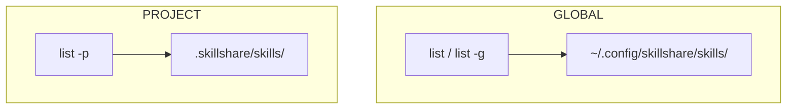
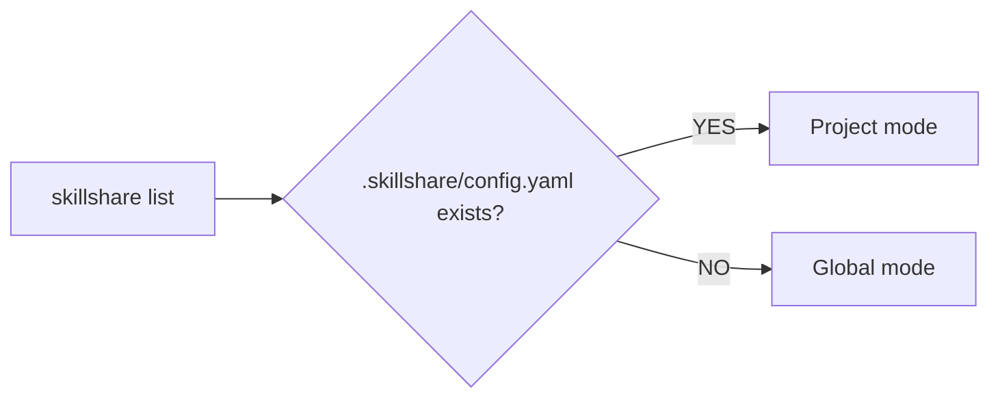

# list

ソースディレクトリにインストールされているすべての Skill を一覧表示します。

```bash
skillshare list              # インタラクティブ TUI（TTY でのデフォルト）
skillshare list --verbose    # 詳細なプレーンテキスト表示
skillshare list --json       # CI/スクリプト向けの JSON 出力
```

## こんなときに使う

- どの Skill がインストールされていて、どこから来たかを確認する
- Skill をインタラクティブに検索・フィルタする
- どの Skill がトラック対象リポジトリで、どれがローカルかを確認する
- クリーンアップ前に Skill コレクションを監査する

```text
skillshare list --no-tui

Skills
  _superpowers/skills/
    brainstorming                tracked: _superpowers
    dispatching-parallel-agents  tracked: _superpowers
    systematic-debugging         tracked: _superpowers
    …
  frontend/
    react-components             local
  web/
    accessibility                github.com/addyosmani/web-quality-skills/skills...
    core-web-vitals              github.com/addyosmani/web-quality-skills/skills...
    …
  docx                           github.com/anthropics/skills/skills/docx
  frontend-design                github.com/anthropics/skills/skills/frontend-de...
  pdf                            github.com/anthropics/skills/skills/pdf
  skill-creator                  github.com/anthropics/skills/skills/skill-creator
  skillshare                     github.com/runkids/skillshare/skills/skillshare
  …

Tracked repos
✓ _superpowers  up to date · 15 skills

28 skills · 15 tracked, 9 remote, 4 local
  Add -v for sources and install dates
```

## インタラクティブ TUI

TTY 上では、`skillshare list` は Skill と Agent を 2 つのタブに分けたインタラクティブな画面を開きます。左側がリスト、右側が選択した項目の詳細です。ここから Skill の更新、アンインストール、audit、有効/無効の切り替え（即座に `.skillignore` に書き込み）、ファイルの閲覧ができます。よく使うキーは画面下部に表示され、`?` ですべてのキーを確認できます。

- **スマートフィルタ** — `/` を押して名前・パス・ソースでフィルタします。正確なフィルタリングのためのタグ構文もサポートしています。

  | タグ | 短縮形 | 値 | 例 |
  |-----|-------|--------|---------|
  | `type:` | `t:` | `tracked`, `remote`, `local`, `github` | `t:tracked` |
  | `group:` | `g:` | 任意のディレクトリ名 | `g:security` |
  | `repo:` | `r:` | 任意のリポジトリ名 | `r:team` |
  | `kind:` | `k:` | `skill`, `agent` | `k:agent` |
  | `status:` | `s:` | `enabled`, `disabled` | `s:disabled` |

  タグは自由テキストと組み合わせられます（AND ロジック）。
  ```
  t:tracked g:security audit
  ```
  これは、"security" グループ内のトラック対象 Skill のうち、名前に "audit" を含むものだけを表示します。

- **Manual only トグル** — `m` を押すと、選択した Skill の `SKILL.md` 内の `disable-model-invocation` を切り替えます。Skill はインストールされたままで、名前を指定して呼び出すことは引き続きできますが、モデルが自発的に読み込むことはなくなり、詳細パネルには **manual only** バッジが表示されます。`t` とは異なり、これは Skill ファイル自体を編集します。トラック対象またはインストール済みの Skill の場合、TUI は先に確認します。なぜなら `skillshare update` はローカルに変更があるトラック対象リポジトリをスキップし、Skill の再インストールはこの編集を消してしまうからです。もう一度 `m` を押すと、その行が削除され、ファイルは元どおりに復元されます。Agent は影響を受けません。[ダッシュボード](/docs/reference/commands/ui) にも同じ **manual only** タグが表示され、Skill エディタに切り替えスイッチがあります。

TUI をスキップしてプレーンテキストを出力するには `--no-tui` を使用します。

```bash
skillshare list --no-tui          # プレーンテキスト出力
skillshare list --no-tui | less   # 手動でページャにパイプ
```

## 検索とフィルタ

TUI に入らずに Skill をフィルタします。

```bash
skillshare list react                     # 名前/パス/ソースでフィルタ
skillshare list --type local              # ローカル Skill のみ
skillshare list --type github             # GitHub ソースの Skill のみ
skillshare list --status disabled         # .skillignore で無効化された Skill のみ
skillshare list --status enabled --json   # 有効な Skill を JSON で
skillshare list react --sort newest       # インストール日でソート
skillshare list --json | jq '.[].name'   # スクリプト向けの JSON
```

デフォルトのビュー（`--status all`）には disabled とマークされたエントリも含まれます。`--status`
はパターンや `--type` と AND 条件で組み合わされ、プロジェクトモードや `list agents` / `list --all` でも動作し、TUI も同じように絞り込まれます。
そのとき TUI の最上行には `disabled only` などと表示されます。TUI の中では、代わりにフィルタに `s:disabled` と入力してください。

:::tip AI での利用
Skill をプログラムから調べる場合は `--json` モードを使用してください。
```bash
skillshare list --json | jq '.[] | {name, source, type}'
```
:::

## 出力例

### コンパクトビュー

フォルダを使って整理している場合、Skill は自動的にディレクトリごとにグルーピングされます。

```
Skills
  frontend/
    react-helper   github.com/user/skills
    vue-helper     github.com/user/skills
  my-skill         local
  commit-commands  github.com/user/skills
  old-draft        local · disabled

Tracked repos
✓ _team-skills  up to date · 3 skills

8 skills · 3 tracked, 3 remote, 2 local
  Add -v for sources and install dates
```

すべての Skill がトップレベル（フォルダなし）にある場合、出力はフラットなリストになります — 以前のバージョンと同一です。

### Verbose ビュー

```bash
skillshare list --verbose
```

```
Skills
  frontend/
    react-helper
      Source     github.com/user/skills
      Type       github
      Installed  2026-01-15
    vue-helper
      Source     github.com/user/skills
      Type       github
      Installed  2026-01-15
  my-skill
    Source     local
  commit-commands
    Source     github.com/user/skills
    Type       github
    Installed  2026-01-15

Tracked repos
✓ _team-skills  up to date · 3 skills
! _other-repo   has changes · 5 skills

12 skills · 8 tracked, 3 remote, 1 local
```

## グローバル vs プロジェクト

skillshare は 2 つのレベルで動作します。`list` コマンドは、アクティブなレベルの Skill を表示します。



| | Global | Project |
|---|---|---|
| **ソース** | `~/.config/skillshare/skills/` | `.skillshare/skills/` |
| **フラグ** | `-g` またはデフォルト | `-p` または自動検出 |
| **範囲** | マシン上のすべてのプロジェクト | 単一のリポジトリ |
| **共有方法** | `push` / `pull` | git commit |

### 自動検出

フラグなしで `skillshare list` を実行すると、skillshare は自動的にモードを検出します。



```bash
cd my-project/            # .skillshare/config.yaml がある
skillshare list           # → Skills · project

cd ~
skillshare list           # → Skills
```

自動検出を上書きするには `-p` または `-g` を使用します。

```bash
skillshare list -g        # プロジェクト内でも強制的にグローバル
skillshare list -p        # 自動検出なしでも強制的にプロジェクト
```

## プロジェクトモード

```bash
skillshare list          # .skillshare/ が存在すれば自動検出
skillshare list -p       # 明示的にプロジェクトモード
```

### 出力例

```
Skills · project
  tools/
    pdf     anthropic/skills/pdf
    review  github.com/team/tools
  my-skill  local

3 skills · 2 remote, 1 local
  Add -v for sources and install dates
```

プロジェクトの list は、ヘッダーに `· project` ラベルが付く点を除き、グローバルの list と同じ表示形式を使います。Skill はディレクトリごとにグルーピングされ、`local`（メタデータなし）またはソース URL（リモート）で分類されます。

## オプション

| フラグ | 説明 |
|------|-------------|
| `[pattern]` | 名前・パス・ソースで Skill をフィルタ（大文字小文字を区別しない） |
| `--verbose, -v` | 詳細情報を表示（ソース、種類、インストール日） |
| `--json, -j` | JSON として出力（CI/スクリプトに便利） |
| `--no-tui` | インタラクティブ TUI を無効化し、プレーンテキストを出力 |
| `--type, -t <type>` | 種類でフィルタ: `tracked`, `local`, `github` |
| `--status <status>` | ステータスでフィルタ: `all`（デフォルト）, `enabled`, `disabled` |
| `--sort, -s <order>` | ソート順: `name`（デフォルト）, `newest`, `oldest` |
| `--project, -p` | プロジェクトの Skill を一覧表示 |
| `--global, -g` | グローバルの Skill を一覧表示 |
| `--help, -h` | ヘルプを表示 |

## ディレクトリのグルーピング

Skill が（install 時の [`--into`](/docs/reference/commands/install) や、手動の `mv` + `sync` によって）フォルダに整理されている場合、`list` は自動的にディレクトリごとにグルーピングします。

```
  frontend/
    react-helper  github.com/user/skills
    vue-helper    github.com/user/skills
  my-skill        local
```

- 同じフォルダ配下の Skill はグループヘッダー（例: `frontend/`）を共有します
- 各グループ内では、フルパスではなくベース名のみが表示されます
- トップレベルの Skill（親フォルダなし）はグループ化されずに末尾に表示されます
- **すべての** Skill がトップレベルにある場合、出力はフラットなリストになり、グループヘッダーは表示されません

グルーピングはフラグではなく、ソースディレクトリ内のディレクトリ構造に基づきます。利用を開始するには、`--into` で Skill を整理してください。

```bash
skillshare install owner/repo -s react-patterns --into frontend
skillshare install owner/repo -s vue-patterns --into frontend
```

詳細は [Organizing Skills with Folders](/docs/how-to/daily-tasks/organizing-skills) を参照してください。

## 出力の見方

### Skill のソース

| ラベル | 意味 |
|-------|---------|
| `local` | ローカルで作成、メタデータなし |
| `github.com/...` | GitHub からインストール |
| `tracked: <repo>` | トラック対象リポジトリの一部 |
| `[disabled]` | `.skillignore` により除外された Skill（[enable/disable](./enable.md) を参照） |

### リポジトリのステータス

| アイコン | 意味 |
|------|---------|
| `✓` | 最新の状態、ローカル変更なし |
| `!` | コミットされていない変更がある |
| `!` + 警告 | Git の状態が不明（読み取れなかった）。警告行にリポジトリ名とエラーが表示されます |

## Agent サポート

`skillshare list agents` は agent のみに絞り込み、agent のソースディレクトリ（`~/.config/skillshare/agents/` または `.skillshare/agents/`）から `.md` ファイルを表示します。

```bash
skillshare list agents              # agent のみを一覧表示
skillshare list agents --json       # agent の JSON 出力
skillshare list agents --verbose    # agent の詳細一覧
```

インタラクティブ TUI では、agent は Skill と区別するために **[A]** バッジで表示されます。すべての TUI 機能（フィルタリング、詳細パネル、enable/disable トグル）は同じように動作します。

`agents` 引数を指定しない場合、`list` は Skill のみを表示します（デフォルトの動作）。背景については [Agents](/docs/understand/agents) を参照してください。

## 関連項目

- [enable / disable](/docs/reference/commands/enable) — 削除せずに Skill を切り替え
- [install](/docs/reference/commands/install) — Skill をインストール
- [uninstall](/docs/reference/commands/uninstall) — Skill を削除
- [status](/docs/reference/commands/status) — sync のステータスを表示
- [Agents](/docs/understand/agents) — Agent の概念
