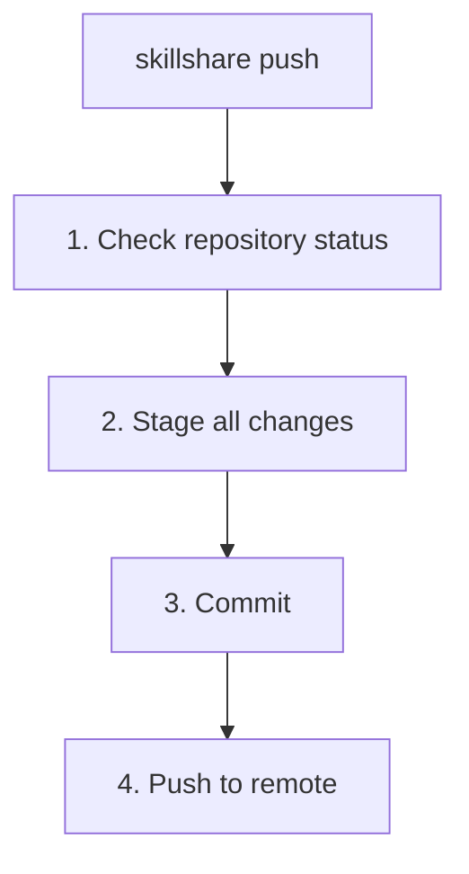

# push

Source を git remote にコミットしてプッシュします。

プッシュせずにローカルのチェックポイントだけを作りたい場合は、代わりに [`commit`](./commit.md) を使ってください。

```bash
skillshare push                  # 自動生成メッセージ
skillshare push -m "Add pdf"     # カスタムメッセージ
skillshare push --pull           # remote の変更をマージしてプッシュし、その後 sync
skillshare push --dry-run        # プレビュー
```

## 使うタイミング

- git 経由で Skill の変更を他のマシンと共有する
- Skill をリモートリポジトリにバックアップする
- Skill を編集した後、コミットとプッシュを 1 コマンドで行う

まだ共有せずにローカルのチェックポイントだけを保存したい場合は、[`skillshare commit`](./commit.md) を使ってください。

## 実行される処理



## オプション

| フラグ | 説明 |
|------|-------------|
| `-m, --message <msg>` | コミットメッセージ（デフォルト: "Update skills"） |
| `--pull` | プッシュ前に remote の変更をマージし、その後 target を sync（[Push と Pull を同時に行う](#push-and-pull-together) を参照） |
| `--dry-run, -n` | 変更を加えずにプレビュー |

## Git Root スコープ

`push` は `git_root` 設定フィールド（デフォルト: `skills` source）で選択されたディレクトリに対して動作します。スコープの一覧は [commit — Git Root スコープ](./commit.md#git-root-scope) を参照してください。`git_root` が変更されたものの、git リポジトリが別のスコープのディレクトリにまだ存在している場合、`push` は修正に必要な正確な `git init` / `mv` コマンドとともに「Git root mismatch」エラーを表示します。[init 後にスコープを変更する](/docs/reference/targets/configuration#git-root) も参照してください。

`git_root: root` では、未プッシュのコミットが `config.yaml` または `config.yaml/` 内のファイルを追加・変更している場合、後のコミットで削除していても `push` は拒否します。`--pull` と `--dry-run` にも適用され、ステージングや pull の前に確認します。dry-run は何も変更しません。エラーには対象コミットのハッシュが表示されます。`push` の送信先リモート（upstream のリモート、初回 push 前は `origin`）のどの ref にも含まれないコミットを未プッシュとみなすため、そのリモートにすでにある履歴は拒否されません。`push` は `push.default` や `remote.pushDefault` に関係なく、常に現在のブランチだけをそのリモートへ送信します。

再試行する前に、対象コミットからファイルを取り除いてください。エラーに表示される `git rebase -i <commit>`（最も古い対象コミットの直前から開始します）で対象コミットを編集対象にし、各編集で `git rm -r --cached -- config.yaml`、`git commit --amend`、`git rebase --continue` を実行します。Skillshare が履歴を自動で書き換えることはありません。公開済みの `config.yaml` の追跡を解除するだけのコミットは push できます。未プッシュの追加コミットの後に削除コミットを作っても、過去の内容は履歴から消えません。

## 前提条件

Source ディレクトリは remote を持つ git リポジトリである必要があります。

```bash
# init 時に設定する（推奨）:
skillshare init --remote git@github.com:you/my-skills.git

# または既存のセットアップに remote を追加する:
skillshare init --remote git@github.com:you/my-skills.git
```

init は最初のコミットを自動的に作成するため、セットアップ直後から `push` が動作します。

## 初回プッシュのアップストリームマッピング

初回のプッシュ時（アップストリームの追跡がまだない場合）、`skillshare push` はアップストリームを自動設定します。

- remote に既定のブランチ（例えば `main` や `trunk`）が既に存在する場合、ローカルの変更はその remote の既定ブランチにプッシュされます。
- remote が空の場合、現在のローカルブランチにプッシュされます。

これにより、誤って間違った remote ブランチを作成してしまう（例えばリモートは `main` を使っているのにローカルは `master` を使っている、など）ことを防ぎます。

## 例

```bash
# 自動メッセージでのクイックプッシュ
skillshare push

# カスタムコミットメッセージ
skillshare push -m "Add commit-commands skill"

# プッシュされる内容をプレビュー
skillshare push --dry-run
```

## コンフリクトへの対応

remote により新しいコミットがある場合:

```bash
$ skillshare push
✗ Push failed
  Remote may have newer changes

Next
  skillshare pull  get them first
  skillshare push  then push again
```

解決方法:
```bash
skillshare pull    # remote の変更を自分の変更とマージ
skillshare push    # 自分の変更をプッシュ
```

`pull` は remote のコミットを、まだプッシュしていない自分のコミットとマージするため、2回目の `push` は成功します。両方で同じファイルを変更していた場合の動作は [両方のマシンでコミットした場合](/docs/reference/commands/pull#when-both-machines-committed) を参照してください。

## Push と Pull を同時に行う {#push-and-pull-together}

`skillshare push --pull` は往復の流れ全体を1つのコマンドで行います:

1. ローカルの変更をコミット（変更がある場合）
2. [`pull`](/docs/reference/commands/pull) と同じ方法で remote の新しいコミットをマージ
3. 結果をプッシュ
4. `pull` と同様に、git root スコープに含まれるものについて target を sync

マージでコンフリクトが発生した場合、何もプッシュされず、target も sync されません。変更はローカルにコミットされたまま残ります。コンフリクトを解決してから、もう一度 `skillshare push --pull` を実行してください。プッシュは成功したものの target の sync に失敗した場合は、remote はすでに更新されているので、表示された `skillshare sync ... --global` コマンド（`git_root` に対応するリソースごとに 1 行）を実行して再試行してください。

`git_root: root` では、マージによって remote が追跡している `config.yaml` が取り込まれた場合、`push --pull` はこのマシンのコピーを保持し、同じプッシュで remote から `config.yaml` を取り除きます。

`--pull` はリベースも force-push も行いません。

## ワークフロー

Skill を共有する際の典型的なワークフロー:

```bash
# 1. Skill を変更する
# 2. remote にプッシュする
skillshare push -m "Update my-skill"

# 別のマシンで:
skillshare pull    # 変更を取得して同期
```

## 関連項目

- [commit](/docs/reference/commands/commit) — プッシュせずにローカルでコミット
- [pull](/docs/reference/commands/pull) — remote からプル
- [sync](/docs/reference/commands/sync) — ローカルの Target へ同期
- [Cross-Machine Sync](/docs/how-to/sharing/cross-machine-sync) — 完全なセットアップ手順
