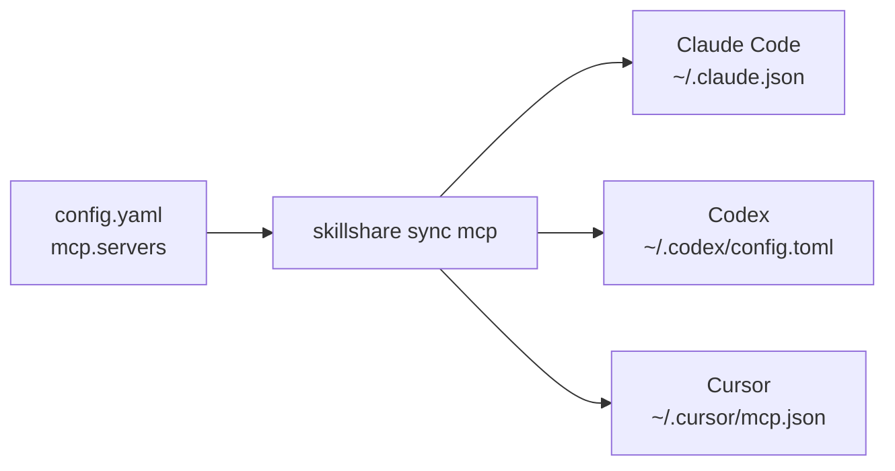

# Agent를 위해 MCP를 한 번에 설정하기

MCP를 사용하면 Agent가 다른 프로그램이나 서비스가 제공하는 도구를 사용할 수 있습니다. Skillshare는
연결 설정을 한 번만 저장하고 지원되는 각 Agent의 네이티브 설정 파일을 작성합니다. 게이트웨이를
실행하거나 백그라운드 서버를 계속 실행 상태로 유지하지는 않습니다.

지원되는 MCP 클라이언트에는 Claude Code, Codex(CLI, IDE 확장, ChatGPT 데스크톱 앱이 하나의 설정을
공유), Cursor, VS Code, OpenCode, Kilo Code, Grok CLI, Antigravity(AGY), Amp, Claude Desktop, Cline,
Copilot CLI, Factory, Gemini CLI, Goose, Junie, Kiro, LM Studio, Warp, Windsurf가 포함되며, Pi ≥ 0.99.0도 [내장 MCP](/docs/reference/commands/mcp#pi)를 통해 지원됩니다.
[대상 및 인증 제한](/docs/reference/commands/mcp#native-destinations)을
참고하세요. 대시보드에는 현재 스코프에서 사용 가능한 클라이언트가 표시됩니다.

예를 들어, Amp, Gemini CLI, Kiro와 Playwright를 공유하려면:

```yaml
mcp:
  servers:
    playwright:
      command: npx
      args: ["-y", "@playwright/mcp@latest"]
      targets: [amp, gemini, kiro]
```

각 클라이언트의 JSON이나 YAML 형식을 배울 필요는 없습니다. `skillshare sync mcp`를 실행하면
Skillshare가 정의를 변환해줍니다. 수신하는 클라이언트가 해당 명령을 실행하므로, 그 클라이언트의
환경에 Node.js/npx가 있어야 합니다.

## 가이드에 따라 설정 시작하기

터미널에서 연결을 탐색하고 관리하려면 `skillshare mcp`를 실행하세요. `/`로 필터,
`e`로 편집, `d`로 제거, `r`로 백업에서 복원할 수 있습니다. 모든 대화형 변경 사항은
저장 전에 미리보기가 제공됩니다. 일반 상태 출력을 보려면 `skillshare mcp --no-tui`를 사용하세요.

신규 설치라면 먼저 Skillshare를 초기화한 다음 다음을 실행하세요:

```bash
skillshare mcp add
```

MCP 제공자로부터 받은 URL이나 JSON을 붙여넣고, 이름을 지정하고, Agent를 선택한 다음 변경 사항을
검토합니다. **Save and sync**는 설정을 즉시 적용하며, **Save only**는 정의를 저장해두고 나중에
`skillshare sync mcp`를 실행하도록 남겨둡니다.

대시보드에서 **Add server**는 두 가지 방식을 지원합니다: 필드를 직접 채우거나 설정을 붙여넣는
방식입니다. 붙여넣기 쪽에서는 파일을 불러올 수도 있는데, 이는 브라우저에서 `mcp import --file`에
해당하는 기능입니다. 붙여넣은 JSON은 자동으로 인식되며, TOML의 경우 Codex에서 온 것인지 Grok에서
온 것인지 선택해야 합니다. 붙여넣은 내용에 서버가 하나이고 Pi가 체크되어 있으면, 대화상자에
폼의 Pi 설정인 도구 노출 방식과 기타 Pi 설정도 표시됩니다. **Import from a target**은 별도 기능으로, 이미 설치된 Agent가 가진
서버를 읽어옵니다. 어느 경우든 대시보드는 CLI와 동일한 소스, 검증, 미리보기, 충돌 규칙을
사용합니다. MCP 페이지의 Sync 박스에 있는 **Sync MCP**는 MCP 설정 파일만 작성합니다.
Sync 페이지에는 Skill, Agent, 추가 항목, MCP를 위한 **Sync all resources**도 있습니다.

Pi 가져오기 원본 메뉴는 Pi의 `mcp.json`과, 0.23.0 이전에 `pi-mcp-adapter`로 설정한
서버를 위한 `mcp-adapter.json`을 나열하며, 각각 해당 파일만 읽습니다. adapter 파일은
읽기만 합니다: sync는 가져온 서버를 Pi의 `mcp.json`에 작성합니다. 표시 경로는 현재 범위, `PI_CODING_AGENT_DIR`, 계정 디렉터리를 따릅니다. 프로젝트에서는
해당 프로젝트의 `.pi/`를 읽습니다. 개인 server와 인증 정보는 전역 파일에 두고, 프로젝트
파일은 신뢰할 수 있는 프로젝트에서만 사용하세요.


Config 편집기는 저장 시 두 칸 들여쓰기를 사용해 YAML을 포맷하며 주석을 보존합니다. 필드를
클릭하면 `mcp`, `sources.mcp`, 연결 필드, 환경 변수 참조를 포함한 설명이 오른쪽 패널에
표시됩니다.

동기화 후에는 Agent를 다시 로드하세요. 해당 Agent에서 필요한 로그인이나 승인을 완료하세요.
Skillshare는 연결을 테스트하거나, 서버 프로그램을 설치하거나, 로그인 세션을 복사하지 않습니다.
동기화가 성공했다는 것은 설정이 기록되었다는 의미일 뿐, 도구 호출이 성공했다는 의미는 아닙니다.

## 두 가지 연결 유형 이해하기

| 제공자가 제공하는 것 | 연결 방식 | 예시 |
|---|---|---|
| 명령과 인자 | `stdio`: Agent가 로컬 프로세스를 시작 | `command: npx`와 `args` |
| MCP 엔드포인트 URL | Streamable HTTP: Agent가 실행 중인 서비스에 연결 | `url: https://example.com/mcp` |

어느 쪽이든 정의는 한 번만 저장되고, 각 Agent의 자체 파일에 기록됩니다.



일반적으로 `transport`를 직접 설정할 필요는 없습니다. Skillshare가 `command`나 `url`로부터
자동으로 추론합니다. URL은 여러분의 컴퓨터에서 실행 중인 서비스를 가리킬 수도, 원격 서비스를
가리킬 수도 있습니다. 일반적인 웹사이트 URL이 아니라 제공자의 실제 MCP 엔드포인트를 사용하세요.
레거시 SSE 설정은 자동으로 변환되지 않고 거부됩니다.

## 모델에 전달되는 도구 제한하기

서버 하나가 많은 도구를 제공할 수 있습니다. `tools`를 한 번 설정해 일부만 남기거나
일부를 숨기면, Skillshare가 각 Agent 고유의 형식으로 작성합니다:

```bash
skillshare mcp edit github --tools-allow 'get_*,search_code' --tools-deny get_secret
skillshare sync mcp --dry-run
```

대시보드에서는 서버를 열어 **도구** 섹션을 사용하세요. **도구 불러오기**가
서버의 도구를 나열하면, 모델에 주지 않을 도구의 선택을 해제하세요. Pi는 정책 전체를 적용하고, Codex와 Copilot CLI는
정확한 이름을 적용하며, 그 밖의 Agent는 적용하지 않습니다. 미리보기와
`skillshare mcp check`는 정책 일부를 적용하지 않는 Agent를 각각 알려줍니다.
[도구 정책](/docs/reference/commands/mcp#tool-policy)을 참고하세요.

## 모든 것을 하나의 파일에 유지하기

이것이 기본 방식입니다. 기존 Skill과 Agent는 디렉터리 Source로 그대로 유지되며,
MCP 연결은 `mcp.servers` 아래에 구조화된 설정으로 관리됩니다:

```yaml
sources:
  skills: ~/.config/skillshare/skills
  agents: ~/.config/skillshare/agents

mcp:
  targets: [claude, codex, cursor, vscode]
  servers:
    company-docs:
      url: https://docs.example.com/mcp
```

`company-docs`는 여러분이 직접 정하는 이름입니다. 서버를 설치하거나 조회하지는 않습니다.
예시 URL을 여러분 제공자의 엔드포인트로 바꾸세요. `mcp.targets`는 Skill Target과 무관하게
수신할 클라이언트를 선택합니다. 서버별 선택적 `targets` 목록은 이 기본값을 덮어씁니다.

## MCP를 별도 파일로 분리하기 {#split-mcp-into-its-own-file}

별도로 공유하거나 버전 관리하고 싶다면 외부 Source를 사용하세요:

```yaml title="config.yaml"
sources:
  skills: ~/.config/skillshare/skills
  agents: ~/.config/skillshare/agents
  mcp: ./mcp.yaml

mcp:
  targets: [claude, codex, cursor]
```

```yaml title="mcp.yaml"
servers:
  company-docs:
    url: https://docs.example.com/mcp
```

상대 경로는 `config.yaml`이 있는 디렉터리를 기준으로 해석됩니다.
`.skillshare/config.yaml`의 경우 `./mcp.yaml`은 `.skillshare/mcp.yaml`을 의미합니다.
절대 경로와 `~/`도 지원됩니다.
`push` / `pull`로 이 파일을 머신 간에 공유하려면 `root` scope repository 안에 두세요.
[Cross-Machine Sync — MCP 서버](/docs/how-to/sharing/cross-machine-sync#mcp-servers)를 참고하세요.

**한 번에 하나의 Source만** 사용하세요: `sources.mcp`와 `mcp.servers`는 공존할 수 없으며,
`mcp.servers: {}`도 마찬가지입니다. 전환하려면 `servers` 매핑을 외부 파일로 옮기고,
`sources.mcp`를 추가한 다음, 인라인 `mcp.servers`를 제거하세요. `mcp.targets`는
`config.yaml`에 그대로 두세요. 동기화 전에 미리보기를 확인하세요:

```bash
skillshare sync mcp --dry-run
```

CLI와 대시보드 편집 모두 활성화된 Source를 따릅니다. 외부 파일이 없거나 유효하지 않으면
동기화가 중단됩니다. 이는 절대 "모든 서버 삭제"를 의미하지 않습니다. 정의를 의도적으로
제거하려면 명시적으로 `servers: {}`를 사용한 다음 관리되는 제거 항목을 미리보기로
확인하세요.

## 로컬 프로그램과 자격 증명

```yaml
mcp:
  targets: [claude, codex]
  servers:
    internal-tools:
      command: company-mcp
      args: [--workspace, /path/to/workspace]
      env:
        COMPANY_TOKEN:
          fromEnv: COMPANY_TOKEN
    company-docs:
      url: https://docs.example.com/mcp
      bearerToken:
        fromEnv: DOCS_TOKEN
```

필요한 로컬 프로그램은 직접 설치해야 합니다. Agent는 자신의 환경 안에서 그 프로그램을
찾을 수 있어야 하고 참조된 환경 변수도 읽을 수 있어야 합니다. 터미널에만 설정된 변수는
데스크톱에서 실행된 Agent에는 전달되지 않을 수 있습니다.

Skillshare는 변수 참조를 기록할 뿐 절대 해석하지 않습니다. 실제 토큰은 소스 파일, URL,
명령 인자에 넣지 마세요. 민감하다고 알려진 환경 변수나 헤더 키는 `fromEnv`가 필요합니다.
Import는 `DATABASE_URL`과 같은 URL 값 안의 비밀번호를 포함해 인식 가능한 리터럴 비밀
정보를 참조로 변환하고 설정해야 할 변수를 알려줍니다. 명령 인자에는 이동 가능한 참조
문법이 없으므로, import는 인자가 자격 증명처럼 보일 때 경고하지만 그대로 일반 텍스트로
유지합니다. Import가 URL 경로에 담긴 토큰처럼 모든 자격 증명 형식을 식별할 수 있는 것은
아닙니다.

Codex는 이름으로 로컬 변수를 전달하므로, Codex를 선택했다면 `env.KEY.fromEnv`도
`KEY`와 같아야 합니다. 설정을 표현할 수 없는 Target은 그 값을 누락시키는 대신
미리보기 자체를 막습니다. 클라이언트별 플레이스홀더와 입력 프롬프트는 import 전에
명시적으로 해결해야 합니다. Codex의 `startup_timeout_sec`나 `cwd`처럼 Agent 특화
필드는 import되지 않습니다. import는 이를 경고로 나열하며, sync는 해당 Agent의 기존
항목에 그대로 유지합니다.

## 기존 연결 가져오기

```bash
skillshare mcp import                         # Agent와 서버 선택
skillshare mcp import docs --from claude --target claude --target codex --sync
```

한 번에 하나의 서버를 가져옵니다. Agent의 항목이 이미 가져온 정의와 일치하면 해당
Agent 파일을 변경하지 않고 관리 대상이 됩니다. 다를 경우 — 대개는 리터럴 토큰이 환경
참조로 바뀐 경우인데 — CLI는 정상 작동 중인 항목을 덮어쓰는 대신 중단합니다. 보고된
변수를 설정한 다음 `--replace`로 다시 실행하거나, 해당 Agent를 `--target`에서
제외하세요. 대시보드 미리보기에도 같은 항목이 충돌로 표시됩니다.

Source에 이미 해당 이름이 있다면 대시보드의 **Edit** 작업이나 CLI의 `--replace`를
사용하세요. import에서 `--replace`는 가져온 Agent 자신의 항목도 다시 씁니다.
**Save only**는 파일을 변경하지 않고 해당 항목을 기준선으로 기록하므로, 다음 sync에서
다시 쓰면서도 그동안 이루어진 편집을 여전히 감지합니다. 다른 충돌하는 네이티브 항목을
덮어쓰지는 않습니다. MCP 대시보드에서 처리할 수 있는 충돌은 **Import from cursor**처럼
Agent 이름을 딴 import 작업을 제공하여 그 버전을 채택하거나, **Replace with source**로
해당 항목을 덮어쓸 수 있습니다. 아직 존재하는 다른 Skillshare 설정이 소유한 충돌에는
두 작업이 모두 제공되지 않습니다. 해당 설정만이 그 항목을 놓아줄 수 있기 때문입니다.

Agent가 같은 이름으로 이미 가진 서버를 넘겨받을 때도 이 방법을 씁니다. 서버를 source에
추가합니다. Agent의 항목이 이미 같으면 다음 미리보기에 **인수**로 표시되고, sync는 파일을
바꾸지 않고 관리 대상으로 기록합니다. import한 뒤에 가져온 Agent를 선택하면 이렇게 됩니다.
다르면 미리보기는 항목을 덮어쓰지 않고 충돌로 표시합니다. import해서 Agent의 버전을
채택하거나, source 정의로 교체하세요.

MCP 대시보드는 Agent 설정 파일에 이미 있지만 Skillshare가 관리하지 않는 서버도 찾습니다.
찾으면 서버 목록 위의 안내가 몇 개인지, 어느 Agent에 있는지 알려주고, **Import**는 그중
첫 번째 Agent의 import를 엽니다. 프로젝트의 **MCP** 탭도 그 프로젝트의 파일에 대해 같은
일을 하며, 그 프로젝트로 import합니다.
[Skillshare가 관리하지 않는 서버](/docs/reference/commands/mcp#unmanaged-servers)를 참고하세요.

## 한 프로젝트에서 글로벌 서버 끄기

Agent의 글로벌 설정에 있는 서버는 모든 프로젝트에서 로드됩니다. 한 프로젝트에서만
끄려면, 해당 프로젝트 안에서 Agent의 글로벌 설정에 있는 서버 이름을 사용해 다음을
실행하세요:

```bash
skillshare mcp add company-docs --disabled --target opencode
skillshare sync mcp
```

대시보드에서는 `skillshare ui`로 프로젝트 폴더에서 열어 **서버 추가** 옆에 있는
**전역 서버 끄기** 버튼을 선택하세요.

이 기능은 Claude Code, OpenCode, Kilo Code, Pi 1.0.1 이상에서 작동합니다. 다른 Agent는
거부됩니다. 각 Agent에 무엇이 기록되는지, 그리고 나머지가 왜 지원되지 않는지는
[명령어 레퍼런스](/docs/reference/commands/mcp#turn-off-a-global-server-in-one-project)를
참고하세요.


## 제거 및 복원

```bash
skillshare mcp remove company-docs
skillshare sync mcp --dry-run
skillshare sync mcp
```

이 설정에 의해 관리되던 항목 중 변경되지 않은 것만 제거됩니다. 관리되지 않는 항목과
다른 프로그램이 편집한 항목은 보호됩니다. Skillshare가 관리하기 이전부터 Agent 항목이
Source와 이미 일치했던 경우(예: 프로젝트를 이동한 경우)에도 그대로 유지됩니다. Skillshare가
제거해야 한다면 먼저 import하세요.

대시보드에서는 서버 행의 삭제 작업을 사용하세요. 대화상자에는 변경될 각 Agent 파일이
나열됩니다. **Remove from source only**는 동기화 없이 `mcp remove`와 동일하게
작동하고, **Remove and sync**는 Agent 파일도 정리하며 충돌이 있는 동안에는
비활성화됩니다.

서버 관리를 멈추되 Agent에는 남겨 두려면 `--keep-files`로 제거하거나, 대시보드의 제거
대화상자에서 **Stop managing**을 선택하세요:

```bash
skillshare mcp remove company-docs --keep-files
```

Agent 파일은 바뀌지 않으며, 이후 sync도 그 항목을 건드리지 않습니다.
[서버 관리 중지](/docs/reference/commands/mcp#stop-managing-a-server)를 참고하세요.

모든 네이티브 파일 변경은 영향을 받는 MCP 항목의 비공개 백업을 생성합니다. Skillshare는
각 Agent 파일마다 최신 20개의 백업을 유지합니다. 출력에는 해당 ID가 포함됩니다:

```bash
skillshare mcp restore BACKUP_ID --dry-run
skillshare mcp restore BACKUP_ID
```

대시보드에서 **Backups & restore**는 일자별로 백업을 나열합니다. 백업을 미리보기하여
복원될 항목을 확인한 다음 **Restore this file**을 선택하세요.

복원은 관련 없는 설정을 그대로 유지하며, 영향을 받는 항목에 대한 더 최근 변경 사항을
덮어쓰지 않습니다. Source 파일은 되돌리지 않으므로, 복원 내용이 다음 동기화에서도
유지되길 원한다면 Source도 함께 편집하세요. 백업에는 이전 네이티브 자격 증명이 포함될
수 있으므로 로컬 상태 디렉터리는 비공개로 유지하세요.

쓰기는 파일 단위로 원자적입니다. 여러 파일 처리 도중 실패하면 완료된 파일은 그대로
적용되고 해당 백업 ID가 보고됩니다. 보고된 원인을 해결한 다음 다시 시도하세요. 다음
MCP 쓰기 작업(`sync mcp`나 대시보드 sync 등)이 중단된 쓰기 작업의 복구를 마무리하며,
미리보기에는 이미 그 결과가 반영되어 표시됩니다. 그 사이에 Agent 파일이 다시
편집되었다면, 더 이상 일치하지 않는 항목은 충돌로 보고됩니다.
충돌을 "해결"하려고 소유권 상태를 삭제하지 마세요. 기존 항목이 관리되지 않는 상태가
되어 다시 명시적으로 import해야 합니다. 소유하던 설정이 이미 삭제된 항목은 그럴 필요가
없습니다. 충돌이 해당 항목을 잔여 항목으로 보고하며, 그 충돌에서 바로 import하거나
replace하면 인계받을 수 있습니다.

지원되는 경로, 플래그, 현재 제한 사항은 [MCP 명령어 레퍼런스](/docs/reference/commands/mcp)를
참고하세요.
