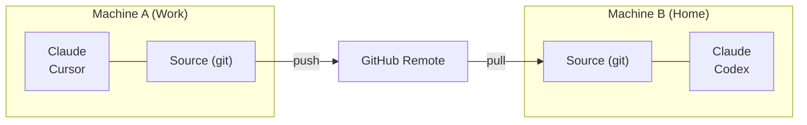

# Cross-Machine Sync

git을 사용해 여러 컴퓨터에서 Skill을 동기화합니다.

## 개요



---

## 첫 번째 머신 설정

### 대화형 (안내 프롬프트)

```bash
skillshare init --remote git@github.com:you/my-skills.git
```

### 비대화형 (프롬프트 없음)

```bash
# 원격에 이미 Skill이 있는 경우 (또는 새 Source로 시작)
skillshare init --remote git@github.com:you/my-skills.git --no-copy --all-targets --no-skill

# 기존 Claude Skill이 있는 첫 번째 머신: init 중에 가져오기
skillshare init --remote git@github.com:you/my-skills.git --copy-from claude --all-targets --no-skill
```

이 명령은:
1. Source 디렉터리를 생성합니다
2. 초기 커밋과 함께 git을 초기화합니다
3. Remote를 추가합니다
4. Target을 자동으로 감지하고 설정합니다

선택 사항 (설정 후 추가 AI CLI를 설치한 경우에만):

```bash
skillshare init --discover
```

그런 다음 Skill을 push하세요:
```bash
skillshare push
```

:::tip 이미 초기화했나요?
기존 설정에 Remote를 추가하세요:
```bash
skillshare init --remote git@github.com:you/my-skills.git
```
초기 설정 이후에도 동작합니다 — 단순히 Remote를 추가할 뿐입니다.
:::

---

## 두 번째 머신 설정 {#second-machine-setup}

`skillshare init`을 실행하고 **Connect my existing skillshare repo**를 선택한 뒤 저장소 URL을 붙여넣습니다:

<p>
  
</p>

URL을 직접 전달할 수도 있습니다:

```bash
skillshare init --remote git@github.com:you/my-skills.git
```

Init은 아무것도 쓰지 않고 먼저 저장소를 확인한 뒤 pull합니다. 수동으로 `git clone`할 필요가 없습니다.

:::info 내부적으로 일어나는 일
1. 저장소를 임시 폴더에 clone해 Skill 수를 세고 구조를 판단합니다: `--git-root root`로 push한 폴더 전체인지, `skills/` 폴더 안의 Skill인지
2. 이 머신에서 저장소와 이름이 같은 Skill은 저장소 버전을 사용합니다. 이 머신에만 있는 Skill은 유지되고 다음 `skillshare push` 때 저장소에 추가됩니다
3. 확인 후: source를 만들고 git을 초기화하고 Remote를 추가한 뒤 원격 브랜치로 재설정하고 추적을 설정합니다
4. 감지된 로컬 Target을 설정하고 첫 sync를 제안합니다
:::

수동 제어를 선호한다면:

```bash
# 직접 clone한 다음, 기존 Source로 init
git clone git@github.com:you/my-skills.git ~/.config/skillshare/skills
skillshare init --source ~/.config/skillshare/skills
skillshare sync
```

---

## 일상 워크플로

### Machine A: 변경 후 push

```bash
# Skill 편집 (심볼릭 링크를 통해 변경 사항이 즉시 반영됩니다)
$EDITOR ~/.config/skillshare/skills/my-skill/SKILL.md

# 선택 사항: push 없이 로컬 체크포인트 생성
skillshare commit -m "Update my-skill"

# 공유할 준비가 되면 Remote에 push
skillshare push -m "Update my-skill"
```

### Machine B: pull 후 sync

```bash
skillshare pull
```

이게 전부입니다. `pull`은 pull 이후 자동으로 `sync`를 실행합니다. [git root scope](/docs/reference/targets/configuration#git-root)에 포함된 것만 sync합니다. 기본값은 skills, agents / extras scope에서는 해당 리소스, `git_root: root`에서는 세 가지 모두입니다. Plugins, MCP 서버, hooks는 아래의 추가 단계가 필요합니다.

### 명령 하나로 양방향 처리

여러 머신에서 skill을 편집한다면 `push`와 `pull` 대신 다음을 실행하세요:

```bash
skillshare push --pull -m "Update my-skill"
```

변경 사항을 커밋하고, 다른 머신이 push한 내용을 병합한 뒤 push하고, target을 sync합니다. 충돌이 발생하면 아무것도 push되기 전에 중단됩니다. [Push와 Pull 함께 하기](/docs/reference/commands/push#push-and-pull-together)를 참고하세요.

---

## Plugins, MCP, Hooks {#plugins-mcp-hooks}

`push`와 `pull`은 git root 디렉터리 안의 파일만 버전 관리합니다. Plugins, hooks, MCP 서버는 `config.yaml`의 설정이며, `config.yaml`은 이 repository에 절대 포함되지 않습니다. 기본 `skills` scope에서는 repo 밖에 있고, `root` scope에서는 ignore됩니다. 각 머신은 자신만의 `config.yaml`과 targets, 경로를 유지합니다.

| 리소스 | 저장 위치 | `push` / `pull`로 이동 여부 |
|---|---|---|
| Skills | Skills source | 예 |
| Agents | Agents source | `git_root: agents` 또는 `root`일 때 |
| Extras | Extras source | `git_root: extras` 또는 `root`일 때 |
| MCP 서버 | `config.yaml`, 또는 `sources.mcp`가 지정한 파일 | 그 파일이 repository 안에 있을 때만 |
| Plugins | `config.yaml`의 `plugins:` | 아니요 |
| Hooks | `config.yaml`의 `hooks:` | 아니요 |

다른 머신에서 pull한 뒤 나머지는 직접 적용합니다:

```bash
skillshare pull
skillshare sync --all              # agents, extras, MCP, hooks 추가
skillshare sync plugins --no-tui   # plugins는 --all에 포함되지 않음
```

### MCP 서버 {#mcp-servers}

서버 정의를 repository 안의 별도 파일에 둡니다. `git_root: root`에서는 repository가 `config.yaml`이 있는 디렉터리(`~/.config/skillshare`, Windows에서는 `%AppData%\skillshare`)이므로, 상대 경로의 `sources.mcp`는 commit되고 `config.yaml`은 로컬에 남습니다:

```yaml title="config.yaml (각 머신에서 설정)"
sources:
  mcp: ./mcp.yaml

mcp:
  targets: [claude, codex]
```

`mcp.targets`는 `config.yaml`에 남으므로 머신마다 받을 클라이언트를 따로 고를 수 있습니다. 모든 머신에서 `sources.mcp`를 설정하세요. 기존 서버를 `config.yaml` 밖으로 옮기려면 [MCP를 별도 파일로 분리하기](/docs/how-to/daily-tasks/sharing-mcp#split-mcp-into-its-own-file)를, 기존 설정을 `root` scope로 전환하려면 [`git_root`](/docs/reference/targets/configuration#git-root)를 참고하세요.

Skillshare는 자격 증명을 값이 아닌 `fromEnv` 참조로 저장합니다. 각 머신에서 Agent가 읽을 수 있는 곳에 해당 환경 변수를 설정하세요.

### Plugins {#plugins}

Plugin 정의는 git으로 이동하지 않습니다. 각 머신에서 같은 소스로부터 다시 추가합니다:

1. 첫 번째 머신의 dashboard에서 **Plugins → Share**를 열고 명령을 복사합니다. HTTPS Git 소스로 추가한 plugins가 나열되며, 예를 들면 다음과 같습니다:

   ```bash
   skillshare plugin add https://github.com/acme/plugins --plugin review -g --no-tui
   ```

2. 다른 머신에서 이 명령을 실행하고, Plugins 페이지에서 Agents를 체크한 뒤 `skillshare sync plugins`를 실행합니다.

여러 머신에서 쓸 plugin은 **Import installed**가 아니라 **Add plugin**으로 소스에서 추가하세요. Import는 native 설치만 기록합니다. 다른 머신에서 Claude와 Codex는 같은 이름의 native marketplace에서 다시 설치하며, 그 marketplace가 등록되어 있지 않으면 plugin을 건너뜁니다. Cursor와 Antigravity는 imported plugin을 다시 설치할 수 없습니다. 로컬 디렉터리에서 추가한 plugin은 경로가 첫 번째 머신에만 있으므로 **Share**에 표시되지 않습니다.

`sync plugins`는 없는 plugins를 설치하고, 이미 설치된 것은 그대로 둡니다. 업데이트하려면 `skillshare plugin check`를 실행한 다음 `skillshare plugin update`를 실행하세요. [도구 간 plugins 관리](/docs/how-to/daily-tasks/sharing-plugins#updates-and-recovery)를 참고하세요.

### Hooks {#hooks}

Hooks에는 별도 파일이 없습니다. `config.yaml`의 `hooks:` 섹션을 다른 머신에 복사한 뒤 `skillshare sync hooks`를 실행하세요.

### 각 머신에 남는 것 {#per-machine}

- plugin을 설치하는 native CLI(`claude`, `codex` 등)는 Skillshare가 실행되는 곳에 설치되어 있고 `PATH`에 있어야 합니다. 예약 작업의 `PATH`는 터미널보다 짧은 경우가 많습니다. Codex는 Codex 데스크톱 app과 Homebrew 폴더에서도 찾습니다. 다른 위치에 있는 머신에서는 [`SKILLSHARE_CODEX_CLI`](/docs/reference/appendix/environment-variables#skillshare_codex_cli)를 설정하세요.
- 로그인, OAuth 토큰, native 신뢰 확인, 활성화/비활성화 상태는 각 Agent에 남습니다.
- MCP 서버가 참조하는 환경 변수의 값.

---

## 명령어

### Commit

push 없이 로컬 체크포인트를 생성합니다:

```bash
skillshare commit                  # 기본 메시지
skillshare commit -m "Add pdf"     # 사용자 지정 메시지
skillshare commit --dry-run        # 미리보기
```

**실제로 일어나는 일:**
```
git add -A
git commit -m "Add pdf"
```

`commit`은 Remote를 필요로 하지 않으며 절대 push하지 않습니다.

### Push

로컬 변경 사항을 커밋하고 push합니다:

```bash
skillshare push                  # 자동 생성된 메시지
skillshare push -m "Add pdf"     # 사용자 지정 메시지
```

**실제로 일어나는 일:**
```
git add -A
git commit -m "Add pdf"
git push          # 첫 push 시 upstream을 자동 설정합니다
```

### Pull

Remote 변경 사항을 pull하고 sync합니다:

```bash
skillshare pull
```

**실제로 일어나는 일:**
```
git pull           # 두 머신 모두 커밋했다면 병합; 첫 pull 시 fetch 후 병합 또는 reset
skillshare sync
```

---

## 충돌 처리

### Pull 실패 (로컬에 커밋되지 않은 변경 사항)

로컬 변경 사항을 유지하고 싶지만 아직 push할 준비가 안 됐다면, 먼저 로컬에 커밋하세요:

```bash
skillshare commit -m "Save local changes"
skillshare pull
```

### Push 실패 (Remote가 앞서 있음)

```
$ skillshare push
Push failed
  Remote may have newer changes
  Run: skillshare pull
  Then: skillshare push
```

**해결 방법:**
```bash
skillshare pull
skillshare push
```

### 로컬에 커밋되지 않은 변경 사항으로 Pull이 계속 실패하는 경우

```
$ skillshare pull
Local changes detected
  Run: skillshare push
  Or:  cd ~/.config/skillshare/skills && git stash
```

**해결 방법:**
```bash
# 옵션 1: 먼저 로컬에 커밋
skillshare commit -m "Local changes"
skillshare pull

# 옵션 2: 먼저 변경 사항을 push
skillshare push -m "Local changes"
skillshare pull

# 옵션 3: 변경 사항을 임시로 stash
cd ~/.config/skillshare/skills
git stash
skillshare pull
git stash pop
```

### 병합 충돌

두 머신 모두 커밋한 경우 `pull`이 이를 병합합니다. `.metadata.json`의 충돌은 자동으로 해결됩니다. 그 외의 파일에서 충돌이 발생하면 pull이 중단되고, 병합이 되돌려지며, 해당 파일이 표시됩니다:

```
$ skillshare pull
pull stopped: this machine and the remote both changed my-skill/SKILL.md; the merge was undone, resolve it with git in ~/.config/skillshare/skills
```

**해결 방법:**
```bash
cd ~/.config/skillshare/skills
git pull --no-rebase          # 병합을 다시 실행하고 충돌을 남겨 둠
# 충돌한 파일 편집
git add .
git commit --no-edit
skillshare push
skillshare sync
```

---

## 상태 확인

```bash
skillshare status
```

다음을 표시합니다:
- Git 상태 (clean, ahead, behind)
- Remote 설정
- Sync 상태

---

## 비공개 저장소

비공개 저장소에는 SSH URL을 사용하세요:

```bash
skillshare init --remote git@github.com:you/private-skills.git
```

---

## 팁

### SSH 키 사용

비밀번호 프롬프트를 피하려면 SSH 키를 설정하세요:
```bash
ssh-keygen -t ed25519 -C "your@email.com"
# 공개 키를 GitHub에 추가
```

### Dotfiles를 위한 이식 가능한 경로

dotfiles를 통해 `config.yaml`을 공유한다면, 경로를 `/home/alice/...` 대신 `~/...` 형태로 유지하도록 `preserve_tilde_on_save`를 활성화하세요:

```yaml
preserve_tilde_on_save: true
```

이렇게 하면 동일한 config가 서로 다른 사용자명이나 OS별 홈 접두사를 가진 머신에서 사용될 때 발생하는 지저분한 diff를 방지할 수 있습니다. [Configuration — preserve_tilde_on_save](/docs/reference/targets/configuration#preserve_tilde_on_save)를 참고하세요.

### 여러 Remote

백업용 Remote를 추가하세요:
```bash
cd ~/.config/skillshare/skills
git remote add backup git@gitlab.com:you/skills-backup.git
git push backup main
```

### 셸 시작 시 Sync

`~/.bashrc` 또는 `~/.zshrc`에 추가하세요:
```bash
# 터미널이 열릴 때 skillshare를 sync (Remote가 설정된 경우)
skillshare pull 2>/dev/null
```

---

## 대안: Config에서 설치하기 {#alternative-install-from-config}

git remote를 설정하고 싶지 않다면, `config.yaml`이 이식 가능한 Skill 매니페스트 역할을 합니다. `install` / `uninstall`을 실행할 때마다 `skills:` 섹션이 자동으로 갱신되며, `skillshare install` (인자 없음)을 실행하면 나열된 모든 항목을 다시 설치합니다:

```bash
# Machine A — config.yaml이 설치한 항목을 기록합니다
skillshare install anthropics/skills -s pdf
# config.yaml에 이제 다음이 포함됩니다: skills: [{name: pdf, source: "..."}]

# Machine B — config.yaml을 복사한 다음:
skillshare install      # 나열된 모든 Skill을 설치합니다
skillshare sync
```

### 어떤 방법을 사용해야 할까요

| | `push` / `pull` | `install` (인자 없음) |
|---|---|---|
| 동기화되는 것 | 실제 Skill 파일 (전체 내용) | Source URL만 — 설치 시 다시 다운로드 |
| 로컬/수동 작성 Skill | 포함됨 | 포함되지 않음 (Source URL 없음) |
| 필요한 설정 | Source 디렉터리의 git remote | `config.yaml`만 있으면 됨 |
| Project mode | Global만 가능 | `-p`(`.skillshare/config.yaml`)와 함께 동작 |
| 유지 관리 | 변경 후 수동 `push` | install/uninstall 시 자동 조정 |

**권장 사항**: 개인용 Cross-Machine Sync에는 `push`/`pull`을 사용하세요. 팀 온보딩과 Project 설정에는 config에서의 `install`을 사용하세요.

---

## 참고 자료

- [push](/docs/reference/commands/push) — Remote에 push
- [pull](/docs/reference/commands/pull) — Remote에서 pull
- [install](/docs/reference/commands/install#install-from-config-no-arguments) — Config에서 설치
- [Organization-Wide Skills](./organization-sharing.md) — 팀 공유
- [init](/docs/reference/commands/init) — `--remote`로 init
