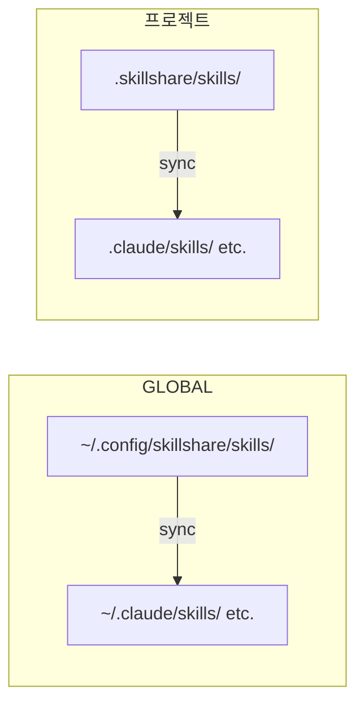

# 소개

**어디서든 나만의 AI 코딩 환경을.**

skillshare는 Skill, Agent, Rule, MCP 연결, Hook을 한곳에서 관리합니다. [데스크톱 앱](/docs/getting-started/desktop-app)이나 CLI로 AI 도구, 머신, 프로젝트를 바꾸어도 자신의 설정을 가져갈 수 있습니다.

## 왜 skillshare인가요?

- **도구를 바꿔도 설정은 그대로** — 직접 관리하는 Source를 유지하고, 지원되는 각 도구에 전달할 리소스를 선택합니다.
- **다른 머신에서도 같은 설정** — Source를 Git으로 버전 관리하고 다른 머신으로 가져갑니다.
- **프로젝트 맥락 공유** — 팀 Skill과 설정을 코드와 함께 관리하고, 원격 Skill의 커밋을 lockfile에 기록합니다.

예를 들어 한 팀원은 Claude Code를, 다른 팀원은 Codex를 사용하며 둘 다 레거시 API에 관한 같은 코드 리뷰 체크리스트가 필요합니다. 체크리스트를 `.skillshare/skills/`에 두고 프로젝트 설정을 커밋하세요. 새 팀원은 채팅에서 지시문을 찾아 복사하는 대신, 선언된 원격 Skill을 설치하고 설정된 Target에 동기화합니다.

전체 절차는 [팀 온보딩 레시피](/docs/how-to/recipes/team-onboarding-recipe)를 참고하세요. 공유 지시문은 설정 차이를 줄이지만, 각 AI 도구의 기능, 권한, 동작은 여전히 다릅니다.

## 빠른 시작

```bash
# 설치
curl -fsSL https://raw.githubusercontent.com/runkids/skillshare/main/install.sh | sh
```

설치 프로그램이 PATH 설정 안내를 표시할 때만 안내에 따라 설정한 후 아래 명령을 실행하세요. PATH 경고가 없으면 추가 설정은 필요하지 않습니다.

```bash

# 초기화 (CLI 자동 감지, git 설정)
skillshare init

# Skill 설치
skillshare install anthropics/skills/skills/pdf

# 모든 Target으로 동기화
skillshare sync
```

이제 설정된 Target에서 Skill을 사용할 수 있습니다.

:::tip[설치 없이 사용해 보기]
먼저 살펴보고 싶으신가요? [Docker Playground](/docs/how-to/advanced/docker-sandbox#playground)를 사용하면 명령 하나로 로컬 설치 없이 체험할 수 있습니다.

```bash
git clone https://github.com/runkids/skillshare.git && cd skillshare
make playground
```
:::

## 동작 방식



Source의 기존 Skill을 편집하면 링크된 Target에 변경 사항이 즉시 반영됩니다. copy mode에서는 `sync`로 복사본을 갱신하세요. 기본 merge mode에서도 Skill을 추가, 삭제하거나 이름을 바꾸면 `sync`가 필요합니다.

Global mode는 개인 설정과 설치된 팀 저장소를 관리합니다. Project mode는 특정 코드베이스의 리소스와 설정을 관리합니다. Git pull로 프로젝트 파일을 가져온 뒤, `skillshare install -p`와 `skillshare sync -p`를 실행하여 선언된 Skill을 로컬에 적용합니다.

## 주요 기능

- **자동 감지** — `.skillshare/`가 있는 프로젝트로 `cd`하면 skillshare가 자동으로 Project mode로 전환됩니다
- **Global 및 Project 범위** — Global mode는 개인 및 조직 공유 리소스를, Project mode는 코드베이스별 리소스를 관리
- **링크를 통한 업데이트** — 기존 Skill을 편집하면 symlink를 사용하는 Target에 즉시 반영
- **팀 사용 준비 완료** — 조직 Skill은 Tracked repo로, 프로젝트 Skill은 git 커밋으로 공유
- **모든 Git 호스트 지원** — GitHub, GitLab, Bitbucket, Azure DevOps, AtomGit, Gitee 또는 자체 호스팅 Git에서 설치, 업데이트, 확인 가능
- **보안 감사** — 사용 전에 알려진 인젝션 및 데이터 유출 패턴을 스캔합니다. Audit은 정적 분석이며 실행 권한은 AI 도구가 관리합니다

## 지원 플랫폼

| 플랫폼 | Source 경로 | 링크 방식 |
|----------|-------------|-----------|
| macOS/Linux | `~/.config/skillshare/skills/` | Symlink |
| Windows | `%AppData%\skillshare\skills\` | 폴더는 NTFS Junction, 단일 파일은 symlink (Developer Mode 필요, 없으면 복사) |

## 다음 단계

### 개인 개발자

1. [첫 Sync](/docs/getting-started/first-sync) — 5분 만에 동기화하기
2. [Skill 만들기](/docs/how-to/daily-tasks/creating-skills) — 첫 Skill 작성하기
3. [머신 간 Sync](/docs/how-to/sharing/cross-machine-sync) — 여러 머신에서 Skill 동기화 유지

### 팀 리드 / 조직

1. [조직 전체 Skill](/docs/how-to/sharing/organization-sharing) — 팀 전체에 표준 공유
2. [프로젝트 설정](/docs/how-to/sharing/project-setup) — 프로젝트 범위 Skill 구성
3. [보안 감사](/docs/reference/commands/audit) — 배포 전 서드파티 Skill 스캔

### 이미 Skill이 있으신가요?

- [기존 Skill에서 시작하기](/docs/getting-started/from-existing-skills) — 마이그레이션 및 통합

### 더 살펴보기

- [핵심 개념](/docs/understand) — Source, Target, Sync 모드
- [명령 레퍼런스](/docs/reference/commands) — 사용 가능한 모든 명령
- [Docker Sandbox](/docs/how-to/advanced/docker-sandbox) — 격리된 환경에서 skillshare 체험
- [FAQ](/docs/troubleshooting/faq) — 자주 묻는 질문
