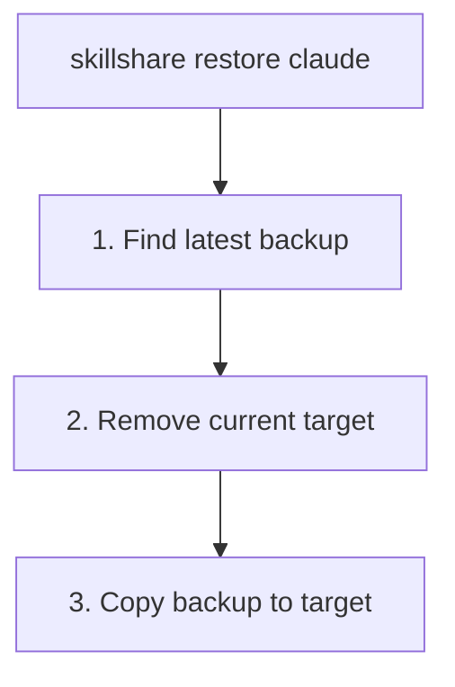

# restore

백업으로부터 target을 복원합니다.

```bash
skillshare restore                                     # Interactive TUI (browse + restore)
skillshare restore claude                              # Latest backup
skillshare restore claude --from 2026-01-19_10-00-00   # Specific backup
skillshare restore claude --dry-run                    # Preview
```

## 언제 사용하나요

- sync가 잘못되어 target을 이전 상태로 되돌려야 할 때
- target에서 skill을 실수로 제거했을 때
- 백업 버전을 대화형으로 탐색하며 현재 상태와 비교할 때

## 대화형 TUI

TTY에서 인수 없이 `skillshare restore`를 실행하면 먼저 백업과 휴지통 중 어디에서 복원할지 묻습니다. 백업을 고르면 target을 선택한 뒤 백업 버전을 둘러볼 수 있습니다. 각 버전에는 날짜, 크기, 현재 target과 비교해 추가되거나 제거될 항목이 표시되며, 여기서 오래된 버전을 삭제할 수도 있습니다. 휴지통을 고르면 trash TUI가 열립니다. 키는 화면 아래쪽에 표시됩니다.

TUI를 건너뛰고 일반 백업 목록을 보려면 `--no-tui`를 사용하세요.

## 동작 방식



## 옵션

| Flag | Description |
|------|-------------|
| `--all` | skill과 agent 모두 복원 |
| `--project, -p` | project mode 사용(`.skillshare/backups/`); **agent 전용** |
| `--global, -g` | global mode 사용(skill의 기본값) |
| `--from, -f <timestamp>` | 특정 백업에서 복원 |
| `--force` | 확인 없이 덮어쓰기 |
| `--dry-run, -n` | 변경 없이 미리보기 |
| `--no-tui` | 대화형 TUI 건너뛰고 백업 목록 표시 |

`restore`는 위치 인자로 kind도 받습니다: `skillshare restore agents claude`는 `claude` target의 agent 백업을 복원합니다.

## 백업 찾기

사용 가능한 백업 목록을 확인합니다.

```bash
skillshare backup --list
```

```
Backups  ~/.local/share/skillshare/backups
  2026-01-20_15-30-00  claude, cursor · 4.2 MB
  2026-01-19_10-00-00  claude · 2.1 MB
  2026-01-18_09-00-00  claude, cursor · 4.0 MB

3 backups, 10.3 MB

Next
  skillshare restore <target> --from <timestamp>  roll a target back
```

## 예시

```bash
# Restore from latest backup
skillshare restore claude

# Restore from specific backup
skillshare restore claude --from 2026-01-19_10-00-00

# Preview restore
skillshare restore claude --dry-run

# Force restore (skip confirmation)
skillshare restore claude --force
```

## 복원 후

`restore`는 target 디렉터리를 스냅샷의 내용으로 교체합니다. 백업은 로컬 콘텐츠만 캡처하므로 — symlink된 skill은 제외됩니다. [What Gets Backed Up](/docs/reference/commands/backup#what-gets-backed-up) 참고 — 동기화된 skill을 다시 가져오려면 이후에 `sync`를 실행하세요.

```bash
skillshare restore claude    # Restore local content from backup
skillshare sync              # Recreate symlinks for synced skills
```

복원된 콘텐츠는 symlink가 아닌 일반 파일입니다. target이 로컬 skill만 보유했던 경우 restore만으로 충분합니다.

## 사용 사례

### 실수로 삭제한 경우

skill을 실수로 삭제한 경우:

```bash
skillshare restore claude --from 2026-01-19_10-00-00
```

### 변경 사항 되돌리기

sync가 잘못된 경우:

```bash
skillshare restore claude  # Go back to pre-sync state
```

### 테스트

이전 skill 버전을 테스트하기 위해 복원합니다.

```bash
skillshare restore claude --from 2026-01-15_10-00-00
# Test old skills...
skillshare sync  # Return to current state
```

### Agent 복원

Agent 복원은 skill 복원과 유사하게 동작하며, `backup agents`(및 `sync agents` 실행 전에 자동으로 실행되는 자동 백업)로 생성된 병렬 `<target>-agents` 백업 항목에 대해 작동합니다.

```bash
skillshare restore agents claude                       # Latest agent backup for claude
skillshare restore agents claude --from 2026-01-19_10-00-00
skillshare restore agents -p                           # Project agents (the only project mode allowed)
skillshare restore --all claude                        # Skills + agents in one shot
```

project mode에서는 restore가 — backup과 마찬가지로 — agent에 대해서만 동작합니다. `agents` 인자 없이 실행하면 오류가 발생합니다.

```
restore is not supported in project mode (except for agents)
```

`skillshare backup --list`로 백업을 나열할 때, agent 백업은 `-agents` 접미사가 붙은 별도 항목으로 표시됩니다(예: `claude-agents`).

## 참고 항목

- [backup](/docs/reference/commands/backup) — 백업 생성 및 관리
- [sync](/docs/reference/commands/sync) — 복원 후 재동기화
- [Agents](/docs/understand/agents) — agent 리소스 모델
