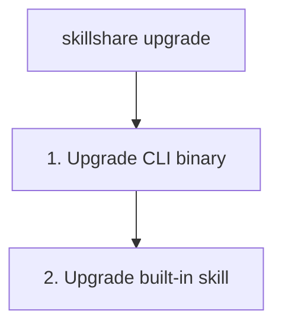

# upgrade

skillshare CLI binary와/또는 내장된 skillshare skill을 업그레이드합니다.

```bash
skillshare upgrade              # CLI와 skill 모두 업그레이드
skillshare upgrade --cli        # CLI만
skillshare upgrade --skill      # skill만
```

## 사용 시점

- 새 버전의 skillshare CLI가 있을 때
- 내장된 skillshare skill 업데이트가 필요할 때
- `doctor`가 업데이트 가능 여부를 보고한 후

```text
skillshare upgrade --skill --dry-run

! Dry run mode - no changes will be made

▸  Skill  skillshare
│
├─ Current  v0.21.12
│
├─ Checking latest version...
├─ Latest: v0.21.13 (1.0s)
│
└─ Action  Would upgrade to v0.21.13
```

## 동작 방식



## 옵션

| Flag | 설명 |
|------|-------------|
| `--cli` | CLI만 업그레이드 |
| `--skill` | skill만 업그레이드(설치되어 있지 않으면 프롬프트 표시) |
| `--force, -f` | 확인 프롬프트 생략 |
| `--dry-run, -n` | 변경 사항 적용 없이 미리보기 |
| `--help, -h` | 도움말 표시 |

## Homebrew 사용자

Homebrew로 설치했다면, `skillshare upgrade`는 자동으로 `brew upgrade`에 위임합니다.

```bash
skillshare upgrade
# → brew update && brew upgrade skillshare
```

Homebrew를 직접 사용할 수도 있습니다.

```bash
brew upgrade skillshare
```

## 예시

```bash
# 표준 업그레이드(CLI와 skill 모두)
skillshare upgrade

# 업그레이드될 내용 미리보기
skillshare upgrade --dry-run

# 프롬프트 없이 강제 업그레이드
skillshare upgrade --force

# CLI binary만 업그레이드
skillshare upgrade --cli

# skillshare skill만 업그레이드
skillshare upgrade --skill
```

## 업그레이드 후

skill을 업그레이드했다면, 배포를 위해 `skillshare sync`를 실행하세요.

```bash
skillshare upgrade --skill
skillshare sync  # 모든 target으로 배포
```

## 업그레이드 대상

### CLI 바이너리

`skillshare` 실행 파일 자체입니다. GitHub 릴리스에서 다운로드합니다.

터미널에서는 다운로드가 얼마나 받아졌는지 표시하므로, 연결이 느려도 멈춘 것처럼
보이지 않습니다. 아래의 Web UI 에셋도 동일하게 표시합니다.

```
Downloading v0.21.4...  3.2 MB / 9.1 MB
```

설치 스크립트의 기본 위치는 이제 `~/.local/bin`이며 일반적인 업데이트에는 `sudo`가 필요하지 않습니다. 기존 설치 위치는 유지됩니다.

binary가 보호된 디렉터리(예: `/usr/local/bin`)에 있으면, skillshare는 별도의 접두사 없이 `sudo`로 binary 교체만 수행합니다. 내장 skill, UI 에셋, 로그는 여전히 사용자 권한으로 기록되므로 업그레이드 전체를 `sudo`로 실행하지 마세요. skill 소스에 root 소유 파일이 남아 이후 `git pull`이 `Permission denied`로 실패합니다.

이전 업그레이드가 이미 그런 파일을 남겼다면 내장 skill 업데이트가 `permission denied`로 실패하며, 오류 메시지에 skill 소스를 다시 사용자 소유로 돌리는 명령이 표시됩니다. 예:

```bash
sudo chown -R "$(id -un)" ~/.config/skillshare/skills
```

비밀번호를 입력할 터미널이 없는 경우(대시보드의 **지금 업데이트** 버튼, CI)에는 입력을 기다리지 않고 업그레이드가 즉시 중단되며, 터미널에서 `skillshare upgrade`를 실행하라고 안내합니다. 캐시된 `sudo` 자격 증명이나 `NOPASSWD` 설정이 있으면 프롬프트 없이 업그레이드됩니다.

### Web UI 에셋

업그레이드 후, skillshare는 새 버전의 Web UI frontend asset을 미리 다운로드합니다. 이는 `~/.cache/skillshare/ui/<version>/`에 캐시되며 `skillshare ui`를 실행할 때 제공됩니다.

미리 다운로드가 실패하면(예: network 문제), 다음 `skillshare ui` 실행 시 대신 다운로드됩니다.

### skillshare Skill

AI CLI에 `/skillshare` command를 추가하는 내장 `skillshare` skill입니다. 위치:
```
~/.config/skillshare/skills/skillshare/SKILL.md
```

## 참고

- [update](/docs/reference/commands/update) — 다른 skill과 repo 업데이트
- [status](/docs/reference/commands/status) — 현재 버전 확인
- [doctor](/docs/reference/commands/doctor) — 문제 진단
