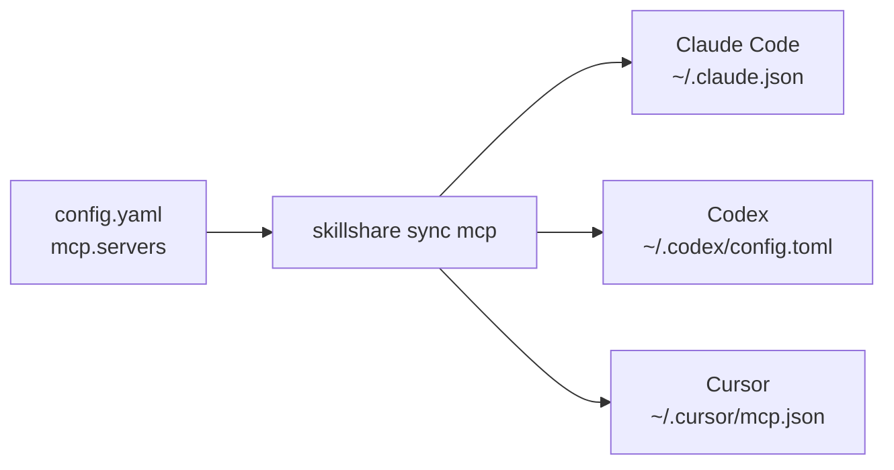

# 为你的 Agent 一次性设置 MCP

MCP 让 Agent 能够使用由其他程序或服务提供的工具。Skillshare
只需设置一次连接配置，就会为每个受支持的 Agent 写入其原生
配置。它不会运行网关，也不会让后台服务器持续运行。

受支持的 MCP 客户端包括 Claude Code、Codex（CLI、IDE 扩展与
ChatGPT 桌面应用共享同一份配置）、Cursor、VS Code、OpenCode、
Kilo Code、Grok CLI、Antigravity（AGY）、Amp、Claude Desktop、Cline、Copilot CLI、Factory、
Gemini CLI、Goose、Junie、Kiro、LM Studio、Warp 与 Windsurf，以及通过
[内置 MCP](/docs/reference/commands/mcp#pi) 支持的 Pi ≥ 0.99.0。
[目的地与身份验证限制](/docs/reference/commands/mcp#native-destinations)
请参见相应说明。控制台会显示你目前范围内可用的客户端。

例如，将 Playwright 与 Amp、Gemini CLI 及 Kiro 共享：

```yaml
mcp:
  servers:
    playwright:
      command: npx
      args: ["-y", "@playwright/mcp@latest"]
      targets: [amp, gemini, kiro]
```

你不需要学习每个客户端各自的 JSON 或 YAML 格式。当你运行 `skillshare sync mcp` 时，
Skillshare 会自动转换该定义。接收端的客户端会启动该命令，因此该客户端的运行环境中
必须具备 Node.js/npx。

## 从引导式设置开始

运行 `skillshare mcp` 即可在终端中浏览与管理连接。使用 `/`
筛选，`e` 编辑，`d` 移除，或 `r` 从备份
还原。每一次互动式变更都会在保存前先行预览。使用
`skillshare mcp --no-tui` 可获得纯文字状态输出。

如果这是全新安装，请先初始化 Skillshare，然后运行：

```bash
skillshare mcp add
```

粘贴由你的 MCP 提供者所提供的 URL 或 JSON，为其命名，选择你的
Agent，并检查变更内容。**Save and sync** 会立即应用设置；
**Save only** 会保留该定义，供之后执行 `skillshare sync mcp` 时使用。

在控制台中，**Add server** 接受两种形式：填写字段，或粘贴
一份配置。粘贴选项也可以加载一个文件，其作用相当于浏览器版本的
`mcp import --file`。粘贴的 JSON 会被自动识别；对于
TOML，则需要选择它来自 Codex 还是 Grok。如果粘贴的内容只有一个服务器且勾选了 Pi，
对话框还会显示表单中的 Pi 设置：工具暴露方式和其他 Pi 设置。**Import from a target** 是
另一个独立功能，用于读取某个已安装 Agent 已有的服务器。无论哪种方式，
控制台都使用与 CLI 相同的来源、验证、预览与冲突规则。MCP 页面 Sync 框中的
**Sync MCP** 只写入 MCP 配置文件。Sync 页面也提供
**Sync all resources**，用于同步 Skill、Agent、extras 与 MCP。

Pi 的导入来源菜单会列出 Pi 的 `mcp.json`，以及（针对 0.23.0 之前用
`pi-mcp-adapter` 设置的服务器）它的 `mcp-adapter.json`；每一项只读取对应的文件。
adapter 文件只会被读取：同步会把导入的服务器写入 Pi 的 `mcp.json`。显示的路径遵循当前范围、
`PI_CODING_AGENT_DIR` 与自定义账号目录。项目导入读取该项目的 `.pi/`。
个人服务器与凭据请保留在全局文件；项目文件只应用于受信任的项目。


Config editor 在你保存时会使用两个空格缩进格式化 YAML，
并保留注释。点击某个字段即可在右侧面板中查看其说明，
包括 `mcp`、`sources.mcp`、连接字段与环境变量引用。

同步之后，请重新加载你的 Agent。并在该 Agent 中完成任何登录或授权。
Skillshare 不会测试连接、安装服务器程序，或复制登录会话。同步成功
只代表配置已被写入，并不代表某次工具调用已经成功。

## 了解两种连接类型

| 提供者给你的东西 | 连接方式 | 示例 |
|---|---|---|
| 一个命令与参数 | `stdio`：Agent 会启动一个本地进程 | `command: npx` 加上 `args` |
| 一个 MCP 端点 URL | Streamable HTTP：Agent 会连接到一个正在运行的服务 | `url: https://example.com/mcp` |

无论哪一种，定义都只保存一次，再写入每个 Agent 自己的文件：



你通常不需要设置 `transport`；Skillshare 会从 `command`
或 `url` 中自动推断。URL 既可以指向你自己电脑上的服务，也可以指向远程服务。
请使用提供者实际的 MCP 端点，而不是一般网站的 URL。旧式的 SSE
配置会被拒绝，而不是被静默转换。

## 限制哪些工具提供给模型

一个服务器可能提供很多工具。设置一次 `tools` 就能只保留其中一部分，或隐藏部分工具，
Skillshare 会按每个 Agent 自己的格式写入：

```bash
skillshare mcp edit github --tools-allow 'get_*,search_code' --tools-deny get_secret
skillshare sync mcp --dry-run
```

在控制台中，打开该服务器并使用它的 **工具** 区块；**加载工具**
会列出服务器的工具，取消勾选不想给模型用的工具。Pi 会应用完整的策略；Codex 与
Copilot CLI 会应用精确名称；其他 Agent 不会应用。预览与
`skillshare mcp check` 会指出每个未应用部分策略的 Agent。参见
[工具策略](/docs/reference/commands/mcp#tool-policy)。

## 将所有内容保存在同一个文件中

这是默认方式。你现有的 Skill 与 Agent 仍然是目录型 Source；
MCP 连接则是 `mcp.servers` 下的结构化设置：

```yaml
sources:
  skills: ~/.config/skillshare/skills
  agents: ~/.config/skillshare/agents

mcp:
  targets: [claude, codex, cursor, vscode]
  servers:
    company-docs:
      url: https://docs.example.com/mcp
```

`company-docs` 是你自己选择的名称。它本身不会安装或查找任何服务器。
请将示例中的 URL 替换成你的提供者端点。`mcp.targets` 会独立于你的 Skill
Target 来选择接收方客户端。某个服务器自身可选的 `targets` 列表会覆盖该默认值。

## 将 MCP 拆分到独立文件中 {#split-mcp-into-its-own-file}

当你想要单独共享或进行版本控制时，可以使用外部 Source：

```yaml title="config.yaml"
sources:
  skills: ~/.config/skillshare/skills
  agents: ~/.config/skillshare/agents
  mcp: ./mcp.yaml

mcp:
  targets: [claude, codex, cursor]
```

```yaml title="mcp.yaml"
servers:
  company-docs:
    url: https://docs.example.com/mcp
```

相对路径会以包含 `config.yaml` 的目录为基准解析。
对于 `.skillshare/config.yaml` 而言，`./mcp.yaml` 指的就是 `.skillshare/mcp.yaml`。
同样也支持绝对路径与 `~/`。
要通过 `push` / `pull` 在机器之间共享这个文件，请把它放在 `root` 作用域的
repository 中；请参阅 [Cross-Machine Sync — MCP servers](/docs/how-to/sharing/cross-machine-sync#mcp-servers)。

请**同一时间只使用一种 Source**：`sources.mcp` 与 `mcp.servers` 不能共存，
包括 `mcp.servers: {}` 的情况。若要切换，请将 `servers` 映射移入外部
文件，加入 `sources.mcp`，并移除内联的 `mcp.servers`。`mcp.targets` 仍保留在
`config.yaml` 中。同步前请先预览：

```bash
skillshare sync mcp --dry-run
```

CLI 与控制台的编辑都遵循当前生效的 Source。缺失或无效的
外部文件会阻止同步；这绝不代表“删除所有服务器”。请使用明确的
`servers: {}` 来有意移除定义，然后预览受管理的移除操作。

## 本地程序与凭证

```yaml
mcp:
  targets: [claude, codex]
  servers:
    internal-tools:
      command: company-mcp
      args: [--workspace, /path/to/workspace]
      env:
        COMPANY_TOKEN:
          fromEnv: COMPANY_TOKEN
    company-docs:
      url: https://docs.example.com/mcp
      bearerToken:
        fromEnv: DOCS_TOKEN
```

请自行安装所需的本地程序。该 Agent 必须能够在其自身的运行环境中找到该程序
并读取任何被引用的环境变量。仅在终端中设置的变量，可能无法传达到从桌面启动的
Agent 中。

Skillshare 只会写入变量引用，绝不会解析它们。请让实际的令牌
远离源文件、URL 与命令参数。已知的敏感环境变量或标头 key 需要使用
`fromEnv`。Import 会将可识别的明文密钥（包括像 `DATABASE_URL` 这类
URL 值中的密码）转换为引用，并回报你需要设置的变量。命令参数没有
可移植的引用语法：当参数看起来像凭证时，Import 会发出警告，但仍会将其
保留为明文。Import 无法识别所有凭证格式，例如藏在 URL 路径中的令牌。

Codex 会依名称转发本地变量，因此当选择 Codex 时，`env.KEY.fromEnv` 也必须
是 `KEY`。当某个 Target 无法表示某项设置时，会阻止预览，而不是直接丢弃它。
客户端专属的占位符与输入提示，必须在 Import 前先行明确解析。Agent 专属的
字段，例如 Codex 的 `startup_timeout_sec` 或 `cwd`，不会被 Import；Import 会将其
列为警告，sync 则会保留该 Agent 现有条目中的这些字段。

## 导入现有连接

```bash
skillshare mcp import                         # 选择一个 Agent 与一个 server
skillshare mcp import docs --from claude --target claude --target codex --sync
```

一次只能 Import 一个 server。当某个 Agent 的条目已经与被导入的
定义相符时，它会被纳入管理，而不会更改该 Agent 的文件。当两者
不同时——最常见的原因是明文令牌被转换成了环境变量引用——CLI 会
停止操作，而不是覆写一个原本可正常运作的条目。请先设置回报的
变量，然后加上 `--replace` 重新运行，或者将该 Agent 排除在 `--target` 之外。
控制台的预览会将同一条目显示为冲突。

如果 Source 中已经存在该名称，请使用控制台的 **Edit** 操作，或
CLI 的 `--replace`。在 Import 时，`--replace` 也会重写被导入 Agent 自身的
条目；**Save only** 则会将该条目记录为基准，但不改动
文件，因此下一次同步会重写它，并且仍能检测到期间所做的编辑。它
绝不会覆盖其他有冲突的原生条目。在 MCP 控制台中，可以处理的
冲突会提供一个以该 Agent 命名的导入操作，例如 **Import from
cursor**，用于采用该版本；或 **Replace with source**，用于覆写该条目。
如果某个冲突是由另一份仍然存在的 Skillshare 配置所拥有，则这两个
操作都不会出现，因为只有那份配置才能释放该条目。

如果某个 Agent 已经有同名的 server，也可以用这种方式接管它：
把它加入 Source。如果该 Agent 的条目已经相同，下一次预览会列为 **接管**，
同步时只记为受管理、不改动文件；导入后才勾选来源 Agent 时就是这种情况。
如果内容不同，预览会将它显示为冲突，而不会覆写它。你可以 import 它以采用
该 Agent 的版本，或用 Source 中的定义替换它。

MCP 控制台也会查找 Agent 配置文件中已有、但 Skillshare 并未管理的 server。
找到时，server 列表上方会有一条提示，说明有多少个、位于哪些 Agent 中；
**Import** 会为其中第一个 Agent 打开导入。项目的 **MCP** 标签页也会对该项目的
文件做同样的事，并导入到该项目。参见 [Skillshare 未管理的 server](/docs/reference/commands/mcp#unmanaged-servers)。

## 在单一项目中关闭某个全局 server

Agent 全局配置中的某个 server，会在每个项目中都被加载。若要在
某个项目中将其关闭，请在该项目内运行以下命令，并使用该 server 在
该 Agent 全局配置中所使用的名称：

```bash
skillshare mcp add company-docs --disabled --target opencode
skillshare sync mcp
```

在控制台中，从项目文件夹使用 `skillshare ui` 打开它，选择 **添加服务器** 旁边的
**关闭全局服务器** 按钮。

此功能适用于 Claude Code、OpenCode、Kilo Code 与 Pi 1.0.1 及以上版本。其他 Agent
则会被拒绝。
[命令参考文档](/docs/reference/commands/mcp#turn-off-a-global-server-in-one-project)
说明了针对每个 Agent 会写入什么内容，以及为何其他 Agent 不受支持。


## 移除与还原

```bash
skillshare mcp remove company-docs
skillshare sync mcp --dry-run
skillshare sync mcp
```

只有先前由该配置管理、且未被更改过的条目才会被移除。
未受管理的条目，以及被其他程序编辑过的条目，都会受到保护。若某个 Agent
条目在 Skillshare 开始管理它之前就已经与 Source 相符（例如在项目被移动之后），
该条目也会被保留；如果希望 Skillshare 移除它，请先将其 import。

在控制台中，请使用某个 server 行上的删除操作。对话框会列出每个
将发生变更的 Agent 文件。**Remove from source only** 相当于不进行同步的
`mcp remove`；**Remove and sync** 也会清理 Agent 文件，并且在存在
冲突时会被停用。

若要停止管理某个 server，但将它保留在 Agent 中，请使用 `--keep-files` 移除它，
或在控制台的删除对话框中选择 **Stop managing**：

```bash
skillshare mcp remove company-docs --keep-files
```

不会有任何 Agent 文件被更改，之后的同步也不会动这些条目。参见
[停止管理某个 server](/docs/reference/commands/mcp#stop-managing-a-server)。

每一次原生文件的变更，都会为受影响的 MCP 条目建立一份私有备份。
Skillshare 会为每个 Agent 文件保留最新的 20 份备份。输出内容包含
其 ID：

```bash
skillshare mcp restore BACKUP_ID --dry-run
skillshare mcp restore BACKUP_ID
```

在控制台中，**Backups & restore** 会按天列出备份。预览某个
备份即可查看它将还原的条目，然后选择 **Restore this file**。

还原操作会保留不相关的设置，并拒绝覆盖对受影响条目所做的更新的更改。
它不会还原你的 Source 文件；如果希望还原结果能在下一次同步后依然有效，
也请同时编辑 Source。备份中可能包含旧的原生凭证，因此请妥善保护本地状态目录的私密性。

写入操作是以单一文件为单位、原子性的。若在多个文件写入过程中途失败，
已完成的文件仍会保持已应用状态，并回报其备份 ID。修正回报的原因后
重试即可。下一次 MCP 写入操作（例如 `sync mcp` 或控制台的同步）会继续
完成一次中断写入的恢复，且预览已经会显示该结果。如果该 Agent 文件在
此期间又被再次编辑，则不再匹配的条目会被回报为冲突。
请勿透过删除所有权状态来“修复”冲突：现有条目将因此变成
未受管理状态，需要重新明确执行 import。如果某个条目的所属配置
已被删除，则不需要这么做：冲突会将它回报为残留条目，直接从该
冲突执行 import 或替换即可接管它。

支持的路径、参数与目前的限制，请参见 [MCP 命令参考文档](/docs/reference/commands/mcp)。
