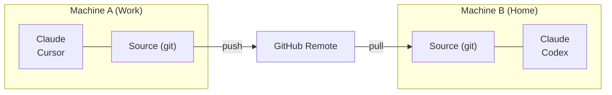

# Cross-Machine Sync

使用 git 在多台电脑之间同步你的 Skill。

## Overview



---

## First Machine Setup

### Interactive（引导式提示）

```bash
skillshare init --remote git@github.com:you/my-skills.git
```

### Non-interactive（无提示）

```bash
# Remote 已有你的 Skill（或从空白 Source 开始）
skillshare init --remote git@github.com:you/my-skills.git --no-copy --all-targets --no-skill

# 第一台机器已有既有的 Claude Skill：在 init 时一并导入
skillshare init --remote git@github.com:you/my-skills.git --copy-from claude --all-targets --no-skill
```

这会：
1. 建立 Source 目录
2. 以初始 commit 初始化 git
3. 加入 remote
4. 自动侦测并设置 Target

之后可选（仅在设置完成后又安装了其他 AI CLI 时才需要）：

```bash
skillshare init --discover
```

接着 push 你的 Skill：
```bash
skillshare push
```

:::tip 已经初始化过？
为既有设置加入 remote：
```bash
skillshare init --remote git@github.com:you/my-skills.git
```
即使在初次设置之后执行，这个指令依然有效——它只会加入 remote。
:::

---

## Second Machine Setup

运行 `skillshare init`，选择 **Connect my existing skillshare repo**，再粘贴 repo URL：

<p>
  
</p>

也可以直接传入 URL：

```bash
skillshare init --remote git@github.com:you/my-skills.git
```

Init 会先检查 repo（不写入任何东西），再把它拉取下来，不需要手动执行 `git clone`。

:::info 背后发生了什么
1. 把 repo clone 到临时文件夹，统计 skills 数量并判断结构：用 `--git-root root` 推送的整个文件夹，或放在 `skills/` 文件夹中的 skills
2. 这台机器上与 repo 同名的 skills 使用 repo 版本；只存在于这台机器的 skills 会保留，并在下次 `skillshare push` 时加入 repo
3. 确认后：创建 source、初始化 git、添加 remote、重置为 remote 分支并设置 tracking
4. 配置检测到的本地 targets，并询问是否进行首次同步
:::

若你偏好手动控制：

```bash
# 直接 clone，再以既有 Source 执行 init
git clone git@github.com:you/my-skills.git ~/.config/skillshare/skills
skillshare init --source ~/.config/skillshare/skills
skillshare sync
```

---

## Daily Workflow

### Machine A：修改并 push

```bash
# 编辑 Skill（透过 symlink，变更会立即可见）
$EDITOR ~/.config/skillshare/skills/my-skill/SKILL.md

# 可选：建立本地检查点而不 push
skillshare commit -m "Update my-skill"

# 准备好分享时再 push 到 remote
skillshare push -m "Update my-skill"
```

### Machine B：拉取并 sync

```bash
skillshare pull
```

就这样。`pull` 会在拉取后自动执行 `sync`。它会按照 [git root scope](/docs/reference/targets/configuration#git-root) 包含的内容执行 sync：默认是 skills，agents / extras 作用域同步对应资源，`git_root: root` 则三者都同步。Plugins、MCP server 和 hooks 需要下面的额外步骤。

### 一条命令双向同步

如果你在多台机器上编辑 skills，请改为运行下面这条命令，而不是分别运行 `push` 和 `pull`：

```bash
skillshare push --pull -m "Update my-skill"
```

它会 commit 你的更改，合并其他机器推送的内容，然后 push 并 sync targets。如果遇到冲突，它会在推送任何内容之前停止。参见 [同时 Push 与 Pull](/docs/reference/commands/push#push-and-pull-together)。

---

## Plugins, MCP and Hooks {#plugins-mcp-hooks}

`push` 和 `pull` 只对 git root 目录中的文件做版本控制。Plugins、hooks 和 MCP server 是 `config.yaml` 中的设置，而 `config.yaml` 永远不在这个 repository 中：默认的 `skills` scope 把它放在 repo 之外，`root` scope 则会 ignore 它。每台机器都保留自己的 `config.yaml`，以及自己的 targets 和路径。

| 资源 | 存储位置 | 是否随 `push` / `pull` 移动 |
|---|---|---|
| Skills | Skills source | 是 |
| Agents | Agents source | `git_root: agents` 或 `root` 时 |
| Extras | Extras source | `git_root: extras` 或 `root` 时 |
| MCP servers | `config.yaml`，或 `sources.mcp` 指定的文件 | 仅当该文件位于 repository 内时 |
| Plugins | `config.yaml` 中的 `plugins:` | 否 |
| Hooks | `config.yaml` 中的 `hooks:` | 否 |

在另一台机器 pull 之后，其余部分需要自己应用：

```bash
skillshare pull
skillshare sync --all              # 加上 agents、extras、MCP 和 hooks
skillshare sync plugins --no-tui   # plugins 永远不包含在 --all 中
```

### MCP servers {#mcp-servers}

把 server 定义放在 repository 内的独立文件中。使用 `git_root: root` 时，repository 就是存放 `config.yaml` 的目录（`~/.config/skillshare`，Windows 上是 `%AppData%\skillshare`），因此相对路径的 `sources.mcp` 会被 commit，而 `config.yaml` 留在本地：

```yaml title="config.yaml（每台机器各自设置）"
sources:
  mcp: ./mcp.yaml

mcp:
  targets: [claude, codex]
```

`mcp.targets` 保留在 `config.yaml` 中，因此每台机器可以各自选择接收的 client。每台机器都要设置 `sources.mcp`。要把现有 server 移出 `config.yaml`，请参阅 [将 MCP 拆分到独立文件中](/docs/how-to/daily-tasks/sharing-mcp#split-mcp-into-its-own-file)。要把现有设置切换到 `root` scope，请参阅 [`git_root`](/docs/reference/targets/configuration#git-root)。

Skillshare 把凭据保存为 `fromEnv` 引用，从不保存实际的值。请在每台机器上设置这些环境变量，并确保 Agent 能读取到。

### Plugins {#plugins}

Plugin 定义不会通过 git 传递。请在每台机器上从相同的来源重新添加：

1. 在第一台机器的 dashboard 打开 **Plugins → Share**，复制命令。它会列出从 HTTPS Git 来源添加的 plugins，例如：

   ```bash
   skillshare plugin add https://github.com/acme/plugins --plugin review -g --no-tui
   ```

2. 在另一台机器运行该命令，在 Plugins 页面勾选 Agents，然后运行 `skillshare sync plugins`。

需要在多台机器上使用的 plugin，请用 **Add plugin** 从来源添加，而不是 **Import installed**。Import 只记录 native 安装。在另一台机器上，Claude 和 Codex 会从同名的 native marketplace 重新安装；如果那台机器没有注册该 marketplace，这个 plugin 就会被跳过。Cursor 和 Antigravity 则完全无法重新安装 imported plugin。从本地目录添加的 plugin 不会出现在 **Share** 中，因为该路径只存在于第一台机器上。

`sync plugins` 会安装缺少的 plugins，已安装的保持不变。要更新它们，先运行 `skillshare plugin check`，再运行 `skillshare plugin update`。请参阅 [跨工具管理 plugins](/docs/how-to/daily-tasks/sharing-plugins#updates-and-recovery)。

### Hooks {#hooks}

Hooks 没有独立的文件。把 `config.yaml` 的 `hooks:` 部分复制到另一台机器，然后运行 `skillshare sync hooks`。

### What Stays on Each Machine {#per-machine}

- 安装 plugin 用的 native CLI（`claude`、`codex` 等）必须安装在 Skillshare 运行的环境中，并且位于 `PATH` 上。计划任务的 `PATH` 通常比你的终端短。Codex 也会从 Codex 桌面 app 和 Homebrew 的文件夹里找；装在其他位置的机器，请设置 [`SKILLSHARE_CODEX_CLI`](/docs/reference/appendix/environment-variables#skillshare_codex_cli)。
- 登录状态、OAuth token、native 信任确认以及启用/禁用状态，都保留在各个 Agent 中。
- MCP server 引用的环境变量的值。

---

## Commands

### Commit

建立本地检查点而不 push：

```bash
skillshare commit                  # 默认讯息
skillshare commit -m "Add pdf"     # 自定义讯息
skillshare commit --dry-run        # 预览
```

**实际执行内容：**
```
git add -A
git commit -m "Add pdf"
```

`commit` 不需要 remote，也绝不会 push。

### Push

Commit 并 push 本地变更：

```bash
skillshare push                  # 自动生成讯息
skillshare push -m "Add pdf"     # 自定义讯息
```

**实际执行内容：**
```
git add -A
git commit -m "Add pdf"
git push          # 首次 push 时自动设置 upstream
```

### Pull

拉取 remote 变更并 sync：

```bash
skillshare pull
```

**实际执行内容：**
```
git pull           # 两台机器都有新 commit 时会合并；首次拉取时改用 fetch + merge 或 reset
skillshare sync
```

---

## Conflict Handling

### Pull 失败（本地有未 commit 的变更）

若想保留本地变更但还不打算 push，先在本地 commit：

```bash
skillshare commit -m "Save local changes"
skillshare pull
```

### Push 失败（remote 领先）

```
$ skillshare push
Push failed
  Remote may have newer changes
  Run: skillshare pull
  Then: skillshare push
```

**解法：**
```bash
skillshare pull
skillshare push
```

### Pull 仍因本地未 commit 的变更而失败

```
$ skillshare pull
Local changes detected
  Run: skillshare push
  Or:  cd ~/.config/skillshare/skills && git stash
```

**解法：**
```bash
# 选项 1：先在本地 commit
skillshare commit -m "Local changes"
skillshare pull

# 选项 2：先 push 你的变更
skillshare push -m "Local changes"
skillshare pull

# 选项 3：暂时 stash 变更
cd ~/.config/skillshare/skills
git stash
skillshare pull
git stash pop
```

### Merge 冲突

两台机器都有新 commit 时，`pull` 会把它们合并。`.metadata.json` 的冲突会自动解决。其他文件发生冲突时，`pull` 会停止、撤销合并，并列出冲突的文件：

```
$ skillshare pull
pull stopped: this machine and the remote both changed my-skill/SKILL.md; the merge was undone, resolve it with git in ~/.config/skillshare/skills
```

**解决方法：**
```bash
cd ~/.config/skillshare/skills
git pull --no-rebase          # 重新合并并保留冲突
# 编辑冲突文件
git add .
git commit --no-edit
skillshare push
skillshare sync
```

---

## Check Status

```bash
skillshare status
```

会显示：
- Git 状态（clean、ahead、behind）
- Remote 设置
- Sync 状态

---

## Private Repository

私有仓库请使用 SSH URL：

```bash
skillshare init --remote git@github.com:you/private-skills.git
```

---

## Tips

### 使用 SSH 密钥

设置 SSH 密钥以避免密码提示：
```bash
ssh-keygen -t ed25519 -C "your@email.com"
# 将公钥加入 GitHub
```

### dotfiles 的可移植路径

若你透过 dotfiles 分享 `config.yaml`，启用 `preserve_tilde_on_save` 可将路径保持为 `~/...`，而不是 `/home/alice/...`：

```yaml
preserve_tilde_on_save: true
```

这能避免同一份 config 在不同用户名或不同 OS 家目录前缀的机器间使用时产生杂讯般的 diff。参见 [Configuration — preserve_tilde_on_save](/docs/reference/targets/configuration#preserve_tilde_on_save)。

### 多个 remote

加入备用 remote：
```bash
cd ~/.config/skillshare/skills
git remote add backup git@gitlab.com:you/skills-backup.git
git push backup main
```

### 在 shell 启动时 sync

加入 `~/.bashrc` 或 `~/.zshrc`：
```bash
# 在开启终端时 sync skillshare（若已设置 remote）
skillshare pull 2>/dev/null
```

---

## Alternative: Install from Config {#alternative-install-from-config}

若不想设置 git remote，`config.yaml` 也能当作可移植的 Skill 清单。每次 `install` / `uninstall` 都会自动更新 `skills:` 区块，而 `skillshare install`（不带参数）会重新安装清单中的所有项目：

```bash
# Machine A —— config.yaml 记录你安装过的内容
skillshare install anthropics/skills -s pdf
# config.yaml 现在会有：skills: [{name: pdf, source: "..."}]

# Machine B —— 复制 config.yaml，然后：
skillshare install      # 安装清单中的所有 Skill
skillshare sync
```

### 该用哪一种

| | `push` / `pull` | `install`（不带参数） |
|---|---|---|
| 同步的内容 | 实际 Skill 文件（完整内容） | 仅同步来源 URL——安装时重新下载 |
| 本地/手写 Skill | 包含在内 | 不包含（没有来源 URL） |
| 所需设置 | Source 目录需有 Git remote | 只需 `config.yaml` |
| Project mode | 仅限 Global | 可搭配 `-p`（`.skillshare/config.yaml`）使用 |
| 维护方式 | 变更后手动 `push` | 于 install/uninstall 时自动调解 |

**建议**：个人跨机器同步请用 `push`/`pull`。团队 onboarding 与专案设置请用 config 中的 `install`。

---

## See Also

- [push](/docs/reference/commands/push) — Push 到 remote
- [pull](/docs/reference/commands/pull) — 从 remote pull
- [install](/docs/reference/commands/install#install-from-config-no-arguments) — 从 config 安装
- [Organization-Wide Skills](./organization-sharing.md) — 团队分享
- [init](/docs/reference/commands/init) — 以 `--remote` 执行 init
