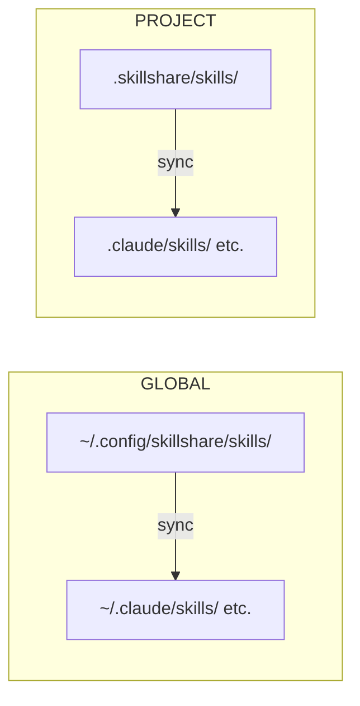

# 简介

**你的 AI coding 环境，随处可用。**

skillshare 在同一处管理 skills、agents、rules、MCP 连接与 hooks。通过[桌面应用](/docs/getting-started/desktop-app)或 CLI，在切换 AI 工具、机器或项目时带着你的设置一起走。

## 为什么选择 skillshare？

- **换工具，保留你的设置** —— 维护你掌控的 Source，选择每个支持的工具要接收哪些资源。
- **把设置带到其他机器** —— 用 Git 管理 Source 的版本，再带到另一台机器。
- **共享项目上下文** —— 把团队 skills 与配置放在代码旁，并用 lockfile 记录远端 skill 的 commit。

例如，一位同事用 Claude Code，另一位用 Codex，两人都需要同一份针对旧版 API 的代码审查清单。把清单放在 `.skillshare/skills/`，并提交项目配置。新成员安装配置中声明的远端 skills，再同步到配置的 targets，省下从聊天记录找指令、复制粘贴的工作。

完整流程请见[团队入职 recipe](/docs/how-to/recipes/team-onboarding-recipe)。共享指令能减少配置分歧；每个 AI 工具仍有各自的能力、权限与行为。

## 快速开始

```bash
# Install
curl -fsSL https://raw.githubusercontent.com/runkids/skillshare/main/install.sh | sh
```

只有安装器显示 PATH 设置提示时，才需要按提示设置后再运行下方命令。没有 PATH 警告就不需要额外设置。

```bash

# Initialize (auto-detects CLIs, sets up git)
skillshare init

# Install a skill
skillshare install anthropics/skills/skills/pdf

# Sync to all targets
skillshare sync
```

你的 skill 现在已可供配置的 targets 使用。

:::tip[不安装也能试用]
想先体验一下？用 [Docker Playground](/docs/how-to/advanced/docker-sandbox#playground) —— 一条命令，无需本地安装：

```bash
git clone https://github.com/runkids/skillshare.git && cd skillshare
make playground
```
:::

## 工作原理



编辑 Source 中已有的 skill，使用链接的 targets 就会立即看到变更。copy mode 需要运行 `sync` 才会更新副本。默认的 merge mode 在添加、移除或重命名 skills 后，也需要运行 `sync`。

Global mode 管理你的个人设置与已安装的团队仓库；Project mode 管理单个代码项目的资源与配置。Git pull 会带回项目文件；接着运行 `skillshare install -p` 与 `skillshare sync -p`，才能在本地应用项目声明的 skills。

## 核心特性

- **自动检测** —— `cd` 进入带有 `.skillshare/` 的项目，skillshare 自动切换到 Project mode
- **Global 与 Project 范围** —— Global mode 管理个人与组织共享资源；Project mode 管理特定代码项目的资源
- **链接更新** —— 编辑已有 skill，使用 symlink 的 targets 就会立即反映变更
- **面向团队** —— 组织级 skills 走 tracked repos，项目级 skills 走 git commit
- **任意 Git 托管** —— 可从 GitHub、GitLab、Bitbucket、Azure DevOps、AtomGit、Gitee 或任意自建 Git 安装、更新与检查
- **安全审计** —— 使用前扫描 skills 中已知的注入与数据外泄模式。Audit 是静态分析；执行权限仍由 AI 工具管理

## 支持的平台

| 平台 | Source 路径 | 链接类型 |
|----------|-------------|-----------|
| macOS/Linux | `~/.config/skillshare/skills/` | Symlinks |
| Windows | `%AppData%\skillshare\skills\` | 文件夹用 NTFS Junctions；单个文件用 symlinks（需要 Developer Mode，否则复制） |

## 下一步

### 独立开发者

1. [第一次 Sync](/docs/getting-started/first-sync) —— 5 分钟完成同步
2. [创建 Skills](/docs/how-to/daily-tasks/creating-skills) —— 写下你的第一个 skill
3. [跨机器 Sync](/docs/how-to/sharing/cross-machine-sync) —— 让 skills 在多台机器间保持一致

### 团队负责人／组织

1. [组织级 Skills](/docs/how-to/sharing/organization-sharing) —— 在团队内共享规范
2. [项目配置](/docs/how-to/sharing/project-setup) —— 配置项目范围的 skills
3. [安全审计](/docs/reference/commands/audit) —— 部署前扫描第三方 skills

### 已经有 Skills 了？

- [从现有 Skills 迁移](/docs/getting-started/from-existing-skills) —— 迁移与整合

### 了解更多

- [核心概念](/docs/understand) —— Source、Targets、Sync 模式
- [命令参考](/docs/reference/commands) —— 所有可用命令
- [Docker Sandbox](/docs/how-to/advanced/docker-sandbox) —— 在隔离环境中体验 skillshare
- [FAQ](/docs/troubleshooting/faq) —— 常见问题
