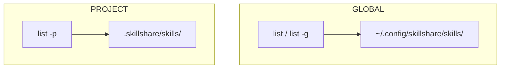
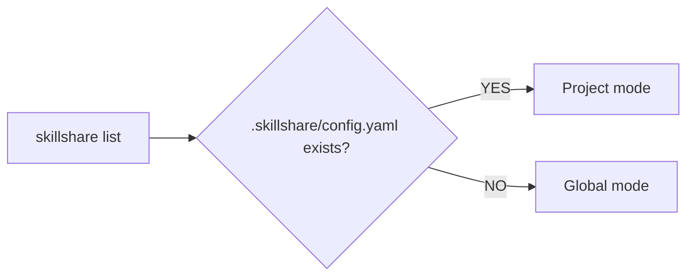

# list

列出 source 目录中所有已安装的 skills。

```bash
skillshare list              # Interactive TUI (default on TTY)
skillshare list --verbose    # Detailed plain text view
skillshare list --json       # JSON output for CI/scripts
```

## 何时使用

- 查看已安装了哪些 skills 以及它们的来源
- 交互式地搜索和过滤 skills
- 检查哪些 skills 是 tracked repos，哪些是本地的
- 在清理之前审查你的 skill 集合

```text
skillshare list --no-tui

Skills
  _superpowers/skills/
    brainstorming                tracked: _superpowers
    dispatching-parallel-agents  tracked: _superpowers
    systematic-debugging         tracked: _superpowers
    …
  frontend/
    react-components             local
  web/
    accessibility                github.com/addyosmani/web-quality-skills/skills...
    core-web-vitals              github.com/addyosmani/web-quality-skills/skills...
    …
  docx                           github.com/anthropics/skills/skills/docx
  frontend-design                github.com/anthropics/skills/skills/frontend-de...
  pdf                            github.com/anthropics/skills/skills/pdf
  skill-creator                  github.com/anthropics/skills/skills/skill-creator
  skillshare                     github.com/runkids/skillshare/skills/skillshare
  …

Tracked repos
✓ _superpowers  up to date · 15 skills

28 skills · 15 tracked, 9 remote, 4 local
  Add -v for sources and install dates
```

## 交互式 TUI

在 TTY 上，`skillshare list` 会打开交互式界面，skills 和 agents 各在一个标签页：左侧是列表，右侧是所选项目的详情。在这里可以更新、卸载或审计（audit）skill，启用或禁用 skill（立即写入 `.skillignore`），以及阅读它的文件。常用按键列在界面底部，按 `?` 可查看全部按键。

- **智能过滤** —— 按 `/` 按名称、路径或来源过滤。支持标签语法以实现精确过滤：

  | Tag | Short | Values | Example |
  |-----|-------|--------|---------|
  | `type:` | `t:` | `tracked`, `remote`, `local`, `github` | `t:tracked` |
  | `group:` | `g:` | any directory name | `g:security` |
  | `repo:` | `r:` | any repo name | `r:team` |
  | `kind:` | `k:` | `skill`, `agent` | `k:agent` |
  | `status:` | `s:` | `enabled`, `disabled` | `s:disabled` |

  标签可以与自由文本组合（AND 逻辑）：
  ```
  t:tracked g:security audit
  ```
  这会仅显示 "security" group 中名称包含 "audit" 的 tracked skills。

- **仅手动切换** —— 按 `m` 切换所选 skill 的 `SKILL.md` 中的 `disable-model-invocation`。
  该 skill 仍保持已安装状态，你仍可以按名称调用它，但模型不会再自主加载它；详情面板会显示
  **manual only** 徽章。与 `t` 不同，这会编辑 skill 文件本身：对于 tracked 或已安装的 skill，
  TUI 会先询问，因为 `skillshare update` 会跳过有本地更改的 tracked repos，而重新安装某个 skill
  会丢弃该编辑。再次按 `m` 会移除该行并完全恢复文件。Agents 不受影响。
  [dashboard](/docs/reference/commands/ui) 显示相同的 **manual only** 标签，并在其 skill 编辑器中提供该开关。

使用 `--no-tui` 跳过 TUI，改为打印纯文本：

```bash
skillshare list --no-tui          # Plain text output
skillshare list --no-tui | less   # Pipe to pager manually
```

## 搜索与过滤

无需进入 TUI 即可过滤 skills：

```bash
skillshare list react                     # Filter by name/path/source
skillshare list --type local              # Only local skills
skillshare list --type github             # Only GitHub-sourced skills
skillshare list --status disabled         # Only skills disabled via .skillignore
skillshare list --status enabled --json   # Enabled skills, as JSON
skillshare list react --sort newest       # Sort by install date
skillshare list --json | jq '.[].name'   # JSON for scripting
```

默认视图（`--status all`）包含被标记为禁用的条目。`--status`
与 pattern 及 `--type` 以 AND 语义组合，在 project mode 以及
`list agents` / `list --all` 中均可用，并会以相同方式缩小 TUI 的范围，
TUI 最上面一行会显示例如 `disabled only`。在 TUI 里请改为在过滤中输入 `s:disabled`。

:::tip AI Usage
以编程方式检查 skills 时使用 `--json` 模式：
```bash
skillshare list --json | jq '.[] | {name, source, type}'
```
:::

## 示例输出

### 紧凑视图

当你使用文件夹组织 skills 时，它们会自动按目录分组：

```
Skills
  frontend/
    react-helper   github.com/user/skills
    vue-helper     github.com/user/skills
  my-skill         local
  commit-commands  github.com/user/skills
  old-draft        local · disabled

Tracked repos
✓ _team-skills  up to date · 3 skills

8 skills · 3 tracked, 3 remote, 2 local
  Add -v for sources and install dates
```

如果所有 skills 都在顶层（没有文件夹），输出就是一个扁平列表——与之前版本相同。

### 详细视图

```bash
skillshare list --verbose
```

```
Skills
  frontend/
    react-helper
      Source     github.com/user/skills
      Type       github
      Installed  2026-01-15
    vue-helper
      Source     github.com/user/skills
      Type       github
      Installed  2026-01-15
  my-skill
    Source     local
  commit-commands
    Source     github.com/user/skills
    Type       github
    Installed  2026-01-15

Tracked repos
✓ _team-skills  up to date · 3 skills
! _other-repo   has changes · 5 skills

12 skills · 8 tracked, 3 remote, 1 local
```

## Global vs Project

skillshare 在两个层级上运作。`list` 命令显示活动层级中的 skills：



| | Global | Project |
|---|---|---|
| **Source** | `~/.config/skillshare/skills/` | `.skillshare/skills/` |
| **Flag** | `-g` or default | `-p` or auto-detected |
| **Scope** | All projects on machine | Single repository |
| **Shared via** | `push` / `pull` | git commit |

### 自动检测

当你不带 flags 运行 `skillshare list` 时，skillshare 会自动检测模式：



```bash
cd my-project/            # Has .skillshare/config.yaml
skillshare list           # → Skills · project

cd ~
skillshare list           # → Skills
```

使用 `-p` 或 `-g` 覆盖自动检测：

```bash
skillshare list -g        # Force global, even inside a project
skillshare list -p        # Force project, even without auto-detection
```

## Project Mode

```bash
skillshare list          # Auto-detected if .skillshare/ exists
skillshare list -p       # Explicit project mode
```

### 示例输出

```
Skills · project
  tools/
    pdf     anthropic/skills/pdf
    review  github.com/team/tools
  my-skill  local

3 skills · 2 remote, 1 local
  Add -v for sources and install dates
```

Project list 使用与 global list 相同的视觉格式，标题中带有 `· project` 标签。Skills 按目录分组，
并分类为 `local`（无 metadata）或按来源 URL（remote）分类。

## 选项

| Flag | Description |
|------|-------------|
| `[pattern]` | Filter skills by name, path, or source (case-insensitive) |
| `--verbose, -v` | Show detailed information (source, type, install date) |
| `--json, -j` | Output as JSON (useful for CI/scripts) |
| `--no-tui` | Disable interactive TUI, use plain text output |
| `--type, -t <type>` | Filter by type: `tracked`, `local`, `github` |
| `--status <status>` | Filter by status: `all` (default), `enabled`, `disabled` |
| `--sort, -s <order>` | Sort order: `name` (default), `newest`, `oldest` |
| `--project, -p` | List project skills |
| `--global, -g` | List global skills |
| `--help, -h` | Show help |

## 目录分组

当 skills 通过 [`--into`](/docs/reference/commands/install)（安装期间）或手动 `mv` + `sync`
被组织到文件夹中时，`list` 会自动按目录分组：

```
  frontend/
    react-helper  github.com/user/skills
    vue-helper    github.com/user/skills
  my-skill        local
```

- 同一文件夹下的 skills 共享一个分组标题（如 `frontend/`）
- 在每个分组内，只显示基础名称（而非完整路径）
- 顶层 skills（没有父文件夹）会在底部以未分组形式出现
- 如果**所有** skills 都是顶层的，输出就是扁平列表——没有分组标题

分组基于你 source 目录内部的目录结构，而不是某个 flag。要开始使用它，请用 `--into` 组织 skills：

```bash
skillshare install owner/repo -s react-patterns --into frontend
skillshare install owner/repo -s vue-patterns --into frontend
```

更多细节，参见 [使用文件夹组织 Skills](/docs/how-to/daily-tasks/organizing-skills)。

## 理解输出内容

### Skill 来源

| Label | Meaning |
|-------|---------|
| `local` | Created locally, no metadata |
| `github.com/...` | Installed from GitHub |
| `tracked: <repo>` | Part of a tracked repository |
| `[disabled]` | Skill is excluded via `.skillignore` (see [enable/disable](./enable.md)) |

### Repository 状态

| Icon | Meaning |
|------|---------|
| `✓` | Up-to-date, no local changes |
| `!` | Has uncommitted changes |
| `!` + warning | Git status unknown (could not be read); a warning line names the repo and error |

## Agent 支持

`skillshare list agents` 只过滤出 agents，显示 agents source 目录（`~/.config/skillshare/agents/`
或 `.skillshare/agents/`）中的 `.md` 文件。

```bash
skillshare list agents              # List agents only
skillshare list agents --json       # JSON output for agents
skillshare list agents --verbose    # Detailed agent list
```

在交互式 TUI 中，agents 会显示 **[A]** 徽章以与 skills 区分。所有 TUI 功能（过滤、详情面板、
启用/禁用切换）的工作方式相同。

不带 `agents` 参数时，`list` 只显示 skills（默认行为）。背景信息参见 [Agents](/docs/understand/agents)。

## 另请参阅

- [enable / disable](/docs/reference/commands/enable) — 切换 skills 而不移除它们
- [install](/docs/reference/commands/install) — 安装 skills
- [uninstall](/docs/reference/commands/uninstall) — 移除 skills
- [status](/docs/reference/commands/status) — 显示同步状态
- [Agents](/docs/understand/agents) — Agent 概念
