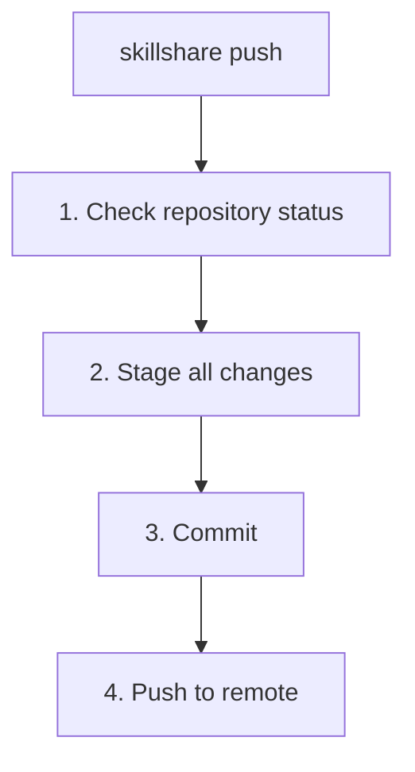

# push

提交 source 并推送到 git remote。

如果你只想要一个不推送的本地检查点，请改用 [`commit`](./commit.md)。

```bash
skillshare push                  # 自动生成消息
skillshare push -m "Add pdf"     # 自定义消息
skillshare push --pull           # 合并 remote 的更改并推送，然后 sync
skillshare push --dry-run        # 预览
```

## 何时使用

- 通过 git 与你的其他机器共享 skill 更改
- 将你的 skills 备份到远程仓库
- 编辑 skills 后，一条命令完成提交并推送

如果你想先保存一个本地检查点而暂不共享，请使用 [`skillshare commit`](./commit.md)。

## 会发生什么



## 选项

| 标志 | 描述 |
|------|-------------|
| `-m, --message <msg>` | Commit 消息（默认："Update skills"） |
| `--pull` | 推送前先合并 remote 的更改，然后 sync targets（参见 [同时 Push 与 Pull](#push-and-pull-together)） |
| `--dry-run, -n` | 预览而不做任何更改 |

## Git Root 作用域

`push` 作用于 `git_root` 配置字段所选定的目录（默认：`skills` source）。作用域表参见 [commit — Git Root Scope](./commit.md#git-root-scope)。如果 `git_root` 被更改了，但 git 仓库仍然位于另一个作用域的目录中，`push` 会打印一条 "Git root mismatch" 错误，并给出精确的 `git init` / `mv` 命令来修复。参见 [Changing the scope after init](/docs/reference/targets/configuration#git-root)。

## 前提条件

你的 source 目录必须是一个带有 remote 的 git 仓库：

```bash
# 在 init 期间设置（推荐）：
skillshare init --remote git@github.com:you/my-skills.git

# 或为现有设置添加 remote：
skillshare init --remote git@github.com:you/my-skills.git
```

Init 会自动创建初始 commit，因此设置完成后 `push` 可立即使用。

## 首次 Push 的 Upstream 映射

在首次 push 时（尚未有 upstream tracking），`skillshare push` 会自动配置 upstream：

- 如果 remote 已经有默认分支（例如 `main` 或 `trunk`），本地更改会被推送到该 remote 默认分支。
- 如果 remote 为空，则会推送到你当前的本地分支。

这样可以避免意外创建错误的 remote 分支（例如本地是 `master` 而 remote 使用 `main`）。

## 示例

```bash
# 使用自动生成消息快速推送
skillshare push

# 自定义 commit 消息
skillshare push -m "Add commit-commands skill"

# 预览将要推送的内容
skillshare push --dry-run
```

## 冲突处理

如果 remote 有更新的 commit：

```bash
$ skillshare push
✗ Push failed
  Remote may have newer changes

Next
  skillshare pull  get them first
  skillshare push  then push again
```

解决方法：
```bash
skillshare pull    # 把 remote 的更改与你的合并
skillshare push    # 推送你的更改
```

`pull` 会把 remote 的 commit 与你尚未推送的 commit 合并，所以第二次 `push` 就能成功。如果两边改了同一个文件，请参阅 [两台机器都有新 commit 时](/docs/reference/commands/pull#when-both-machines-committed)。

## 同时 Push 与 Pull {#push-and-pull-together}

`skillshare push --pull` 用一条命令完成整个往返：

1. Commit 你的本地更改（如果有）
2. 合并 remote 的新 commit，方式与 [`pull`](/docs/reference/commands/pull) 相同
3. 推送结果
4. 像 `pull` 一样，按 git root 作用域包含的内容 sync targets

如果合并遇到冲突，不会推送任何内容，也不会 sync targets。你的更改仍以 commit 形式保留在本地；解决冲突后，再次运行 `skillshare push --pull`。如果推送成功但 sync targets 失败，remote 已经更新，请运行输出中给出的 `skillshare sync ... --global` 命令重试（按 `git_root` 对应的资源，每项一行）。

在 `git_root: root` 下，如果合并带入了 remote 跟踪的 `config.yaml`，`push --pull` 会保留本机的副本，并在同一次推送中把 `config.yaml` 从 remote 移除。

`--pull` 从不 rebase，也从不 force-push。

## 工作流

共享 skills 的典型工作流：

```bash
# 1. 对 skills 进行更改
# 2. 推送到 remote
skillshare push -m "Update my-skill"

# 在另一台机器上：
skillshare pull    # 获取更改并同步
```

## 另请参阅

- [commit](/docs/reference/commands/commit) — 仅提交，不推送
- [pull](/docs/reference/commands/pull) — 从 remote 拉取
- [sync](/docs/reference/commands/sync) — 同步到本地 targets
- [Cross-Machine Sync](/docs/how-to/sharing/cross-machine-sync) — 完整设置
