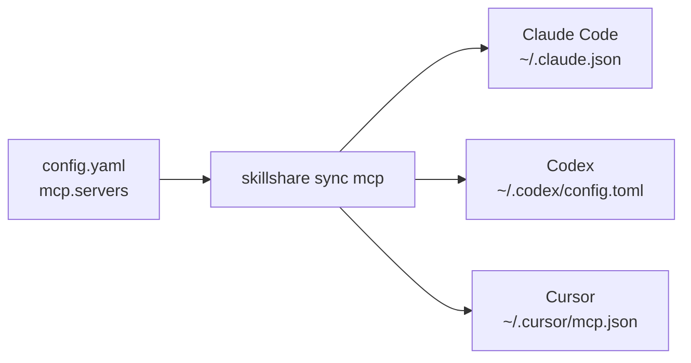

# 為你的 Agents 一次設定好 MCP

MCP 讓一個 Agent 能使用其他程式或服務提供的工具。Skillshare 只需儲存一次連線設定，
就會為每個支援的 Agent 寫入其原生設定檔。它不會執行 gateway，也不會保留背景伺服器持續運作。

支援的 MCP client 包含 Claude Code、Codex（CLI、IDE 擴充功能與 ChatGPT 桌面應用程式共用同一份設定）、
Cursor、VS Code、OpenCode、Kilo Code、Grok CLI、Antigravity（AGY）、Amp、Claude Desktop、
Cline、Copilot CLI、Factory、Gemini CLI、Goose、Junie、Kiro、LM Studio、Warp 與 Windsurf，
以及透過[內建 MCP](/docs/reference/commands/mcp#pi) 支援的 Pi ≥ 0.99.0。
[目的地與驗證限制](/docs/reference/commands/mcp#native-destinations)請參閱該頁。
Dashboard 會顯示目前範圍內可用的 client。

舉例來說，將 Playwright 分享給 Amp、Gemini CLI 與 Kiro：

```yaml
mcp:
  servers:
    playwright:
      command: npx
      args: ["-y", "@playwright/mcp@latest"]
      targets: [amp, gemini, kiro]
```

你不需要學習每個 client 的 JSON 或 YAML 格式。當你執行 `skillshare sync mcp` 時，
Skillshare 會自動轉換該定義。實際啟動指令的是接收端的 client，因此該 client 的環境中
必須要有 Node.js/npx 可用。

## 從引導式設定開始

執行 `skillshare mcp` 可在終端機中瀏覽並管理連線。使用 `/` 篩選、
`e` 編輯、`d` 移除，或 `r` 從備份還原。每一次互動式變更在儲存前都會先預覽。
使用 `skillshare mcp --no-tui` 取得純文字狀態輸出。

若這是全新安裝，請先初始化 Skillshare，然後執行：

```bash
skillshare mcp add
```

貼上你的 MCP 提供者所提供的 URL 或 JSON，為它取一個名稱，選擇你的 Agents，並檢視變更。
**Save and sync** 會立即套用設定；**Save only** 則只保留該定義，供之後的 `skillshare sync mcp` 使用。

在 dashboard 中，**Add server** 支援兩種形式：填寫欄位，或貼上一份設定。
貼上這一側也支援載入檔案，等同於瀏覽器版的 `mcp import --file`。貼上的 JSON 會自動被辨識；
若是 TOML，則需選擇它來自 Codex 還是 Grok。若貼上的內容只有一個伺服器且勾選了 Pi，
對話框也會顯示表單中的 Pi 設定：工具曝光模式與其他 Pi 設定。**Import from a target** 是另一個獨立功能，
會讀取已安裝的 Agent 目前已有的伺服器設定。無論哪種方式，dashboard 都使用與 CLI 相同的來源、
驗證、預覽與衝突規則。MCP 頁面 Sync 框中的 **Sync MCP** 只會寫入 MCP 設定檔。
Sync 頁面也提供 **Sync all resources**，可同步 Skills、agents、extras 與 MCP。

Pi 的匯入來源選單會列出 Pi 的 `mcp.json`，以及（針對 0.23.0 之前以 `pi-mcp-adapter` 設定的伺服器）
它的 `mcp-adapter.json`；每個來源只讀取該檔案。adapter 檔案只會被讀取：同步會把匯入的伺服器
寫入 Pi 的 `mcp.json`。顯示的路徑遵循目前範圍、
`PI_CODING_AGENT_DIR` 與自訂帳號目錄。專案匯入讀取該專案的 `.pi/`。
個人伺服器與憑證請保留在全域檔案；專案檔案只應用於受信任的專案。


儲存時 Config 編輯器會以兩個空格縮排格式化 YAML，並保留註解。點選某個欄位即可在右側面板
看到其說明，包括 `mcp`、`sources.mcp`、連線欄位與環境變數參照。

同步後，請重新載入你的 Agent，並在該 Agent 中完成任何登入或授權步驟。Skillshare 不會測試
連線、安裝伺服器程式，或複製登入的 session。同步成功只代表設定已經寫入，並不代表某次工具
呼叫已經成功。

## 了解兩種連線類型

| 提供者給你的資訊 | 連線方式 | 範例 |
|---|---|---|
| 一個指令與參數 | `stdio`：由 Agent 啟動一個本機行程 | `command: npx` 加上 `args` |
| 一個 MCP endpoint URL | Streamable HTTP：Agent 連接到一個運行中的服務 | `url: https://example.com/mcp` |

無論哪一種，定義都只存一次，再寫入每個 Agent 自己的檔案：



你通常不需要自行設定 `transport`；Skillshare 會從 `command` 或 `url` 自動推斷。
URL 可以指向你自己電腦上的服務，也可以是遠端服務。請使用提供者實際的 MCP endpoint，
而不是一般的網站 URL。舊式的 SSE 設定會被拒絕，而不會被靜默轉換。

## 限制哪些工具會提供給模型

一個伺服器可能提供很多工具。只要設定一次 `tools`，就能只保留其中一部分或隱藏部分工具，
Skillshare 會依各 Agent 自己的格式寫入：

```bash
skillshare mcp edit github --tools-allow 'get_*,search_code' --tools-deny get_secret
skillshare sync mcp --dry-run
```

在 dashboard 中，開啟該伺服器並使用它的 **工具** 區塊；**載入工具** 會列出伺服器的
工具，取消勾選不想給模型用的工具。Pi 會套用整份政策；Codex 與 Copilot CLI 只套用完整的工具名稱；其他 Agents 則不套用。
預覽與 `skillshare mcp check` 會指出每個省略部分政策的 Agent。請參閱
[工具政策](/docs/reference/commands/mcp#tool-policy)。

## 全部保留在同一份檔案中

這是預設方式。你既有的 skills 與 agents 仍然是目錄形式的 Source；
MCP 連線則是 `mcp.servers` 底下的結構化設定：

```yaml
sources:
  skills: ~/.config/skillshare/skills
  agents: ~/.config/skillshare/agents

mcp:
  targets: [claude, codex, cursor, vscode]
  servers:
    company-docs:
      url: https://docs.example.com/mcp
```

`company-docs` 是你自訂的名稱，它不會安裝或查詢任何伺服器。
請將範例中的 URL 換成你的提供者的 endpoint。`mcp.targets` 用來選擇接收端的 client，
與你的 skill targets 是各自獨立的。伺服器自身可選填的 `targets` 清單會覆寫這個預設值。

## 將 MCP 拆分成獨立檔案 {#split-mcp-into-its-own-file}

當你想要單獨分享或做版本控制時，可以使用外部來源：

```yaml title="config.yaml"
sources:
  skills: ~/.config/skillshare/skills
  agents: ~/.config/skillshare/agents
  mcp: ./mcp.yaml

mcp:
  targets: [claude, codex, cursor]
```

```yaml title="mcp.yaml"
servers:
  company-docs:
    url: https://docs.example.com/mcp
```

相對路徑會以 `config.yaml` 所在的目錄為基準解析。
對 `.skillshare/config.yaml` 而言，`./mcp.yaml` 代表 `.skillshare/mcp.yaml`。
也支援絕對路徑與 `~/`。
要透過 `push` / `pull` 在機器之間共用這個檔案，請把它放在 `root` scope 的
repository 裡；請參考 [跨機器 Sync — MCP servers](/docs/how-to/sharing/cross-machine-sync#mcp-servers)。

**同一時間只能使用一種來源**：`sources.mcp` 與 `mcp.servers` 不能同時存在，
即使是 `mcp.servers: {}` 也不行。要切換時，將 `servers` 對照表搬到外部檔案中、
加入 `sources.mcp`，並移除內嵌的 `mcp.servers`。`mcp.targets` 仍留在 `config.yaml` 中。
同步前先預覽：

```bash
skillshare sync mcp --dry-run
```

CLI 與 dashboard 的編輯都遵循目前生效的來源。外部檔案遺失或無效時會停止同步；
它絕不代表「刪除所有伺服器」。若要刻意移除定義，請明確使用 `servers: {}`，
然後預覽受管理項目的移除結果。

## 本機程式與憑證

```yaml
mcp:
  targets: [claude, codex]
  servers:
    internal-tools:
      command: company-mcp
      args: [--workspace, /path/to/workspace]
      env:
        COMPANY_TOKEN:
          fromEnv: COMPANY_TOKEN
    company-docs:
      url: https://docs.example.com/mcp
      bearerToken:
        fromEnv: DOCS_TOKEN
```

所需的本機程式請自行安裝。該 Agent 必須能在自己的環境中找到它，並讀取任何被參照的
環境變數。只在某個終端機中設定的變數，可能無法傳遞給從桌面啟動的 Agent。

Skillshare 只會寫入變數參照，絕不會自行解析出實際值。請將真正的 token 保留在
原始檔案、URL 與指令參數之外。已知的敏感環境變數或 header 鍵值都必須使用 `fromEnv`。
匯入時會將可辨識的明文密鑰（包括像 `DATABASE_URL` 這種 URL 值中內含密碼的情況）轉換為
參照，並回報你需要設定的變數。指令參數沒有可攜的參照語法：當某個參數看起來像憑證時，
匯入會發出警告，但仍會保留為純文字。匯入無法辨識所有憑證格式，例如藏在 URL 路徑中的 token。

Codex 是以名稱轉發本機變數，因此選擇 Codex 時，`env.KEY.fromEnv` 也必須是 `KEY`。
若某個 target 無法表示某項設定，會直接阻擋預覽，而不是默默捨棄它。client 專屬的
佔位符與輸入提示（input prompts）必須先明確解析後才能匯入。Agent 專屬的欄位，
例如 Codex 的 `startup_timeout_sec` 或 `cwd`，不會被匯入；匯入會將它們列為警告，
並在同步時保留在該 Agent 既有的項目中。

## 匯入既有的連線

```bash
skillshare mcp import                         # 選擇一個 Agent 與一個伺服器
skillshare mcp import docs --from claude --target claude --target codex --sync
```

一次匯入一個伺服器。當某個 Agent 的項目已經與匯入的定義相符時，它會直接變為受管理狀態，
而不會更動該 Agent 的檔案。當兩者不同時（最常見的原因是明文 token 被轉換成環境變數參照），
CLI 會停止，而不是覆寫一個正常運作的項目。設定好回報的變數後，再加上 `--replace` 重新執行，
或是將該 Agent 排除在 `--target` 之外。dashboard 的預覽會將同一項目顯示為衝突。

若來源中已經存在同名項目，請使用 dashboard 的 **Edit** 動作或 CLI 的 `--replace`。
匯入時，`--replace` 也會改寫被匯入的 Agent 自身的項目；而 **Save only** 則只會將該項目
記錄為基準，不會改動檔案，因此下一次同步會改寫它，並且仍然能偵測到期間所做的編輯。
它絕不會覆寫其他有衝突的原生項目。在 MCP dashboard 中，你能處理的衝突會提供一個以
Agent 命名的匯入動作，例如 **Import from cursor**，用以採用該版本，或
**Replace with source** 以覆寫該項目。若某則衝突的項目由另一份仍然存在的 Skillshare
設定檔所擁有，兩者都不會出現，因為只有那份設定檔能釋放該項目。

接手某個 Agent 裡已有同名的伺服器，也是用這個方式：把它加進來源。若該 Agent 的項目
已經相同，下一次預覽會列為 **接管**，同步時只記為受管理、不改動檔案；匯入後才勾選
來源 Agent 時就是這種情況。若內容不同，預覽會顯示為衝突，而不會覆寫它。匯入即可
採用該 Agent 的版本，或以來源定義取代它。

MCP dashboard 也會找出你的 Agents 設定檔中、Skillshare 沒有管理的伺服器。找到時，
伺服器清單上方會有一則說明，告訴你有幾個、在哪些 Agents 中，**Import** 會針對其中
第一個 Agent 開啟匯入。專案的 **MCP** 分頁也會對該專案的檔案做同樣的事，並匯入到
該專案。請參閱 [Skillshare 未管理的伺服器](/docs/reference/commands/mcp#unmanaged-servers)。

## 在單一專案中關閉某個全域伺服器

Agent 全域設定中的伺服器，會在每一個專案中載入。若要在某個專案中關閉它，
請在該專案內執行以下指令，並使用該伺服器在 Agent 全域設定中的名稱：

```bash
skillshare mcp add company-docs --disabled --target opencode
skillshare sync mcp
```

在 dashboard 中，從專案資料夾以 `skillshare ui` 開啟，選擇 **新增伺服器** 旁邊的
**關閉全域伺服器** 按鈕。

這適用於 Claude Code、OpenCode、Kilo Code 與 Pi 1.0.1 以上版本。其他 Agents 則會被拒絕。
[指令參考](/docs/reference/commands/mcp#turn-off-a-global-server-in-one-project)
說明了各個 Agent 會寫入什麼內容，以及為什麼其他 Agent 不受支援。


## 移除與復原

```bash
skillshare mcp remove company-docs
skillshare sync mcp --dry-run
skillshare sync mcp
```

只有先前由這份設定管理、且未經更動的項目才會被移除。未受管理的項目，以及被其他程式
編輯過的項目，都會受到保護。若某個 Agent 的項目在 Skillshare 開始管理它之前就已經與
來源相符（例如專案被搬移過），也會被保留；如果希望 Skillshare 移除它，請先匯入它。

在 dashboard 中，使用伺服器列上的刪除動作。對話框會列出每一個將會變動的 Agent 檔案。
**Remove from source only** 等同於不同步的 `mcp remove`；**Remove and sync** 則
也會清理 Agent 檔案，且在存在衝突時會被停用。

若要停止管理某個伺服器，但保留它在各 Agents 中的設定，請加上 `--keep-files` 移除它，
或在 dashboard 的移除對話框中選擇 **Stop managing**：

```bash
skillshare mcp remove company-docs --keep-files
```

Agent 檔案不會有任何變動，之後的同步也不會再碰這些項目。請參閱
[停止管理某個伺服器](/docs/reference/commands/mcp#stop-managing-a-server)。

每一次原生檔案的變更，都會為受影響的 MCP 項目建立一份私有備份。Skillshare 會為每個
Agent 檔案保留最新的 20 份備份。輸出中會包含其 ID：

```bash
skillshare mcp restore BACKUP_ID --dry-run
skillshare mcp restore BACKUP_ID
```

在 dashboard 中，**Backups & restore** 會依日期列出備份。預覽某份備份即可看到它將會
還原哪些項目，然後選擇 **Restore this file**。

還原會保留不相關的設定，並拒絕覆寫受影響項目中較新的變更。它不會還原你的來源檔案；
如果希望還原結果能在下一次同步後仍然保留，請同時編輯來源檔案。備份中可能包含舊的
原生憑證，因此請將本機 state 目錄保持為私有。

寫入是以每個檔案為單位進行原子操作。若在處理多個檔案的過程中途失敗，已完成的檔案
仍會被套用，並回報其備份 ID。請修正回報的原因後重試。下一次的 MCP 寫入操作
（例如 `sync mcp` 或 dashboard 同步）會完成尚未完成的中斷寫入，且預覽已經會顯示該結果。
如果 Agent 檔案在此期間又被編輯過，不再相符的項目會被回報為衝突。
請勿為了「解決」衝突而刪除擁有權狀態：這會讓既有項目變成未受管理狀態，
之後需要再次明確匯入。若某個項目的擁有設定檔已被刪除，則不需要這麼做：
衝突會說明這是殘留項目，直接從該則衝突進行匯入或取代即可接手它。

支援的路徑、旗標與目前的限制，請參閱 [MCP 指令參考](/docs/reference/commands/mcp)。
