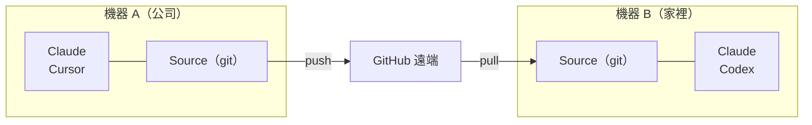

# 跨機器 Sync

使用 git 在多台電腦之間 Sync 你的 skills。

## 概覽



---

## 第一台機器的設定

### 互動模式（引導式提示）

```bash
skillshare init --remote git@github.com:you/my-skills.git
```

### 非互動模式（無提示）

```bash
# Remote 已經有你的 skills（或從全新的 source 開始）
skillshare init --remote git@github.com:you/my-skills.git --no-copy --all-targets --no-skill

# 第一台機器已有 Claude skills：在 init 時匯入
skillshare init --remote git@github.com:you/my-skills.git --copy-from claude --all-targets --no-skill
```

這麼做會：
1. 建立 source 目錄
2. 以初始 commit 初始化 git
3. 新增 remote
4. 自動偵測並設定 targets

之後可選擇性執行（僅在設定完成後又安裝了其他 AI CLI 時需要）：

```bash
skillshare init --discover
```

接著 push 你的 skills：
```bash
skillshare push
```

:::tip 已經初始化過了？
為既有的設定新增 remote：
```bash
skillshare init --remote git@github.com:you/my-skills.git
```
即使在初始設定之後執行也沒問題 — 它只會新增 remote。
:::

---

## 第二台機器的設定 {#second-machine-setup}

執行 `skillshare init`，選擇 **Connect my existing skillshare repo**，再貼上 repo URL：

<p>
  
</p>

也可以直接傳入 URL：

```bash
skillshare init --remote git@github.com:you/my-skills.git
```

Init 會先檢查 repo（不寫入任何東西），再把它拉下來。不需要手動 `git clone`。

:::info 幕後發生了什麼
1. 把 repo clone 到暫存資料夾，計算 skills 數量並判斷結構：用 `--git-root root` 推上去的整個資料夾，或放在 `skills/` 資料夾裡的 skills
2. 這台機器上與 repo 同名的 skills 使用 repo 版本；只存在於這台機器的 skills 會保留，並在下次 `skillshare push` 時加入 repo
3. 確認後：建立 source、初始化 git、新增 remote、重設為 remote 分支並設定追蹤
4. 設定偵測到的本機 targets，並詢問要不要第一次同步
:::

如果你偏好手動控制：

```bash
# 直接 clone，再用既有的 source 初始化
git clone git@github.com:you/my-skills.git ~/.config/skillshare/skills
skillshare init --source ~/.config/skillshare/skills
skillshare sync
```

---

## 日常工作流程

### 機器 A：進行變更並 push

```bash
# 編輯 skills（透過 symlink 立即可見變更）
$EDITOR ~/.config/skillshare/skills/my-skill/SKILL.md

# 選用：建立本機檢查點但不 push
skillshare commit -m "Update my-skill"

# 準備好分享時再 push 到 remote
skillshare push -m "Update my-skill"
```

### 機器 B：Pull 並 sync

```bash
skillshare pull
```

就這樣。`pull` 在拉取後會自動執行 `sync`。它會依照 [git root scope](/docs/reference/targets/configuration#git-root) 涵蓋的內容執行 sync：預設是 skills，agents / extras scope 同步對應資源，`git_root: root` 則三者都同步。Plugins、MCP server 和 hooks 需要下面的額外步驟。

### 一個指令雙向同步

如果你在多台機器上編輯 skills，請改用這個指令，不必分別執行 `push` 和 `pull`：

```bash
skillshare push --pull -m "Update my-skill"
```

它會 commit 你的變更、合併其他機器 push 的內容，接著 push 並 sync targets。遇到衝突時，它會在 push 任何內容之前停止。參見[同時 Push 與 Pull](/docs/reference/commands/push#push-and-pull-together)。

---

## Plugins、MCP 與 Hooks {#plugins-mcp-hooks}

`push` 和 `pull` 只會版本控制 git root 目錄裡的檔案。Plugins、hooks 和 MCP server 是 `config.yaml` 裡的設定，而 `config.yaml` 永遠不在這個 repository 裡：預設的 `skills` scope 把它放在 repo 之外，`root` scope 則會 ignore 它。每台機器都保有自己的 `config.yaml`，以及自己的 targets 和路徑。

| 資源 | 存放位置 | 是否隨 `push` / `pull` 移動 |
|---|---|---|
| Skills | Skills source | 是 |
| Agents | Agents source | `git_root: agents` 或 `root` 時 |
| Extras | Extras source | `git_root: extras` 或 `root` 時 |
| MCP servers | `config.yaml`，或 `sources.mcp` 指定的檔案 | 只有該檔案位於 repository 內時 |
| Plugins | `config.yaml` 的 `plugins:` | 否 |
| Hooks | `config.yaml` 的 `hooks:` | 否 |

在另一台機器 pull 之後，其餘部分要自己套用：

```bash
skillshare pull
skillshare sync --all              # 加上 agents、extras、MCP 和 hooks
skillshare sync plugins --no-tui   # plugins 永遠不包含在 --all 裡
```

### MCP servers {#mcp-servers}

把 server 定義放在 repository 內的獨立檔案。使用 `git_root: root` 時，repository 就是存放 `config.yaml` 的目錄（`~/.config/skillshare`，Windows 上是 `%AppData%\skillshare`），所以相對路徑的 `sources.mcp` 會被 commit，而 `config.yaml` 留在本機：

```yaml title="config.yaml（每台機器各自設定）"
sources:
  mcp: ./mcp.yaml

mcp:
  targets: [claude, codex]
```

`mcp.targets` 留在 `config.yaml` 裡，所以每台機器可以各自選擇接收的 client。每台機器都要設定 `sources.mcp`。要把現有的 server 移出 `config.yaml`，請參考 [將 MCP 拆分成獨立檔案](/docs/how-to/daily-tasks/sharing-mcp#split-mcp-into-its-own-file)。要把現有設定切換到 `root` scope，請參考 [`git_root`](/docs/reference/targets/configuration#git-root)。

Skillshare 把憑證存成 `fromEnv` 參照，從不儲存實際的值。請在每台機器上設定這些環境變數，並確保 Agent 讀得到。

### Plugins {#plugins}

Plugin 定義不會透過 git 傳遞。請在每台機器上從相同的來源重新加入：

1. 在第一台機器的 dashboard 開啟 **Plugins → Share**，複製指令。它會列出從 HTTPS Git 來源加入的 plugins，例如：

   ```bash
   skillshare plugin add https://github.com/acme/plugins --plugin review -g --no-tui
   ```

2. 在另一台機器執行這個指令，在 Plugins 頁面勾選 Agents，然後執行 `skillshare sync plugins`。

想在多台機器上使用的 plugin，請用 **Add plugin** 從來源加入，不要用 **Import installed**。Import 只會記錄 native 安裝。在另一台機器上，Claude 和 Codex 會從同名的 native marketplace 重新安裝；如果那台機器沒有註冊該 marketplace，這個 plugin 就會被略過。Cursor 和 Antigravity 則完全無法重新安裝 imported plugin。從本機目錄加入的 plugin 不會出現在 **Share** 裡，因為那個路徑只存在第一台機器上。

`sync plugins` 會安裝缺少的 plugins，已安裝的維持原樣。要更新它們，先執行 `skillshare plugin check`，再執行 `skillshare plugin update`。請參考 [跨工具管理 plugins](/docs/how-to/daily-tasks/sharing-plugins#updates-and-recovery)。

### Hooks {#hooks}

Hooks 沒有獨立的檔案。把 `config.yaml` 的 `hooks:` 區段複製到另一台機器，然後執行 `skillshare sync hooks`。

### 留在各台機器上的部分 {#per-machine}

- 安裝 plugin 用的 native CLI（`claude`、`codex` 等）必須安裝在 Skillshare 執行的環境中，並且在 `PATH` 上。排程工作的 `PATH` 通常比你的終端機短。Codex 也會從 Codex 桌面 app 和 Homebrew 的資料夾裡找；裝在其他位置的機器，請設定 [`SKILLSHARE_CODEX_CLI`](/docs/reference/appendix/environment-variables#skillshare_codex_cli)。
- 登入狀態、OAuth token、native 信任確認，以及啟用/停用狀態，都留在各個 Agent 裡。
- MCP server 參照的環境變數的值。

---

## 指令

### Commit

建立本機檢查點但不 push：

```bash
skillshare commit                  # Default message
skillshare commit -m "Add pdf"     # Custom message
skillshare commit --dry-run        # Preview
```

**會發生什麼：**
```
git add -A
git commit -m "Add pdf"
```

`commit` 不需要 remote，也絕不會 push。

### Push

Commit 並 push 本機變更：

```bash
skillshare push                  # Auto-generated message
skillshare push -m "Add pdf"     # Custom message
```

**會發生什麼：**
```
git add -A
git commit -m "Add pdf"
git push          # auto-sets upstream on first push
```

### Pull

Pull 遠端變更並 sync：

```bash
skillshare pull
```

**會發生什麼：**
```
git pull           # merges when both machines committed; fetch + merge or reset on first pull
skillshare sync
```

---

## 衝突處理

### Pull 失敗（本機有未提交的變更）

如果你想保留本機變更，但還沒準備好 push，請先在本機 commit：

```bash
skillshare commit -m "Save local changes"
skillshare pull
```

### Push 失敗（remote 領先）

```
$ skillshare push
Push failed
  Remote may have newer changes
  Run: skillshare pull
  Then: skillshare push
```

**解決方式：**
```bash
skillshare pull
skillshare push
```

### Pull 仍因本機未提交的變更而失敗

```
$ skillshare pull
Local changes detected
  Run: skillshare push
  Or:  cd ~/.config/skillshare/skills && git stash
```

**解決方式：**
```bash
# 選項 1：先在本機 commit
skillshare commit -m "Local changes"
skillshare pull

# 選項 2：先 push 你的變更
skillshare push -m "Local changes"
skillshare pull

# 選項 3：暫時 stash 變更
cd ~/.config/skillshare/skills
git stash
skillshare pull
git stash pop
```

### Merge 衝突

兩台機器都有 commit 時，`pull` 會把它們合併。`.metadata.json` 的衝突會自動解決。其他檔案的衝突則會讓 pull 停止、復原 merge，並列出衝突的檔案：

```
$ skillshare pull
pull stopped: this machine and the remote both changed my-skill/SKILL.md; the merge was undone, resolve it with git in ~/.config/skillshare/skills
```

**解決方法：**
```bash
cd ~/.config/skillshare/skills
git pull --no-rebase          # 重新 merge 並保留衝突
# 編輯衝突的檔案
git add .
git commit --no-edit
skillshare push
skillshare sync
```

---

## 檢查狀態

```bash
skillshare status
```

顯示：
- Git 狀態（clean、ahead、behind）
- Remote 設定
- Sync 狀態

---

## 私有 Repository

私有 repo 請使用 SSH URL：

```bash
skillshare init --remote git@github.com:you/private-skills.git
```

---

## 小技巧

### 使用 SSH 金鑰

設定 SSH 金鑰以避免密碼提示：
```bash
ssh-keygen -t ed25519 -C "your@email.com"
# 將公開金鑰新增到 GitHub
```

### 適用於 dotfiles 的可攜路徑

如果你透過 dotfiles 分享 `config.yaml`，啟用 `preserve_tilde_on_save` 可以讓路徑保持 `~/...` 的形式，而不是 `/home/alice/...`：

```yaml
preserve_tilde_on_save: true
```

這可以避免在不同使用者名稱或作業系統特有家目錄前綴的機器之間共用同一份設定時，產生雜訊般的 diff。詳見 [Configuration — preserve_tilde_on_save](/docs/reference/targets/configuration#preserve_tilde_on_save)。

### 多個 Remote

新增備援 remote：
```bash
cd ~/.config/skillshare/skills
git remote add backup git@gitlab.com:you/skills-backup.git
git push backup main
```

### 在 shell 啟動時 Sync

加入到 `~/.bashrc` 或 `~/.zshrc`：
```bash
# 在終端機開啟時 Sync skillshare（若已設定 remote）
skillshare pull 2>/dev/null
```

---

## 替代方案：從 Config 安裝 {#alternative-install-from-config}

如果你不想設定 git remote，`config.yaml` 也可以當作可攜的 skill 清單。每次 `install` / `uninstall` 都會自動更新 `skills:` 區塊，而 `skillshare install`（不帶參數）會重新安裝清單中列出的所有項目：

```bash
# 機器 A — config.yaml 會記錄你安裝了什麼
skillshare install anthropics/skills -s pdf
# config.yaml now has: skills: [{name: pdf, source: "..."}]

# 機器 B — 複製 config.yaml，然後：
skillshare install      # Installs all listed skills
skillshare sync
```

### 該用哪一種

| | `push` / `pull` | `install`（不帶參數） |
|---|---|---|
| Sync 了什麼 | 實際的 skill 檔案（完整內容） | 僅 source URL — 安裝時重新下載 |
| 本機/手寫的 skills | 包含 | 不包含（沒有 source URL） |
| 需要的設定 | source 目錄要有 Git remote | 只需要 `config.yaml` |
| Project mode | 僅限 Global | 可搭配 `-p`（`.skillshare/config.yaml`） |
| 維護方式 | 變更後需手動 `push` | install/uninstall 時自動同步 |

**建議**：個人跨機器 Sync 請使用 `push`/`pull`。團隊導入與專案設定則使用 config 的 `install`。

---

## 參見

- [push](/docs/reference/commands/push) — Push 到 remote
- [pull](/docs/reference/commands/pull) — 從 remote pull
- [install](/docs/reference/commands/install#install-from-config-no-arguments) — 從 config 安裝
- [Organization-Wide Skills](./organization-sharing.md) — 團隊分享
- [init](/docs/reference/commands/init) — 使用 `--remote` 進行 Init
