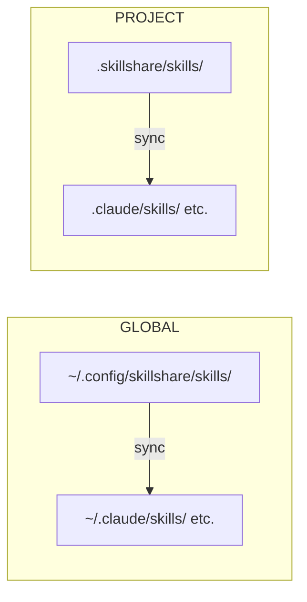

# 介紹

**你的 AI coding 環境，隨處可用。**

skillshare 在同一處管理 skills、agents、rules、MCP 連線與 hooks。透過[桌面應用程式](/docs/getting-started/desktop-app)或 CLI，在切換 AI 工具、機器或專案時帶著你的設定一起走。

## 為什麼選擇 skillshare？

- **換工具，保留你的設定** — 維護你掌控的 source，選擇每個支援的工具要接收哪些資源。
- **把設定帶到其他機器** — 用 Git 管理 source 的版本，再帶到另一台機器。
- **共享專案情境** — 把團隊 skills 與設定放在程式碼旁，並用 lockfile 記錄遠端 skill 的 commit。

例如，一位同事用 Claude Code，另一位用 Codex，兩人都需要同一份針對舊版 API 的程式碼審查清單。把清單放在 `.skillshare/skills/`，並提交專案設定。新成員安裝設定中宣告的遠端 skills，再同步到設定的 targets，省下從聊天紀錄找指令、複製貼上的工作。

完整流程請見[團隊導入 recipe](/docs/how-to/recipes/team-onboarding-recipe)。共享指令能減少設定分歧；每個 AI 工具仍有各自的能力、權限與行為。

## 快速開始

```bash
# Install
curl -fsSL https://raw.githubusercontent.com/runkids/skillshare/main/install.sh | sh
```

只有安裝器顯示 PATH 設定提示時，才需要依提示設定後再執行下方指令。沒有 PATH 警告就不需要額外設定。

```bash

# Initialize (auto-detects CLIs, sets up git)
skillshare init

# Install a skill
skillshare install anthropics/skills/skills/pdf

# Sync to all targets
skillshare sync
```

你的 skill 現在已可供設定的 targets 使用。

:::tip[不安裝也能試]
想先四處看看？可以用 [Docker Playground](/docs/how-to/advanced/docker-sandbox#playground)，一道指令，不必在本機安裝：

```bash
git clone https://github.com/runkids/skillshare.git && cd skillshare
make playground
```
:::

## 運作方式



編輯 source 中既有的 skill，使用連結的 targets 就會立即看到變更。copy mode 需要執行 `sync` 才會更新副本。預設的 merge mode 在新增、移除或重新命名 skills 後，也需要執行 `sync`。

Global mode 管理你的個人設定與已安裝的團隊 repositories；project mode 管理單一程式碼專案的資源與設定。Git pull 會帶回專案檔案；接著執行 `skillshare install -p` 與 `skillshare sync -p`，才能在本機套用專案宣告的 skills。

## 主要特色

- **自動偵測** — `cd` 進入含有 `.skillshare/` 的專案，skillshare 會自動切換到 project mode
- **Global 與 Project 範圍** — Global mode 管理個人與組織共享資源；project mode 管理特定程式碼專案的資源
- **連結更新** — 編輯既有 skill，使用 symlink 的 targets 就會立即反映變更
- **團隊就緒** — 組織 skills 走 tracked repos，專案 skills 走 git commit
- **支援任何 Git 服務** — 可從 GitHub、GitLab、Bitbucket、Azure DevOps、AtomGit、Gitee 或任何自架 Git 安裝、更新與檢查
- **安全稽核** — 使用前掃描 skills 中已知的注入與資料外洩模式。Audit 是靜態分析；執行權限仍由 AI 工具管理

## 支援平台

| 平台 | Source 路徑 | 連結型態 |
|----------|-------------|-----------|
| macOS/Linux | `~/.config/skillshare/skills/` | Symlinks |
| Windows | `%AppData%\skillshare\skills\` | 資料夾用 NTFS Junctions；單一檔案用 symlinks（需要開發人員模式，否則改為複製） |

## 下一步

### 個人開發者

1. [First Sync](/docs/getting-started/first-sync) — 5 分鐘完成第一次同步
2. [建立 Skills](/docs/how-to/daily-tasks/creating-skills) — 寫出你的第一個 skill
3. [跨機器同步](/docs/how-to/sharing/cross-machine-sync) — 讓多台機器的 skills 保持一致

### 團隊負責人／組織

1. [組織層級 Skills](/docs/how-to/sharing/organization-sharing) — 把規範共享給整個團隊
2. [專案設定](/docs/how-to/sharing/project-setup) — 建立專案範圍的 skills
3. [安全稽核](/docs/reference/commands/audit) — 部署前先掃描第三方 skills

### 已經有 Skills 了？

- [從既有 Skills 遷移](/docs/getting-started/from-existing-skills) — 遷移與整併

### 深入了解

- [核心概念](/docs/understand) — Source、targets、sync 模式
- [指令參考](/docs/reference/commands) — 所有可用指令
- [Docker Sandbox](/docs/how-to/advanced/docker-sandbox) — 在隔離環境中試用 skillshare
- [FAQ](/docs/troubleshooting/faq) — 常見問題
